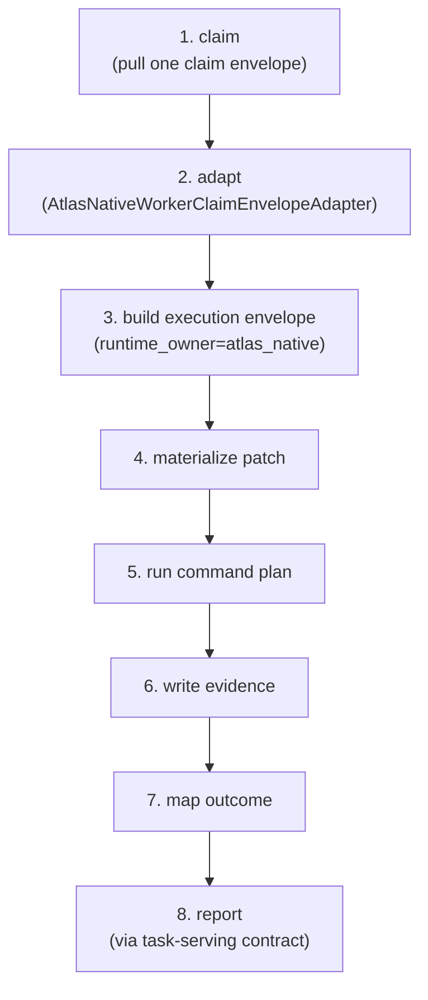

# Maestro and worker swarm

Maestro is the scheduler. It serves tasks, leases them to workers, retries failures, routes by worker affinity, and keeps the queue healthy across cost, fairness, decay, priority, and multi-provider concerns. It never rewrites architecture or relaxes gates. The Worker Swarm is the execution muscle. Atlas-native workers run the claim-execute-report cycle inside a scoped execution envelope limited to `allowed_files`. Bootstrap workers (Codex, Claude, Cursor) reach the same packets through the external-provider invoker chain. No worker approves, merges, widens scope, or self-certifies.

## Purpose

To serve admitted packets to workers in dependency-safe, cost-fair, queue-healthy order, and to execute each packet in an exact scope on the shared mainline. This is the execute stage of the government, where the simplicity law becomes a runtime constraint: workers edit only `allowed_files`, Atlas commits only that task scope, and the next packet follows.

## Key abstractions

| Abstraction | Role |
|---|---|
| Maestro scheduler | Allocates worker budget across lanes; serves, leases, retries packets |
| Project lane scheduler | Deterministic budget allocator across project lanes with per-lane caps |
| Scoped execution envelope | The hard boundary that limits a worker to `allowed_files` and forbids the rest |
| Atlas-native worker | The autonomy destination: claim, execute, report with no external provider |
| Claim-execute-report cycle | The 8-step native worker tick |
| Bootstrap worker | Codex, Claude, Cursor, or Loop invoked through the external-provider chain |
| Forbidden action labels | The closed set of actions a native worker refuses before any step |
| Worker capability contract | Declares what a worker can and cannot do |

## How it works

### Maestro scheduling

`AtlasMaestroProjectLaneScheduler` is the planning primitive. It allocates a global worker budget across lanes given per-lane demand and per-lane caps. It is pure: no process spawning, no worktrees, no provider calls. Two calls with the same input produce byte-identical JSON.

The defaults encode the simplicity law directly: `topology = shared_local_main_with_scope_lock` and `default_worktree_or_sandbox = false`. Critical lanes are capped at one worker (`CRITICAL_CAP = 1`). When total demand exceeds the global budget, the scheduler applies fair reduction: it drops one worker at a time off the largest-allocation lane, tie-broken by sorted lane id ascending, so the trim sequence is deterministic. Each allocation carries a reason vector (`no_demand`, `capped_by_lane_cap`, `reduced_for_budget_fairness`).

Maestro is not a single service. It is a family of scheduling concerns, each in its own subdirectory under `app/Services/Ai/SelfConstruction/Maestro/`:

| Subdirectory | Concern |
|---|---|
| `Adaptive/` | Adaptive scheduling |
| `ClosedLoop/` | Closed-loop scheduling |
| `Concurrency/` | Concurrency control |
| `Cost/` | Cost-aware scheduling |
| `Decay/` | Task decay |
| `DynamicPriority/` | Dynamic priority |
| `Fairness/` | Fairness across workers and lanes |
| `Health/` | Queue and worker health |
| `MultiProvider/` | Multi-provider routing |
| `PacketEvolution/` | Packet evolution |
| `Personalization/` | Per-worker personalization |
| `Pinning/` | Worker pinning |
| `Projection/` | Schedule projection |
| `Provenance/` | Scheduling provenance |
| `ProviderLearning/` | Provider learning |
| `ProviderNegotiation/` | Provider negotiation |
| `Retry/` | Retry policy |
| `Semantic/` | Semantic scheduling |
| `Tiering/` | Task tiering |

### The scoped execution envelope

`AtlasSelfConstructionWorkerScopedExecutionEnvelope` is the pure composer that produces the hard boundary for a worker packet. It never runs shell commands, mutates files, claims tasks, or reports completion. It validates four invariants and refuses otherwise:

- `allowed_files` is non-empty
- `allowed_files` and `forbidden_files` do not overlap (the `allowed_forbidden_overlap` blocker)
- `gates` is non-empty (at minimum an acceptance verification)
- `lease_id` is present and non-empty

The output envelope carries `allowed_files`, `forbidden_files`, `gates`, `evidence_requirements`, `rollback_plan`, `worker_capability`, and a deterministic `envelope_hash`. A worker that steps outside `allowed_files` is caught by the Verification Court's `changed_file_outside_allowed` check.

### The Atlas-native worker

The native worker is the autonomy destination. `AtlasNativeWorkerClaimExecuteReportCycle` runs a bounded tick for one task in eight ordered steps:



The cycle enforces a hard guard before any step runs: any planned action label in the forbidden set is refused immediately and surfaced under `blocked_actions`. The forbidden labels are:

| Forbidden label | Why |
|---|---|
| `external_provider` | Native workers never start Claude, Codex, Cursor, or any external provider |
| `network` | No unrestricted network access |
| `unrestricted` | No unrestricted shell |
| `git` | The cycle never runs git itself |
| `operator_handoff` | No handoff to the operator mid-task |
| `human_required` | No human dependency in the native path |

The default mode is dry-run: the cycle returns planned steps without invoking claim, materializer, runner, evidence, or report. Apply mode uses only injected callbacks and the Atlas-native services in the constructor. The execution envelope builder (`AtlasNativeWorkerExecutionEnvelopeBuilder`) is fail-closed: it throws on missing `allowed_files`, empty `acceptance_criteria`, missing `required_evidence`, or a non-Atlas-native `simplicity_contract`. The envelope always carries `runtime_owner = 'atlas_native'`, `execution_topology = 'shared_local_main_with_scope_lock'`, and `provider_prompt = null`.

### The bootstrap worker chain

During bootstrap and transition, the same packets reach external coding tools through the invoker chain at the root of `app/Services/Ai/SelfConstruction/`. This is the `Agent*` Codex invoker family, roughly 120 files, including `AgentCodexProviderExecutionDriver`, `AgentCodexRealInvoker*`, `AgentDispatchExecutor*`, and `AgentProviderAdapterRegistry`. These are replaceable execution muscles, not authority. The final owner remains Atlas-native; the invoker chain is how Atlas drives an external tool to execute a packet it could not yet run itself.

The autonomy ladder moves from external muscles to Atlas-native muscles:

```
bootstrap: human opens sessions + Claude/Codex/Cursor execute packets
transition: Atlas serves, verifies, learns while external workers remain replaceable
final: Atlas-native workers execute continuously without operator/human/provider dependency
```

## Integration points

- Inputs are admitted packets from the [Control plane and task fabric](control-plane-and-task-fabric.md).
- Outputs are candidate changes handed to the [Verification court and merge governor](verification-court-and-merge-governor.md), which re-run gates server-side and never trust worker self-report.
- The scoped envelope is the runtime enforcement of the [separation of powers](separation-of-powers.md): a worker cannot widen its scope.
- Worker authority to run at all comes from the [fleet control plane](agent-governance-fleet.md); nothing executes until the operator enables the master switches.
- The native worker pool is supervised by `AtlasNativeWorkerPoolSupervisor` and gated by `AtlasNativeWorkerReadinessGate`.

## Key source files

| File | Role |
|---|---|
| `app/Services/Ai/SelfConstruction/Maestro/AtlasMaestroProjectLaneScheduler.php` | Deterministic project-lane budget allocator |
| `app/Services/Ai/SelfConstruction/Maestro/` | 21 scheduling-concern subdirectories |
| `app/Services/Ai/SelfConstruction/WorkerSwarm/AtlasSelfConstructionWorkerScopedExecutionEnvelope.php` | Scoped execution envelope composer |
| `app/Services/Ai/SelfConstruction/WorkerSwarm/AtlasSelfConstructionWorkerAssignmentMatcher.php` | Worker-to-packet assignment matcher |
| `app/Services/Ai/SelfConstruction/WorkerSwarm/AtlasSelfConstructionWorkerCapabilityContract.php` | Worker capability contract |
| `app/Services/Ai/SelfConstruction/NativeWorker/AtlasNativeWorkerClaimExecuteReportCycle.php` | The 8-step native worker tick |
| `app/Services/Ai/SelfConstruction/NativeWorker/AtlasNativeWorkerExecutionEnvelopeBuilder.php` | Atlas-native execution envelope builder (fail-closed) |
| `app/Services/Ai/SelfConstruction/NativeWorker/AtlasNativeWorkerPoolSupervisor.php` | Native worker pool supervisor |
| `app/Services/Ai/SelfConstruction/NativeWorker/AtlasNativeWorkerReadinessGate.php` | Native worker readiness gate |
| `app/Services/Ai/SelfConstruction/NativeWorker/AtlasNativeWorkerEvidenceWriter.php` | Native worker evidence writer |
| `app/Services/Ai/SelfConstruction/AgentCodexProviderExecutionDriver.php` | Bootstrap Codex provider execution driver |

## Related pages

- [Self-Construction OS and government](index.md) — the overview and 16-organ map
- [Control plane and task fabric](control-plane-and-task-fabric.md) — where packets are compiled and admitted
- [Verification court and merge governor](verification-court-and-merge-governor.md) — where worker output is re-verified
- [Constitution and earned autonomy](constitution-and-earned-autonomy.md) — the autonomy ladder from bootstrap to native
- [Glossary](../../overview/glossary.md) — Maestro, worker swarm, scoped execution envelope, native worker
