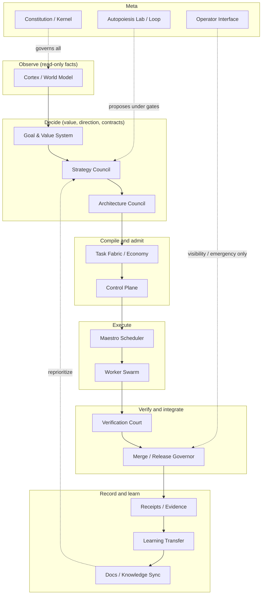

# Separation of powers

The strongest autonomous engineering architecture separates powers. One organ observes, one organ decides value and priority, one organ designs, one organ decomposes work, one organ schedules, workers execute only scoped packets, an independent court verifies, a merge governor controls production entry, receipts prove events, learning transfer changes future context, and docs remain the authoring source of truth. The same agent or runtime must not create the objective, implement the patch, judge its own work, merge it, and promote its own learning.

This is not a style preference. It is the structural defense against the single most dangerous failure mode of a 24/7 self-improving system: a worker that approves its own output creates false green, and a judge that authored the candidate cannot be independent. Every organ below has a narrow authority and an explicit non-authority, enforced in code as pure, deterministic functions that emit signed envelopes.

## Purpose

To make the engineering lifecycle safe by ensuring no single agent spans originate through promote. Each role is a distinct organ with a hard boundary, so a compromised or Goodharted worker cannot smuggle its own work into `main`, and a judge cannot ratify what it wrote.

## The canonical organ tree

## The authority and non-authority table

This is the canonical contract from `docs/engineering-knowledge-base/atlas-autonomous-engineering-government.md`. Every organ declares what it owns and what it must not do.

| Organ | Authority (what it owns) | Non-authority (what it must not do) |
|---|---|---|
| Constitution / Kernel | Laws, forbidden scopes, autonomy levels, rollback requirements | Does not execute product work |
| Control Plane | Chooses what evolves, when, risk, budget, scope, mode | Does not write code directly |
| Cortex / World Model | Read-only understanding of code, docs, memory, evidence, graph, risk, history | Does not decide or promote learning alone |
| Goal & Value System | Defines real value and anti-proxy criteria | Does not accept task count or green tests as value |
| Strategy Council | Selects the next highest-leverage direction | Does not create executable packets directly |
| Architecture Council | Produces criticized contracts, interfaces, invariants, decomposition boundaries | Does not schedule workers or approve merges |
| Task Fabric / Task Economy | Converts approved architecture into self-sufficient packets with scope, deps, gates, rollback, evidence | Does not decide final priority or verify merit |
| Maestro Scheduler | Serves tasks, leases, retries, worker affinity, throughput, queue health | Does not rewrite architecture or relax gates |
| Worker Swarm | Executes small packets in exact allowed-file scopes on the mainline | Does not approve, merge, widen scope, or self-certify |
| Verification Court | Re-runs gates server-side, validates evidence, detects Goodhart, rejects false green | Does not author the candidate |
| Merge / Release Governor | Controls integration, main, rollback, canary, release, blast-radius policy | Does not trust worker self-report |
| Receipts / Evidence / Memory | Records facts, decisions, completions, failures, rollbacks, promotions | Receipts alone are not learning |
| Learning Transfer System | Promotes reusable lessons into future packets/context/docs after evidence | Does not promote narrative memory without proof |
| Autopoiesis Lab / Loop | Proposes self-improvement and recursive evolution under gates | Does not become the OS or bypass the Kernel |
| Docs / Knowledge Sync | Authoring source of truth and worker context freshness | Not optional post-work decoration |
| Operator Interface | Visibility and emergency override | Not a required steady-state runtime organ |

## Why no single agent spans the lifecycle

Consider the alternative. If one agent originates the goal, writes the code, runs the tests, judges the result, merges to `main`, and records the learning, every one of those steps is a self-target it can game. It can write a test that always passes, report green on a diff that does nothing, merge its own work, and record a narrative lesson that flatters its own performance. The separation of powers makes each of those a different organ with a different incentive and a different evidence requirement:

- The **Worker Swarm** edits only `allowed_files` and reports an outcome. It cannot approve, merge, widen scope, or self-certify.
- The **Verification Court** re-runs the gates itself, server-side, and never authors the candidate. It detects false green by comparing worker claims against replay facts.
- The **Merge Governor** requires `server_side_green=true` and a present evidence hash. It never trusts worker self-report alone.
- The **Learning Transfer** orchestrator only promotes a lesson after it passes a candidate gate with evidence refs. It does not promote narrative memory without proof.

The Architecture Council's critic enforces this at the contract level: a contract where `verifies[].organ === this organ` raises a `mixed_powers:designs_and_verifies` finding and is rejected. An organ that designs a thing cannot also be the organ that verifies it.

## The decide organs

Four organs own the "decide" phase: Cortex observes, Goal and Value defines what counts as real value, Strategy Council picks the direction, and Architecture Council produces the criticized contracts. None of them execute, merge, or learn.

### Cortex / World Model

Cortex is the read-only world model. `AtlasSelfConstructionCortexSnapshotComposer` composes six sections, inventory, freshness, risk gaps, queue state, task coverage, and evidence refs, into one deterministic world snapshot. The output is observation facts only: no priority, no scheduling, no merge, no learning decision. It emits a `snapshot_hash` (sha256 over canonical ksort) so downstream organs can detect drift. It emits no scalar score or rank. Missing sections surface as `missing_section:<name>` blockers.

| File | Role |
|---|---|
| `app/Services/Ai/SelfConstruction/Cortex/AtlasSelfConstructionCortexSnapshotComposer.php` | Composes the world snapshot (facts only, no decision) |
| `app/Services/Ai/SelfConstruction/Cortex/AtlasSelfConstructionCortexSourceInventory.php` | Read-only inventory of code, docs, memory |
| `app/Services/Ai/SelfConstruction/Cortex/AtlasSelfConstructionCortexFreshnessBridge.php` | Context-freshness bridge |
| `app/Services/Ai/SelfConstruction/Cortex/AtlasSelfConstructionCortexRiskGapLens.php` | Risk-gap lens |

### Goal and Value System

Goal and Value defines real value and rejects proxy value. `AtlasGoalValueAntiProxyGate` blocks work whose evidence is purely proxy signals, test count, task count, line churn, rename-only AST diff, or self-reported success, before it reaches Strategy or Merge. Proxy signals are not inherently rejected: they are accepted only when paired with concrete `capability_lift_refs` or `failure_removal_refs`. Without that pairing, the proxy is the only signal and the gate refuses. The output is facts only: `blocked`, `proxy_categories`, `blocked_proxy_categories`, `has_real_lever`. No scalar score.

| File | Role |
|---|---|
| `app/Services/Ai/SelfConstruction/GoalValue/AtlasGoalValueAntiProxyGate.php` | Blocks proxy-only value before it enters the pipeline |
| `app/Services/Ai/SelfConstruction/GoalValue/AtlasGoalValueDecisionPolicy.php` | Decision policy for real value |
| `app/Services/Ai/SelfConstruction/GoalValue/AtlasGoalValueOutcomeEvidenceEvaluator.php` | Evaluates outcome evidence |
| `app/Services/Ai/SelfConstruction/GoalValue/AtlasGoalValueRealLeverageContract.php` | The real-leverage contract |

### Strategy Council

Strategy Council ranks candidate directions by real leverage evidence, never by task volume or hype. `AtlasStrategyCouncilLeverageRanker` rejects candidates with empty `evidence_refs` or proxy-only signals (`novelty`, `task_count`, `line_churn`, `green_self_report`) and no real levers. Accepted candidates are ranked in lexicographic order: higher `autonomy_unlock`, then higher `waste_reduction`, then lower `dependency_count`, then lower `risk`, finally `candidate_id` ascending. Each candidate carries a transparent reason vector so the operator can read why one beat another. No single composite score is computed or returned.

| File | Role |
|---|---|
| `app/Services/Ai/SelfConstruction/StrategyCouncil/AtlasStrategyCouncilLeverageRanker.php` | Ranks candidates by real leverage (no composite score) |
| `app/Services/Ai/SelfConstruction/StrategyCouncil/AtlasStrategyCouncilRoadmapCandidateFilter.php` | Filters roadmap candidates |
| `app/Services/Ai/SelfConstruction/StrategyCouncil/AtlasStrategyCouncilAmbitionBudgetPolicy.php` | Ambition budget policy |
| `app/Services/Ai/SelfConstruction/StrategyCouncil/AtlasStrategyCouncilDecisionLedger.php` | Append-only decision ledger |

### Architecture Council

Architecture Council produces criticized contracts, interfaces, invariants, and decomposition boundaries. `AtlasArchitectureCouncilContractCritic` examines a proposed contract before it becomes a Task Fabric input. It flags six finding families: `missing_non_authority` (every organ must declare what it does not own), `mixed_powers:designs_and_verifies` (the designer is also the verifier), `missing_invariants`, `broad_mutation:<key>` (responsibilities mention forbidden broad verbs like "mutate global" or "edit constitution"), `no_evidence_refs`, and `hidden_side_effects:<key>` (responsibilities mention execute, shell, git, commit, merge, push, or provider call not covered by `forbidden_side_effects`). The critic is pure: it produces no task packets, runs no commands, mutates no storage.

| File | Role |
|---|---|
| `app/Services/Ai/SelfConstruction/ArchitectureCouncil/AtlasArchitectureCouncilContractCritic.php` | Criticizes contracts for separation-of-powers violations |
| `app/Services/Ai/SelfConstruction/ArchitectureCouncil/AtlasArchitectureCouncilInvariantExtractor.php` | Extracts invariants from contracts |
| `app/Services/Ai/SelfConstruction/ArchitectureCouncil/AtlasArchitectureCouncilBoundaryMap.php` | Maps decomposition boundaries |
| `app/Services/Ai/SelfConstruction/ArchitectureCouncil/AtlasArchitectureCouncilImplementationSliceDesigner.php` | Designs implementation slices |

## How the separation is enforced in code

The organs are implemented as pure, deterministic PHP classes under `app/Services/Ai/SelfConstruction/`. Each one:

- declares a `SCHEMA` constant and emits a versioned envelope
- is deterministic: identical input produces byte-identical output
- emits facts only, never a scalar score the system could game (the NO-SCALAR principle)
- carries an explicit non-authority in its docblock and, for the Architecture Council, in the contract it critiques

The Architecture Council's critic is the meta-enforcement: it rejects any contract where an organ designs and verifies the same thing, so the separation is checked at contract time, not just hoped for at runtime.

## Integration points

- The decide organs feed [Task Fabric](control-plane-and-task-fabric.md), which compiles their output into packets.
- The execute organs ([Maestro and worker swarm](maestro-and-worker-swarm.md)) never relax the gates the decide organs set.
- The verify organs ([Verification court and merge governor](verification-court-and-merge-governor.md)) never trust worker self-report, which is the runtime enforcement of this separation.
- The [Constitution and earned autonomy](constitution-and-earned-autonomy.md) define the laws and trust ladder that gate which organs may act autonomously.
- The doctrine is explained in the concept page [Separation of powers](../../concepts/separation-of-powers.md).

## Key source files

| File | Role |
|---|---|
| `docs/engineering-knowledge-base/atlas-autonomous-engineering-government.md` | Canonical authority/non-authority table |
| `app/Services/Ai/SelfConstruction/Cortex/AtlasSelfConstructionCortexSnapshotComposer.php` | World snapshot (observe, facts only) |
| `app/Services/Ai/SelfConstruction/GoalValue/AtlasGoalValueAntiProxyGate.php` | Anti-proxy value gate |
| `app/Services/Ai/SelfConstruction/StrategyCouncil/AtlasStrategyCouncilLeverageRanker.php` | Leverage ranker (no composite score) |
| `app/Services/Ai/SelfConstruction/ArchitectureCouncil/AtlasArchitectureCouncilContractCritic.php` | Contract critic (mixed-powers detector) |

## Related pages

- [Self-Construction OS and government](index.md) — the overview and 16-organ map
- [Control plane and task fabric](control-plane-and-task-fabric.md) — compilation and admission
- [Verification court and merge governor](verification-court-and-merge-governor.md) — runtime enforcement of author-not-judge
- [Separation of powers (concept)](../../concepts/separation-of-powers.md) — the doctrine
- [Anti-Goodhart and no-proxy](../../concepts/anti-goodhart.md) — the NO-SCALAR principle
- [Glossary](../../overview/glossary.md) — organ, separation of powers, non-authority
