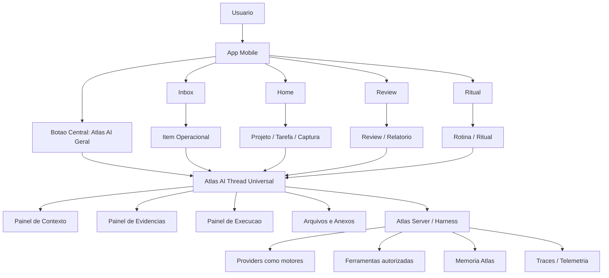

> Cleanup status: superseded_source_material.
> Canonical replacement: docs/engineering-knowledge-base/atlas-ai-mobile-surface-gateway.md; docs/engineering-knowledge-base/atlas-ai-master-architecture.md; docs/engineering-knowledge-base/atlas-ai-operating-system.md.
> Cleanup note: Useful mobile surface source. Mobile must remain a surface, not a parallel domain architecture.

# Atlas AI Mobile - Modelo Operacional, Telas E Fluxos

**Status:** especificacao canonica de produto e arquitetura mobile
**Data:** 2026-05-02
**Escopo:** Atlas App, Atlas Server, Mobile Gateway, Inbox Operacional, Atlas AI geral, Atlas AI contextual, programacao mobile, memoria, permissoes e notificacoes
**Prioridade:** core do produto
**Principio central:** existe um unico Atlas AI. O que muda e foco, contexto, memoria, ferramentas, permissoes e objetivo.

Este documento existe para remover ambiguidade sobre como o Atlas AI funciona no app mobile. Ele deve ser usado como referencia antes de criar novas telas, novos fluxos, novas actions, novos prompts, novos nomes de UI ou novas automacoes relacionadas ao Atlas AI.

## 1. Decisao Executiva

O app mobile deve ter uma experiencia central de Atlas AI parecida, em simplicidade inicial, com apps modernos de IA: o usuario toca no botao principal e cai em uma conversa geral com o Atlas AI para conversar, pesquisar, pensar, planejar, desenvolver ideias, anexar arquivos e continuar trabalhos.

Mas o Atlas nao deve copiar o modelo simples de "um chat solto". O diferencial do Atlas e que essa conversa pode ser aberta com contexto real do sistema: projeto, tarefa, captura, alerta operacional, relatorio, arquivo, rotina, review ou execucao de codigo.

A decisao final e:

> O botao central abre o Atlas AI geral. Todas as outras entradas tambem abrem o Atlas AI, mas com foco e contexto pre-carregados.

Nao existem outras IAs dentro do produto. Nao existe "Atlas de codigo", "Atlas operacional", "Atlas de projeto" ou "outra IA". Existe Atlas AI.

## 2. Regra Constitucional

Esta regra e nao negociavel:

> Sempre existe um unico Atlas AI.

Qualquer especializacao deve ser descrita como:

- foco;
- direcionamento;
- contexto;
- workspace;
- skill;
- memoria;
- ferramenta;
- permissao;
- workflow.

Nunca como outra IA.

### 2.1 Nomes proibidos em UI

Nao usar em texto visivel:

- "outra IA";
- "IA operacional";
- "IA de codigo";
- "Atlas Code";
- "Atlas Operacional";
- "chat operacional" como identidade;
- "thread contextual" como label para usuario final;
- "mobile thread";
- "bot de projeto";
- "assistente separado".

### 2.2 Nomes permitidos em UI

Usar:

- "Atlas AI";
- "Atlas AI - Geral";
- "Atlas AI - Programacao";
- "Atlas AI - Operacional";
- "Atlas AI - Projeto";
- "Atlas AI - Revisao";
- "Foco: Programacao";
- "Contexto: Projeto Atlas App";
- "Usando contexto deste item";
- "Discutir com Atlas AI";
- "Programar com Atlas AI";
- "Trabalhar com Atlas AI";
- "Revisar com Atlas AI";
- "Perguntar ao Atlas AI sobre isto".

Internamente o codigo pode usar nomes tecnicos como `thread`, `context_bundle`, `execution_run` e `capability_profile`, mas a interface precisa reforcar a identidade unica.

## 3. Definicao Curta

**Atlas AI mobile e a superficie principal de conversa, decisao e execucao do Atlas no app.**

Ele pode funcionar como conversa geral ou como conversa contextual. Em ambos os casos, o usuario esta falando com o mesmo Atlas AI.

O que muda:

| Dimensao | Exemplo |
|---|---|
| Foco | Geral, Pesquisa, Programacao, Operacional, Projeto, Revisao |
| Contexto | Item do inbox, projeto, arquivo, metrica, relatorio, captura |
| Memoria | Memoria geral, memoria de projeto, memoria operacional |
| Ferramentas | Arquivos, busca, repositorio, workers, metricas, calendario futuro |
| Permissoes | Ler, preparar, propor, pedir aprovacao, executar, aplicar |
| Formato | Resposta livre, plano, diagnostico, diff, briefing, decisao |
| Criterio de sucesso | Conversa util, tarefa concluida, alerta entendido, codigo validado |

## 4. Modelo Mental Do Produto

O usuario deve entender o Atlas assim:

```text
Atlas AI
  conversa comigo
  entende meu contexto
  lembra do que importa
  usa ferramentas quando autorizado
  explica evidencias
  pede aprovacao quando ha risco
  executa trabalho em ambientes controlados
  aprende com resultados
```

O usuario nao deve precisar pensar em provider, modelo, agente, job, trace, token, CLI ou worker para usar o app. Esses conceitos existem na arquitetura, mas nao devem virar carga cognitiva da tela principal.

## 5. Arquitetura De Produto



### 5.1 Camadas

| Camada | Responsabilidade |
|---|---|
| Atlas App | Experiencia mobile, navegacao, composer, anexos, notificacoes, contexto visivel |
| Mobile Gateway | API mobile segura para inbox, devices, actions, threads e contexto |
| Atlas AI Thread | Conversa persistente, geral ou contextual |
| Context Bundle | Pacote de contexto auditavel ligado a um item, projeto, arquivo ou run |
| Atlas AI Harness | Classifica intencao, monta contexto, escolhe skill/modelo, executa workflow e mede qualidade |
| Providers | Motores substituiveis: Claude, Codex, GPT, Gemini, local ou futuro |
| Tool Runtime | Repositorio, shell, testes, banco, arquivos, browser, workers, APIs |
| Telemetria | Mede qualidade, eficiencia, custo, continuidade, ruido e resultado |

## 6. Navegacao Principal

O bottom nav atual pode continuar com:

- Home;
- Inbox;
- botao central Atlas AI;
- Review;
- Ritual.

O botao central deve continuar sendo a entrada mais importante do Atlas AI.

### 6.1 Botao central

Funcao:

- abrir Atlas AI geral;
- iniciar nova conversa;
- continuar conversa recente;
- pesquisar;
- pensar ideias;
- anexar arquivos;
- planejar;
- acessar focos como Programacao, Projeto, Operacional e Revisao.

Nao deve abrir direto uma tela operacional nem um painel tecnico. O primeiro significado do botao central e:

> Falar com Atlas AI.

### 6.2 Como chegar aos outros fluxos

Os outros fluxos devem ser acessados de duas formas:

1. Pelo proprio Atlas AI geral, escolhendo ou inferindo um foco.
2. Pelo objeto de origem, abrindo Atlas AI com contexto.

Exemplos:

| Origem | Acao | Resultado |
|---|---|---|
| Botao central | Abrir Atlas AI | Atlas AI Geral |
| Atlas AI Geral | "quero programar" | Foco Programacao |
| Item operacional | Discutir com Atlas AI | Foco Operacional com contexto do item |
| Relatorio diario | Discutir com Atlas AI | Foco Operacional com contexto do relatorio |
| Projeto | Trabalhar com Atlas AI | Foco Projeto com memoria e arquivos |
| Tarefa | Planejar com Atlas AI | Foco Projeto ou Trabalho com tarefa aberta |
| Arquivo | Analisar com Atlas AI | Foco Pesquisa/Projeto com arquivo no contexto |
| Review | Revisar com Atlas AI | Foco Revisao com historico do periodo |
| Captura | Perguntar ao Atlas AI sobre isto | Foco Geral/Projeto com captura no contexto |

## 7. Focos Oficiais Do Atlas AI

Foco e a palavra de produto recomendada. Foco nao e identidade. Foco e uma politica de contexto e execucao.

### 7.1 Geral

Uso:

- conversa livre;
- perguntas;
- ideias;
- organizacao mental;
- planejamento inicial;
- busca rapida;
- anexos simples.

Comportamento:

- resposta direta;
- baixo atrito;
- pode inferir foco mais adequado;
- pode sugerir transformar conversa em projeto, tarefa, pesquisa ou execucao.

Permissoes default:

- ler contexto basico autorizado;
- criar rascunhos;
- sugerir proximos passos;
- nao executar acoes sensiveis sem confirmacao.

### 7.2 Pesquisa

Uso:

- investigar assunto;
- comparar opcoes;
- sintetizar documentos;
- produzir relatorio;
- trabalhar com fontes.

Comportamento:

- separa fatos, inferencias e hipoteses;
- mostra fontes quando houver;
- permite anexos;
- cria artefatos de pesquisa quando o resultado fica grande.

Permissoes default:

- buscar e ler fontes autorizadas;
- nao agir fora da pesquisa sem confirmacao.

### 7.3 Programacao

Uso:

- pedir alteracao em codigo;
- investigar bug;
- revisar arquitetura;
- rodar testes;
- preparar diff;
- abrir PR futuro.

Comportamento:

- primeiro entende objetivo;
- cria plano;
- cria contrato de tarefa;
- pede aprovacao;
- executa no Mac/server, nao no iPhone;
- mostra diff, testes, riscos e evidencias;
- continua conversa no mesmo Atlas AI.

Permissoes default:

- plan-only;
- leitura de repositorio quando autorizado;
- execucao somente apos aprovacao explicita;
- aplicar patch, commit, push e PR exigem gates especificos.

### 7.4 Operacional

Uso:

- alertas;
- relatorios;
- recomendacoes;
- performance do Atlas;
- falhas de jobs;
- metricas;
- aprovacoes.

Comportamento:

- linguagem humana primeiro;
- tecnico colapsado;
- explica por que apareceu, por que agora, severidade, evidencia e proxima acao;
- pode abrir conversa com contexto completo;
- reduz ruido por dedupe, cooldown e briefing.

Permissoes default:

- leitura segura;
- acoes mutantes exigem approval estruturado;
- push nunca carrega contexto sensivel completo.

### 7.5 Projeto

Uso:

- continuar trabalho de longo prazo;
- tomar decisoes;
- planejar entregas;
- revisar status;
- usar arquivos e memoria de projeto.

Comportamento:

- prioriza memoria do projeto;
- mantem decisoes e proximos passos;
- pode criar tarefas, documentos e planos;
- separa decisao, recomendacao e execucao.

Permissoes default:

- ler contexto do projeto;
- propor mudancas;
- criar tarefas/artefatos com confirmacao quando necessario.

### 7.6 Revisao

Uso:

- review diario/semanal;
- ritual;
- revisao de performance;
- aprendizado;
- retrospectiva.

Comportamento:

- sintetiza o periodo;
- aponta progresso, bloqueios e padroes;
- recomenda ajustes;
- transforma conclusoes em memoria candidata.

Permissoes default:

- ler eventos e memorias autorizadas;
- propor alteracoes de rotina ou prioridades;
- nao alterar objetivos estruturais sem confirmacao.

## 8. Atlas AI Thread Universal

A conversa deve ser uma superficie universal. Nao criar uma implementacao inferior para operacional ou programacao.

### 8.1 Header

O header deve mostrar:

- titulo principal: `Atlas AI`;
- foco atual;
- contexto ativo quando existir;
- estado de execucao quando houver;
- botao para ver/trocar contexto.

Exemplos:

```text
Atlas AI
Foco: Geral
```

```text
Atlas AI
Foco: Operacional - Contexto: Telemetry Health
```

```text
Atlas AI
Foco: Programacao - Workspace: atlas-app
```

### 8.2 Context pill

Sempre que houver contexto, mostrar uma capsula tocavel:

```text
Usando contexto: Inbox - Telemetry Health - 5 evidencias
```

Ao tocar, abrir painel com:

- origem;
- resumo;
- itens usados;
- arquivos/anexos;
- memorias relevantes;
- evidencias;
- permissoes;
- como remover ou trocar contexto.

### 8.3 Composer

O composer deve ser o mesmo em todos os focos.

Capacidades:

- texto;
- audio;
- imagem;
- arquivo;
- contexto atual;
- comandos rapidos;
- escolha de foco quando necessario;
- envio resiliente ao app sair da tela;
- estado claro de pendente, rodando, falhou ou aguardando aprovacao.

Placeholders recomendados:

| Foco | Placeholder |
|---|---|
| Geral | Pergunte, planeje ou crie com o Atlas AI |
| Pesquisa | Pesquise ou analise com o Atlas AI |
| Programacao | Descreva o que quer construir, corrigir ou revisar |
| Operacional | Pergunte sobre este item, metrica ou relatorio |
| Projeto | Trabalhe neste projeto com o Atlas AI |
| Revisao | Revise progresso, decisoes e proximos passos |

### 8.4 Paineis dentro da conversa

No mobile, a conversa deve ser a tela principal. Paineis entram por botao, sheet ou segmented control, sem esconder o chat.

Paineis oficiais:

| Painel | Funcao |
|---|---|
| Contexto | Mostra o que o Atlas AI esta usando para responder |
| Evidencias | Mostra fatos, fontes, traces, metricas, arquivos e eventos |
| Execucao | Mostra jobs, planos, aprovacoes, diff, testes e estados |
| Arquivos | Mostra anexos e documentos ligados ao trabalho |
| Acoes | Mostra decisoes e actions disponiveis |

### 8.5 Historico

O historico deve ser unico, mas filtravel.

Filtros:

- Tudo;
- Geral;
- Programacao;
- Operacional;
- Projeto;
- Revisao;
- Pesquisa.

Uma thread pode mudar de foco ao longo do tempo, mas deve guardar:

- foco inicial;
- foco atual;
- contextos usados;
- decisoes tomadas;
- execucoes ligadas;
- artefatos gerados.

## 9. Fluxos Principais

### 9.1 Fluxo geral pelo botao central

```text
Usuario toca botao central
  -> abre Atlas AI Geral
  -> usuario pergunta ou anexa algo
  -> Atlas responde ou detecta foco
  -> se precisar, mostra "Foco sugerido"
  -> usuario confirma ou ignora
  -> conversa continua no mesmo lugar
```

Regras:

- nao exigir escolha antes de conversar;
- sugestoes de foco devem ser discretas;
- foco nao deve parecer troca de assistente;
- o usuario pode voltar ao Geral a qualquer momento.

### 9.2 Fluxo operacional

```text
Sistema detecta evento relevante
  -> cria Inbox Item persistente
  -> se realmente necessario, envia push minimo
  -> usuario abre Inbox ou notificacao
  -> ve resumo humano, severidade e acao recomendada
  -> toca "Discutir com Atlas AI"
  -> abre Atlas AI com foco Operacional e contexto do item
  -> Atlas explica, responde e sugere acoes
```

Regra essencial:

> Push chama atencao. Inbox e fonte da verdade. Atlas AI resolve a decisao.

### 9.3 Fluxo do briefing da manha

```text
Madrugada/manha
  -> rollups e snapshots fecham o dia anterior
  -> relatorio diario e gerado
  -> alertas, recomendacoes e pendencias sao consolidados
  -> um unico Briefing Atlas AI aparece no Inbox
  -> push so se houver relevancia
  -> usuario abre e pode discutir com Atlas AI
```

Cadencia recomendada:

| Horario | Acao |
|---|---|
| 00:00-06:59 | Sem push comum; P0 real pode atravessar quiet hours |
| 06:15 | Self-diagnostic silencioso |
| 06:30 | Proposal scan entra no digest |
| 06:45 | Insight watch entra no digest |
| 06:50 | Snapshot/rollup final |
| 07:05 | Relatorio de performance |
| 07:10-07:15 | Push unico de briefing se houver algo relevante |
| 12:30 | Checkpoint opcional apenas para bloqueio real |
| 18:30 | Resumo silencioso no Inbox, sem push por padrao |

Dias 15 e 30:

- manter briefing diario do dia anterior;
- incluir secao multi-janela: 3, 7, 15 e 30 dias quando houver dados;
- nao mandar push separado, salvo regressao critica.

### 9.4 Fluxo de programacao pelo mobile

O iPhone e cockpit de decisao. O Mac/server executa.

```text
Usuario pede tarefa tecnica ao Atlas AI
  -> Atlas detecta foco Programacao
  -> cria plano
  -> cria contrato de tarefa
  -> usuario aprova escopo/permissoes
  -> runner executa em worktree/sandbox
  -> app mostra progresso compacto
  -> runner coleta diff/testes/evidencias
  -> Atlas apresenta resultado
  -> usuario pede ajuste, aplica, commita ou descarta
```

Politica default:

```text
mobile request
  -> plan only
  -> explicit approval
  -> run in git worktree
  -> max attempts configured
  -> auto-test when possible
  -> diff artifact
  -> quality gate
  -> human approval
  -> apply/commit/PR only by action explicitamente autorizada
```

Estados recomendados:

| Estado | Significado |
|---|---|
| `drafting_plan` | Atlas esta criando plano |
| `awaiting_plan_approval` | Esperando aprovacao do plano |
| `queued` | Execucao enfileirada |
| `preparing_sandbox` | Preparando worktree/sandbox |
| `running_agent` | Executando agente/provider |
| `awaiting_permission` | Pausado por permissao |
| `capturing_diff` | Coletando diff |
| `running_tests` | Rodando testes |
| `repairing` | Corrigindo falha detectada |
| `review_ready` | Pronto para revisao |
| `needs_human` | Precisa de decisao humana |
| `ready_to_apply` | Pode aplicar apos confirmacao |
| `applied` | Aplicado no workspace autorizado |
| `committed` | Commit criado |
| `blocked` | Bloqueado |
| `unsafe` | Bloqueado por risco |
| `cancelled` | Cancelado |

Card de execucao ideal:

```text
Corrigir bug do login
Status: pronto para revisao
Arquivos alterados: 4
Testes: 18 passaram, 1 falhou
Risco: medio

[Ver diff] [Ver testes] [Pedir ajuste] [Aplicar]
```

### 9.5 Fluxo de projeto

```text
Usuario abre projeto
  -> toca "Trabalhar com Atlas AI"
  -> Atlas AI abre com foco Projeto
  -> contexto inclui objetivo, decisoes, arquivos e pendencias
  -> usuario conversa, decide, cria tarefas ou documentos
  -> aprendizados relevantes viram memoria candidata do projeto
```

Regras:

- projeto e workspace de contexto;
- Atlas AI continua sendo o mesmo;
- memoria de projeto deve ter prioridade dentro do foco Projeto;
- usuario deve ver o que esta sendo usado como contexto.

### 9.6 Fluxo de captura

```text
Usuario captura texto/audio/imagem
  -> item cai no Inbox
  -> Atlas analisa e sugere destino
  -> usuario revisa
  -> pode arquivar, transformar em tarefa, anexar a projeto ou discutir com Atlas AI
```

Captura nao deve virar chat automaticamente. Ela deve ser triada.

## 10. Telas Alvo

### 10.1 Atlas AI Geral

Primeira tela apos botao central.

Elementos:

- titulo `Atlas AI`;
- composer imediatamente utilizavel;
- conversas recentes;
- sugestoes discretas;
- acesso a focos;
- anexos;
- voz;
- historico.

Estado vazio:

```text
Como posso ajudar?
```

Sugestoes:

- Conversar sobre uma ideia;
- Pesquisar um assunto;
- Programar com Atlas AI;
- Revisar meu dia;
- Trabalhar em um projeto;
- Ver pendencias operacionais.

### 10.2 Atlas AI Contextual

Mesma tela base do Atlas AI, com contexto ativo.

Elementos extras:

- context pill;
- foco visivel;
- origem;
- painel de evidencias;
- acoes contextuais;
- estado de execucao quando houver.

Exemplo:

```text
Atlas AI
Foco: Operacional - Contexto: Telemetry Health

Usando: 1 relatorio, 5 metricas, 2 traces
```

### 10.3 Inbox

Inbox e entrada e triagem. Nao deve tentar ser o Atlas AI.

Separacao recomendada:

- Capturas;
- Operacional.

Capturas:

- pensamentos;
- audios;
- notas rapidas;
- imagens;
- links;
- arquivos recebidos.

Operacional:

- alertas;
- recomendacoes;
- relatorios;
- aprovacoes;
- jobs;
- insights;
- propostas.

### 10.4 Inbox Operacional

Organizar por decisao, nao por origem tecnica.

Grupos:

| Grupo | Quando entra |
|---|---|
| Agora | Critico, bloqueante, approval ativo, expira em breve |
| Hoje | Regressao confiavel, recomendacao importante, job relevante |
| Revisar | Relatorios, tendencias, propostas nao urgentes |
| Historico | Lidos, resolvidos, expirados, descartados |

Card operacional deve mostrar:

- titulo humano;
- severidade;
- por que importa;
- janela/amostra quando relevante;
- proxima acao;
- confianca;
- status;
- acoes primarias.

### 10.5 Detalhe Operacional

Primeira camada deve ser humana, nao tecnica.

Ordem:

1. Decisao necessaria;
2. Resumo;
3. Por que apareceu;
4. Severidade e impacto;
5. Evidencias;
6. Acao recomendada;
7. Acoes;
8. Detalhes tecnicos colapsados;
9. Metadados.

Botao principal:

```text
Discutir com Atlas AI
```

Esse botao deve abrir Atlas AI com foco Operacional e contexto do item.

### 10.6 Briefing Da Manha

Uma tela ou item especial do Inbox Operacional.

Blocos maximos:

1. Estado geral;
2. Mudancas importantes;
3. Riscos;
4. Acoes recomendadas;
5. Pendencias.

Regra:

- nenhum JSON na primeira camada;
- tecnico apenas em detalhes;
- recomendacoes devem ser acionaveis;
- dias 15 e 30 incluem comparacao de 3, 7, 15 e 30 dias.

### 10.7 Tela De Execucao De Programacao

Pode ser uma tela de detalhe aberta a partir da thread.

Abas:

- Plano;
- Escopo;
- Diff;
- Testes;
- Tentativas;
- Evidencias;
- Timeline;
- Permissoes.

Acoes:

- Aprovar plano;
- Editar escopo;
- Rodar somente analise;
- Pedir ajuste;
- Rodar mais testes;
- Aplicar no workspace;
- Criar commit;
- Abrir PR;
- Descartar.

Aplicar, commit, push e PR sempre exigem confirmacao explicita e quality gate adequado.

## 11. Modelo De Permissoes

Permissoes pertencem a acoes, nao a "IAs".

### 11.1 Niveis

| Nivel | Descricao | Exemplo |
|---|---|---|
| `read` | Pode ler contexto autorizado | Explicar alerta, analisar arquivo |
| `prepare` | Pode preparar plano/rascunho | Plano de codigo, resposta, tarefa |
| `propose` | Pode propor action | Recomendar patch, criar tarefa |
| `approve_once` | Pode executar uma action especifica uma vez | Rodar teste aprovado |
| `approve_scope` | Pode operar dentro de escopo por tempo limitado | Workspace por 1h |
| `apply` | Pode aplicar mudanca preparada | Aplicar patch validado |
| `commit` | Pode criar commit | Commit apos diff aprovado |
| `publish` | Pode push/PR/enviar | Abrir PR, enviar mensagem |

### 11.2 Regras nao negociaveis

- Analisar nao autoriza agir.
- Recomendar nao autoriza executar.
- Executar exige escopo, permissao e rastro.
- Aprovacao expirada falha fechado.
- Aprovacao deve ter escopo, tempo, risco e acao.
- Push nunca aprova nada sozinho.
- App mobile nunca fala direto com provider.
- Comandos destrutivos exigem confirmacao especifica.
- Alteracao de codigo exige diff e teste/gate quando aplicavel.
- Dirty state do workspace precisa ser detectado antes de aplicar patch.
- Secrets no diff bloqueiam aplicacao.

## 12. Memoria E Continuidade

O Atlas AI precisa parecer continuo sem misturar contextos indevidamente.

### 12.1 Camadas de memoria

| Camada | Uso |
|---|---|
| Memoria Canonica | Preferencias, principios, objetivos e fatos estaveis |
| Memoria De Projeto | Decisoes, arquivos, status e contexto de projeto |
| Memoria De Conversa | Historico e estado da thread |
| Memoria Episodica | Eventos recentes e decisoes temporais |
| Memoria Operacional | Execucoes, permissoes, traces, jobs e resultados |

### 12.2 Como o foco afeta memoria

Foco nao isola a identidade. Foco prioriza recuperacao.

Exemplo:

- Foco Programacao prioriza repo, tickets, erros, padroes de codigo e execucoes recentes.
- Foco Operacional prioriza metricas, alertas, relatorios e decisoes abertas.
- Foco Projeto prioriza memoria do projeto, arquivos e proximos passos.

### 12.3 Regras

- Conversas nao devem virar ilhas.
- Memorias importantes podem subir de thread para projeto ou memoria canonica.
- Memoria sensivel deve ter escopo e regra de uso.
- O usuario deve conseguir entender por que um contexto foi usado.
- O Atlas nao deve perguntar novamente o que ja sabe, salvo quando a memoria estiver incerta ou antiga.

## 13. Contratos De Dados Recomendados

Estes contratos sao conceituais. A implementacao pode adaptar nomes para tabelas existentes, mas os campos devem existir em algum lugar auditavel.

### 13.1 Thread

Metadados recomendados:

```json
{
  "atlas_focus": "operational",
  "initial_focus": "operational",
  "source_type": "ai_inbox_item",
  "source_id": "uuid",
  "context_bundle_id": "uuid",
  "capability_profile": "mobile_operational_read",
  "permission_policy": "read_only_until_approval",
  "execution_policy": "no_code_execution",
  "workspace": null
}
```

### 13.2 Context bundle

Deve guardar:

- origem;
- resumo humano;
- payload redigido;
- evidencias;
- metricas;
- refs;
- arquivos;
- traces;
- janela temporal;
- confianca;
- status de redacao.

### 13.3 Engineering run

Deve guardar:

- thread_id;
- objetivo;
- escopo;
- workspace;
- base branch/ref;
- sandbox/worktree;
- plano;
- approvals;
- comandos permitidos;
- tentativas;
- diff artifacts;
- testes;
- gates;
- estado final;
- riscos residuais.

### 13.4 Approval

Deve guardar:

- action_id;
- action_type;
- scope;
- expires_at;
- risk_level;
- requested_by;
- approved_by;
- idempotency_key;
- payload aprovado;
- resultado.

## 14. Notificacoes

Notificacao nao e conteudo. Notificacao e chamada de atencao.

### 14.1 Regras

- Push nao contem contexto sensivel completo.
- Push aponta para Inbox ou thread.
- Push deve ser deduplicado.
- Quiet hours devem ser respeitadas.
- Saudavel nao fala.
- Warning sem acao entra no briefing.
- Info nao vira push.
- Critico so interrompe quando ha impacto real agora.

### 14.2 Tipos

| Tipo | Push? | Onde aparece |
|---|---|---|
| P0 critico | Sim, pode atravessar quiet hours | Inbox Operacional + alerta |
| P1 bloqueante | Sim, se exige decisao | Inbox Operacional |
| Relatorio diario | Um push consolidado se relevante | Briefing |
| Warning | Nao isolado por padrao | Briefing/Revisar |
| Info | Nao | Historico |
| Proposal | Normalmente nao | Revisar |

## 15. Explicabilidade

Todo item operacional ou decisao relevante deve responder:

- O que aconteceu?
- Por que isso apareceu?
- Por que agora?
- Por que esta severidade?
- Qual metrica passou de qual limite?
- Qual janela e amostra foram usadas?
- O que e fato?
- O que e hipotese?
- Qual e o risco de falso positivo?
- Qual e a acao segura recomendada?
- O que faria esse alerta sumir?

Se a tela nao responde isso, a UX operacional esta incompleta.

## 16. Medicao De Qualidade Do Atlas AI Mobile

O Atlas precisa medir a si mesmo.

### 16.1 Roteamento

- taxa de foco correto;
- foco alterado manualmente pelo usuario;
- resposta em modo errado;
- ferramenta escolhida errada;
- execucao sugerida quando deveria apenas explicar;
- explicacao quando deveria executar.

### 16.2 Continuidade

- retomada correta de projeto;
- uso correto de memoria;
- perguntas repetidas desnecessarias;
- memoria irrelevante usada;
- contexto importante esquecido;
- tempo ate retomar trabalho antigo.

### 16.3 Resultado

- tarefa concluida;
- primeira resposta util;
- turnos ate resolucao;
- retrabalho;
- abandono;
- feedback explicito;
- outcome concreto criado.

### 16.4 Operacional

- alertas uteis;
- falso positivo;
- ruido;
- tempo ate reconhecimento;
- tempo ate resolucao;
- alertas auto-resolvidos;
- recomendacoes aplicadas;
- melhoria apos recomendacao.

### 16.5 Programacao

- plano aprovado sem ajuste;
- execucao concluida;
- testes passaram;
- diff aplicado;
- retrabalho;
- falha por permissao;
- falha por contexto insuficiente;
- tempo ate review ready;
- qualidade do diff;
- rollback necessario.

### 16.6 Seguranca

- acoes sensiveis sem confirmacao: deve ser zero;
- contexto sensivel em push: deve ser zero;
- provider chamado diretamente pelo app: deve ser zero;
- permissao expirada usada: deve ser zero;
- execucao fora de escopo: deve ser zero.

## 17. Regras De Copy E Linguagem

### 17.1 Principios

- Sempre dizer Atlas AI.
- Foco e contexto aparecem como qualificadores.
- Evitar jargao tecnico na primeira camada.
- JSON e metadados ficam em detalhes tecnicos.
- Acoes devem ser verbos claros.
- O usuario deve saber se esta conversando, aprovando ou executando.

### 17.2 Labels recomendados

| Situacao | Label |
|---|---|
| Abrir chat geral | Atlas AI |
| Abrir de item operacional | Discutir com Atlas AI |
| Abrir de projeto | Trabalhar com Atlas AI |
| Abrir de codigo | Programar com Atlas AI |
| Abrir de review | Revisar com Atlas AI |
| Ver contexto | Contexto usado |
| Ver fontes | Evidencias |
| Ver runtime | Execucao |
| Aprovar plano | Aprovar plano |
| Aplicar patch | Aplicar alteracao |
| Adiar alerta | Adiar |
| Fechar item | Descartar |

## 18. Anti-padroes

Nao fazer:

- criar uma segunda experiencia de chat inferior para operacional;
- esconder que ha contexto ativo;
- deixar o usuario sem saber quais dados o Atlas esta usando;
- despejar JSON como mensagem principal;
- enviar push para todo insight;
- chamar provider direto do app;
- executar codigo pelo mobile sem contrato e aprovacao;
- misturar capturas pessoais e alertas criticos sem separacao visual;
- transformar todo item do Inbox em conversa automaticamente;
- criar novo bot para cada dominio;
- chamar agentes de "IAs";
- aplicar mudanca de codigo sem diff/gate;
- deixar falha de trace invisivel na UI;
- descartar thread/contexto quando endpoint falha temporariamente;
- bloquear navegacao inteira enquanto modelo roda.

## 19. Ordem De Implementacao Recomendada

### Fase 0 - Nomenclatura e contrato de produto

- Normalizar labels para `Atlas AI`.
- Remover textos como `thread contextual` da UI.
- Definir enum oficial de focos.
- Documentar regra "um Atlas AI".

Pronto quando:

- nenhuma tela sugere outra IA;
- todos os fluxos usam mesma linguagem;
- contexto/foco aparecem como qualificadores.

### Fase 1 - Thread universal

- Extrair componentes compartilhados de conversa.
- Unificar composer.
- Unificar exibicao de status de traces.
- Garantir persistencia e continuacao entre sessoes.
- Garantir envio resiliente ao sair da tela/app.

Pronto quando:

- Atlas AI geral e contextual usam mesma base;
- falhas aparecem com retry;
- pending/running/failed nao somem.

### Fase 2 - Contexto visivel

- Implementar context pill.
- Criar painel de contexto.
- Mostrar evidencias e anexos.
- Permitir remover/trocar contexto quando seguro.

Pronto quando:

- usuario sabe o que o Atlas esta usando;
- item operacional abre conversa com contexto claro;
- projeto/arquivo/captura tambem.

### Fase 3 - Inbox e operacional premium

- Separar Capturas e Operacional.
- Agrupar Operacional por Agora/Hoje/Revisar/Historico.
- Melhorar detalhe operacional com explicabilidade.
- Tecnico colapsado.
- Briefing da manha consolidado.

Pronto quando:

- alertas nao parecem spam tecnico;
- cada item responde por que importa;
- briefing e uma unidade, nao varias notificacoes soltas.

### Fase 4 - Programacao mobile

- Criar foco Programacao dentro do Atlas AI.
- Criar contrato de tarefa.
- Criar approvals estruturados.
- Exibir run card.
- Exibir diff/testes/evidencias.
- Separar sandbox de aplicar no workspace.

Pronto quando:

- usuario consegue pedir codigo pelo app;
- Atlas planeja, pede aprovacao, executa fora do iPhone e volta com evidencias;
- nada mutante ocorre sem permissao.

### Fase 5 - Memoria e projetos

- Criar/fortalecer memoria de projeto.
- Permitir mover/ligar threads a projetos.
- Mostrar contexto de projeto.
- Criar filtros de historico.

Pronto quando:

- trabalhos longos continuam sem reexplicar tudo;
- memoria nao vaza entre contextos indevidos;
- usuario entende escopo da memoria.

### Fase 6 - Medicao e melhoria continua

- Medir roteamento, continuidade, outcome, ruido, seguranca e programacao.
- Alimentar relatorios diarios.
- Incluir feedback `util`, `ruido`, `falso positivo`.
- Usar dados para melhorar foco, contexto e notificacoes.

Pronto quando:

- Atlas sabe quando ajudou;
- sabe quando atrapalhou;
- sabe quando foi ruido;
- sabe quando deve mudar comportamento.

## 20. Definition Of Done Do Atlas AI Mobile

Uma mudanca nessa area so deve ser considerada pronta quando:

- respeita a regra de um unico Atlas AI;
- usa labels aprovados;
- mostra foco e contexto quando existirem;
- nao cria chat paralelo;
- usa Mobile Gateway/Atlas Server, nunca provider direto;
- possui estado de loading/running/failed/retry;
- nao perde mensagem se usuario sai da tela;
- registra trace/telemetria;
- possui permissao explicita para action sensivel;
- nao manda contexto sensivel em push;
- tem teste ou smoke para o fluxo principal;
- falha de backend aparece como erro recuperavel, nao tela vazia;
- tecnico fica disponivel sem dominar a primeira camada.

## 21. Exemplo De Experiencia Final

### Caso 1: conversa comum

```text
Vitor toca no botao central.
Tela: Atlas AI.
Vitor: "me ajuda a pensar uma estrategia para o Atlas mobile"
Atlas responde, sugere plano e pode oferecer "Transformar em projeto".
```

### Caso 2: alerta operacional

```text
Push: "Atlas AI: briefing de hoje pronto"
Vitor abre o item.
Tela mostra: Estado geral, riscos, acoes recomendadas.
Vitor toca "Discutir com Atlas AI".
Abre Atlas AI com foco Operacional e contexto do briefing.
Vitor pergunta: "qual e o ponto mais perigoso?"
Atlas responde com evidencia e acao segura.
```

### Caso 3: programar pelo iPhone

```text
Vitor abre Atlas AI.
Vitor: "corrige o bug do inbox operacional que some as vezes"
Atlas detecta foco Programacao.
Atlas cria plano e escopo.
Vitor aprova.
Runner no Mac cria worktree, investiga, altera codigo e roda testes.
App mostra card: "pronto para revisao".
Vitor ve diff/testes e decide aplicar.
```

### Caso 4: projeto

```text
Vitor abre projeto Atlas App.
Toca "Trabalhar com Atlas AI".
Atlas AI abre com foco Projeto.
Contexto mostra decisoes, arquivos e proximos passos.
Vitor pede: "qual proxima entrega mais importante?"
Atlas responde usando memoria do projeto.
```

## 22. Referencias Externas De Produto

Estas referencias confirmam o padrao de mercado: conversa central, projetos/workspaces, contexto, memoria, anexos, ferramentas e artefatos. O Atlas deve usar esses padroes sem copiar a fragmentacao de multiplas IAs.

- ChatGPT Projects: https://help.openai.com/en/articles/10169521-projects-in-chatgpt
- Claude Projects: https://support.anthropic.com/en/articles/9517075-what-are-projects
- Claude Artifacts: https://support.anthropic.com/en/articles/9487310-what-are-artifacts-and-how-do-i-use-them
- Gemini Gems: https://support.google.com/gemini/answer/15146780
- Gemini Deep Research: https://support.google.com/gemini/answer/15719111

## 23. Frase Canonica

Use esta frase para alinhar produto, engenharia e design:

> Atlas AI e uma inteligencia unica e continua. O app pode abrir o Atlas AI com diferentes focos, contextos, memorias, ferramentas e permissoes, mas o usuario sempre esta falando com o mesmo Atlas AI.
