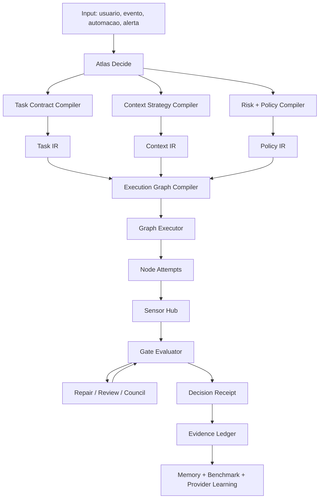

> Cleanup status: superseded_source_material.
> Canonical replacement: docs/engineering-knowledge-base/atlas-ai-kernel-architecture.md; docs/engineering-knowledge-base/atlas-ai-operating-system.md; docs/engineering-knowledge-base/atlas-ai-pipeline.md.
> Cleanup note: P0 source material for Decide. Preserve for audit; canonical runtime contracts now live in Kernel/Operating System/Pipeline.
> Authority warning: this file calls itself canonical in historical sections; current authority is the canonical replacement set above.

# Atlas Decide - Especificacao Canonica Final

**Status:** especificacao canonica de arquitetura, produto e implementacao
**Data:** 2026-05-02
**Sistema:** Atlas AI
**Escopo:** App, CLI, backend, workers, providers, Engineering Harness, memoria, automacoes, telemetria, benchmarks e autoaprimoramento
**Prioridade:** nucleo do Atlas AI
**Decisao central:** `Atlas Decide` e o modo operacional padrao do Atlas AI para conversas, pesquisas, programacao, automacoes e decisoes automaticas.

Este documento define o estado final profissional do `Atlas Decide`. Ele deve ser usado antes de alterar roteamento, provider selection, configuracoes do app, CLI, workers, prompts, skills, automacoes, memoria, benchmarks ou qualquer fluxo em que o Atlas AI decide o que fazer.

## 1. Decisao Executiva

`Atlas Decide` nao e um botao cosmetico, nao e um provider, nao e um modo "auto" simples e nao e apenas uma escolha entre Claude, Codex e Gemini.

`Atlas Decide` e o **compilador operacional do Atlas AI**.

Ele recebe uma intencao do operador ou de uma automacao e compila essa intencao em:

- contrato da tarefa;
- contexto necessario;
- risco;
- politica de autonomia;
- budget;
- providers elegiveis;
- grafo de execucao;
- sensores;
- gates;
- fallback;
- evidencias;
- decisao final;
- aprendizado para proximas execucoes.

O estado final e:

```text
pedido / evento / automacao
  -> Atlas Decide
  -> Task Contract
  -> Context Strategy
  -> Risk + Budget + Policy
  -> Execution Graph
  -> Provider per node
  -> Sensors + Gates
  -> Decision Receipt
  -> Outcome + Learning Loop
```

O usuario nao deve precisar escolher `Claude`, `Codex`, `Gemini`, `Conselho`, modelo, tier ou fluxo. Ele pode escolher quando quiser assumir o controle, mas o modo padrao do Atlas deve ser:

```text
atlas decide
```

## 2. Tese Central

O ponto mais poderoso do Atlas nao e ter muitos modelos. O ponto poderoso e ter um sistema que sabe **quando, por que, com qual contexto, em qual ordem, com qual risco, com qual evidencia e com qual aprendizado** usar cada modelo.

Claude, Codex e Gemini sao motores.

Atlas Decide e o sistema que:

- interpreta a tarefa;
- escolhe se precisa responder, pesquisar, planejar, programar, revisar, executar ou apenas registrar;
- decide se deve usar um modelo, varios modelos ou nenhum modelo;
- usa Gemini para gastar contexto amplo quando isso economiza modelos caros;
- usa Codex para execucao tecnica quando ha patch, teste e repair;
- usa Claude para julgamento, arquitetura, decisao e revisao;
- usa Opus/Codex 5.5 apenas quando o custo de erro justifica;
- registra tudo para auditoria e aprendizado.

## 3. Regra Constitucional

`Atlas Decide` e o modo padrao do Atlas AI em todas as superficies.

Isso significa:

- no app, o composer deve iniciar em `atlas decide`;
- na CLI, `atlas decide` deve ser o caminho recomendado;
- em automacoes, o Atlas deve decidir o fluxo dentro da politica configurada;
- em tarefas de programacao, o Atlas deve escolher o grafo de execucao, nao apenas um provider;
- em pesquisa, o Atlas deve decidir profundidade, fontes, provider e verificacao;
- em memoria, o Atlas deve decidir se salva, descarta, compacta, pede confirmacao ou transforma em aprendizado;
- em alertas operacionais, o Atlas deve decidir diagnostico, severidade, proxima acao e necessidade de humano;
- em decisoes automaticas, o Atlas deve operar dentro de politicas auditaveis, com gates e rollback quando aplicavel.

## 4. O Que Atlas Decide Nao E

`Atlas Decide` nao e:

- `default_provider`;
- `requested_provider=auto`;
- uma opcao visual no rodape;
- uma roleta de modelos;
- um fallback simples;
- um "conselho" sempre ligado;
- autonomia sem controle;
- permissao para executar qualquer coisa;
- substituto de testes;
- substituto de auditoria;
- uma promessa de acerto sem evidencia.

O erro arquitetural mais perigoso e implementar `Atlas Decide` como:

```text
if provider == auto:
    provider = default_provider
```

Isso e apenas default. Nao e decisao.

## 5. Estado Atual E Lacunas

O Atlas ja possui pecas importantes:

- app com opcao `atlas decide`;
- runtime settings persistidos;
- providers `claude_cli`, `codex_cli`, `gemini_cli`;
- modelo Gemini CLI fixo em `gemini-3.1-pro-preview`;
- fallback Gemini -> Claude em falhas de quota/capacidade/policy/auth quando aplicavel;
- provider health;
- `ai_router_decisions`;
- `ai_trace_metric_summaries`;
- quality evaluator;
- budget runtime;
- Engineering Harness;
- Atlas-Bench;
- contexto, compactacao, handoff e memoria;
- skills especializadas;
- controle manual de providers/modelos no app.

As lacunas principais sao:

- `atlas decide` ainda pode virar default provider em vez de decisao real;
- app ainda pode mandar provider/override cedo demais;
- router de provider nao decide grafo, apenas motor;
- decisao por tarefa ainda nao e persistida como recibo completo;
- Gemini ainda nao esta formalizado como motor de contexto amplo;
- Claude/Codex/Gemini ainda nao sao medidos por pipeline completo;
- benchmarks ainda nao tem corpus/outcome suficiente para roteamento agressivo;
- telemetria atual mede traces, mas nao prova aprendizado robusto;
- app ainda expoe provider demais para o usuario normal;
- settings ainda precisam separar politica do Atlas de override avancado;
- decisoes automaticas ainda precisam de politica propria de risco, gates e auditoria.

## 6. Definicao Curta

`Atlas Decide` e a camada que transforma qualquer entrada em um plano operacional verificavel.

Entrada:

- mensagem do usuario;
- evento do sistema;
- alerta operacional;
- automacao agendada;
- captura;
- relatorio;
- tarefa de programacao;
- pesquisa;
- memoria candidata;
- mudanca de configuracao;
- follow-up automatico.

Saida:

- resposta simples;
- pergunta de clarificacao;
- pesquisa com fontes;
- plano;
- decisao recomendada;
- execucao automatica;
- patch de codigo;
- review;
- registro de memoria;
- benchmark;
- alerta;
- bloqueio;
- pedido de aprovacao;
- fallback;
- decisao auditavel.

## 7. Principios

### P1. Atlas decide o grafo, nao so o provider

Uma tarefa pode exigir:

- Gemini para scout de contexto;
- Claude para plano;
- Codex para patch;
- testes locais;
- Claude para review;
- Gemini para revisao ampla;
- Atlas para score final.

Chamar isso de "usar Codex" e impreciso. O correto e:

```text
execution_graph = scout -> plan -> patch -> test -> review -> decide
```

### P2. Provider e motor, nao identidade

O resultado deve sempre ser Atlas AI. O provider usado e detalhe operacional auditavel.

### P3. Contexto e arbitrado, nao despejado

O Atlas deve gastar contexto bruto no motor mais adequado e barato para essa funcao. Para contexto longo, multimodal, logs extensos, docs e repo amplo, o Gemini 3.1 Pro e o scout natural. Os modelos caros recebem briefs compactos.

### P4. Autonomia cresce com evidencia

O Atlas pode tomar decisoes automaticas, mas a autonomia deve ser limitada por:

- risco;
- reversibilidade;
- budget;
- historico;
- benchmark;
- confianca;
- controles;
- outcome.

### P5. Decisao sem recibo nao existe

Cada decisao relevante deve gerar um `Decision Receipt`.

### P6. Sem teste, sem `resolved` em programacao

Para programacao, se havia teste/sensor aplicavel e ele falhou ou nao rodou sem justificativa, a decisao nao pode ser `resolved`.

### P7. Fallback nao pode degradar capacidade silenciosamente

Se Gemini falha e Atlas troca para Claude, isso deve ser registrado. Se Codex falha e Atlas troca para Claude, idem. Se o fallback perde uma capacidade essencial, a decisao deve marcar degradacao.

### P8. Overrides existem, mas sao excecao

O usuario pode escolher Claude, Codex, Gemini, Opus ou Codex 5.5 manualmente. Mas o modo default deve continuar sendo `Atlas Decide`.

### P9. Configuracao do app e fonte de politica

Se o usuario muda politica, modelo permitido, tier premium, default ou budget no app, o backend, CLI, workers e automacoes precisam obedecer. O app nao deve ser apenas UI local.

### P10. Aprendizado e empirico

O Atlas nao deve assumir que Gemini e melhor em X, Claude em Y ou Codex em Z para sempre. Ele deve medir por task type, risco, provider, modelo, pipeline, custo, latencia, qualidade e outcome.

## 8. Modelo Mental De Produto

Para o usuario normal:

```text
Atlas decide sozinho o melhor caminho.
Eu posso ver por que ele decidiu.
Eu posso trocar manualmente quando quiser.
Eu posso controlar autonomia, custo e premium nas configuracoes.
O Atlas aprende com os resultados.
```

Para o sistema:

```text
Atlas Decide compila uma tarefa em contrato, contexto, grafo, execucao, gates, decisao e aprendizado.
```

## 9. UX Padrao

### 9.1 Composer

Padrao:

```text
atlas decide - responder - claro
```

Variacoes internas:

```text
atlas decide - pesquisar - profundo
atlas decide - programar - seguro
atlas decide - revisar - critico
atlas decide - executar - autorizado
```

O provider nao deve ser o centro da UX. O provider aparece como detalhe depois da decisao.

### 9.2 Durante execucao

Estados visiveis:

- `Classificando tarefa`;
- `Carregando contexto`;
- `Checando saude, fila e budget`;
- `Escolhendo estrategia`;
- `Executando`;
- `Validando`;
- `Registrando decisao`.

### 9.3 Depois da resposta

Rodape ideal:

```text
Atlas decidiu: Gemini scout + Codex execute + Claude review
Motivo: programacao ampla, contexto longo, risco medio, budget ok
Fallback: Claude Sonnet
Confianca: alta
```

Tap abre:

```text
Por que o Atlas decidiu assim?
```

### 9.4 Settings

Settings deve ser reorganizado em:

```text
Politica do Atlas Decide
  Autonomia: Conservador | Equilibrado | Agressivo
  Prioridade: Qualidade | Balanceado | Velocidade | Custo
  Premium: Nunca | Perguntar | Auto dentro do limite
  Conselho: Nunca | Perguntar em risco alto | Auto em risco critico
  Budget: global, por tier, por janela
  Contexto longo: Auto Gemini | Perguntar | Nunca
  Programacao: Seguro | Balanceado | Rapido

Avancado
  Default provider preferido
  Modelos Claude
  Modelos Codex
  Modelo Gemini
  allow_auto por provider
  allow_manual por provider
  limites por provider
  overrides por thread
```

O usuario avancado pode escolher provider, mas a interface principal deve reforcar que `Atlas Decide` e o padrao.

## 10. Arquitetura Final



## 11. Componentes

### 11.1 AtlasDecideService

Responsavel por receber uma entrada e orquestrar todo o processo.

Responsabilidades:

- normalizar entrada;
- resolver configuracoes efetivas;
- classificar intencao;
- compilar contrato;
- montar estrategia de contexto;
- calcular risco;
- aplicar hard gates;
- gerar grafo;
- escolher provider por no;
- registrar decisao;
- iniciar execucao ou retornar resposta imediata.

### 11.2 TaskContractCompiler

Transforma entrada ambigua em contrato.

Campos minimos:

```json
{
  "goal": "string",
  "task_type": "conversation|research|decision|programming|review|memory|automation|operations",
  "acceptance_criteria": [],
  "in_scope": [],
  "out_of_scope": [],
  "allowed_paths": [],
  "forbidden_paths": [],
  "risk_flags": [],
  "rollback_policy": "none|soft|patch|backup|required",
  "definition_of_done": []
}
```

### 11.3 ContextStrategyCompiler

Decide qual contexto usar e qual provider deve processar cada camada de contexto.

Camadas:

| Camada | Nome | Uso |
|---|---|---|
| L0 | Raw Corpus | conversa bruta, repo, logs, docs, anexos |
| L1 | Evidence Cards | fatos atomicos com fonte, confianca e validade |
| L2 | Decision Brief | sintese orientada a decisao |
| L3 | Premium Brief | 500-1500 tokens para modelo caro |

Regra:

```text
contexto bruto amplo -> Gemini
brief compacto -> Claude/Codex/Opus/Codex 5.5
```

### 11.4 RiskPolicyCompiler

Classifica risco e autonomia.

Dimensoes:

- impacto financeiro;
- irreversibilidade;
- dados sensiveis;
- acao externa;
- escrita em arquivo;
- mudanca em codigo;
- banco/migration;
- auth/pagamento;
- saude/seguranca;
- producao;
- relacao com terceiros;
- incerteza;
- historico de falha.

### 11.5 ExecutionGraphCompiler

Gera um DAG de execucao.

Exemplo:

```json
{
  "graph_id": "decide_graph_123",
  "nodes": [
    {"id": "classify", "kind": "classify_task"},
    {"id": "scout", "kind": "long_context_scout"},
    {"id": "distill", "kind": "context_distill"},
    {"id": "plan", "kind": "plan"},
    {"id": "execute", "kind": "patch_or_answer"},
    {"id": "test", "kind": "sensor"},
    {"id": "review", "kind": "review"},
    {"id": "decide", "kind": "final_decision"}
  ],
  "edges": [
    ["classify", "scout"],
    ["scout", "distill"],
    ["distill", "plan"],
    ["plan", "execute"],
    ["execute", "test"],
    ["test", "review"],
    ["review", "decide"]
  ]
}
```

### 11.6 ProviderPolicyEngine

Escolhe provider por no, nao por conversa inteira.

Entrada:

- task type;
- risk;
- context size;
- modality;
- tool requirement;
- provider health;
- queue;
- budget;
- premium policy;
- allow_auto;
- allow_manual;
- historical score;
- benchmark score;
- user override;
- fallback plan.

Saida:

```json
{
  "node_id": "scout",
  "provider": "gemini_cli",
  "model": "gemini-3.1-pro-preview",
  "reason": "long_context_scout",
  "fallback_provider": "claude_cli",
  "fallback_model": "claude-sonnet-4-6"
}
```

### 11.7 GraphExecutor

Executa o grafo com:

- status por no;
- retries;
- cancellation;
- timeout;
- idempotencia;
- artifacts;
- logs;
- fallback;
- repair loops;
- replay.

### 11.8 SensorHub

Executa sensores objetivos.

Exemplos:

- `php artisan test`;
- `npm run test:front`;
- typecheck;
- lint;
- visual smoke;
- Playwright/Cypress;
- quality scan;
- migration review;
- budget check;
- provider health;
- memory consistency;
- source verification.

### 11.9 GateEvaluator

Decide se o grafo avanca, repara, bloqueia ou pede humano.

Decisoes possiveis:

- `continue`;
- `retry`;
- `repair`;
- `review`;
- `fallback`;
- `pause_for_user`;
- `block`;
- `unsafe`;
- `complete`.

### 11.10 EvidenceLedger

Persistencia append-only de evidencias.

Deve registrar:

- input;
- contrato;
- contexto usado;
- contexto descartado;
- candidatos de provider;
- provider escolhido;
- fallback;
- modelo;
- custo/tokens;
- latencia;
- ferramentas;
- comandos;
- patch;
- testes;
- reviews;
- score;
- decisao;
- feedback;
- outcome.

### 11.11 LearningLoop

Transforma resultado em melhoria.

Saidas:

- provider score;
- model score;
- pipeline score;
- benchmark case;
- memoria candidata;
- prompt update candidate;
- skill update candidate;
- route policy update;
- negative cache;
- preference candidate;
- risk precedent.

## 12. Tipos De Tarefa

### 12.1 Conversa simples

Exemplos:

- pergunta casual;
- explicacao curta;
- brainstorming leve.

Fluxo:

```text
classify -> answer -> record
```

Provider:

- Claude Sonnet ou default configurado;
- Gemini se contexto longo/anexo;
- Codex apenas se tarefa tecnica/codigo.

### 12.2 Pesquisa

Exemplos:

- pesquisar memoria de IA;
- comparar ferramentas;
- resumir docs.

Fluxo:

```text
classify -> source_plan -> retrieve -> synthesize -> verify -> answer -> record
```

Provider:

- Gemini para leitura longa e triagem;
- Claude para sintese final;
- fallback Claude quando Gemini bater quota/capacidade;
- web/source tools quando necessario.

### 12.3 Decisao

Exemplos:

- escolher arquitetura;
- decidir investimento de tempo;
- priorizar roadmap;
- decidir configuracao do Atlas.

Fluxo:

```text
classify -> options -> evidence -> tradeoff -> recommendation -> authorship_gate -> record
```

Provider:

- Gemini para contexto amplo e alternativas;
- Claude para julgamento;
- Opus se risco alto e premium permitido;
- Conselho se divergencia/risco critico.

### 12.4 Programacao

Exemplos:

- bug;
- refactor;
- feature;
- teste;
- UI;
- migracao.

Fluxo:

```text
scout -> plan -> patch -> test -> repair -> review -> decide -> evidence
```

Provider:

- Codex como executor principal;
- Claude como planner/reviewer;
- Gemini como scout/reviewer amplo;
- Codex 5.5 para premium execution quando permitido e justificado.

### 12.5 Revisao

Exemplos:

- revisar diff;
- revisar arquitetura;
- avaliar qualidade;
- encontrar regressao.

Fluxo:

```text
load_diff -> inspect -> risk_map -> findings -> verdict
```

Provider:

- Claude para risco/arquitetura;
- Codex para diff tecnico;
- Gemini para varredura ampla.

### 12.6 Memoria

Exemplos:

- capturas;
- decisoes;
- preferencias;
- aprendizados;
- compactacao.

Fluxo:

```text
triage -> classify -> dedupe -> evidence -> memory_delta -> approval_policy -> write
```

Provider:

- Gemini para lote/triagem/contexto longo;
- Claude para memoria sensivel e decisao de significado;
- Atlas rules para persistencia.

### 12.7 Automacao

Exemplos:

- relatorio diario;
- monitorar performance;
- follow-up;
- auto-cura;
- reprocessamento.

Fluxo:

```text
event -> classify -> policy -> execute_or_queue -> notify_or_record -> outcome
```

Provider:

- depende do task type;
- Gemini para triagem em lote;
- Claude para decisao;
- Codex para engineering tasks;
- nenhum provider quando regra deterministica basta.

### 12.8 Operacional

Exemplos:

- alerta de performance;
- trace ruim;
- provider offline;
- budget estourado;
- worker falhando.

Fluxo:

```text
ingest -> severity -> diagnose -> recommend_or_execute -> verify -> record
```

Provider:

- Gemini para logs longos;
- Claude para diagnostico;
- Codex para correcoes tecnicas;
- hard gates para producao/dados.

## 13. Papeis Dos Providers

### 13.1 Gemini CLI

Provider:

```text
gemini_cli
```

Modelo:

```text
gemini-3.1-pro-preview
```

Regra:

```text
usar somente o modelo mais forte configurado para Gemini
```

Papel:

- long-context scout;
- leitura massiva de repo/docs/logs/traces;
- multimodal;
- triagem em lote;
- clustering de memorias;
- compaction de contexto;
- broad review;
- comparacao de screenshots;
- detectar lacunas e inconsistencias;
- gerar Evidence Cards;
- gerar Decision Briefs.

Nao usar como default para:

- patch direto;
- execucao destrutiva;
- migrations;
- comandos perigosos;
- repair loop de codigo;
- acao sem sensor;
- decisao final de alto risco sem reviewer.

Fallback:

- se quota/capacidade/auth/policy impedir Gemini, trocar para Claude quando a tarefa ainda puder ser resolvida;
- registrar fallback no receipt;
- se a tarefa exige multimodal/long-context e Claude nao cobre, marcar degradacao.

### 13.2 Claude Sonnet

Papel:

- julgamento geral;
- conversa;
- decisao;
- arquitetura;
- plano;
- tradeoffs;
- revisao;
- interpretacao de falhas;
- sintese final;
- memoria sensivel.

Uso:

- provider diario padrao para raciocinio;
- fallback primario do Gemini;
- reviewer do Codex.

### 13.3 Claude Opus

Papel:

- decisao premium;
- arquitetura critica;
- risco alto;
- revisao final sensivel;
- plano de alto impacto;
- julgamento quando Sonnet nao basta.

Uso:

- manual;
- automatico apenas se `premium_policy=auto` e risco/custo justificar;
- sempre registrado como premium.

### 13.4 Codex Spark

Papel:

- programacao rapida;
- patch;
- testes;
- repair;
- leitura tecnica de diff;
- tarefas de engenharia de baixo/medio risco.

Uso:

- executor default para no `implement_patch`;
- nao como default geral de conversa;
- pode ser bloqueado em automatico se usuario configurar.

### 13.5 Codex 5.5

Papel:

- execucao premium;
- refactor complexo;
- reparo dificil;
- programacao de alto risco;
- debugging profundo;
- finalizacao quando Spark/Sonnet nao convergem.

Uso:

- manual;
- automatico somente com politica premium e budget;
- nunca gastar contexto bruto desnecessario nele; Gemini deve scoutar antes.

### 13.6 Conselho

Conselho nao e provider. Conselho e protocolo.

Usar quando:

- risco critico;
- divergencia entre modelos;
- falha repetida;
- decisao arquitetural grande;
- auth/billing/migration/privacidade;
- resposta vai virar acao externa;
- resultado sera usado como politica persistente.

Output do conselho:

```json
{
  "agreements": [],
  "disagreements": [],
  "risk": "high",
  "recommended_graph_change": "",
  "executor": "",
  "blocked_until": "",
  "final_recommendation": ""
}
```

## 14. Context Arbitrage

### 14.1 Problema

Sonnet, Opus e Codex 5.5 sao bons para julgamento e execucao, mas caros demais para receber contexto bruto gigante sempre.

### 14.2 Solucao

Usar Gemini como camada de leitura ampla e compressao.

Fluxo:

```text
L0 Raw Corpus
  -> Gemini Scout
  -> L1 Evidence Cards
  -> Gemini Distill
  -> L2 Decision Brief
  -> Claude/Codex/Opus/Codex 5.5
  -> final judgment / execution
```

### 14.3 Briefs

#### Decision Brief v1

```json
{
  "goal": "",
  "pending_decision": "",
  "options": [],
  "criteria": [],
  "tradeoffs": [],
  "reversibility": "",
  "cost_of_delay": "",
  "stakeholders": [],
  "asymmetric_risks": [],
  "evidence_refs": [],
  "unknowns": [],
  "recommendation": "",
  "authorship_question": ""
}
```

#### Premium Brief v1

```json
{
  "decision_in_3_lines": "",
  "ranked_criteria": [],
  "recommended_option": "",
  "best_objection": "",
  "risk_of_being_wrong": "",
  "signals_that_change_decision": [],
  "minimum_reversible_action": "",
  "human_gate_required": false
}
```

#### Handoff Brief v1

```json
{
  "thread_id": "",
  "goal": "",
  "current_state": "",
  "preserved_decisions": [],
  "open_loops": [],
  "next_steps": [],
  "previous_provider": "",
  "escalation_reason": "",
  "do_not_reopen": []
}
```

### 14.4 Caches

Criar caches:

- `corpus_digest_cache`;
- `decision_brief_cache`;
- `provider_brief_cache`;
- `negative_context_cache`.

Cada cache deve ter:

- `hash`;
- `source_refs`;
- `privacy_class`;
- `valid_until`;
- `invalidated_by`;
- `created_by_provider`;
- `model`;
- `prompt_version`.

Invalidar quando:

- criterio muda;
- opcao nova aparece;
- contexto fonte muda;
- feedback marca contexto errado;
- privacidade muda;
- fase do projeto muda;
- decisao e reaberta.

## 15. Politica De Autonomia

### 15.1 Niveis

| Nivel | Nome | Comportamento |
|---|---|---|
| A0 | Observa | Apenas analisa e registra |
| A1 | Recomenda | Recomenda, nao executa |
| A2 | Prepara | Gera plano/patch/proposta sem aplicar |
| A3 | Executa reversivel | Executa acao reversivel e auditavel |
| A4 | Executa com rollback | Executa acao sensivel com rollback claro |
| A5 | Critico | Exige gate humano ou conselho salvo politica explicita |

### 15.2 Perfil Do App

Configuracoes:

```text
Conservador:
  premium pergunta
  conselho pergunta
  A3 limitado
  sem exploration agressivo

Equilibrado:
  premium auto dentro do limite
  conselho auto em risco critico
  A3 permitido
  exploration baixa em tarefas low-risk

Agressivo:
  premium auto
  conselho auto por risco
  A4 permitido quando rollback existe
  exploration maior em baixo risco
```

### 15.3 Decisoes Automaticas

O Atlas Decide sera usado para decisoes automaticas. Isso e permitido, mas cada decisao automatica deve ter:

- fonte do evento;
- politica aplicada;
- autonomia efetiva;
- risco;
- reversibilidade;
- acao tomada;
- justificativa;
- fallback;
- notificacao se necessario;
- outcome esperado;
- janela de revisao.

Exemplos de decisoes automaticas permitidas:

- classificar captura;
- compactar conversa;
- escolher provider para pesquisa;
- reprocessar trace com falha;
- criar memory delta candidato;
- rodar benchmark smoke;
- trocar Gemini para Claude em quota;
- reduzir modelo quando budget pedir;
- enviar resumo operacional;
- marcar alerta como baixo risco.

Exemplos que exigem gate humano por padrao:

- apagar dados;
- alterar producao;
- enviar mensagem externa sensivel;
- gastar premium fora de budget;
- aplicar migration arriscada;
- trocar politica global de autonomia;
- promover prompt/policy para todos os fluxos;
- registrar memoria sensivel como verdade permanente.

## 16. Hard Gates

### 16.1 Provider Gates

Bloquear provider quando:

- auth expirada;
- rate limit sem fallback;
- provider offline;
- modelo nao permitido;
- `allow_auto=false` e chamada automatica;
- budget hard-limit;
- privacy incompatibiliza provider;
- CLI retorna erro de argumentos/configuracao;
- modelo nao existe ou nao foi validado.

### 16.2 Context Gates

Bloquear ou degradar quando:

- contexto obrigatorio ausente;
- source nao confiavel;
- anexo nao processado;
- contexto sensivel sem politica;
- contexto longo demais sem distill;
- brief sem `source_refs`;
- memoria antiga tratada como atual sem validade.

### 16.3 Engineering Gates

Programacao nao pode virar `resolved` se:

- teste aplicavel falhou;
- patch viola escopo estrito;
- review P0/P1 aberto;
- segredo aparece no diff;
- workspace dirty nao foi respeitado;
- worktree nao consegue aplicar patch;
- migration sem rollback/review quando exigido;
- comportamento visual exigido sem evidencia;
- attempt final falhou.

### 16.4 Automation Gates

Automacao nao pode executar se:

- politica nao permite autonomia exigida;
- custo estimado supera limite;
- acao externa sensivel sem gate;
- falta rollback para acao irreversivel;
- decision receipt nao pode ser gravado;
- evento fonte esta incompleto.

## 17. Decision Receipt

Cada execucao relevante deve gerar recibo.

Formato minimo:

```json
{
  "decision_id": "uuid",
  "trace_id": "uuid",
  "surface": "mobile|cli|automation|api",
  "task_type": "programming",
  "risk_level": "medium",
  "autonomy_requested": "A3",
  "autonomy_effective": "A2",
  "policy_version": "atlas_decide_policy_v1",
  "operator_override": false,
  "candidates": [
    {
      "provider": "gemini_cli",
      "model": "gemini-3.1-pro-preview",
      "eligible": true,
      "score": 0.82,
      "reason": "long_context"
    }
  ],
  "selected_graph": "graph_id",
  "selected_provider_summary": "Gemini scout + Codex execute + Claude review",
  "fallback_plan": [],
  "signals": {
    "context_size": 120000,
    "has_attachments": true,
    "provider_health": {},
    "budget": {},
    "historical_scores": {}
  },
  "decision": "queued|answered|resolved|partial|blocked|unsafe|needs_human",
  "confidence": 0.78,
  "cost_estimate": {},
  "actual_cost": {},
  "evidence_refs": [],
  "created_at": "timestamp"
}
```

## 18. Decision Outcomes

Decisao final deve usar vocabulario estavel:

| Decisao | Significado |
|---|---|
| `answered` | Resposta simples concluida |
| `resolved` | Contrato satisfeito com gates verdes |
| `partial` | Valor entregue, mas evidencia incompleta ou risco residual |
| `unresolved` | Falha sem bloqueio externo |
| `blocked` | Falta permissao, contexto, provider, budget ou humano |
| `unsafe` | Risco de segredo, privacidade, destruicao ou dano |
| `needs_human` | Decisao depende de criterio humano/autoria |
| `degraded` | Concluiu com fallback que perdeu capacidade |
| `queued` | Decisao tomada e execucao enfileirada |
| `cancelled` | Operador/sistema cancelou |

## 19. Scoring

### 19.1 Score De Decisao

```text
decision_score =
  0.30 * quality
+ 0.18 * outcome_probability
+ 0.14 * first_pass_success
+ 0.12 * risk_fit
+ 0.10 * context_efficiency
+ 0.08 * reliability
+ 0.05 * cost_fit
+ 0.03 * latency_fit
- uncertainty_penalty
- policy_violation_penalty
- remediation_penalty
```

### 19.2 Score Por Provider/Pipeline

O Atlas deve medir por `arm_id`:

```text
arm_id = provider:model:pipeline:runtime:context_policy
```

Exemplos:

```text
gemini_cli:gemini-3.1-pro-preview:long_context_scout:host:l0_to_l2
codex_cli:gpt-5.3-codex-spark:dev_harness:host:brief
codex_cli:gpt-5.5:premium_patch:host:brief
claude_cli:claude-sonnet-4-6:decision_judge:host:l3
claude_codex:council:critical_review:host:l3
```

### 19.3 Exploration/Exploitation

Estado inicial recomendado:

```text
shadow + conservative
```

Depois:

- baixo risco: 10-20% exploration;
- medio risco: 5-10% exploration;
- alto risco: exploit conservador por lower confidence bound;
- critico: sem exploration sem benchmark/outcome robusto.

Registrar sempre:

- candidatos;
- scores;
- policy;
- propensity;
- se foi exploration;
- outcome maduro.

## 20. Benchmark E Aprendizado

### 20.1 Atlas-Bench

Atlas-Bench deve ser laboratorio offline do Atlas Decide.

Suites:

- `atlas-decide-smoke`: 5-10 casos;
- `atlas-decide-release`: 20+ casos;
- `atlas-decide-regression`: 50+ casos;
- `atlas-engineering-heavy`: programacao/refactor/debug;
- `atlas-memory-curation`: memoria/triagem/compactacao;
- `atlas-research`: pesquisa e verificacao;
- `atlas-ops`: alertas operacionais.

### 20.2 Promocao De Politica

Uma politica nova so vira default se:

- nao piora pass rate;
- melhora score ou reduz custo/latencia;
- nao aumenta regressao de qualidade;
- nao aumenta unsafe/blocked indevido;
- tem benchmark pareado;
- tem amostra minima;
- tem rollback.

### 20.3 Dados Minimos

| Amostra | Uso |
|---|---|
| `n < 5` | apenas prior |
| `5 <= n < 20` | exploration, sem promocao |
| `20 <= n < 50` | canary baixo risco |
| `50 <= n < 100` | default low/medium se LCB vencer |
| `>= 100` | elegivel para high risk se outcomes existem |

## 21. Programacao Pesada

### 21.1 Fluxo Estado-Da-Arte

```text
1. Scout
   - identificar repo real
   - git status
   - dirty state
   - arquivos provaveis
   - testes
   - riscos

2. Long Context Scout
   - Gemini le contexto amplo
   - gera mapa de arquivos, simbolos, padroes, lacunas

3. Plan
   - Claude gera plano
   - Codex valida contra codigo real
   - Gemini critica escopo

4. Patch
   - Codex aplica menor diff
   - worktree se dirty state ou risco

5. Test
   - testes focados
   - typecheck/lint/visual se aplicavel

6. Repair
   - max 3 iteracoes
   - cada iteracao exige hipotese nova

7. Review
   - Claude arquitetura/risco
   - Codex diff tecnico
   - Gemini broad review

8. Decide
   - resolved/partial/blocked/unsafe

9. Evidence
   - patch hash
   - testes
   - findings
   - outcome
```

### 21.2 Regras De Workspace

O workspace `/Users/vitorepf/Develop/atlas` e agregado. Repos reais:

- `atlas-server`;
- `atlas-app`;
- possivelmente docs/Vault.

Antes de qualquer patch:

- identificar repo alvo;
- rodar `git status --short`;
- separar mudancas preexistentes;
- usar worktree quando dirty state existir;
- nao reverter mudancas do usuario;
- nao aplicar patch fora do escopo sem revalidar plano.

### 21.3 Comando Profissional

```bash
php artisan atlas:engineering:run \
  --task-id=<task-id> \
  --workspace=/Users/vitorepf/Develop/atlas/<repo-alvo> \
  --sandbox=worktree \
  --harness-policy=strict \
  --complete \
  --auto-test \
  --quality-scan=auto \
  --quality-profile=standard \
  --quality-changed-only \
  --max-attempts=3 \
  --json
```

## 22. Pesquisa E Contexto Longo

Pesquisa no Atlas Decide deve:

- classificar necessidade de fonte externa;
- usar browsing quando informacao for instavel;
- usar Gemini para leitura longa;
- preservar `source_refs`;
- separar fato de inferencia;
- gerar resumo auditavel;
- registrar custo/contexto;
- usar Claude para sintese final quando julgamento for relevante.

Exemplo:

```text
"Faca uma pesquisa sobre memoria de IA"
  -> classify research
  -> source plan
  -> Gemini scout long docs/papers
  -> Claude synthesize
  -> answer with sources
  -> record decision receipt
```

## 23. Memoria E Autoaprimoramento

Atlas Decide participa do self-improvement em quatro niveis:

### 23.1 Memory Delta

Decide se uma informacao vira:

- memoria permanente;
- memoria de projeto;
- preferencia;
- decisao;
- hipotese;
- descarte;
- revisao futura.

### 23.2 Skill Delta

Decide se um padrao repetido sugere alterar skill.

Gate:

- evidencias multiplas;
- comparacao antes/depois;
- rollback;
- revisao humana se skill sensivel.

### 23.3 Prompt/Policy Delta

Decide se prompt ou politica deve mudar.

Nunca promover automaticamente para fluxo critico sem benchmark.

### 23.4 Provider Policy Delta

Decide se Gemini/Claude/Codex deve ganhar ou perder peso em um tipo de tarefa.

Precisa de:

- outcomes;
- benchmark;
- confidence;
- custo confiavel;
- amostra suficiente.

## 24. App Como Control Plane

O app configura o Atlas. Configuracao do app deve refletir no backend, CLI e workers.

### 24.1 Fonte De Verdade

Fonte de verdade:

```text
Atlas DB / Runtime Settings
```

O app nao deve decidir localmente o provider final, salvo override explicito. Ele deve enviar:

- intencao;
- modo desejado;
- hints;
- anexos;
- contexto;
- politica escolhida;
- override manual se houver.

O backend decide.

### 24.2 Quando Usuario Muda Default

Se o usuario define default como Codex:

- o Atlas deve registrar preferencia;
- `Atlas Decide` deve considerar isso como prior;
- chamadas manuais sem decide podem usar Codex diretamente;
- automacoes respeitam `allow_auto`;
- CLI e workers leem o mesmo setting.

Mas:

- se a tarefa nao combina com Codex, Atlas Decide pode escolher outro provider e explicar;
- se usuario escolheu override hard "usar Codex nesta resposta/thread", o Atlas deve obedecer salvo gate duro.

### 24.3 Override Escopado

Overrides devem ter escopo:

- uma resposta;
- thread;
- 1h;
- projeto;
- tarefa;
- ate desligar manualmente.

Override sem escopo vira divida.

## 25. Payloads

### 25.1 App -> Backend

Payload recomendado:

```json
{
  "input": "Faca uma pesquisa sobre memoria de IA",
  "surface": "mobile",
  "decision_mode": "atlas_decide",
  "task_hints": {
    "focus": "research",
    "depth": "auto",
    "style": "clear"
  },
  "context_refs": [],
  "attachments": [],
  "manual_override": null,
  "policy_hints": {
    "autonomy": "balanced",
    "priority": "quality",
    "premium": "ask",
    "council": "critical_only"
  }
}
```

### 25.2 Manual Override

```json
{
  "decision_mode": "manual_override",
  "manual_override": {
    "provider": "codex_cli",
    "model": "gpt-5.5",
    "scope": "single_response",
    "reason": "operator_selected"
  }
}
```

### 25.3 Backend -> App

```json
{
  "trace_id": "uuid",
  "decision_receipt": {
    "decision_id": "uuid",
    "status": "executing",
    "summary": "Gemini scout + Claude synthesize",
    "reason": "research with long context",
    "confidence": "high",
    "fallback": "Claude Sonnet"
  }
}
```

## 26. CLI

Comandos finais desejaveis:

```bash
atlas decide "pergunta ou tarefa"
atlas decide --focus research "..."
atlas decide --focus programming --workspace atlas-server "..."
atlas decide --why <trace-id>
atlas decide receipt <trace-id>
atlas decide replay <decision-id>
atlas decide benchmark --suite atlas-decide-smoke
atlas decide policy status
atlas decide policy set --autonomy balanced --priority quality
```

Artisan:

```bash
php artisan atlas:decide:run
php artisan atlas:decide:receipt
php artisan atlas:decide:benchmark
php artisan atlas:decide:policy
php artisan atlas:decide:replay
```

## 27. Data Model Proposto

Pode evoluir tabelas existentes, mas o contrato conceitual e:

### 27.1 `ai_decisions`

- `id`;
- `trace_id`;
- `thread_id`;
- `surface`;
- `decision_mode`;
- `task_type`;
- `risk_level`;
- `autonomy_requested`;
- `autonomy_effective`;
- `policy_version`;
- `status`;
- `decision`;
- `confidence`;
- `operator_override`;
- `created_at`;
- `updated_at`.

### 27.2 `ai_decision_candidates`

- `decision_id`;
- `provider`;
- `model`;
- `pipeline`;
- `eligible`;
- `score`;
- `reason`;
- `rejected_reason`;
- `health_snapshot`;
- `budget_snapshot`.

### 27.3 `ai_execution_graphs`

- `id`;
- `decision_id`;
- `graph_hash`;
- `task_contract_hash`;
- `context_pack_hash`;
- `policy_hash`;
- `status`.

### 27.4 `ai_execution_graph_nodes`

- `graph_id`;
- `node_id`;
- `kind`;
- `provider`;
- `model`;
- `status`;
- `attempts`;
- `started_at`;
- `finished_at`;
- `artifact_refs`;
- `failure_reason`.

### 27.5 `ai_context_briefs`

- `id`;
- `decision_id`;
- `brief_type`;
- `source_hash`;
- `brief_hash`;
- `provider`;
- `model`;
- `source_refs`;
- `privacy_class`;
- `valid_until`.

### 27.6 `ai_decision_outcomes`

- `decision_id`;
- `outcome_type`;
- `accepted`;
- `reopened`;
- `rolled_back`;
- `incident`;
- `quality_score`;
- `cost`;
- `latency`;
- `recorded_at`.

## 28. Observabilidade

Metricas obrigatorias:

- `decision_count`;
- `decision_by_task_type`;
- `decision_by_provider`;
- `decision_by_pipeline`;
- `fallback_rate`;
- `degraded_rate`;
- `premium_usage_rate`;
- `premium_roi`;
- `context_compression_ratio`;
- `context_waste_rate`;
- `first_pass_success`;
- `reask_rate`;
- `redecision_rate`;
- `cost_per_accepted_decision`;
- `cost_per_outcome`;
- `unsafe_block_rate`;
- `false_block_rate`;
- `manual_override_rate`;
- `router_override_rate`;
- `atlas_decide_acceptance_rate`;
- `bench_pass_rate`;
- `provider_health_pain`.

## 29. Fallback

### 29.1 Gemini -> Claude

Quando Gemini falhar por:

- quota;
- capacidade;
- auth;
- policy;
- CLI error recuperavel.

Acao:

- tentar Claude se tarefa permite;
- marcar fallback;
- marcar degradacao se contexto/multimodal for essencial;
- atualizar provider pain;
- registrar no receipt.

### 29.2 Codex -> Claude

Quando Codex falhar:

- CLI error;
- model unavailable;
- quota;
- argument error;
- non-convergence.

Acao:

- se tarefa e programacao, Claude pode planejar/reparar;
- se precisa patch tecnico, tentar Codex fallback model ou pausar;
- nao fingir resolved sem sensor.

### 29.3 Claude -> Outro

Quando Claude falhar:

- fallback depende da tarefa;
- Gemini pode responder pesquisa/contexto;
- Codex pode executar programacao;
- se julgamento critico, bloquear ou pedir humano.

## 30. Privacy E Seguranca

Atlas Decide deve classificar dados:

- `public`;
- `internal`;
- `private`;
- `secret`;
- `regulated`;
- `unknown`.

Regras:

- nunca enviar segredo para provider sem politica;
- redigir secrets em evidence;
- nao usar memoria sensivel como contexto sem motivo;
- registrar source refs;
- limitar contexto por escopo;
- bloquear acao destrutiva sem rollback/gate;
- separar provider permissions de tool permissions.

Importante:

```text
provider confiavel nao significa ferramenta autorizada
```

## 31. Exemplos Canonicos

### 31.1 Pergunta simples

Input:

```text
Esta funcionando?
```

Atlas Decide:

- task: conversation/status;
- risco baixo;
- provider: Claude/default;
- grafo simples;
- resposta direta;
- receipt leve.

### 31.2 Pesquisa sobre memoria de IA

Input:

```text
Faca uma pesquisa sobre memoria de IA
```

Atlas Decide:

- task: research;
- fonte externa provavel;
- Gemini scout;
- Claude synthesize;
- resposta com fontes;
- fallback Claude se Gemini falhar.

### 31.3 Refactor grande

Input:

```text
Refatore o fluxo de Atlas Decide no app e backend
```

Atlas Decide:

- task: programming/refactor;
- risco alto;
- scout repo;
- Gemini context map;
- Claude plan;
- Codex patch;
- tests;
- Claude/Codex review;
- maybe council;
- worktree;
- no resolved sem gates.

### 31.4 Alerta operacional

Input:

```text
Relatorio de performance critico
```

Atlas Decide:

- task: operations;
- severity;
- Gemini logs if long;
- Claude diagnosis;
- Codex only if patch needed;
- recommendation or automatic low-risk action;
- outcome tracking.

### 31.5 Auto memoria

Evento:

```text
nova captura de pensamento
```

Atlas Decide:

- triage;
- dedupe;
- classify;
- memory delta candidate;
- save automatic if low-risk/preference explicit;
- ask if sensitive/identity-level.

## 32. Roadmap De Implementacao

### Fase 0 - Corrigir Semantica Atual

Objetivo: `atlas decide` nao pode ser default provider.

Entregas:

- app nao envia `requested_provider=auto` como override;
- backend diferencia `decision_mode=atlas_decide` de provider manual;
- `ai_router_decisions.was_overridden` so true para override real;
- `AiTraceResource` expoe decision receipt basico;
- app mostra "por que decidiu".

### Fase 1 - Decision Receipt

Entregas:

- receipt persistente;
- candidatos/rejected reasons;
- fallback plan;
- provider/model/tier;
- policy version;
- confidence;
- cost estimate;
- app sheet de explicacao;
- CLI `atlas decide --why`.

### Fase 2 - Provider Policy Por Tarefa

Entregas:

- `AtlasDecideService`;
- `TaskContractCompiler`;
- `RiskPolicyCompiler`;
- `ProviderPolicyEngine`;
- hard gates;
- Gemini como long-context scout formal;
- Claude/Codex fallback formal;
- settings globais respeitados por app/CLI/workers.

### Fase 3 - Context Arbitrage

Entregas:

- Evidence Cards;
- Decision Brief;
- Premium Brief;
- context cache;
- negative cache;
- Gemini distill;
- premium receives brief only by default.

### Fase 4 - Execution Graph Para Programacao

Entregas:

- `ExecutionGraph`;
- nodes;
- provider per node;
- integration with Engineering Harness;
- worktree default for dirty state;
- graph evidence;
- graph replay.

### Fase 5 - Auto Decisions

Entregas:

- policy for automation;
- autonomy levels A0-A5;
- background decisions;
- scheduled decisions;
- audit ledger;
- notification rules;
- rollback rules.

### Fase 6 - Empirical Router

Entregas:

- `arm_id`;
- propensity logging;
- Atlas-Bench suites;
- provider/model/pipeline score;
- conservative contextual bandit;
- promotion gates;
- shadow mode;
- canary low-risk.

### Fase 7 - Self-Improvement

Entregas:

- memory deltas;
- skill deltas;
- prompt/policy deltas;
- benchmark before promotion;
- rollback;
- human gate for sensitive policies.

## 33. Definition Of Done

`Atlas Decide` so pode ser considerado completo quando:

- o app usa `atlas decide` como padrao real;
- backend decide provider/grafo, nao o app;
- CLI e app obedecem as mesmas runtime settings;
- Gemini 3.1 Pro e usado como long-context scout/triage formal;
- quota/capacidade de Gemini cai para Claude com receipt;
- Codex funciona como executor tecnico;
- Claude funciona como julgador/revisor;
- Opus/Codex 5.5 existem como premium com politica clara;
- settings do app mudam comportamento real do Atlas inteiro;
- cada decisao relevante tem receipt;
- programacao pesada passa por harness, testes, review e evidence;
- automacoes tem politica de autonomia e risco;
- Atlas-Bench mede providers/pipelines;
- learning loop nao promove mudanca sem evidencia;
- UI mostra decisao, motivo, fallback, custo e aprendizado sem exigir que usuario entenda provider.

## 34. Anti-Patterns

Nao fazer:

- chamar default provider e dizer que foi Atlas Decide;
- usar Gemini para patch destrutivo por padrao;
- mandar repo inteiro para Opus/Codex 5.5 sem scout;
- esconder fallback;
- deixar app escolher provider final quando modo e `atlas decide`;
- tratar `auto` como override;
- promover provider por amostra pequena;
- usar conselho teatral sem output estruturado;
- dizer `resolved` sem teste/sensor em codigo;
- transformar settings em controles locais sem persistencia real;
- ignorar dirty state;
- apagar/reverter mudanca do usuario;
- executar automacao sensivel sem receipt;
- trocar politica global automaticamente sem benchmark.

## 35. Referencias Externas

Estas referencias orientam o desenho, mas o Atlas deve validar tudo empiricamente no proprio ambiente:

- SWE-bench: https://arxiv.org/abs/2310.06770
- SWE-agent: https://arxiv.org/abs/2405.15793
- Agentless: https://arxiv.org/abs/2407.01489
- Reflexion: https://arxiv.org/abs/2303.11366
- Graph of Thoughts: https://arxiv.org/abs/2308.09687

## 36. Decisao Final

O estado final mais profissional do Atlas Decide e:

```text
Atlas Decide = Operating System de decisao e execucao do Atlas AI
```

Ele nao escolhe "qual IA responde".

Ele escolhe:

- qual tarefa esta acontecendo;
- qual contexto e necessario;
- qual risco existe;
- qual politica se aplica;
- qual grafo deve rodar;
- qual provider entra em cada no;
- qual sensor valida;
- qual fallback existe;
- qual decisao final e defensavel;
- qual aprendizado volta para o Atlas.

Este e o ponto em que `Gemini`, `Claude`, `Codex`, `Opus`, `Codex 5.5` e `Conselho` deixam de ser opcoes que o usuario precisa gerenciar e passam a ser motores sob comando do Atlas.
