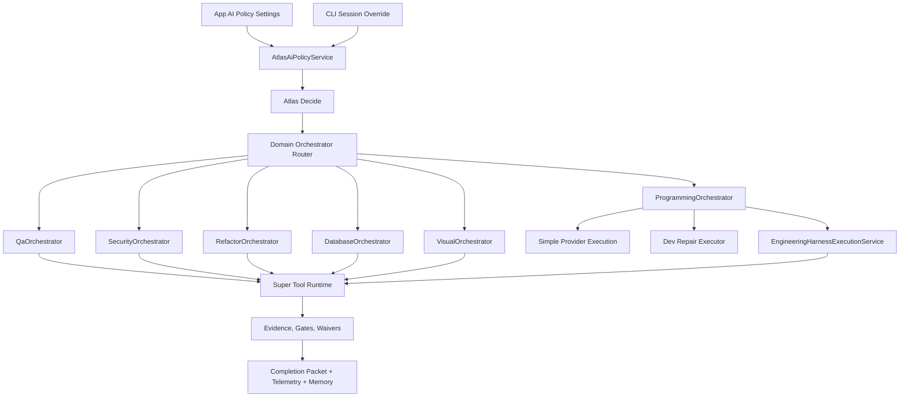

# Atlas Programming Product Architecture

Status: draft canonical specification
Date: 2026-05-03
Scope: Atlas app, Atlas CLI, Atlas Decide, Engineering Harness, Tool Runtime, domain orchestrators, release gates

## Document Hierarchy

This document is not the parent architecture for all Atlas AI domains.

It is the `programming` domain specialization of:

- `2026-05-03-atlas-domain-profile-orchestration-architecture.md`

The parent document defines the canonical architecture for domain profiles, flow profiles, model policies, orchestration policies, skill policies, memory policies, gate policies, domain orchestrators, and domain runtimes.

This document applies that architecture to:

- `programming.dev`
- `programming.debug`
- `programming.refactor`
- `programming.qa`
- `programming.security`
- `programming.forge`

The correct relationship is:

```text
Atlas Domain Profile Orchestration Architecture
  -> defines the cross-domain operating model

Atlas Programming Product Architecture
  -> specializes that model for programming work
  -> implements `AtlasProgrammingOrchestrator`
  -> uses Engineering Harness as the heavy programming runtime
```

If this document appears to conflict with the parent domain-profile architecture, do not create a third path. Update this document so the programming implementation remains a clean specialization of the parent model.

## Executive Decision

Atlas does not need more command variants. Atlas needs one authority chain for programming work.

The target product model is:

- `atlas dev`: default interactive programming cockpit for daily work.
- `atlas forge`: maximum-power interactive programming cockpit for medium, difficult, risky, or large work.
- App Settings: persistent AI policy, model availability, autonomy, budgets, and background permissions.
- CLI session override: temporary restriction or preference for the current session.
- Atlas Decide: authority for provider, model, graph, fallback, and policy receipt.
- Domain orchestrators: authority for execution workflow by task type.
- Engineering Harness and Tool Runtime: execution and evidence engines, not top-level UX.

The current system already has most of the required pieces. The architectural problem is that several components make overlapping decisions:

- `AtlasDecideService` decides candidate provider, task profile, context strategy, execution strategy, and planned graph.
- `AiGatewayService` applies final provider gates, fallback, budget, and Gemini scout activation.
- `AtlasCliDevWorkflowService` uses `AtlasCliProviderStrategyService`, creating a second provider-strategy brain for `atlas dev`.
- `EngineeringHarnessRunnerService` is powerful, but hidden behind `atlas engineering run --task-id=...` and coupled to `AtlasTask`.
- The app exposes global provider/model settings, but not a full policy profile per mode, task, surface, background, or session.

This document defines the correction path.

## Product Goal

Atlas programming must feel like a final product, not a collection of advanced commands.

The operator should only need to remember:

```bash
atlas dev
atlas forge
```

`atlas dev` should handle normal programming, bugs, small/medium refactors, review, QA requests, and implementation. `atlas forge` should handle harder tasks with stronger gates, more context, multi-stage model graphs, worktree/sandbox isolation, and evidence requirements.

Advanced commands may continue to exist for debugging, CI, dogfood, and internal diagnostics, but they should not be required for the best normal workflow.

## Current State

### App Settings

Relevant files:

- `atlas-app/components/sheets/SettingsSheet.tsx`
- `atlas-app/lib/atlasAiModeContract.ts`
- `atlas-server/app/Services/Ai/AtlasAiRuntimeSettings.php`
- `atlas-server/app/Http/Controllers/AiProviderController.php`
- `atlas-server/app/Services/Ai/AiProviderModelResolver.php`
- `atlas-server/app/Services/Ai/AiRuntimeBudgetService.php`

Current capability:

- Select default provider: Claude, Codex, or Gemini.
- Select Claude and Codex model tiers.
- Show Gemini fixed model.
- Toggle automatic Codex and Gemini.
- Enable/disable AI budget.
- Configure visible token limits by provider.
- Persist settings in `atlas_ai_runtime_settings`.
- Apply parts of this policy in `AiGatewayService`.

Current gap:

The settings are global. They cannot yet express:

- Codex automatic allowed for programming but not background.
- Gemini allowed as context scout in `forge` but not as direct dev executor.
- Opus allowed only in `forge`.
- Council allowed for QA/security but not for simple chat.
- Background automation requiring budget, gates, and conservative autonomy.
- Different provider/model policies for `general`, `operational`, `programming`, `qa`, `security`, `refactor`, and `forge`.

### Atlas Decide

Relevant files:

- `atlas-server/app/Services/Ai/AtlasDecideService.php`
- `atlas-server/app/Services/Ai/AiGatewayService.php`
- `atlas-server/app/Console/Commands/AtlasAiDecideCommand.php`
- `atlas-server/app/Http/Controllers/AiDecisionController.php`
- `atlas-server/app/Services/Ai/Telemetry/AiTraceMetricAggregator.php`

Current capability:

- Normalizes `manual_override` versus `atlas_decide`.
- Chooses a candidate provider.
- Detects task type, risk, complexity, context pressure, source-grounding needs, and code-execution needs.
- Produces context strategy and execution strategy.
- Produces an `execution_graph`.
- Activates one real multi-stage graph in practice: Gemini scout before executor.
- Records decision telemetry and diagnostics.

Current gap:

Atlas Decide is not yet the final authority. It produces a candidate and a plan, while final provider/fallback policy is still partly owned by `AiGatewayService`, preview commands, and CLI provider strategy. Its graph is often a planned contract, not a runtime graph.

Target: Atlas Decide must become the authority for provider, model, graph, fallback, and decision receipt. It must not become the executor of programming, QA, security, refactor, or database workflows.

### CLI Dev

Relevant files:

- `atlas-server/bin/atlas`
- `atlas-server/app/Console/Commands/AtlasCliDevCommand.php`
- `atlas-server/app/Console/Commands/AiChatCommand.php`
- `atlas-server/app/Services/Ai/Cli/AtlasCliDevWorkflowService.php`
- `atlas-server/app/Services/Ai/Cli/AtlasCliProviderStrategyService.php`
- `atlas-server/app/Console/Commands/AtlasCliHelpCommand.php`

Current capability:

- `atlas dev` opens an interactive dev cockpit through `atlas:ai:chat --dev --new-thread --cockpit`.
- `atlas dev "prompt"` runs a stronger one-shot workflow with preflight, execution plan, quality policy, provider run, gates, and optional repair loop.
- Many flags exist for stronger operation: completion, auto-test, provider, model, task id, criticality, permission, etc.

Current gap:

`atlas dev` and `atlas dev "prompt"` are different products:

```text
atlas dev
  interactive chat/cockpit

atlas dev "..."
  workflow with preflight, quality policy, gates, and repair loop
```

The user naturally wants the interactive flow, but the strongest path currently depends on command arguments and flags. This is a product failure.

Target: each interactive message in `atlas dev` and `atlas forge` must pass through the same programming orchestrator used by one-shot and automated flows.

### Engineering Harness

Relevant files:

- `atlas-server/app/Console/Commands/AtlasEngineeringRunCommand.php`
- `atlas-server/app/Services/Engineering/EngineeringHarnessRunnerService.php`
- `atlas-server/app/Services/Engineering/EngineeringTestMatrixService.php`
- `atlas-server/app/Services/Engineering/EngineeringRunScoringService.php`
- `atlas-server/app/Services/Engineering/EngineeringControlRegistryService.php`
- `atlas-server/app/Services/Engineering/EngineeringModelPolicyService.php`

Current capability:

The Harness is strong. It covers:

- Task contract and blueprint.
- Workspace snapshot.
- Harnessability checks.
- Autonomy policy.
- Worktree and Docker isolation.
- Provider runtime.
- Context pack.
- Controls and evidence.
- Patch artifacts.
- Test matrix.
- Quality scan.
- Visual smoke.
- Tool Runtime gate.
- Scoring.
- Learning and memory.
- Workspace release.

Current gap:

The Harness is coupled to `AtlasTask` and `--task-id`, and it behaves like a top-level orchestrator. It also has separate model policy logic. This makes it too hard for `atlas dev` and `atlas forge` to use its power automatically.

Target: the Harness becomes a heavy execution engine called by `AtlasProgrammingOrchestrator`, through a generic programming execution request. The existing `run(AtlasTask $task, array $options)` remains as a compatibility adapter.

### Super Tool Runtime

Relevant files:

- `atlas-server/app/Services/Tools/AtlasToolExecutor.php`
- `atlas-server/app/Services/Tools/AtlasToolGateService.php`
- `atlas-server/app/Services/Tools/AtlasToolReleaseGateService.php`
- `atlas-server/app/Services/Tools/AtlasToolEvidenceStore.php`
- `atlas-server/docs/engineering-knowledge-base/super-tool-runtime-core.md`

Current capability:

The Tool Runtime is already close to the right shape:

- Tool registry.
- Policy decisions.
- Execution.
- Evidence store.
- Gates.
- Waivers.
- Release gate integration.

Target: keep it as transverse infrastructure used by programming, QA, security, visual, database, API, and release orchestrators.

## Root Problem

The root problem is not that Atlas has multiple services.

The root problem is that Atlas has multiple partial authorities:

```text
App Settings
  partial global provider/model policy

AtlasDecideService
  candidate provider + task profile + planned graph

AiGatewayService
  final provider gate + fallback + budget + scout activation

AtlasCliProviderStrategyService
  CLI-specific provider recommendation

EngineeringModelPolicyService
  Harness-specific model policy

EngineeringHarnessRunnerService
  heavy workflow orchestration
```

This creates drift:

- Preview can disagree with execution.
- CLI can choose provider before Decide.
- Gateway can override Decide without a single canonical receipt.
- Harness can select models outside the same policy chain.
- App policy is respected in some places, but not as a complete mode/task/background contract.
- The best product behavior is hidden behind flags and task IDs.

## Target Architecture



### Responsibility Boundaries

| Component | Owns | Must not own |
|---|---|---|
| App Settings | Persistent policy, model availability, budgets, autonomy, background permissions | Per-run execution orchestration |
| CLI Session Override | Temporary policy restriction for one session | Global policy mutation unless explicitly requested |
| `AtlasAiPolicyService` | Effective policy resolution by scope | Provider execution |
| Atlas Decide | Provider, model, graph, fallback, decision receipt | QA/security/refactor execution |
| Domain Orchestrator Router | Selects specialized orchestrator from task contract | Model-specific fallback logic |
| `AtlasProgrammingOrchestrator` | Programming flow: simple, repair, harness, forge | Low-level tool execution details |
| QA/Security/DB/Visual/Refactor Orchestrators | Domain gates and sensors | Global provider/model authority |
| Engineering Harness | Heavy programming execution, isolation, tests, patch, scoring | Top-level product UX |
| Super Tool Runtime | Tool registry, execution, evidence, waivers, gates | Task intent classification |
| Telemetry/Memory | Outcome, scorecard, learning, regression detection | Runtime decision mutation without receipt |

## Policy Model

Create a server-side policy authority:

```text
AtlasAiPolicyService
```

It should consume low-level runtime settings and produce effective policy profiles.

### Policy Scopes

```text
global
mode: general | operational | programming
task: respond | plan | review | dev | debug | qa | refactor | security | db | visual | forge
surface: app | cli | background | scheduler | engineering_harness
session_override
```

### Policy Profile Fields

```json
{
  "profile_id": "programming.forge.cli",
  "policy_version": "atlas-ai-policy-v1",
  "enabled_providers": ["claude_cli", "codex_cli", "gemini_cli"],
  "disabled_providers": [],
  "allowed_models": {
    "claude_cli": ["claude-sonnet-4-6", "claude-opus-4-6"],
    "codex_cli": ["gpt-5.3-codex-spark", "gpt-5.5"],
    "gemini_cli": ["gemini-3.1-pro-preview"]
  },
  "default_provider": "atlas_decide",
  "default_model_policy": "best_quality",
  "allow_auto": true,
  "allow_manual": true,
  "allow_background": false,
  "allow_council": true,
  "allow_multistage_graph": true,
  "budget_policy": {
    "enabled": true,
    "window_hours": 24,
    "mode": "visible_tokens"
  },
  "autonomy_level": "high",
  "required_gates": ["tests", "quality_scan", "tool_runtime_gate"],
  "fallback_order": ["codex_cli", "claude_cli", "gemini_cli"],
  "risk_limits": {
    "destructive_write_requires_approval": true,
    "background_high_risk_escalates": true
  }
}
```

### Required Policy Profiles

Minimum profiles:

- `global.default`
- `general.respond`
- `operational.diagnose`
- `programming.dev`
- `programming.forge`
- `programming.qa`
- `programming.refactor`
- `programming.security`
- `programming.database`
- `background.safe`
- `benchmark.fair_claude`
- `benchmark.supercharged`

### Background Policy

Background runs must be conservative by default:

- Only explicitly allowed providers/models.
- Budget enabled unless explicitly disabled by policy.
- No destructive writes without gate/approval.
- High-risk tasks escalate to inbox.
- Evidence required for completion.
- Session overrides do not leak into background runs.

## Atlas Decide V2 Contract

Atlas Decide should return a typed operational decision, not a loose array.

Proposed object:

```text
OperationalDecision
```

Minimum fields:

```json
{
  "decision_id": "uuid",
  "policy_profile_id": "programming.forge.cli",
  "policy_version": "atlas-ai-policy-v1",
  "decision_policy_version": "atlas-decide-v2",
  "surface": "cli",
  "mode": "programming",
  "task": "forge",
  "decision_mode": "atlas_decide",
  "task_profile": {
    "task_type": "implementation",
    "risk_level": "high",
    "complexity": "high",
    "context_pressure": "high",
    "requires_code_execution": true,
    "requires_source_grounding": true
  },
  "provider_selection": {
    "candidate_provider": "codex_cli",
    "selected_provider": "codex_cli",
    "selected_model": "gpt-5.5",
    "selected_model_source": "policy_profile",
    "fallback_provider": "claude_cli",
    "fallback_reason": null,
    "selection_reason": "programming executor with high autonomy policy"
  },
  "context_strategy": "open_brain_plus_repo_focused_context",
  "execution_strategy": "programming_orchestrator_forge",
  "planned_graph": {
    "nodes": [],
    "edges": []
  },
  "runtime_graph": {
    "activation_status": "pending",
    "nodes": [],
    "edges": []
  },
  "quality_gates": ["tests", "quality_scan", "tool_runtime_gate"],
  "budget_decision": {
    "allowed": true,
    "reason": "within_policy"
  },
  "constraints": [],
  "receipt": {
    "traceable": true,
    "dry_run": false
  }
}
```

### Decide V2 Rules

- Provider fallback is centralized.
- Preview and execution call the same decision path; preview uses dry-run.
- `AtlasCliProviderStrategyService` no longer chooses execution provider for dev/forge.
- `EngineeringModelPolicyService` consumes the effective policy and benchmark data, but does not bypass Decide.
- `planned_graph` and `runtime_graph` are separate.
- Quality gates are executable contracts, not only labels.
- Every trace/job records `policy_profile_id`, `policy_version`, selected provider/model, fallback reason, graph status, and gate results.

## Programming Orchestrator

Create:

```text
AtlasProgrammingOrchestrator
```

It is the product-level authority for programming flow.

### Input

```text
ProgrammingRequest
```

Minimum fields:

```json
{
  "surface": "cli",
  "profile": "dev",
  "workspace": "/path/to/workspace",
  "thread_id": null,
  "message": "user task",
  "task_id": null,
  "permission_mode": "workspace-write",
  "session_override": null,
  "interactive": true
}
```

### Output

```text
ProgrammingResult
```

Minimum fields:

```json
{
  "status": "passed|failed|blocked|partial|needs_user",
  "decision_id": "uuid",
  "executor": "simple|dev_repair|engineering_harness|forge",
  "changed_files": [],
  "tests": [],
  "quality_gates": [],
  "evidence_refs": [],
  "blocking_failures": [],
  "warnings": [],
  "completion_packet": {}
}
```

### Flow

1. Receive an interactive message, one-shot task, app programming request, scheduler request, or engineering task.
2. Build `TaskContract`.
3. Resolve effective policy through `AtlasAiPolicyService`.
4. Call Atlas Decide.
5. Route to the correct executor:
   - `simple_provider_execution`
   - `dev_repair_executor`
   - `engineering_harness_execution`
   - `forge_execution`
6. Call domain orchestrators when needed:
   - QA
   - security
   - refactor
   - database
   - visual
   - API contract
7. Run gates proportional to risk.
8. Attempt repair loop when policy permits.
9. Produce completion packet.
10. Record telemetry, score, memory, and learning.

## `atlas dev`

`atlas dev` is the daily programming product.

Required behavior:

- Opens interactive cockpit by default.
- Does not require prompt in command.
- Each user message becomes a `ProgrammingRequest`.
- Uses Open Brain/context pack automatically when useful.
- Uses Atlas Decide for provider/model/graph/fallback.
- Classifies task type and risk.
- Uses the right executor for the task.
- Runs risk-proportional gates.
- Emits a completion packet with evidence.
- Records telemetry and memory.

Default policy:

```text
profile = dev
interactive = true
autonomy = medium
repair_loop = allowed
auto_test = risk_proportional
quality_scan = risk_proportional
open_brain = automatic
engineering_harness = automatic_when_needed
done_policy = evidence_preferred
```

User should not need to remember:

```text
--complete
--auto-test
--critical
--require-open-brain
--quality-scan=auto
--model-policy=best-quality
--sandbox=worktree
```

## `atlas forge`

`atlas forge` is the maximum-power programming product.

Required behavior:

- Opens interactive cockpit by default.
- Uses stronger policy than `atlas dev`.
- Requires Open Brain/context pack.
- Enables multi-stage graph when useful.
- May use Gemini scout, Codex executor, Claude reviewer, and council synthesis if allowed by policy.
- Uses worktree/sandbox by default for risky tasks.
- Runs tests, quality, security, DB, visual, and API gates when detected.
- Runs repair loop when authorized.
- Does not declare done without objective evidence or explicit blocker.
- Records scorecard per run.

Default policy:

```text
profile = forge
interactive = true
autonomy = high
repair_loop = required_when_failure_is_repairable
auto_test = true
quality_scan = true
open_brain = required
engineering_harness = preferred_for_medium_or_high_risk
tool_runtime_gate = required
done_policy = evidence_required
```

## Domain Orchestrators

Create formal orchestrators for specialized work.

Minimum set:

- `QaOrchestrator`
- `SecurityOrchestrator`
- `RefactorOrchestrator`
- `DatabaseOrchestrator`
- `VisualOrchestrator`
- `ApiContractOrchestrator`
- `ReleaseReadinessOrchestrator`
- `MemoryOrchestrator`

Common result contract:

```json
{
  "status": "passed|warning|blocked|failed|skipped",
  "evidence_refs": [],
  "blocking_failures": [],
  "warnings": [],
  "artifacts": [],
  "recommended_next_actions": []
}
```

These orchestrators own domain sensors and gates. They do not choose global provider/model policy.

## Engineering Harness Refactor

Create a facade:

```text
EngineeringHarnessExecutionService::execute(ProgrammingExecutionRequest $request): ProgrammingExecutionResult
```

Keep existing command compatibility:

```text
EngineeringHarnessRunnerService::run(AtlasTask $task, array $options)
```

as a legacy adapter that builds `ProgrammingExecutionRequest`.

Required changes:

- Decouple the heavy executor from mandatory `AtlasTask`.
- Stop calling `atlas:cli:dev --task-id=...` as the provider execution path from inside Harness.
- Move delivery/apply decisions under `AtlasProgrammingOrchestrator` policy.
- Convert test matrix items into executable sensor contracts where practical.
- Make model policy consume `AtlasAiPolicyService` and Atlas Decide receipts.
- Preserve artifacts, scoring, controls, and memory learning.

## Release Gates

The existing readiness checks are useful but too structural for dev/forge product claims.

Add product gates:

### Dev Product Gate

Must prove:

- `atlas dev` interactive flow uses `AtlasProgrammingOrchestrator`.
- Each message produces task contract, decision receipt, execution result, gates, telemetry, and completion packet.
- Provider/model selection comes from Atlas Decide and effective policy.
- Repair loop works when policy permits.
- No normal workflow requires hidden flags.

### Forge Product Gate

Must prove:

- `atlas forge` exists as a first-class command.
- Interactive forge uses the maximum policy profile.
- Open Brain is required.
- Engineering Harness is invoked automatically when risk/complexity warrants.
- Gates are objective and persisted.
- Completion requires evidence or explicit blocker.

### Fair Claude Gate

Must prove a controlled benchmark:

- Same Claude model as baseline.
- No Codex.
- No Gemini.
- No Atlas Decide.
- No council.
- No fallback.
- Same task corpus.
- Protocol validity is 100%.
- Scorecard is published.

This gate proves the Harness, not the supercharged product.

### Supercharged Gate

Must prove the real product:

- App policy controls providers/models.
- Atlas Decide selects graph/provider/model/fallback.
- Gemini scout, Codex, Claude, council, and fallback are allowed only when policy permits.
- Cost per green case is measured.
- Interventions per green case are measured.
- Failures and invalid runs are visible.

## Metrics

Do not claim 10x as a release claim until measured.

Use 5x as the first external-quality target:

```text
intervention_reduction =
human_interventions_per_green_case_baseline /
human_interventions_per_green_case_atlas
```

Minimum 5x criteria:

- 40 or more valid medium/difficult cases.
- `protocol_validity_rate = 100%`.
- `intervention_reduction >= 5.0x`.
- `final_gate_pass_rate_atlas >= 90%`.
- Score split by task class.
- Losses and invalid cases published.

Internal 10x target:

- `intervention_reduction >= 10.0x` on difficult subset.
- `autonomous_success_lift >= 40pp`.
- `repair_conversion_rate >= 70%`.
- `human_override_rate <= 10%`.
- `invalid_run_rate <= 3%`.
- No P0/P1 regression for 30 days.

## Migration Plan

### Implementation Checkpoint - 2026-05-03

Delivered in the first implementation slice:

- `AtlasAiPolicyService` exists and resolves effective policy for programming and forge profiles.
- `OperationalDecision` exists as the typed decision boundary returned by Atlas Decide.
- `AtlasDecideService::operationalDecision()` returns policy, provider/model selection, fallback, planned graph, runtime graph, and budget receipt.
- `AiGatewayService`, `AtlasCliDevWorkflowService`, `AiChatCommand`, and `atlas dev` preflight now consume the canonical decision/policy path instead of forcing the old default provider path.
- `AtlasProgrammingOrchestrator` exists and produces session plans for `dev` and `forge`.
- `atlas forge` exists as a product entrypoint through `bin/atlas`.
- `EngineeringHarnessExecutionService` exists as the product-facing Harness facade.
- `atlas forge "task"` can invoke the Engineering Harness without a preexisting `task-id`; the facade creates an `AtlasTask`, attaches an engineering contract, runs the Harness, and returns normalized programming result/evidence.
- `atlas forge` accepts advanced session overrides for Harness execution when needed: `--test-command`, `--sandbox`, `--provider-runtime`, `--visual-e2e`, `--quality-scan`, `--harness-policy`, and `--no-apply-isolated-patch`.
- `AiChatCommand` now turns an interactive `--dev-plan` into a per-message `programming_message_plan` generated by `AtlasProgrammingOrchestrator`, preserving the parent session plan and recalculating executor/policy/decision for the actual operator message.
- Interactive dev/forge messages whose `programming_message_plan.executor_decision.executor` is `engineering_harness` now dispatch through `AtlasProgrammingOrchestrator::executeWithHarness()` instead of the regular chat gateway. The result is recorded as an `AiTrace` with provider `engineering_harness`, response summary, programming plan, and programming result.
- Interactive programming messages now record a `programming_dispatch` contract in the payload/trace. The contract captures source, selected executor, dispatch path, policy profile id, operational decision id, plan id, and execution status. Harness-selected paths stamp execution status on the synthetic Harness trace; non-Harness provider paths are projected into normal gateway trace/job metadata.
- `AiWorker` now closes non-Harness provider dispatch receipts as the provider run advances: `executed` on success, `blocked` on terminal failure, and `retrying` on retryable provider failure.
- Provider and Harness paths now project a common `programming_completion` packet. Provider completion records status, executor, dispatch path, provider/model, response hash or error code, and timestamps. Harness completion records status, executor, dispatch path, task/run ids, score, evidence refs, blocking failures, and completion timestamp.
- `AtlasProgrammingOrchestrator` now owns the programming dispatch contract and Harness completion contract generation. `AiChatCommand` consumes these contracts instead of constructing them itself, keeping the CLI as surface glue rather than the programming authority.
- `dev_repair_executor` now has a first-class `programming_repair` contract generated by `AtlasProgrammingOrchestrator`, including enabled status, complete mode, max iterations, statuses that trigger repair, stop statuses, and quality-worsening stop policy. The one-shot `atlas dev` repair prompt also comes from the orchestrator.
- The non-Harness provider path now executes the native `dev_repair_executor` contract in `AiWorker`: after a provider run succeeds, Atlas evaluates the workspace quality gate, reenqueues a same-trace repair job when the status is repairable and iterations remain, stops when `stop_when_quality_worsens` detects regression, marks the trace failed when the repair budget is exhausted or worsens, and records the quality outcome in `programming_completion`/`programming_repair`.
- Native repair completion now includes an auditable `programming_completion.repair` summary with status, current/next iteration, max iterations, reason if stopped, previous/last quality status, and compact repair history.
- Engineering Harness patch artifacts now expose an `integrity` packet in run payloads, including existence and hash-match checks for persisted diff files. This makes missing patch evidence visible in API/CLI output instead of relying on tests or consumers to reopen `diff_path` blindly.
- `AtlasAiPolicyService` now exposes explicit `profile_context` and `execution_policy` contracts for app/CLI/background consumers. The execution policy includes executor preference, max iterations, auto-test/quality requirements, Open Brain level, Harness requirement, and background execution constraints.
- `AtlasProgrammingOrchestrator` now consumes `policy_profile.execution_policy` as the executor authority. Normal `atlas dev` stays on `simple_provider_execution`, `atlas dev --complete` uses `dev_repair_executor`, and `atlas forge` uses `engineering_harness`; the old generic programming-risk shortcut no longer promotes every dev task to Harness.
- Programming dispatch and repair contracts now carry the policy context they are executing under, so trace consumers can audit `profile_context`, `execution_policy`, policy profile id, executor preference, and repair quality requirements from the same plan.
- `AiChatCommand`, `AiGatewayService`, and `AiWorker` now project programming policy context under explicit programming fields instead of overloading the legacy `execution_policy=dual_review` council marker. Provider and worker traces can audit `programming_profile_context` and `programming_execution_policy`, while provider completions also embed the dispatch `profile_context` and `execution_policy`.
- The parent domain-profile registry now has an initial concrete implementation: `ai_domain_profiles`, `ai_flow_profiles`, `AiDomainProfile`, `AiFlowProfile`, and `AtlasDomainProfileRegistry`.
- Programming policies now expose `domain=programming`, `flow=programming.dev|programming.forge`, registry source, domain profile, and flow profile in the policy receipt. This makes programming a specialization of the parent Domain Profile architecture instead of a separate hardcoded mode.
- `AtlasEffectivePolicyComposer` now emits the Effective Policy V2 receipt for programming profiles while preserving the existing executor behavior. This allows per-session provider/model locking without letting a profile JSON or session override silently promote normal `atlas dev` to Harness.
- CLI model/provider controls now feed the Effective Policy V2 override path. `atlas dev --ai=codex --model=5.5` and `atlas:ai:chat --ai=codex --model=5.5` emit `ai_policy_override` into the dev plan, programming message plan, trace/job payload, and policy receipt.
- Effective Policy V2 now emits normalized `operational_contracts` for model graph, context, memory, skills, tools, and gates. Programming consumers can audit graph shape, tool/evidence permissions, memory recall scope, required skill traces, and blocking gates without re-parsing raw profile JSON.

Validated:

- PHP lint passed for the touched programming/CLI/Harness integration files.
- Focused Forge/Harness command path test passed: `atlas:cli:dev --forge --no-run --test-command=... --json` routes to Harness, creates a task, resolves the run, and emits evidence refs.
- Focused cockpit planning test passed: a `forge` dev-plan generates an interactive per-message plan with parent plan id, forge policy, and engineering harness executor decision.
- Focused cockpit dispatch test passed: `atlas:ai:chat --dev --dev-plan=forge --no-run --json` dispatches to Harness, creates a task, resolves the run, and returns the programming result in the trace payload.
- Focused dispatch-contract test passed: `programming_dispatch` records `programming_orchestrator_harness` for Harness-selected messages and `ai_gateway_provider` for non-Harness programming executors.
- Focused gateway metadata test passed: non-Harness programming dispatch is projected into `AiGatewayService` trace/job metadata for JSON output and telemetry.
- Focused worker receipt test passed: provider execution updates `programming_dispatch.status`, `trace_provider`, `completed_at`, and `updated_at` consistently.
- Focused completion packet tests passed: provider worker metadata emits `programming_completion`, and Harness JSON output exposes `programming_completion` beside `programming_result`.
- Focused orchestrator contract tests passed: dispatch path and Harness completion packet are verified directly on `AtlasProgrammingOrchestrator`.
- Focused repair contract tests passed: `dev_repair_executor` emits an actionable repair policy and the repair prompt includes quality gate evidence.
- Focused native repair executor test passed: `AiWorker` enqueues a same-trace repair job when provider execution succeeds but the workspace quality gate fails.
- Focused repair safety test passed: native `dev_repair_executor` stops instead of opening a new repair job when quality regresses from `needs_review` to `failed`.
- Focused repair completion tests passed: `programming_completion.repair` records iteration state, stop reason, quality status, and repair history for continuing and stopped loops.
- Focused Harness artifact integrity tests passed: run payloads expose `patch_artifacts.*.integrity.checked`, `exists`, and `hash_matches` for direct runner output and API reads.
- Focused policy-profile tests passed: Forge prefers Engineering Harness, complete dev exposes `dev_repair_executor`, and background programming requires explicit auto allowance with a background safety gate.
- Focused policy-consumption tests passed: `AtlasProgrammingOrchestrator` now verifies normal dev, complete dev, and forge executor selection against `execution_policy`; `atlas:cli:dev --plan-only` exposes the same executor preferences in the operator JSON.
- Focused consumer projection tests passed: chat dispatch, gateway metadata projection, and worker completion receipts preserve `profile_context`/`execution_policy` for non-Harness programming execution.
- Focused dev/forge/harness regression tests passed for the new route.
- Focused domain-profile registry tests passed: static fallback resolves `programming.forge` without tables, database rows override static profiles when registry tables exist, and `AtlasAiPolicyService` exposes domain/flow context without changing executor behavior.
- Focused Effective Policy V2 tests passed: policy receipts expose schema version 2, source order, execution authority, and session provider/model override while ignoring unsafe session executor override attempts.
- Focused CLI override tests passed: `atlas:cli:dev --ai=codex --model=5.5 --plan-only --json` projects the override through the programming session plan, and `atlas:ai:chat --ai=codex --model=5.5 --no-run --json` records it in the queued job payload.

Remaining before product-final:

- `AtlasCliProviderStrategyService` still exists for compatibility/diagnostics and should continue being demoted out of execution authority.
- Product gates and official benchmark enforcement are not yet release blockers.
- App settings now have the first canonical flow-policy editor and effective-policy preview, but still need the deeper policy studio for exact model graphs, provider constraints, skill bundles, trace previews, eval visibility, and cross-domain policy editing.

### Phase 0 - Canonical Decision

Deliverables:

- Adopt this document as canonical architecture.
- Mark `atlas dev` and `atlas forge` as product commands.
- Document that App = policy, Decide = provider/model/graph/fallback, Orchestrators = execution, Harness/Tools = evidence.

Acceptance:

- Existing docs link to this spec.
- Release checklist references Dev Product Gate and Forge Product Gate.

### Phase 1 - Policy Engine

Deliverables:

- Create `AtlasAiPolicyService`.
- Create profile storage for global, programming, forge, background, qa, security, and benchmark profiles.
- Make `AtlasAiRuntimeSettings` a low-level source, not the complete policy authority.
- App settings separate provider/model policy, mode policy, background policy, and health/usage.

Acceptance:

- Effective policy can be resolved for `(surface, mode, task, background, session_override)`.
- Traces record policy profile and version.
- Background policy is conservative by default.

### Phase 2 - Decide V2

Deliverables:

- Create typed `OperationalDecision`.
- Centralize provider/model/fallback in Decide plus policy engine.
- Split `planned_graph` and `runtime_graph`.
- Make preview and execution use the same dry-run capable path.
- Relegate `AtlasCliProviderStrategyService` to diagnostics/compatibility.

Acceptance:

- No dev/forge execution path selects provider outside Decide.
- Decision receipt includes selected provider/model and fallback reason.
- Existing Gemini scout path is represented as runtime graph.

### Phase 3 - Programming Orchestrator

Deliverables:

- Create `AtlasProgrammingOrchestrator`.
- Route `atlas dev`, `atlas forge`, app programming mode, and programming automations through it.
- Convert interactive messages into `ProgrammingRequest`.
- Preserve cockpit UX while changing backend execution path.

Acceptance:

- `atlas dev` interactive and one-shot share the same pipeline.
- `atlas forge` exists and uses forge profile.
- Completion packet is emitted consistently.

### Phase 4 - Harness Facade

Deliverables:

- Create `EngineeringHarnessExecutionService`.
- Let it accept generic programming execution requests.
- Keep `AtlasEngineeringRunCommand` as compatibility entrypoint.
- Remove cycles where Harness calls CLI dev as the core provider path.

Acceptance:

- `atlas forge` can invoke Harness without requiring preexisting `task-id`.
- Existing engineering tests remain compatible.
- Harness artifacts and scoring are preserved.

### Phase 5 - Domain Orchestrators

Deliverables:

- Implement QA, security, refactor, DB, visual, API contract, release readiness, and memory orchestrators.
- Standardize orchestrator result contract.
- Move domain-specific gates out of ad hoc command strings where practical.

Acceptance:

- Programming Orchestrator can call domain orchestrators based on task contract and risk.
- Tool Runtime evidence is attached to final result.

### Phase 6 - Product Gates

Deliverables:

- Add Dev Product Gate.
- Add Forge Product Gate.
- Add Fair Claude Gate.
- Add Supercharged Gate.
- Make release/readiness commands understand product profile.

Acceptance:

- A release claiming dev/forge final cannot pass on structural checks alone.
- Gates block missing telemetry, missing scorecards, missing evidence, or invalid benchmark protocol.

### Phase 7 - Benchmark And Readiness

Deliverables:

- Official task corpus.
- Paired baseline runner.
- Protocol validity checker.
- Scorecard generation.
- Cost and intervention tracking.
- Regression dashboard.

Acceptance:

- 5x claim requires measured data.
- 10x remains internal until proven.
- Failures and invalid runs are preserved, not hidden.

## Implementation Order

Recommended order:

1. Write/accept this architecture.
2. Implement `AtlasAiPolicyService`.
3. Refactor Decide to return `OperationalDecision`.
4. Make `atlas dev` stop preselecting provider in chat mode.
5. Create `AtlasProgrammingOrchestrator`.
6. Route interactive `atlas dev` through it.
7. Add `atlas forge`.
8. Add Harness facade.
9. Add product gates.
10. Add benchmark enforcement.

This order reduces risk because it first centralizes policy and decision, then changes execution paths.

## Non-Goals

- Do not remove advanced commands.
- Do not delete Engineering Harness.
- Do not turn Atlas Decide into a giant executor.
- Do not make `forge` an alias for a pile of flags.
- Do not claim 10x before measured evidence.
- Do not make background automation powerful by default without conservative policy.

## Anti-Patterns To Avoid

- Adding another provider strategy service.
- Adding more user-facing flags instead of product profiles.
- Letting preview and execution use different selection logic.
- Hardcoding model choices in UI-only logic.
- Treating `default_provider` as the same thing as policy.
- Letting Harness remain the only path to serious execution.
- Letting `atlas dev` interactive bypass the robust workflow.
- Using telemetry as proof when gates are not executable.

## Definition Of Done

Atlas programming reaches final product quality when:

- `atlas dev` is enough for normal programming.
- `atlas forge` is enough for hard programming.
- App policy controls what Atlas may use.
- CLI session override can restrict one session.
- Atlas Decide is the only provider/model/graph/fallback authority.
- Programming Orchestrator is the only programming flow authority.
- Domain orchestrators own their gates.
- Harness and Tool Runtime provide heavy execution and evidence.
- Release gates prove product behavior, not only file presence.
- Benchmark claims are backed by scorecards.
- The user no longer needs to remember hidden combinations of flags to get best performance.

## Current Backend/App Contract

Implemented as of 2026-05-04:

- `atlas dev --ai=<provider> --model=<model>` and `atlas:ai:chat --ai=<provider> --model=<model>` project session overrides into `ai_policy_override`.
- `AtlasAiPolicyService` emits `atlas-ai-policy-v2` with `effective_policy` and `policy_merge_receipt`.
- `AtlasAiPolicyService` also exposes `policy_contracts`, mirroring `effective_policy.operational_contracts`, so internal consumers can read the resolved model graph, context, memory, skill, tool, and gate contract from the full profile.
- `AtlasProgrammingOrchestrator` receives the session override and keeps executor selection under profile policy.
- `AtlasProgrammingOrchestrator` now consumes and propagates `policy_contracts` into `programming_session_plan`, `programming_dispatch`, repair contracts, and Harness completion contracts. This makes programming traces carry the resolved model graph/tool/gate/memory/skill intent, not only the legacy `execution_policy`.
- `AiGatewayService` projects those contracts as `programming_policy_contracts` in provider metadata, and `AiWorker` copies dispatch contracts into `programming_completion`.
- Native `dev_repair_executor` now enforces the first policy contracts directly: `gate_contract.minimum_gate=strict|release` or `evidence_required=true` forces test/evidence evaluation, and `tool_contract.mode=read_only` or `workspace_write=false` blocks repair attempts that would require workspace writes.
- `ProgrammingExecutionRequest` now carries `policy_contracts` into `EngineeringHarnessExecutionService`.
- The Harness facade enforces the same gate/tool contract slice before invoking `EngineeringHarnessRunnerService`: strict/release/evidence gates upgrade execution to `auto_test=true`, `complete=true`, `quality_scan=required`, and `harness_policy=strict`; read-only tool contracts block provider-backed Harness execution and return a normalized blocked programming result before creating an `AtlasTask`.
- `AiWorker` now enforces provider-side programming policy contracts before direct provider execution: read-only tool contracts force `tool_permissions.mode=read`, and strict/release/evidence gates block simple provider execution when no native repair/test evidence path is active.
- `AiGatewayService` now projects a `programming_policy_contract_receipt` into trace/job payloads. The receipt audits context pack fulfillment, Open Brain/memory injection, and required skill activation against the resolved `policy_contracts`, making context/memory/skill contracts visible as runtime evidence instead of preview-only metadata.
- The receipt also audits the resolved tool contract against requested runtime permissions. Read-only/no-write contracts block `write`/`danger` permission requests before trace/job enqueue, and `danger` permission requires explicit confirmation when the tool contract requires destructive approval (`atlas_tool_contract_policy_violation`).
- The same receipt now audits `model_graph` fulfillment: selected provider/model, matched graph node, allowed providers, fallback providers, and status (`satisfied`, `provider_matched_model_drift`, `fallback_provider`, or `out_of_contract`).
- `AiGatewayService` now blocks programming execution when the resolved runtime is fully outside the policy `model_graph`. Single-provider execution validates the selected provider/model; `claude_codex` council execution validates the real runtime providers (`claude_cli` and `codex_cli`) or an explicit `claude_codex` graph node. Allowed fallback providers remain audit states for now; `out_of_contract` is a hard runtime violation (`atlas_model_graph_policy_violation`).
- Model graph drift is now policy-sensitive. `AtlasEffectivePolicyComposer` emits `strict_model_match=true` for fixed/locked model policies, and `AiGatewayService` blocks same-provider model drift under that contract. Flexible/balanced policies can still audit `provider_matched_model_drift` without failing closed.
- Skill contracts now resolve to real Atlas skill bundles instead of synthetic domain names. `programming.dev` defaults to `dev-quality-gate`; `programming.forge` defaults to `engineering-blueprint`, `dev-quality-gate`, and `code-reviewer`.
- `AiPromptBuilder` now activates bundles required by programming `policy_contracts.skills.required_bundles`, not only manually requested `activated_skills`.
- `AiGatewayService` now blocks programming execution when `require_skill_trace=true` and the required bundle trace is still missing after prompt construction (`atlas_skill_contract_policy_violation`).
- Context and memory contracts now have a gateway enforcement slice. If `require_context_pack=true` and no context pack reaches the prompt, execution fails with `atlas_context_contract_policy_violation`. If memory/Open Brain is required and no injection is delivered, execution fails with `atlas_memory_contract_policy_violation`.
- `AiPromptBuilder` now turns on Open Brain `auto` mode when programming policy contracts require memory. Open Brain `degraded` remains allowed and auditable, so an empty or sparse recall does not become a false hard failure when Atlas still delivered the provider-safe context envelope.
- `GET /ai/policies/profiles` gives the app the domain/flow catalog.
- `POST /ai/policies/preview` lets the app preview `programming.dev`, `programming.forge`, and future flows with model/provider override before execution.
- `PATCH /ai/policies/flows/{flow}` lets the app update flow policies such as `model_policy`, `gate_policy`, and `execution_policy`.
- `SettingsSheet` now reads the profile registry alongside provider settings and exposes a first flow editor for executor, autonomy, approval, background, minimum gate, model policy, context policy, memory policy, skill policy, and tool policy.
- `SettingsSheet` also renders an effective-policy preview panel for the selected flow, including model graph, skills, tools, and gates. The preview uses `POST /ai/policies/preview`, so app editing and execution inspect the same composed policy contract instead of a UI-only approximation.
- Database-backed flow `execution_policy` is now authoritative for programming session planning. This means changing `programming.dev` from direct execution to repair loop or harness in the app affects the effective policy and orchestrator decision.

Still pending for product-final programming:

- Expand direct enforcement of normalized contracts across the remaining runtimes. Programming repair, direct provider execution, and the Harness facade now enforce gate/tool contracts; the gateway blocks incompatible tool permissions, fully out-of-contract model graph execution for single-provider and council runtimes, fixed/locked model graph drift, missing required skill traces, and missing required context/Open Brain delivery. Stricter memory quality thresholds, tool evidence packet enforcement, and broader Tool Runtime gates still need full contract-driven enforcement.
- Expand the visual app policy studio to exact model graph editing, provider constraints, skill bundle selection, trace previews, eval visibility, and domain-level editing beyond the first flow controls.
- Make Atlas Decide emit explicit domain/flow classification receipts.
- Add measured programming eval gates before claiming 5x/10x superiority.
