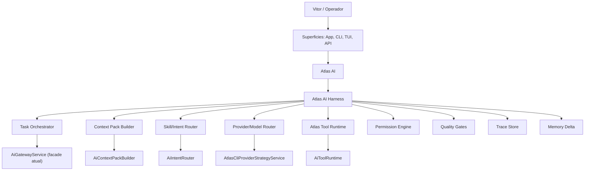

> Cleanup status: superseded_source_material.
> Canonical replacement: docs/engineering-knowledge-base/atlas-ai-layer-0-glossary.md; docs/atlas-cli-final-product.md.
> Cleanup note: Useful naming/CLI ADR source. Promote stable naming decisions before archival.

# ATLAS AI/CLI - ADR DE NOMENCLATURA, COMANDOS E TUI

**Documento de saneamento arquitetural para remover ambiguidades entre especificacao, codigo e roadmap**

---

| | |
|---|---|
| **Operador** | Vitor Emanuel |
| **Sistema** | Atlas |
| **Documento** | Atlas AI/CLI - ADR de Nomenclatura, Comandos e TUI |
| **Versao** | 1.0 |
| **Data** | 30 de abril de 2026 |
| **Status** | Aceito |
| **Escopo** | Atlas AI Harness, Atlas CLI, TUI, comandos e mapa spec ↔ codigo |
| **Autoridade superior** | Atlas_Documento_Mestre_v6.md, Atlas_AI_Documentacao_Final.md, Atlas_AI_Harness_v1.md |

---

## 0. Decisao Executiva

Este documento corrige uma inconsistencia real: os documentos do Atlas passaram a usar nomes conceituais, nomes de diagrama e nomes de codigo como se fossem a mesma coisa.

A decisao aceita e:

1. **Atlas AI Harness** e o nome canonico da infraestrutura operacional interna do Atlas AI.
2. **Atlas AI Orchestrator** nao e uma camada separada. Quando aparecer em diagrama, deve ser entendido como o subcomponente **Task Orchestrator** dentro do Harness.
3. **AiGatewayService** nao e o Harness inteiro. E a facade/gateway atual de entrada do backend para interacoes de IA.
4. Os nomes de especificacao devem ter mapa explicito para classes atuais.
5. O CLI deve ter um command registry canonico; comandos antigos ou futuros nao podem aparecer como oficiais sem status.
6. A TUI final deve ter decisao de stack: **Go + Bubble Tea** para V2+, mantendo PHP/Laravel Console para V1/V1.5.
7. "Luxo silencioso" e "CLI operacional" nao conflitam; sao personas de superficie diferentes sobre o mesmo core.

---

## 1. Regra De Linguagem

### 1.1 Termos canonicos

| Termo canonico | Usar para | Nao confundir com |
|---|---|---|
| **Atlas** | Sistema inteiro: app, backend, Vault, CLI, automacoes, dados e experiencia | Um chat ou uma IA especifica |
| **Atlas AI** | Core cognitivo persistente: identidade, memoria, leis, contexto, modelos e ferramentas | Provider ou app |
| **Atlas AI Harness** | Infraestrutura operacional do Atlas AI: roteamento, contexto, runtime, gates, traces e aprendizado | `AiGatewayService` isolado |
| **Task Orchestrator** | Subcomponente que transforma intencao em tarefa, risco, plano e fluxo | "Atlas AI Orchestrator" como camada separada |
| **Context Pack Builder** | Componente que monta o contexto de alto sinal | "Context Compiler" como nome novo |
| **Skill/Intent Router** | Componente que escolhe skill/lente por intencao | Agente ou provider |
| **Provider/Model Router** | Componente que escolhe motor por tarefa, risco, saude e evidencia | `AiProviderManager` isolado |
| **Atlas Tool Runtime** | Execucao de tools, shell, Git, testes e arquivos com permissao | Tool use livre do provider |
| **Atlas CLI** | Interface por comandos no terminal | TUI visual |
| **Atlas TUI** | Interface visual dentro do terminal | App Mac visual |

### 1.2 Termos legados permitidos

| Termo legado | Status | Substituto canonico |
|---|---|---|
| Atlas Harness | Alias aceitavel em conversa curta | Atlas AI Harness |
| Atlas AI Orchestrator | Evitar em docs novos | Task Orchestrator dentro do Atlas AI Harness |
| Context Compiler | Legado | Context Pack Builder |
| Skill Router | Aceito como nome de spec | Skill/Intent Router |
| Model Router | Aceito como nome de spec | Provider/Model Router |

---

## 2. Mapa Spec ↔ Codigo Atual

Este mapa evita a falsa conclusao de que cada conceito precisa ter hoje uma classe com o mesmo nome.

| Conceito de spec | Codigo atual | Status | Decisao |
|---|---|---|---|
| Atlas AI Harness | Conjunto `App\Services\Ai\*`, `App\Services\Ai\Cli\*`, `App\Services\Ai\Runtime\*` | Distribuido | Nao criar `HarnessService` agora. Criar apenas se houver orquestracao transversal real. |
| Task Orchestrator | `AiGatewayService`, `AiPromptBuilder`, `AiSessionManager`, `AiThreadResolver`, `AiQualityActionService` | Parcial/distribuido | Futuro nome possivel: `AiTaskOrchestratorService`, quando o fluxo estiver mais coeso. |
| Context Pack Builder | `AiContextPackBuilder`, `AiConversationContextBuilder`, `AiContextSnapshotRecorder` | Implementado parcialmente | Nome canonico da spec passa a ser Context Pack Builder. |
| Skill/Intent Router | `AiIntentRouter`, `AiSkillStore` | Implementado | Nao renomear agora. Documentar que `AiIntentRouter` e o Skill/Intent Router atual. |
| Provider/Model Router | `AtlasCliProviderStrategyService`, `AiProviderManager`, `AiProviderHealthService`, `AiCouncilCoordinator` | Parcial/distribuido | Futuro: extrair `AiProviderRouterService` quando houver metricas historicas. |
| Tool Runtime | `AiToolRuntime`, `ToolInvocation`, `ToolResult`, `RuntimeSession`, `RuntimeEvent` | Implementado | Manter. |
| Permission Engine | `AiPermissionEngine`, `AiToolPermissionEngine`, `PermissionRequest` | Implementado em duas camadas | Backend provider permission e runtime tool permission sao camadas distintas. |
| Session/Continuity | `AiSessionManager`, `AiSessionStateService`, `AtlasCliSessionService`, `AiCompactionService`, `AiProviderHandoffService` | Implementado parcialmente | Manter separacao ate `atlas dev` gerar sessoes longas mais ricas. |
| CLI Dashboard/TUI V1 | `AtlasCliDashboardService`, `AtlasCliDashboardCommand` | Implementado como dashboard console | Nao chamar de TUI final. E dashboard terminal V1. |
| Doctor/Bootstrap | `AtlasCliBootstrapCommand`, `AtlasCliDoctorCommand`, `AtlasCliDoctorService`, `AtlasCliSetupService`, `AtlasCliInstallService` | Implementado | `atlas bootstrap` e comando recomendado unico. |

### Regra de refactor

Renomear classes agora criaria risco e churn sem ganho operacional imediato. A ordem correta e:

1. documentar mapa canonico;
2. parar de criar nomes novos sem registro;
3. quando um modulo amadurecer, extrair classe com nome canonico;
4. manter aliases/compatibilidade ate testes cobrirem o fluxo.

---

## 3. Arquitetura Canonica Atual



Regra: **provider nunca e a arquitetura**. Provider e motor substituivel dentro do Atlas AI Harness.

---

## 4. Command Registry Canonico

Todo comando citado em documento deve estar em uma das categorias abaixo.

### 4.1 Comandos canonicos implementados

| Comando canonico | Status | Implementacao atual | Observacao |
|---|---|---|---|
| `atlas` / `atlas chat` | Implementado | `atlas:ai:chat` | Loop/conversa base |
| `atlas ask` | Implementado | `atlas:ai:chat --stream` | Pergunta direta |
| `atlas dev` | Implementado V1 | `atlas:cli:dev` | Ainda precisa V1.5 end-to-end |
| `atlas plan` | Implementado | `atlas:ai:chat --mode=plan` | Planejamento sem edicao por default |
| `atlas review` | Implementado | `atlas:ai:chat --mode=review` | Review por conversa/contexto |
| `atlas threads` | Implementado | `atlas:ai:chat --list-threads` | Comando canonico para listar/retomar conversas |
| `atlas status` | Implementado | `atlas:cli:dashboard` | Dashboard terminal V1 |
| `atlas tui` | Implementado como dashboard | `atlas:cli:dashboard` | Nao e TUI final ainda |
| `atlas state` | Implementado | `atlas:cli:state` | Estado de sessao longa |
| `atlas compact` | Implementado | `atlas:cli:state compact` | Compactacao de sessao |
| `atlas handoff` | Implementado | `atlas:cli:state handoff` | Troca de provider com continuidade |
| `atlas checkpoint` | Implementado | `atlas:cli:checkpoint` | Checkpoints |
| `atlas quality` | Implementado | `atlas:cli:quality` | Quality gate |
| `atlas finish` | Alias implementado | `atlas:cli:quality` | Alias para finalizacao |
| `atlas test` | Implementado | `atlas:cli:quality --run-tests --yes` | Test gate |
| `atlas runtime` | Implementado | `atlas:runtime` | Tool runtime |
| `atlas bootstrap` | Implementado | `atlas:cli:bootstrap` | Unico fluxo recomendado de setup |

### 4.2 Comandos internos/avancados

Estes existem, mas nao devem ser recomendados como fluxo principal.

| Comando | Status | Regra |
|---|---|---|
| `atlas doctor` | Avancado | Roda automaticamente ao fim do `atlas bootstrap`; uso manual so para diagnostico |
| `atlas setup` | Interno/avancado | Usado pelo bootstrap |
| `atlas install` | Interno/avancado | Usado pelo bootstrap |
| `atlas providers` | Avancado | Diagnostico/strategy; setup continua sendo bootstrap |
| `atlas health` | Avancado | Health operacional |
| `atlas work` | Avancado | Worker local |
| `atlas bootstrap-skills` | Avancado | Inicializacao de Vault/skills |

### 4.3 Comandos planejados, nao oficiais ainda

Estes podem aparecer em roadmap, mas precisam estar marcados como futuros.

| Comando futuro | Substituto atual | Decisao |
|---|---|---|
| `atlas debug` | `atlas dev` ou `atlas review` com contexto de erro | Planejado para V1.5/V2 |
| `atlas fix` | `atlas dev` | Planejado |
| `atlas trace last/show` | Sem comando canonico ainda | Planejado no Ponto 3 V1.5 |
| `atlas memory review` | Sem comando canonico ainda | Planejado no Ponto 5 V1.5 |
| `atlas ingest` | Sem comando canonico ainda | Planejado |
| `atlas council` | Conselho via workflow/critical mode | Planejado |
| `atlas compare` | Sem comando canonico ainda | Planejado |
| `atlas permissions` | Sem comando canonico ainda | Planejado no Ponto 4 V1.5 |
| `atlas version/update/rollback` | Sem comando canonico ainda | Planejado no Ponto 7 |

### 4.4 Comandos legados/deprecados em docs

| Comando legado citado | Status | Substituto canonico |
|---|---|---|
| `atlas sessions` | Legado com alias de compatibilidade | `atlas threads` |
| `atlas new` | Legado/futuro ambiguo | `atlas ask` para iniciar conversa, futuro `atlas threads new` se necessario |
| `atlas close` | Legado/futuro ambiguo | Futuro `atlas threads archive` |
| `atlas switch codex/claude` | Legado com alias de compatibilidade | `atlas handoff codex` / `atlas handoff claude` |
| `atlas code` | Legado | `atlas dev` |
| `atlas inspect` | Legado | `atlas review` ou futuro `atlas debug` conforme intencao |
| `atlas remember` | Legado | futuro `atlas memory review` / `atlas memory accept` |

### Regra para documentos novos

Nao citar comando como oficial sem declarar um destes status:

- implementado;
- alias;
- avancado/interno;
- planejado;
- legado/deprecado.

---

## 5. ADR Da TUI

### 5.1 Problema

Laravel Console e suficiente para comandos, JSON, dashboards e bootstrap. Ele nao e ideal para uma TUI interativa rica com paineis, atalhos, diff navegavel, timeline e aprovacoes em tempo real.

### 5.2 Decisao

| Versao | Stack | Papel |
|---|---|---|
| V1/V1.5 | PHP/Laravel Console + Symfony Console/Laravel Prompts/Termwind quando util | CLI, bootstrap, doctor, status, dashboards simples |
| V2+ | Go + Bubble Tea | TUI interativa real |
| Backend permanente | Laravel | Core, API, runtime, memoria, traces, provider routing |

### 5.3 Por que Go + Bubble Tea

- gera binario unico para Mac;
- ecossistema TUI maduro;
- melhor para paineis interativos, atalhos e diff navegavel;
- integra bem com comandos JSON existentes;
- menos custo operacional que Rust/Ratatui para este projeto;
- evita forcar Laravel a virar engine de interface terminal complexa.

### 5.4 Como integrar

```text
atlas tui
  -> se V1: chama dashboard Laravel Console
  -> se V2+: chama binario atlas-tui
        -> consome API local ou comandos atlas --json
        -> envia aprovacoes/permissoes para backend
        -> renderiza timeline, diff, testes e checkpoints
```

### 5.5 Consequencia

Enquanto Go/Bubble Tea nao existir, `atlas tui` deve ser descrito como **dashboard terminal**, nao como TUI final.

---

## 6. Persona Dual: Luxo Silencioso Vs CLI Operacional

Nao ha conflito entre "luxo silencioso" e CLI denso. Sao superficies diferentes.

| Superficie | Persona | UX correta |
|---|---|---|
| App mobile | Luxo silencioso | Baixa friccao, visual calmo, captura rapida, contexto discreto |
| CLI | Operador profissional | Denso, rapido, auditable, comandos claros, foco em execucao |
| TUI | Cockpit terminal | Visual terminal, paineis, diff, testes, permissao, traces |
| API/worker | Infraestrutura | Sem UX humana direta, logs e contratos |

Regra: a identidade do Atlas e a mesma. A densidade da interface muda por superficie.

---

## 7. Politica De Correcao De Docs

Quando um documento antigo usa nome ou comando conflitante:

1. nao apagar contexto historico sem necessidade;
2. adicionar nota de normalizacao quando o trecho ainda for util;
3. substituir exemplos de comando por comandos canonicos;
4. mover comandos nao implementados para "planejado";
5. atualizar espelho no Vault quando o documento for constitucional.

---

## 8. Correcoes Aplicadas

1. `Atlas_CLI_TUI_Estado_da_Arte_Plano_Implementacao.md` passou a usar Atlas AI Harness no diagrama.
2. `Atlas_AI_Documentacao_Final.md` passou a usar Context Pack Builder, Skill/Intent Router e Provider/Model Router.
3. `Atlas_AI_Sessoes_Compactacao_Continuidade.md` passou a mapear `new/sessions/close/switch` como legados, aliases ou futuros.
4. O Vault recebeu este ADR como documento constitucional de nomenclatura.
5. Futuro: criar teste de documentacao simples que falhe se comandos legados aparecerem como oficiais fora do registry.
