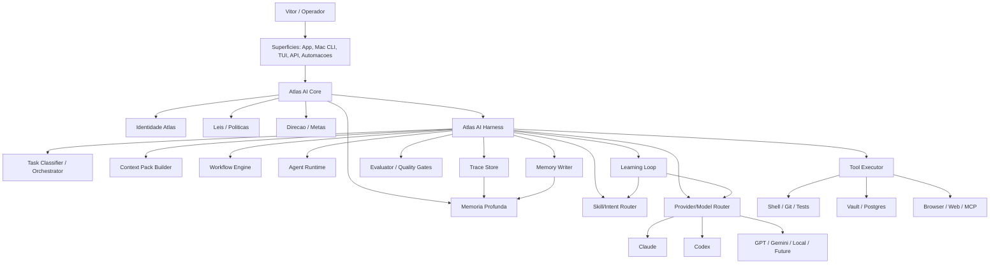
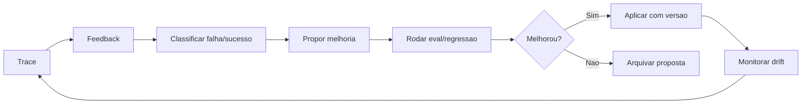

# ATLAS AI HARNESS V1.1

**Infraestrutura operacional interna do Atlas AI para orquestracao, controle, memoria, avaliacao e melhoria continua de IA**

---

| | |
|---|---|
| **Operador** | Vitor Emanuel |
| **Sistema** | Atlas |
| **Documento** | Atlas AI Harness v1.1 |
| **Versao** | 1.1 |
| **Data** | 29 de abril de 2026 |
| **Status** | Especificacao operacional alinhada ao Atlas AI Core |
| **Autoridade superior** | Atlas_Documento_Mestre_v6.md |
| **Documentos relacionados** | Atlas AI - Documentacao Final, Atlas AI Skill System v1, Atlas AI Harness - Super Tool Runtime Core, Atlas Como Superficie Cognitiva Unica, Master Prompt Atlas AI, Memoria Semantica Ativa |

---

## 0. Decisao Executiva

O Atlas AI Harness e a infraestrutura operacional interna do **Atlas AI Core**.

Ele nao e o Atlas AI inteiro. Atlas AI e o nucleo cognitivo persistente do Atlas: identidade, memoria profunda, contexto, leis, objetivos, superficies e direcao estrategica. O Harness e a parte desse core responsavel por fazer qualquer IA performar dentro do Atlas em nivel superior ao uso direto do provider.

Claude, Codex, GPT, Gemini, modelos locais e modelos futuros nao sao a superficie principal. Eles sao motores. O Atlas AI veste esses motores com contexto, memoria, ferramentas, workflows, quality gates, rastreabilidade e aprendizado acumulado.

O objetivo do harness nao e "chamar IA". Isso e trivial.

O objetivo e transformar IA bruta em capacidade operacional composta:

> tarefa certa, contexto certo, modelo certo, papel certo, ferramenta certa, verificacao certa, memoria certa e melhoria certa.

O alvo declarado da V1.1 e construir a base para multiplicar eficiencia e qualidade em desenvolvimento, pesquisa, decisao, memoria e producao intelectual. A meta aspiracional e 5x, mas o sistema so pode declarar ganho quando houver metrica comparavel contra uso direto de Claude/Codex.

Programacao no Mac e uma vertical critica do Harness porque permite medir qualidade com Git, diff, testes e CI. Mas programacao nao define o Atlas AI. O Harness tambem serve perguntas simples, decisoes serias, pesquisa, memoria, estudo, escrita e trabalho.

---

## 0.1 Fronteira Conceitual

| Camada | Definicao | Exemplo | Regra |
|---|---|---|---|
| **Atlas** | Sistema completo: produto, app, backend, Vault, banco, automacoes, dados e experiencia. | Atlas app, Atlas Server, AtlasVault. | Atlas e o sistema. |
| **Atlas AI** | Core cognitivo persistente: identidade, memoria, contexto, leis, metas, superficies e orquestracao inteligente. | Responder no app, decidir, pesquisar, programar, lembrar. | Atlas AI e a identidade cognitiva. |
| **Atlas AI Harness** | Infraestrutura operacional dentro do Atlas AI. | Provider/Model Router, Context Pack Builder, Tool Runtime, Trace Store. | Harness e parte do core, nao o core inteiro. |
| **Provider/modelo** | Motor substituivel. | Claude, Codex, GPT, Gemini, local. | Modelo e motor, nao identidade. |
| **Agente** | Papel temporario dentro de fluxo. | Planner, executor, reviewer, researcher. | Agente e braco operacional. |
| **Skill** | Lente/politica/contrato especializado. | `dev-executor`, `decision-advisor`. | Skill vem antes de agente. |
| **Superficie** | Ponto de contato. | App, Mac CLI, TUI, API, automacao. | Superficie muda; core permanece. |

---

## 1. Definicao

**Atlas AI Harness** e a subcamada modelo-agnostica do Atlas AI que recebe uma intencao do operador, classifica a tarefa, compila contexto, escolhe modelo/agente/skill, executa fluxo adequado, aplica quality gates, registra traces, coleta feedback e transforma aprendizado em memoria reutilizavel.

Ele e composto por:

1. **Task Classifier**: entende o tipo de tarefa e risco.
2. **Skill/Intent Router**: escolhe a lente correta.
3. **Context Pack Builder**: monta contexto compacto e autoritativo.
4. **Provider/Model Router**: escolhe provider/modelo.
5. **Agent Runtime**: executa papeis especializados.
6. **Tool Executor**: roda ferramentas locais quando autorizado, seguindo o Super Tool Runtime Core para registry, politica, sandbox, artifacts, normalizacao e aprendizado.
7. **Evaluator**: verifica qualidade antes de concluir.
8. **Trace Store**: audita input, contexto, prompt, resposta, ferramenta, custo e feedback.
9. **Memory Writer**: propoe o que deve virar conhecimento persistente.
10. **Learning Loop**: melhora prompts, skills, roteamento e evals com base em evidencia.

---

## 2. O Que Nao E

| Nao e | Motivo |
|---|---|
| Atlas AI inteiro | O Atlas AI tambem inclui identidade, memoria profunda, leis, objetivos, superficies e direcao estrategica. |
| Chat wrapper | Wrapper so troca interface. Harness muda processo, contexto, auditoria e qualidade. |
| Multi-agent teatral | Varios agentes sem criterio aumentam custo, divergencia e ruido. |
| Prompt gigante fixo | Contexto bom e compilado por tarefa, nao despejado sempre. |
| Automacao sem operador | Vitor continua capitao. Atlas executa dentro de permissoes e pede confirmacao quando necessario. |
| Fine-tuning disfarcado | Atlas melhora por contexto, memoria, evals, prompts e roteamento. Modelo base continua intercambiavel. |
| Agente autonomo solto no repo | Desenvolvimento pesado exige escopo, diff, testes, revisao e rollback mental. |
| Sistema que sempre usa o modelo mais caro | Modelo caro so quando a tarefa justifica. |

---

## 3. Tese Operacional

Uso direto de Claude, Codex ou qualquer CLI cria silos:

- contexto precisa ser reexplicado;
- decisoes antigas nao entram automaticamente;
- preferencias profundas nao sao modeladas;
- fases encerradas continuam aparecendo como fatos atuais;
- aprendizados de uma sessao nao melhoram a proxima;
- qualidade depende da memoria do operador e da sorte do prompt.

O harness resolve isso porque cada interacao passa pelo Atlas AI:

1. A intencao vira tarefa tipada.
2. A tarefa recebe contexto do Vault, Postgres, repo e historico.
3. O modelo certo e escolhido por regra e evidencia.
4. A execucao segue fluxo predefinido.
5. O resultado passa por gates.
6. O aprendizado volta para a memoria.
7. A proxima tarefa comeca melhor.

---

## 4. Principios Nao-Negociaveis

### P1. Atlas e a superficie. Provider e motor.

O operador deve tender a usar Atlas, nao Claude/Codex diretamente. Quando ainda for necessario usar provider direto, Atlas deve absorver posteriormente decisoes, diffs, aprendizados e contexto gerado.

O Atlas AI e a identidade cognitiva. O Harness e a infraestrutura operacional. O provider e apenas motor.

### P2. Skill antes de agente.

Antes de criar "mais um agente", definir a skill: missao, quando usar, quando nao usar, entrada, saida, quality gate e permissao.

Agente sem skill vira personagem. Skill com runtime vira capacidade.

### P3. Contexto compilado, nao despejado.

O harness nao deve jogar todo o Vault ou todo repo no prompt. Deve montar um **Context Pack** por tarefa, com prioridade, fonte, validade temporal e lacunas.

### P4. Single-agent por default.

Um bom agente com contexto certo vence multi-agent ruim. Council e excecao para tarefas de alto risco, alta ambiguidade ou revisao critica.

### P5. Execucao e revisao sao papeis diferentes.

Em desenvolvimento, quem implementa nao deve ser o unico avaliador. A revisao pode ser feita por outro provider, outro agente ou quality gates deterministicos.

### P6. Autoria humana preservada.

Atlas pode propor plano, codigo, decisao, tese ou memoria. Vitor ratifica o que vira direcao, principio, decisao relevante ou identidade.

### P7. Todo resultado importante deve ter rastro.

Traces registram:

- input do operador;
- tarefa classificada;
- skill ativa;
- contexto usado;
- provider/modelo;
- prompt hash;
- resposta;
- ferramentas;
- diff quando houver;
- verificacoes;
- feedback;
- memoria proposta.

### P8. Qualidade antes de autonomia.

Nao aumentar autonomia de agentes sem evals, gates e reversibilidade. Autonomia sem avaliacao degrada.

### P9. Autoaperfeicoamento exige evidencia.

Prompt, skill, roteador ou fluxo so mudam automaticamente quando houver evidencia comparativa. Mudancas constitucionais ou de criterio precisam de aprovacao humana.

### P10. Melhorar Vitor, nao substituir Vitor.

O harness deve multiplicar capacidade sem atrofiar julgamento. Em decisoes relevantes, Atlas exige articulacao, tradeoffs e criterio humano.

---

## 5. Arquitetura Conceitual



### Camadas

| Camada | Responsabilidade |
|---|---|
| Superficies | App mobile, Mac CLI/TUI, API local, automacoes e browser. |
| Atlas AI Core | Identidade, memoria profunda, leis, metas, direcao e continuidade entre superficies. |
| Harness | Infraestrutura operacional que usa modelos, ferramentas, workflows e gates. |
| Classificacao | Entender tarefa, risco, dominio, urgencia, modo e superficie. |
| Contexto | Montar Context Pack minimo suficiente. |
| Roteamento | Escolher skill, agente, modelo, workflow e ferramenta. |
| Runtime | Executar chamadas a Claude/Codex/futuros providers sem entregar a identidade ao provider. |
| Ferramentas | Repo, shell, testes, busca, navegador, Postgres, Vault e MCP. |
| Avaliacao | Testes, lint, review, fontes, consistencia, privacidade e regras Atlas. |
| Memoria | Registrar trace e propor aprendizado persistente com evidencia. |
| Melhoria | Atualizar prompts, skills e roteamento apenas com evals e rollback. |

---

## 6. Contratos Basicos

### 6.1 Task Request

Entrada normalizada de uma tarefa:

```json
{
  "operator_input": "implemente o fluxo X",
  "surface": "mac_cli|mobile_app|api",
  "workspace": "/path/to/repo",
  "task_type": "dev|review|debug|research|decision|memory|direct",
  "domain": "atlas|blackink|financas|saude|vida|unknown",
  "risk_level": "low|medium|high|irreversible",
  "desired_mode": "direct|plan|execute|review|council|train",
  "constraints": [],
  "privacy_class": "normal|sensitive|relational|medical|secret"
}
```

### 6.2 Context Pack

Contexto compilado por tarefa:

```json
{
  "constitutional_context": [],
  "task_brief": "",
  "repo_context": [],
  "diff_context": [],
  "semantic_memory": [],
  "prior_decisions": [],
  "operator_preferences": [],
  "constraints": [],
  "known_gaps": [],
  "excluded_context": []
}
```

### 6.3 Execution Plan

Plano antes da execucao:

```json
{
  "task_type": "dev",
  "selected_skill": "dev-executor",
  "selected_provider": "codex_cli",
  "agents": ["planner", "executor", "reviewer"],
  "tools_allowed": ["read_files", "edit_files", "run_tests"],
  "quality_gates": ["diff_review", "tests_pass", "no_unrelated_changes"],
  "requires_human_confirmation": false
}
```

### 6.4 Memory Delta

Aprendizado candidato:

```json
{
  "kind": "principle|decision|pattern|preference|bug_lesson|architecture_rule",
  "title": "",
  "evidence_refs": [],
  "confidence": "low|medium|high",
  "ratification_required": true,
  "suggested_vault_path": ""
}
```

---

## 7. Skills

### 7.1 Regras Para Skills

Uma skill do Atlas deve ter:

- missao clara;
- quando usar;
- quando nao usar;
- entradas esperadas;
- saida esperada;
- quality gates;
- permissoes;
- versao;
- exemplos bons e ruins quando necessario.

Skills moram no Vault porque sao parte da memoria operacional do Atlas. O backend carrega o master prompt e a skill ativa em cada interacao.

### 7.2 Skills Atuais

| Skill | Status | Quando usar | Observacao |
|---|---:|---|---|
| `orquestrador` | ativa | Pedido amplo, ambiguo ou multi-dominio. | Default atual. |
| `vault-curador` | ativa | Notas, Obsidian, memoria semantica, modelos mentais. | Nao escreve area nobre sem aprovacao. |
| `blackink` | ativa | Produto, engenharia, operacao, cliente, roadmap BlackInk. | Foco em impacto e manutencao. |
| `financas` | ativa | Caixa, investimento, compra, risco, custo de oportunidade. | Nao finge consultoria regulada. |
| `saude` | ativa | Sono, HRV, energia, treino, recuperacao. | Sem diagnostico medico. |
| `aclarador` | prevista no codigo | Captura bruta e aclaramento semantico. | Precisa existir no Vault para uso confiavel. |

### 7.3 Skills Necessarias Para Harness Profissional

| Skill | Missao | Quando usar | Nao usar quando | Saida padrao |
|---|---|---|---|---|
| `dev-executor` | Implementar mudancas em codigo com escopo fechado. | Tarefa de desenvolvimento com repo definido. | Quando o pedido ainda e ambiguo ou sem criterio de aceite. | Plano curto, arquivos alterados, comandos rodados, riscos. |
| `code-reviewer` | Revisar diff com foco em bugs, regressao, arquitetura e testes. | Antes de merge, apos execucao, PR review. | Para reescrever sem achado concreto. | Findings priorizados, linhas, risco, teste faltante. |
| `debugger` | Diagnosticar falhas, logs, testes quebrados e CI. | Erro reproduzivel ou CI falhando. | Quando falta acesso ao erro/log. | Hipoteses, evidencias, fix minimo, verificacao. |
| `architect` | Definir estrutura tecnica e tradeoffs. | Decisao estrutural, modulo novo, refactor grande. | Para tarefa local simples. | Opcoes, tradeoffs, recomendacao, criterios. |
| `researcher-quick` | Pesquisa rapida com resposta operacional. | Pergunta pontual, baixa criticidade. | Pesquisa que exige fontes profundas. | Resposta curta, fontes se necessario, incertezas. |
| `researcher-deep` | Pesquisa extensiva, fontes primarias e sintese. | Decisao importante, arquitetura, mercado, ciencia. | Pergunta simples. | Estado da arte, fontes, recomendacao, lacunas. |
| `decision-advisor` | Estruturar decisao sem decidir por Vitor. | Decisoes estrategicas, financeiras, pessoais ou reversiveis relevantes. | Quando operador pede decisao cega. | Opcoes, criterios, tradeoffs, reversibilidade, pergunta de autoria. |
| `memory-writer` | Propor memorias persistentes. | Depois de tarefa com aprendizado reutilizavel. | Quando foi apenas execucao trivial. | Nota candidata, fonte, gatilhos, ratificacao. |
| `evaluator` | Avaliar saida contra checklist. | Antes de concluir tarefa relevante. | Quando a tarefa e trivial. | Pass/fail, problemas, proxima acao. |
| `harness-governance` | Medir saude do proprio harness. | Review semanal/mensal do uso de IA. | Durante execucao operacional normal. | Metricas, gargalos, propostas de melhoria. |

---

## 8. Agentes

### 8.1 Diferenca Entre Provider, Skill E Agente

| Conceito | Definicao | Exemplo |
|---|---|---|
| Provider | Motor de IA que gera resposta. | Claude, Codex, GPT, Gemini. |
| Skill | Lente/politica/prompt especializado. | `code-reviewer`, `financas`. |
| Agente | Papel executado dentro de um fluxo. | planner, executor, critic, evaluator. |

Um agente pode usar uma skill. Uma skill pode rodar em providers diferentes. O provider nunca define sozinho o comportamento.

### 8.2 Tipos De Agentes V1

| Agente | Funcao | Provider default | Permissao |
|---|---|---|---|
| Task Orchestrator | Classifica tarefa e escolhe fluxo. | Claude ou modelo barato futuro. | Sem editar. |
| Context Pack Builder | Monta Context Pack. | Deterministico + LLM quando necessario. | Leitura. |
| Planner | Planeja execucao e criterios. | Claude para produto/estrategia, Codex para codigo. | Sem editar. |
| Executor | Implementa ou produz artefato. | Codex para codigo, Claude para texto/sintese. | Pode editar se autorizado. |
| Reviewer | Critica plano, diff ou resposta. | Provider diferente do executor quando possivel. | Sem editar por default. |
| Evaluator | Aplica gates e checklist. | Deterministico primeiro, LLM depois. | Sem editar por default. |
| Researcher | Busca e sintetiza fontes. | Modelo com browsing/ferramentas adequadas. | Sem alterar repo. |
| Memory Curator | Propoe memoria persistente. | Claude/Codex conforme dominio. | Nao ratifica sozinho. |
| Council Coordinator | Coordena dois ou mais providers. | Claude + Codex inicialmente. | Deliberativo, nao executor. |

### 8.3 Regra De Conselho

Council so deve ser usado quando pelo menos uma condicao for verdadeira:

- alto risco;
- alta ambiguidade;
- decisao arquitetural relevante;
- revisao de implementacao importante;
- divergencia entre opcoes;
- tarefa onde erro custa caro;
- operador pediu explicitamente.

Council nao deve ser usado para:

- perguntas simples;
- pequenos ajustes de codigo;
- respostas que exigem velocidade;
- tarefas com criterio objetivo e baixo risco;
- quando um reviewer simples basta.

---

## 9. Taxonomia De Tarefas

| Tipo | Descricao | Fluxo default | Gate principal |
|---|---|---|---|
| `direct` | Resposta simples. | Single-agent. | Clareza e lacuna declarada. |
| `plan` | Planejamento sem executar. | Planner + optional reviewer. | Criterio de aceite. |
| `dev` | Implementacao de codigo. | Context -> plan -> execute -> tests -> review. | Testes/diff. |
| `review` | Revisao de codigo/documento. | Reviewer. | Findings acionaveis. |
| `debug` | Falha, bug, CI. | Reproduce -> diagnose -> fix -> verify. | Erro reproduzido ou explicado. |
| `research_quick` | Pesquisa pontual. | Researcher quick. | Fonte adequada se fato instavel. |
| `research_deep` | Pesquisa extensa. | Researcher deep + synthesis. | Fontes primarias e lacunas. |
| `decision` | Decisao importante. | Decision advisor + articulation. | Vitor decide. |
| `memory` | Curadoria de conhecimento. | Memory curator. | Ratificacao humana. |
| `governance` | Melhorar harness. | Governance + eval. | Evidencia comparativa. |

---

## 10. Algoritmo De Roteamento V1

### 10.1 Sinais De Entrada

- texto do operador;
- superficie: app, Mac CLI, API;
- repo atual;
- diff atual;
- arquivos mencionados;
- dominio;
- risco;
- reversibilidade;
- privacidade;
- urgencia;
- historico de sucesso por tipo;
- custo/latencia tolerados;
- modo de assistencia;
- disponibilidade dos providers.

### 10.2 Regras Heuristicas Iniciais

| Condicao | Rota |
|---|---|
| Pergunta simples, baixo risco | single-agent, provider default. |
| Codigo com edicao | Codex executor. |
| Codigo com risco arquitetural | Planner + Codex executor + reviewer. |
| Review de codigo | Codex ou Claude como reviewer, sem editar. |
| Produto/estrategia BlackInk | Skill BlackInk, Claude planner, Codex reviewer se tecnico. |
| Pesquisa profunda | Researcher-deep, fontes, synthesis. |
| Decisao financeira/pessoal | Decision-advisor, articulacao humana, sem decisao automatica. |
| Memoria semantica | Vault-curador ou memory-writer, ratificacao. |
| Alta ambiguidade + alto impacto | Council deliberativo. |

### 10.3 Pseudocodigo

```pseudo
function route(task):
  classification = classify(task)
  risk = assess_risk(task)
  privacy = assess_privacy(task)

  if privacy in ["medical", "relational", "secret"] and no_redaction_policy:
    require_local_or_human_review()

  if classification.type == "direct" and risk == "low":
    return single_agent(default_provider, skill_for_domain(task))

  if classification.type == "dev":
    if task.is_ambiguous:
      return plan_only(architect_or_dev_planner)
    if risk in ["medium", "high"]:
      return flow(context, planner, codex_executor, reviewer, tests)
    return flow(context, codex_executor, tests)

  if classification.type == "review":
    return reviewer_only(no_edit=true)

  if classification.type == "debug":
    return flow(reproduce, diagnose, minimal_fix, verify)

  if classification.type == "research_deep":
    return flow(researcher_deep, source_check, synthesis, memory_candidate)

  if classification.type == "decision":
    return flow(articulation_prompt, tradeoff_analysis, human_decision)

  if should_use_council(classification, risk, task):
    return council_deliberation_then_single_executor()

  return single_agent(default_provider, orquestrador)
```

---

## 11. Context Engineering

### 11.1 Ordem De Prioridade Do Contexto

1. Pedido atual do operador.
2. Leis constitucionais relevantes.
3. Estado do workspace/repo/diff.
4. Decisoes tecnicas anteriores.
5. Memoria semantica relevante.
6. Padroes e preferencias do operador.
7. Exemplos bons/ruins.
8. Contexto historico de menor prioridade.

### 11.2 Context Pack Ideal Para Desenvolvimento

```markdown
# Task Brief
Pedido, objetivo, criterio de aceite e restricoes.

# Repo State
Branch, arquivos relevantes, diff atual, testes disponiveis.

# Architecture Rules
Padroes locais, decisoes anteriores, coisas proibidas.

# Relevant Memory
Notas do Vault que realmente importam.

# Open Questions
Lacunas que podem bloquear execucao.

# Quality Gates
Comandos e criterios obrigatorios antes de concluir.
```

### 11.3 Regras De Compactacao

- Preferir trechos relevantes a arquivos inteiros.
- Preferir decisoes ratificadas a opinioes antigas.
- Marcar data e validade temporal quando o fato pode envelhecer.
- Nao incluir dado sensivel sem necessidade.
- Separar evidencia de inferencia.
- Declarar lacunas em vez de preencher com chute.

---

## 12. Fluxos Operacionais

### 12.1 `atlas dev`

Objetivo: implementar mudanca de codigo no Mac.

Fluxo:

1. Classificar tarefa.
2. Ler repo, diff e docs relevantes.
3. Montar Context Pack.
4. Se ambigua, gerar plano e pedir confirmacao.
5. Executar com Codex por default.
6. Rodar testes/lint quando disponiveis.
7. Revisar diff com agente separado.
8. Resumir arquivos alterados, riscos e verificacao.
9. Propor memoria se houver decisao reutilizavel.

Quality gates:

- nao tocar arquivos fora do escopo sem justificar;
- nao reverter mudancas do operador;
- rodar verificacao possivel;
- registrar comandos;
- pedir confirmacao para mudanca destrutiva.

### 12.2 `atlas review`

Objetivo: revisar diff ou PR.

Fluxo:

1. Capturar diff.
2. Identificar area de risco.
3. Rodar reviewer.
4. Priorizar bugs, regressao, seguranca, testes.
5. Emitir achados acionaveis.

Quality gate: findings antes de resumo.

### 12.3 `atlas debug`

Objetivo: corrigir erro.

Fluxo:

1. Capturar erro/log/teste.
2. Reproduzir quando possivel.
3. Gerar hipoteses.
4. Testar hipoteses em ordem.
5. Aplicar fix minimo.
6. Verificar.
7. Registrar licao se recorrente.

### 12.4 Conselho Critico

Status de comando: planejado. O Command Registry canonico esta em `Atlas_AI_CLI_Nomenclatura_Comandos_TUI_ADR.md`; `atlas council` nao deve ser tratado como comando implementado ate constar no launcher.

Objetivo: deliberar com Claude + Codex ou providers futuros.

Fluxo:

1. Um provider faz leitura principal.
2. Outro faz revisao critica.
3. Atlas combina divergencias.
4. Vitor escolhe direcao ou autoriza executor unico.

Regra: council nao executa automaticamente.

### 12.5 `atlas research`

Objetivo: pesquisa rapida ou profunda.

Fluxo:

1. Classificar profundidade.
2. Buscar fontes apropriadas.
3. Separar evidencia, inferencia e recomendacao.
4. Listar lacunas.
5. Propor nota se a pesquisa for reutilizavel.

### 12.6 Memory Review

Status de comando: planejado. `atlas remember` e termo legado; o nome canonico futuro deve seguir o registry, provavelmente `atlas memory review` / `atlas memory accept`.

Objetivo: capturar aprendizado para memoria.

Fluxo:

1. Receber texto, diff, decisao ou resultado.
2. Classificar tipo de memoria.
3. Gerar nota candidata com gatilhos.
4. Exigir ratificacao.
5. Indexar.

---

## 13. Quality Gates

### 13.1 Gates Para Codigo

- Escopo declarado.
- Diff revisado.
- Teste/lint/build rodado quando disponivel.
- Erros conhecidos declarados.
- Sem alteracao destrutiva sem permissao.
- Sem refactor oportunista fora do pedido.
- Sem segredo exposto.
- Sem dependencia nova sem justificar.

### 13.2 Gates Para Pesquisa

- Fontes primarias quando possivel.
- Datas e versoes quando informacao pode mudar.
- Evidencia separada de inferencia.
- Confianca declarada.
- Lacunas explicitas.
- Links/fonte quando usado dado externo.

### 13.3 Gates Para Decisao

- Opcoes claras.
- Tradeoffs.
- Reversibilidade.
- Downside.
- Criterio de decisao.
- Stakeholders afetados.
- O que Vitor precisa decidir.

### 13.4 Gates Para Memoria

- Fonte rastreavel.
- Quando usar.
- Quando nao usar.
- Validade temporal.
- Ratificacao quando envolve identidade, valor, estrategia ou decisao.
- Gatilhos de ativacao.

---

## 14. Autoaperfeicoamento De Qualidade

### 14.1 Objetivo

O harness deve melhorar com uso sem se corromper.

Melhoria aceitavel:

- roteamento fica mais preciso;
- prompts ficam mais objetivos;
- skills ganham exemplos;
- quality gates detectam mais problemas;
- contexto recuperado fica mais relevante;
- custo cai sem perder qualidade;
- erros recorrentes viram regras.

Melhoria perigosa:

- agente altera suas proprias regras sem eval;
- prompt cresce sem controle;
- metricas superficiais viram alvo;
- council vira padrao caro;
- memoria falsa vira verdade;
- sistema aprende a agradar feedback imediato e piora longo prazo.

### 14.2 Loop Seguro



### 14.3 O Que Pode Ser Automatico

- coletar metrica;
- agrupar falhas recorrentes;
- sugerir ajuste de prompt;
- sugerir nova regra de roteamento;
- sugerir nota de memoria;
- rodar evals;
- comparar provider por tarefa;
- atualizar ranking de performance com baixo impacto.

### 14.4 O Que Exige Aprovacao Humana

- mudar master prompt;
- mudar leis;
- promover principio;
- permitir acao externa irreversivel;
- aumentar autonomia de executor;
- enviar dado sensivel a provider externo;
- criar skill nova com permissao de escrita;
- alterar regra de qualidade central.

---

## 15. Metricas Para Provar 5x

### 15.1 Eficiencia

| Metrica | Definicao |
|---|---|
| Time to first useful output | Tempo ate primeira resposta aproveitavel. |
| Time to verified completion | Tempo ate tarefa concluida e verificada. |
| Context setup time | Tempo explicando contexto manualmente. |
| Prompts per task | Numero de interacoes ate concluir. |
| Rework count | Quantas vezes precisou refazer. |
| Tool switching count | Quantas ferramentas externas foram abertas. |

### 15.2 Qualidade

| Metrica | Definicao |
|---|---|
| Bug introduction rate | Bugs introduzidos por tarefa de codigo. |
| Test pass rate | Testes passando apos execucao. |
| Review finding severity | Severidade dos achados apos entrega. |
| PR acceptance rate | Percentual aceito sem retrabalho relevante. |
| Decision revisit quality | Decisao se mostrou boa depois. |
| Source quality score | Qualidade das fontes em pesquisa. |

### 15.3 Memoria

| Metrica | Definicao |
|---|---|
| Memory reuse rate | Quantas tarefas usaram memoria relevante. |
| Context precision | Contexto recuperado que realmente ajudou. |
| Stale fact incidents | Fatos antigos usados como atuais. |
| Memory delta acceptance | Propostas de memoria aceitas por Vitor. |

### 15.4 Comparacao Antes/Depois

Para provar 5x:

1. Registrar baseline usando Claude/Codex direto.
2. Registrar a mesma classe de tarefa via Atlas.
3. Comparar tempo, prompts, retrabalho, bugs, qualidade e custo.
4. Separar por tipo de tarefa.
5. Evitar media geral enganosa.

5x pode ser verdadeiro em recuperacao de contexto e reducao de retrabalho antes de ser verdadeiro em qualidade absoluta.

---

## 16. Politicas De Privacidade E Soberania

1. O app e CLI nao devem falar direto com providers sem passar pelo Atlas quando houver registro relevante.
2. Conteudo sensivel exige classificacao antes de entrar em prompt.
3. Conteudo relacional deve ser redigido antes de provider externo quando houver risco a terceiros.
4. Saude nao vira diagnostico.
5. Segredos nunca entram em prompt.
6. Prompt completo pode ser auditado, mas essa auditoria aumenta responsabilidade sobre armazenamento.
7. Provider externo nao recebe mais contexto do que precisa.

---

## 17. Anti-Padroes

| Anti-padrao | Risco | Correcao |
|---|---|---|
| Multi-agent por estetica | Custo alto, ruido, demora. | Single-agent default. |
| Debate sem decisao | Divergencia infinita. | Council termina em opcoes e criterio. |
| Contexto demais | Modelo perde foco. | Context Pack compacto. |
| Memoria falsa | Atlas aprende coisa errada. | Fonte, validade e ratificacao. |
| Self-improvement sem eval | Degradacao invisivel. | Evals antes de mudar. |
| Prompt spaghetti | Sistema impossivel de auditar. | Prompt registry versionado. |
| Executor sem reviewer | Bug passa. | Revisao por gate/agente separado. |
| Reviewer que reescreve tudo | Escopo explode. | Findings acionaveis primeiro. |
| Autonomia prematura | Dano operacional. | Permissoes graduais. |
| Usar provider direto por habito | Memoria se perde. | Fluxo Atlas-first. |

---

## 18. Roadmap

### V0.1 - Harness Manual Estruturado

Objetivo: documentar regras e operar via AI Gateway atual.

Inclui:

- documento v1;
- master prompt atualizado;
- skills basicas;
- traces/jobs;
- council manual;
- indexacao de memoria.

Nao inclui:

- CLI Mac completo;
- edicao automatica via Atlas;
- self-improvement automatico.

Criterio de sucesso:

- Vitor consegue pedir tarefas ao Atlas com menos reexplicacao.
- Respostas respeitam superficie cognitiva unica.
- Memorias relevantes sao recuperadas.

### V1 - Atlas CLI Basico

Objetivo: usar Atlas direto no Mac.

Comandos:

- `atlas ask`
- `atlas dev --plan`
- `atlas review`
- futuro `atlas research`
- futuro `atlas memory review`

Inclui:

- task classifier local;
- envio ao backend;
- Context Pack basico;
- leitura de repo/diff;
- traces.

Nao inclui:

- edicao autonoma ampla;
- autoaprendizado automatico.

### V2 - Dev Harness Completo

Objetivo: substituir uso direto de Codex/Claude Code para desenvolvimento cotidiano.

Inclui:

- `atlas dev` com edicao;
- execucao de testes;
- reviewer separado;
- registro de diff;
- memory delta apos tarefa.

Criterio de sucesso:

- 50%+ das tarefas de dev passam pelo Atlas.
- Menos reexplicacao que Codex/Claude direto.
- Nenhum aumento de bug/retrabalho.

### V3 - Quality Learning Loop

Objetivo: melhorar roteamento, prompts e gates com evidencia.

Inclui:

- prompt/skill registry;
- eval suites;
- comparacao provider por tarefa;
- propostas automaticas de melhoria;
- aprovacao humana para mudancas relevantes.

### V4 - Cognitive OS Maduro

Objetivo: Atlas vira interface principal para IA, trabalho, pesquisa e decisao.

Inclui:

- CLI/TUI Mac consolidado;
- app mobile como captura e conversa leve;
- workflows profundos de dev/pesquisa;
- memoria evolutiva;
- alocacao empirica de humano/IA/dupla;
- semanas solo e metricas de transferencia.

---

## 19. Checklist De Implementacao Da Proxima Etapa

1. Criar skill `aclarador` no Vault se ausente.
2. Criar skill `dev-executor`.
3. Criar skill `code-reviewer`.
4. Criar skill `architect`.
5. Criar modelo de Context Pack.
6. Criar tabela ou metadata para `task_type`, `risk_level`, `surface` e `quality_gates`.
7. Criar CLI minimo `atlas ask` que chama o backend.
8. Criar `atlas review` lendo diff local.
9. Registrar feedback estruturado por tarefa.
10. Criar primeira eval suite manual: 10 tarefas reais comparando direto vs Atlas.

---

## 20. Regra Final

O Atlas AI Harness nao sera julgado por quantos agentes tem, nem por quantos providers chama, nem por parecer sofisticado.

Sera julgado por:

> O mesmo Vitor, usando o mesmo Claude/Codex por dentro do Atlas, consegue produzir resultado melhor, mais rapido, com menos retrabalho, mais memoria e mais evolucao pessoal do que usando Claude/Codex diretamente?

Se sim, o harness esta vivo.
