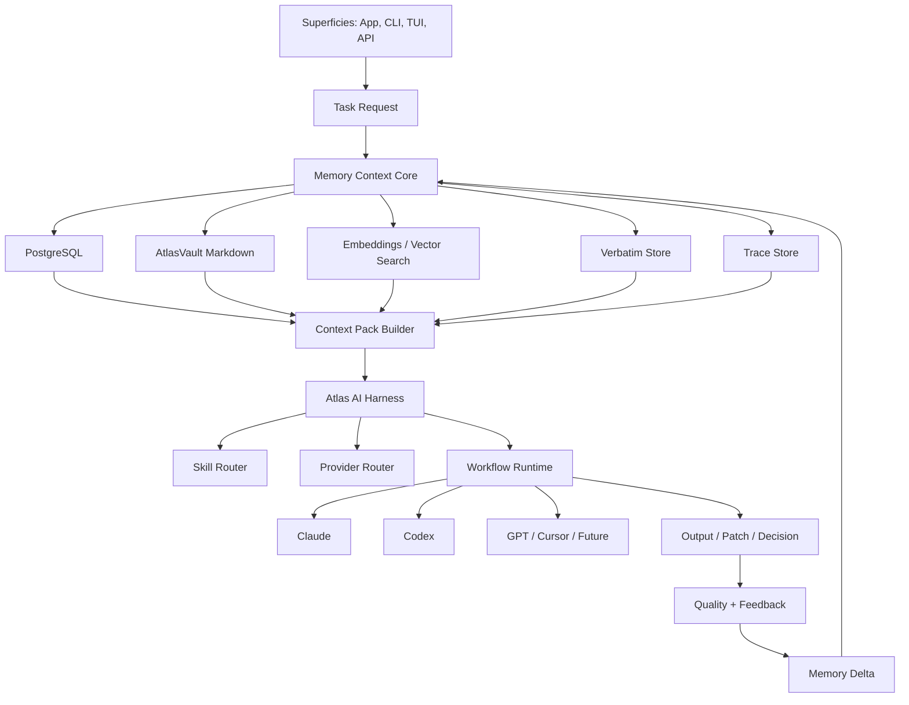

# Atlas AI Memory Context Core - Open Brain

| | |
|---|---|
| Sistema | Atlas |
| Documento | Arquitetura core de memoria, contexto e recall do Atlas AI |
| Data | 1 de maio de 2026 |
| Status | Documento canonico de direcao |
| Relacionado | `Atlas_AI_Harness_v1.md`, `Atlas_Memoria_Semantica_Ativa_Compartilhada.md`, `Atlas_Memoria_Semantica_Ativa_Projeto_Funcional.md`, `Atlas_Engineering_Harness_Runner_Plano_Profissional.md`, `atlas-server/docs/engineering-knowledge-base/` |
| Decisao central | A memoria pertence ao Atlas, nao ao provider |

---

## Arquitetura Operacional Canonica

O sistema de memoria do Atlas e uma arquitetura em camadas. Nenhuma camada isolada
e suficiente: documentos explicam decisoes, Postgres guarda estado vivo, indices
conectam fatos, e context packs selecionam o minimo necessario para a IA agir sem
depender da lembranca de uma conversa.

```text
Canonical Docs versionados
+ Codigo real
+ Runs, outcomes, traces e feedbacks
        |
        v
Postgres Operational Registries
  - Memory Registry
  - Verbatim Store
  - Engineering Knowledge Registry
  - Engineering Code Intelligence Index
        |
        v
Context Pack Builder
  - memory_refs
  - verbatim_refs
  - knowledge_refs
  - code_refs
        |
        v
Atlas AI / Atlas CLI / Harness Runner / App
        |
        v
Provider Projections controladas
  - CLAUDE.md
  - AGENTS.md
  - futuros consumidores externos
```

### Camadas

| Camada | Fonte de verdade | Papel |
|---|---|---|
| Canonical Docs | Arquivos versionados no repo | Arquitetura, ADRs, playbooks, decisoes duraveis e regras de manutencao |
| Memory Registry | Postgres | Memorias operacionais tipadas: decisoes, preferencias, feedbacks, issues, resolucoes e aprendizados |
| Verbatim Store | Postgres | Evidencia textual exata e provider-safe quando a redacao importa |
| Engineering Knowledge Base | Docs canonicos + Postgres | Conhecimento de engenharia versionado, indexavel e reutilizavel em context packs |
| Code Intelligence Index | Codigo real + Postgres | Modulos, simbolos, rotas, comandos, migrations, testes e links docs->codigo |
| Context Pack Builder | Servicos Atlas | Composicao deterministica do que entra no prompt, com budget, rastreabilidade e motivo |
| Provider Projections | Artefatos gerados | Projecoes locais para ferramentas externas; nunca sao fonte primaria |

### Politica De Fonte Da Verdade

- Atlas e a fonte de verdade da memoria operacional.
- Docs canonicos do repo sao a fonte de verdade para arquitetura, ADRs e playbooks.
- Postgres e a fonte de verdade para estado vivo, indices, auditoria, runs e relacoes.
- `CLAUDE.md`, `AGENTS.md`, Obsidian, Cursor, Claude, Codex e ChatGPT sao consumidores ou superficies auxiliares.
- Conversa de IA nao vira memoria canonica sem promocao explicita, revisavel e auditavel.
- Provider projections podem ser regeneradas a partir do Atlas; elas nao devem ser editadas como se fossem memoria primaria.
- Embeddings, ChromaDB, vector search e Open Brain remoto continuam fora do core deterministico ate uma fase propria com DoD explicito.

### Contratos De Contexto

| Contrato | Origem | Deve conter | Nao deve conter |
|---|---|---|---|
| `memory_refs` | `atlas_memory_entries` | Memorias duraveis, escopo, prioridade, tipo, motivo de inclusao | Segredos, traces longos, conteudo bloqueado por privacidade |
| `verbatim_refs` | Verbatim Store | Evidencia exata curta, redigida e provider-safe | Texto privado bruto ou sem policy |
| `knowledge_refs` | Engineering Knowledge Base | Docs canonicos, categoria, prioridade, path, resumo e razao | Conteudo inteiro de docs sem necessidade |
| `code_refs` | Code Intelligence Index | Modulos, root paths, testes relacionados, status de docs e contagens | Dump completo de codigo ou simbolos irrelevantes |
| `provider_projection_refs` | Provider Projection Audit | Target, checksum, estado, drift e operacao | Conteudo privado nao provider-safe |

### Modelo De Maturidade

| Nivel | Nome | Status atual |
|---|---|---|
| L1 | Memory Registry manual/API/CLI | Implementado |
| L2 | Context Pack deterministico com `memory_refs` | Implementado |
| L3 | Verbatim Store e recall textual provider-safe | Implementado |
| L4 | Engineering Knowledge Base canonica | Implementado |
| L5 | Engineering Code Intelligence Index | Implementado no `atlas-server` e navegavel no app |
| L6 | Feedback loop de qualidade de contexto | Parcial: feedback e auditoria existem; otimizacao continua pendente |
| L7 | Retrieval hibrido/semantico | Nao implementado por decisao |
| L8 | Open Brain remoto/multi-tool | Nao implementado por decisao |

### Estado Atual Consolidado

| Pilar | Estado | Observacao operacional |
|---|---|---|
| Memory Registry Central | Implementado | Base canonica para memorias tipadas e escopadas |
| Memory usage audit/feedback | Implementado | Permite explicar e avaliar uso de memorias em contexto |
| Memory delta promotion/governance | Implementado | Promove deltas aceitos e controla conflitos/dedupe |
| Verbatim Store | Implementado | Recall exato e redigido sem vector search |
| Deterministic Recall Composer | Implementado | Ranking deterministico entre registry, verbatim e semantica permitida |
| Provider Projection | Implementado | Preview/write/adopt/status/audit/purge com guardrails |
| Engineering Knowledge Base | Implementado | Docs canonicos + Postgres + CLI/API + app + context pack |
| Engineering Code Intelligence Index | Implementado | Modules/symbols/routes/commands/migrations/tests/doc links, `code_refs`, UI dedicada e audit-code |
| Super Tool Runtime | Implementado backend + app | Registry, policy, executor, evidence store, gates deterministicas e painel operacional no Engineering |
| Documentation Hardening | Implementado | Runbook, contratos, security/privacy, failure modes e DoD canonicos |
| Documentation Preservation | Implementado | Documento mestre preservado no `atlas-server` e `START_HERE.md` como entrada canonica |
| App de Knowledge/Memory | Parcial forte | Memory e Engineering mostram status, sync, detalhe, Code Intelligence navegavel, audit-code visual e gate do Tool Runtime sem escrita |
| Semantic/vector/Open Brain | Nao implementado | Mantido fora para preservar core deterministico |

## Status De Implementacao

Atualizado em 3 de maio de 2026.

### Fase 1 - Memory Registry Central

Status: **implementada no `atlas-server`**.

Objetivo entregue: base canonica inicial para registrar, consultar e relacionar memorias duraveis do Atlas AI sem depender de memoria de provider. Esta fase criou o registry central, mas ainda nao implementou embeddings, ChromaDB, vector search, Verbatim Store completo ou Open Brain remoto.

Capacidades entregues:

- tabela `atlas_memory_entries` com memorias tipadas;
- escopos `global`, `project`, `task`, `engineering_run`, `user` e `session`;
- tipos `decision`, `preference`, `feedback`, `technical_context`, `issue`, `resolution`, `benchmark_observation` e `harness_learning`;
- importancia, prioridade, confianca, fonte (`source_type`/`source_id`), tags, metadata, status, arquivamento e soft delete;
- model Laravel e relacoes com project, task, engineering run, trace e session;
- service principal para registrar memoria, consultar por escopo e recuperar memoria relevante para project/task/run;
- API minima para listar, criar, consultar por project/task/run e arquivar/inativar memorias;
- comandos Artisan `atlas:memory:list` e `atlas:memory:add`;
- atalhos `atlas memory:list` e `atlas memory:add` no launcher shell;
- registro leve de `harness_learning` ao final de runs do Engineering Harness Runner quando a tabela existir;
- testes focados de migration/model, service, API, CLI e regressao do Engineering Harness Runner.

Arquivos criados:

- `atlas-server/database/migrations/2026_05_02_000000_create_atlas_memory_entries_table.php`
- `atlas-server/app/Models/AtlasMemoryEntry.php`
- `atlas-server/app/Services/Ai/AtlasMemoryRegistryService.php`
- `atlas-server/app/Http/Controllers/AtlasMemoryController.php`
- `atlas-server/app/Http/Requests/IndexAtlasMemoryEntryRequest.php`
- `atlas-server/app/Http/Requests/StoreAtlasMemoryEntryRequest.php`
- `atlas-server/app/Http/Requests/UpdateAtlasMemoryEntryRequest.php`
- `atlas-server/app/Http/Resources/AtlasMemoryEntryResource.php`
- `atlas-server/app/Console/Commands/AtlasMemoryListCommand.php`
- `atlas-server/app/Console/Commands/AtlasMemoryAddCommand.php`
- `atlas-server/tests/Feature/AtlasMemoryRegistryTest.php`

Arquivos integrados:

- `atlas-server/app/Models/AtlasProject.php`
- `atlas-server/app/Models/AtlasTask.php`
- `atlas-server/app/Models/AtlasEngineeringRun.php`
- `atlas-server/app/Services/Engineering/EngineeringHarnessRunnerService.php`
- `atlas-server/routes/api.php`
- `atlas-server/bin/atlas`
- `atlas-server/bin/atlas-completion.bash`

Validacao executada:

- `/opt/homebrew/bin/php artisan migrate --path=database/migrations/2026_05_02_000000_create_atlas_memory_entries_table.php`
- `/opt/homebrew/bin/php artisan test --filter=AtlasMemoryRegistryTest`
- `/opt/homebrew/bin/php artisan test --filter=EngineeringHarnessRunnerTest`
- `/opt/homebrew/bin/php artisan route:list --path=memory`
- `/opt/homebrew/bin/php artisan list atlas:memory`

### Fontes De Memoria Mapeadas No Codigo Atual

| Fonte | Tabelas/servicos atuais | Papel na Fase 1 |
|---|---|---|
| Tasks/projetos | `atlas_tasks`, `atlas_task_events`, `atlas_projects`, `atlas_project_events`, `atlas_project_steps`, `atlas_project_blockers` | Escopo e vinculo de memorias de produto, decisao, issue e contexto tecnico |
| Notes semanticas | `semantic_notes`, `semantic_note_links`, `semantic_note_activations`, `semantic_curation_proposals`, `SemanticSearchService` | Fonte existente de conhecimento narrativo/semantico; ainda nao importada automaticamente para o registry |
| AI interactions | `ai_traces`, `ai_jobs`, `ai_messages`, `ai_threads`, `ai_sessions`, `ai_context_snapshots`, `ai_memory_deltas` | Fonte de traces, feedback, continuidade de sessao e deltas revisaveis; registry aceita vinculo por `source_type`/`source_id` |
| Engineering Harness | `atlas_engineering_runs`, `atlas_engineering_run_attempts`, `atlas_engineering_context_packs`, `atlas_engineering_evidence`, `atlas_engineering_review_findings`, `atlas_engineering_test_runs`, `atlas_engineering_benchmark_results` | Fonte de aprendizados de harness, observacoes de benchmark, issues e resolucoes |
| Context packs | `AiContextPackBuilder`, `AiContextSnapshotRecorder`, `atlas_engineering_context_packs`, `ai_context_bundles` | Artefatos existentes de contexto; a Fase 1 registra memorias referenciaveis, mas ainda nao faz ranking/context budget pelo registry |

### Planejado Apos Fase 1

- Integrar `atlas_memory_entries` ao Context Pack Builder como fonte auditavel de `memory_refs`. **Status: entregue na Fase 2A.**
- Mostrar "por que o Atlas lembrou disso" a partir de memorias usadas em context packs. **Status: entregue no prompt/context pack e na auditoria por trace da Fase 2B.**
- Registrar feedback de contexto util/inutil/errado ligado a cada memoria usada. **Status: entregue na Fase 2B.**
- Promover `ai_memory_deltas` aceitos para `atlas_memory_entries` com regra explicita. **Status: entregue na Fase 2C.**
- Criar deduplicacao/conflito entre memorias ativas. **Status: entregue na Fase 2D.**
- Definir politica de privacidade/redaction antes de qualquer envio automatico a providers. **Status: base entregue na Fase 3A/3B para Verbatim Store e na Fase 3D para Memory Registry; fontes nao registry e UI ainda pendentes.**
- Manter fora da Fase 2 inicial: embeddings, ChromaDB, vector search, provider projection generator e Open Brain remoto, salvo decisao explicita posterior.

### Fase 2A - Context Pack Registry Integration

Status: **implementada no `atlas-server`**.

Objetivo entregue: fazer o registry central participar dos Context Packs como fonte canonica, rastreavel e pequena, sem ainda criar busca vetorial, deduplicacao automatica ou Verbatim Store.

Capacidades entregues:

- `AtlasMemoryRegistryService::relevantForContext()` recupera memorias ativas por contexto operacional (`project_id`, `task_id`, `engineering_run_id`, `session_id`, `user_id`) mais memorias globais;
- `AiContextPackBuilder` inclui memorias do registry em `memory.registry`;
- `AiContextPackBuilder` adiciona cada memoria usada em `context_refs` com `type=atlas_memory_entry`;
- `AiContextPack` renderiza a secao "Memoria Registrada Atlas" com tipo, escopo, prioridade, fonte e motivo de inclusao;
- `EngineeringContextPackService` inclui memorias do registry em `memory_refs_json` dos context packs de engenharia;
- limites configuraveis `ATLAS_AI_MEMORY_REGISTRY_LIMIT` e `ATLAS_AI_MEMORY_REGISTRY_EXCERPT_CHARS`;
- testes cobrem registry nos context packs gerais e de engenharia.

Arquivos integrados nesta fase:

- `atlas-server/app/Services/Ai/AtlasMemoryRegistryService.php`
- `atlas-server/app/Services/Ai/AiContextPackBuilder.php`
- `atlas-server/app/Services/Ai/ValueObjects/AiContextPack.php`
- `atlas-server/app/Services/Engineering/EngineeringContextPackService.php`
- `atlas-server/config/atlas.php`
- `atlas-server/tests/Feature/AtlasMemoryRegistryTest.php`

Validacao executada:

- `/opt/homebrew/bin/php artisan test --filter=AtlasMemoryRegistryTest`
- `/opt/homebrew/bin/php artisan test --filter=EngineeringHarnessRunnerTest`
- `/opt/homebrew/bin/php artisan test --filter=AiHarnessContractsTest`
- `/opt/homebrew/bin/php -l app/Services/Ai/AiContextPackBuilder.php`
- `/opt/homebrew/bin/php -l app/Services/Ai/ValueObjects/AiContextPack.php`
- `/opt/homebrew/bin/php -l app/Services/Engineering/EngineeringContextPackService.php`

Status dos itens que ficaram para depois desta fase:

- deduplicacao e conflito entre memorias; **Status: entregue na Fase 2D.**
- Verbatim Store e privacy/redaction mais forte; **Status: base entregue na Fase 3A.**
- embeddings, ChromaDB, vector search e Open Brain remoto continuam fora do escopo.

### Fase 2B - Memory Usage Audit + Feedback

Status: **implementada no `atlas-server`**.

Objetivo entregue: registrar quais memorias do registry foram usadas em cada Context Pack de trace, permitir auditoria posterior e coletar feedback especifico por memoria usada.

Capacidades entregues:

- tabela `atlas_memory_entry_usages` para ligar `atlas_memory_entries` a `ai_traces` e `ai_context_snapshots`;
- `AiContextSnapshotRecorder` grava automaticamente usos de memoria quando o Context Pack contem refs `atlas_memory_entry`;
- `AtlasMemoryUsageService` centraliza gravacao, auditoria por trace e feedback por uso;
- endpoint `GET /ai/memory/audit/traces/{trace}` mostra as memorias usadas, motivo de inclusao, payload do contexto e fonte;
- endpoint `POST /ai/memory/usages/{usage}/feedback` registra `useful`, `not_useful`, `wrong_context`, `stale`, `too_much`, `corrected` ou `dismissed`;
- comando `atlas:memory:audit --trace-id=<uuid>` para auditoria via CLI;
- atalho shell `atlas memory:audit` e `atlas memory audit`;
- relacoes em `AtlasMemoryEntry`, `AiTrace` e `AiContextSnapshot`;
- testes cobrem gravacao automatica, auditoria via API, feedback por uso e CLI.

Arquivos criados nesta fase:

- `atlas-server/database/migrations/2026_05_02_001000_create_atlas_memory_entry_usages_table.php`
- `atlas-server/app/Models/AtlasMemoryEntryUsage.php`
- `atlas-server/app/Services/Ai/AtlasMemoryUsageService.php`
- `atlas-server/app/Http/Requests/FeedbackAtlasMemoryUsageRequest.php`
- `atlas-server/app/Console/Commands/AtlasMemoryAuditCommand.php`

Arquivos integrados nesta fase:

- `atlas-server/app/Services/Ai/AiContextSnapshotRecorder.php`
- `atlas-server/app/Http/Controllers/AtlasMemoryController.php`
- `atlas-server/app/Models/AtlasMemoryEntry.php`
- `atlas-server/app/Models/AiTrace.php`
- `atlas-server/app/Models/AiContextSnapshot.php`
- `atlas-server/routes/api.php`
- `atlas-server/bin/atlas`
- `atlas-server/bin/atlas-completion.bash`
- `atlas-server/tests/Feature/AtlasMemoryRegistryTest.php`

Validacao executada:

- `/opt/homebrew/bin/php artisan migrate --path=database/migrations/2026_05_02_001000_create_atlas_memory_entry_usages_table.php`
- `/opt/homebrew/bin/php artisan test --filter=AtlasMemoryRegistryTest`
- `/opt/homebrew/bin/php artisan test --filter=EngineeringHarnessRunnerTest`
- `/opt/homebrew/bin/php artisan test --filter=AiHarnessContractsTest`
- `/opt/homebrew/bin/php artisan route:list --path=memory`
- `/opt/homebrew/bin/php artisan list atlas:memory`
- `/opt/homebrew/bin/php -l app/Services/Ai/AtlasMemoryUsageService.php`
- `/opt/homebrew/bin/php -l app/Services/Ai/AiContextSnapshotRecorder.php`
- `/opt/homebrew/bin/php -l app/Console/Commands/AtlasMemoryAuditCommand.php`

Status dos itens que ficaram para depois desta fase:

- usar feedback de uso para rebaixar/arquivar memorias ruins; **Status: entregue na Fase 2D.**
- deduplicacao e conflito entre memorias; **Status: entregue na Fase 2D.**
- Verbatim Store e privacy/redaction mais forte; **Status: base entregue na Fase 3A.**
- embeddings, ChromaDB, vector search e Open Brain remoto continuam fora do escopo.

### Fase 2C - Memory Delta Promotion

Status: **implementada no `atlas-server`**.

Objetivo entregue: permitir que `ai_memory_deltas` revisados e aceitos sejam canonizados no `atlas_memory_entries` de forma auditavel, idempotente e reversivel, sem ativar embeddings, ChromaDB, vector search ou Open Brain remoto.

Capacidades entregues:

- colunas `promoted_memory_entry_id` e `promoted_at` em `ai_memory_deltas`;
- relacao `AiMemoryDelta::promotedMemoryEntry()`;
- `AtlasMemoryDeltaPromotionService` promove apenas deltas `accepted` por padrao, com `force` explicito para excecoes controladas;
- promocao idempotente por `source_type=ai_memory_delta` e `source_id=<delta_id>`;
- mapeamento explicito de tipos de delta para tipos do registry (`process` -> `technical_context`, `preference` -> `preference`, `error_pattern` -> `issue`, etc.);
- suporte a escopo `workspace` no registry usando hash estavel do path, evitando transformar memoria de workspace em memoria global;
- `AtlasMemoryRegistryService::relevantForContext()` passa a considerar memoria de workspace quando o contexto inclui `workspace`;
- `EngineeringContextPackService` tambem passa o workspace ao buscar `memory_refs`;
- endpoint `POST /ai/memory/deltas/{delta}/promote`;
- acao CLI `atlas memory promote <delta>` via `atlas:cli:memory promote`;
- atalho shell `atlas memory:promote`;
- suporte CLI a `--all` para promover deltas aceitos em lote, `--force` para excecao revisada e overrides `--memory-type`, `--scope-type`, `--scope-id`;
- testes cobrem promocao por service, idempotencia, busca por workspace, API e CLI.

Arquivos criados nesta fase:

- `atlas-server/database/migrations/2026_05_02_002000_add_promotion_columns_to_ai_memory_deltas.php`
- `atlas-server/app/Services/Ai/AtlasMemoryDeltaPromotionService.php`
- `atlas-server/app/Http/Requests/PromoteAtlasMemoryDeltaRequest.php`

Arquivos integrados nesta fase:

- `atlas-server/app/Models/AiMemoryDelta.php`
- `atlas-server/app/Models/AtlasMemoryEntry.php`
- `atlas-server/app/Services/Ai/AtlasMemoryRegistryService.php`
- `atlas-server/app/Services/Ai/AiContextPackBuilder.php`
- `atlas-server/app/Services/Engineering/EngineeringContextPackService.php`
- `atlas-server/app/Http/Controllers/AtlasMemoryController.php`
- `atlas-server/routes/api.php`
- `atlas-server/app/Console/Commands/AtlasCliMemoryCommand.php`
- `atlas-server/app/Console/Commands/AtlasCliHelpCommand.php`
- `atlas-server/bin/atlas`
- `atlas-server/bin/atlas-completion.bash`
- `atlas-server/tests/Feature/AtlasMemoryRegistryTest.php`

Validacao executada:

- `/opt/homebrew/bin/php artisan migrate --path=database/migrations/2026_05_02_002000_add_promotion_columns_to_ai_memory_deltas.php`
- `/opt/homebrew/bin/php artisan test --filter=AtlasMemoryRegistryTest`
- `/opt/homebrew/bin/php artisan test --filter=EngineeringHarnessRunnerTest`
- `/opt/homebrew/bin/php artisan test --filter=AiHarnessContractsTest`
- `/opt/homebrew/bin/php artisan route:list --path=memory`
- `/opt/homebrew/bin/php artisan list atlas:memory`
- `/opt/homebrew/bin/php artisan list atlas:cli`
- `bash -n bin/atlas`
- `bash -n bin/atlas-completion.bash`

Status dos itens que ficaram para depois desta fase:

- Verbatim Store e privacy/redaction mais forte; **Status: base entregue na Fase 3A.**
- embeddings, ChromaDB, vector search e Open Brain remoto continuam fora do escopo.

### Fase 2D - Memory Governance

Status: **implementada no `atlas-server`**.

Objetivo entregue: adicionar governanca operacional ao Memory Registry Central usando feedback real de uso e varredura deterministica de duplicidade/conflito, sem embeddings, ChromaDB, vector search ou Open Brain remoto.

Capacidades entregues:

- colunas `content_hash` e `governance_checked_at` em `atlas_memory_entries`;
- tabela `atlas_memory_entry_relations` para relacionar memorias por `duplicate` e `conflict`;
- model `AtlasMemoryEntryRelation` e relacoes de entrada/saida em `AtlasMemoryEntry`;
- `AtlasMemoryGovernanceService` para aplicar regras de feedback, detectar duplicatas exatas e registrar conflitos;
- feedback negativo rebaixa prioridade de forma reversivel e registra auditoria em `metadata.governance`;
- dois feedbacks `stale` arquivam a memoria; dois `wrong_context` ou tres feedbacks negativos com baixa saude inativam a memoria;
- duplicatas exatas ativas sao ligadas ao canonico e inativadas de forma reversivel;
- conflitos provaveis sao registrados como relacoes abertas para revisao humana, sem mudar status automaticamente;
- endpoint `POST /ai/memory/governance/scan` com suporte a filtros e `dry_run`;
- endpoint `GET /ai/memory/{memoryEntry}/governance` para auditar governanca e relacoes de uma memoria;
- comando Artisan `atlas:memory:govern` e atalhos `atlas memory govern`, `atlas memory:govern` e `atlas memory:governance`;
- testes cobrem governanca por feedback, API, CLI, `dry_run`, duplicatas e conflitos.

Arquivos criados nesta fase:

- `atlas-server/database/migrations/2026_05_02_003000_create_atlas_memory_entry_relations_table.php`
- `atlas-server/app/Models/AtlasMemoryEntryRelation.php`
- `atlas-server/app/Services/Ai/AtlasMemoryGovernanceService.php`
- `atlas-server/app/Http/Requests/ScanAtlasMemoryGovernanceRequest.php`
- `atlas-server/app/Console/Commands/AtlasMemoryGovernanceCommand.php`

Arquivos integrados nesta fase:

- `atlas-server/app/Models/AtlasMemoryEntry.php`
- `atlas-server/app/Services/Ai/AtlasMemoryUsageService.php`
- `atlas-server/app/Http/Controllers/AtlasMemoryController.php`
- `atlas-server/app/Http/Resources/AtlasMemoryEntryResource.php`
- `atlas-server/routes/api.php`
- `atlas-server/app/Console/Commands/AtlasCliHelpCommand.php`
- `atlas-server/bin/atlas`
- `atlas-server/bin/atlas-completion.bash`
- `atlas-server/tests/Feature/AtlasMemoryRegistryTest.php`
- `atlas-server/tests/Feature/EngineeringHarnessRunnerTest.php` somente para alinhar o schema SQLite manual do teste com migrations ja existentes do benchmark/harness.

Validacao executada:

- `/opt/homebrew/bin/php artisan migrate --path=database/migrations/2026_05_02_003000_create_atlas_memory_entry_relations_table.php`
- `/opt/homebrew/bin/php artisan migrate:status --path=database/migrations/2026_05_02_003000_create_atlas_memory_entry_relations_table.php`
- `/opt/homebrew/bin/php artisan test --filter=AtlasMemoryRegistryTest`
- `/opt/homebrew/bin/php artisan test --filter=EngineeringHarnessRunnerTest`
- `/opt/homebrew/bin/php artisan test --filter=AiHarnessContractsTest`
- `/opt/homebrew/bin/php artisan route:list --path=memory`
- `/opt/homebrew/bin/php artisan list atlas:memory`
- `/opt/homebrew/bin/php artisan list atlas:cli`
- `bash -n bin/atlas`
- `bash -n bin/atlas-completion.bash`

Ainda fica para as proximas fases:

- Verbatim Store e privacy/redaction mais forte; **Status: base entregue na Fase 3A; politica ampla e UI ainda pendentes.**
- API/UI de revisao e resolucao manual para conflitos registrados;
- retrieval semantico/hibrido, embeddings, ChromaDB e vector search;
- Provider Projection Generator; **Status: preview/review/apply/write/inspect/adopt/status local para `CLAUDE.md` e `AGENTS.md`, gate no `atlas doctor`, bootstrap explicito, API segura e superficie no app entregues ate Fase 4H; escrita automatica fora de confirmacao explicita segue bloqueada.**
- Open Brain remoto/multi-tool.

### Fase 3A - Verbatim Store + Privacy Guard

Status: **implementada no `atlas-server`**.

Objetivo entregue: criar a primeira base operacional para recall verbatim, guardando texto exato internamente, expondo por padrao uma versao redigida, classificando privacidade e impedindo que ponteiros bloqueados por privacidade entrem automaticamente em Context Packs de provider.

Capacidades entregues:

- tabela `atlas_verbatim_memories` para decisoes, comandos, evidencias, quotes, requisitos, reviews e falhas exatas;
- campos de escopo equivalentes ao Memory Registry (`global`, `project`, `task`, `engineering_run`, `workspace`, `user`, `session`) e vinculos com project, task, run, trace e session;
- armazenamento separado de `verbatim_text` e `redacted_text`;
- `privacy_class` (`normal`, `private`, `sensitive`, `secret`), `external_ai_allowed`, `redaction_status`, hashes de conteudo e soft delete;
- redaction baseada em `AtlasSecurity::redactString()` e `AtlasSecurity::redactArray()`;
- criacao opcional de ponteiro no `atlas_memory_entries` via `memory_entry_id`;
- ponteiro do registry usa conteudo redigido quando permitido e corpo generico quando a privacidade bloqueia uso externo;
- `AiContextPackBuilder` filtra memorias do registry com `metadata.privacy.external_ai_allowed=false`, evitando injecao automatica em prompt/provider;
- API minima para listar, criar, mostrar e arquivar memorias verbatim;
- comando Artisan `atlas:memory:verbatim` com acoes `list`, `add`, `show` e `archive`;
- atalhos shell `atlas memory verbatim` e `atlas memory:verbatim`;
- testes cobrem migration/model, service, redaction, link com registry, bloqueio de Context Pack, API e CLI.

Arquivos criados nesta fase:

- `atlas-server/database/migrations/2026_05_02_004000_create_atlas_verbatim_memories_table.php`
- `atlas-server/app/Models/AtlasVerbatimMemory.php`
- `atlas-server/app/Services/Ai/AtlasVerbatimMemoryService.php`
- `atlas-server/app/Http/Requests/IndexAtlasVerbatimMemoryRequest.php`
- `atlas-server/app/Http/Requests/StoreAtlasVerbatimMemoryRequest.php`
- `atlas-server/app/Http/Requests/UpdateAtlasVerbatimMemoryRequest.php`
- `atlas-server/app/Http/Resources/AtlasVerbatimMemoryResource.php`
- `atlas-server/app/Console/Commands/AtlasMemoryVerbatimCommand.php`

Arquivos integrados nesta fase:

- `atlas-server/app/Models/AtlasMemoryEntry.php`
- `atlas-server/app/Services/Ai/AiContextPackBuilder.php`
- `atlas-server/app/Http/Controllers/AtlasMemoryController.php`
- `atlas-server/routes/api.php`
- `atlas-server/app/Console/Commands/AtlasCliHelpCommand.php`
- `atlas-server/bin/atlas`
- `atlas-server/bin/atlas-completion.bash`
- `atlas-server/tests/Feature/AtlasMemoryRegistryTest.php`

Validacao executada:

- `/opt/homebrew/bin/php artisan migrate --path=database/migrations/2026_05_02_004000_create_atlas_verbatim_memories_table.php`
- `/opt/homebrew/bin/php artisan migrate:status --path=database/migrations/2026_05_02_004000_create_atlas_verbatim_memories_table.php`
- `/opt/homebrew/bin/php artisan test --filter=AtlasMemoryRegistryTest`
- `/opt/homebrew/bin/php artisan test --filter=EngineeringHarnessRunnerTest`
- `/opt/homebrew/bin/php artisan test --filter=AiHarnessContractsTest`
- `/opt/homebrew/bin/php artisan route:list --path=memory`
- `/opt/homebrew/bin/php artisan list atlas:memory`
- `/opt/homebrew/bin/php artisan list atlas:cli`
- `bash -n bin/atlas`
- `bash -n bin/atlas-completion.bash`

Status dos itens que ficaram para depois desta fase:

- UI/API de revisao explicita para liberar, redigir novamente ou expirar memorias verbatim; **Status: API/CLI entregue na Fase 3B; UI ainda pendente.**
- politica de privacidade ampla para todas as fontes de memoria existentes, nao apenas Verbatim Store e registry refs; **Status: base entregue na Fase 3D para Memory Registry; fontes nao registry e UI ainda pendentes.**
- recall verbatim com orcamento de contexto; **Status: recall provider-safe entregue na Fase 3N; indice/ranking deterministico entregue na Fase 3O; hibrido vetorial ainda pendente.**
- API/UI de revisao e resolucao manual para conflitos registrados;
- retrieval semantico/hibrido, embeddings, ChromaDB e vector search;
- Provider Projection Generator; **Status: preview/review/apply/write/inspect/adopt/status local para `CLAUDE.md` e `AGENTS.md`, gate no `atlas doctor`, bootstrap explicito e apply confirmado entregues ate Fase 4F; escrita automatica fora de confirmacao explicita segue bloqueada.**
- Open Brain remoto/multi-tool.

### Fase 3B - Verbatim Review Controls

Status: **implementada no `atlas-server`**.

Objetivo entregue: adicionar controle explicito de revisao para memorias verbatim, permitindo liberar ou bloquear uso externo, re-redigir conteudo, alterar classe de privacidade e manter o ponteiro do Memory Registry sincronizado com a politica revisada.

Capacidades entregues:

- `AtlasVerbatimMemoryService::review()` para revisar `privacy_class`, `external_ai_allowed`, `redacted_text`, `summary` e `status`;
- historico de revisao em `metadata.review_history`, com `reviewed_at`, `reviewed_by`, acao, nota, privacidade e redaction status;
- sincronizacao idempotente do ponteiro em `atlas_memory_entries` depois de criar, revisar ou arquivar memoria verbatim;
- liberacao controlada: `normal` + `external_ai_allowed=true` permite que a memoria redigida volte ao Context Pack;
- bloqueio controlado: `external_ai_allowed=false` remove a memoria dos Context Packs por causa do filtro ja existente no `AiContextPackBuilder`;
- classes `private`, `sensitive` e `secret` continuam bloqueadas para uso externo pela politica de privacidade;
- endpoint `POST /ai/memory/verbatim/{verbatimMemory}/review`;
- comando `atlas:memory:verbatim` ganhou acoes `review`, `release`, `block` e `redact`;
- atalhos `atlas memory verbatim` e `atlas memory:verbatim` passam a suportar revisao/liberacao/bloqueio;
- testes cobrem review API, block CLI, sincronizacao com registry e inclusao/exclusao no Context Pack.

Arquivos criados nesta fase:

- `atlas-server/app/Http/Requests/ReviewAtlasVerbatimMemoryRequest.php`

Arquivos integrados nesta fase:

- `atlas-server/app/Services/Ai/AtlasVerbatimMemoryService.php`
- `atlas-server/app/Http/Controllers/AtlasMemoryController.php`
- `atlas-server/routes/api.php`
- `atlas-server/app/Console/Commands/AtlasMemoryVerbatimCommand.php`
- `atlas-server/app/Console/Commands/AtlasCliHelpCommand.php`
- `atlas-server/bin/atlas-completion.bash`
- `atlas-server/tests/Feature/AtlasMemoryRegistryTest.php`

Validacao executada:

- `/opt/homebrew/bin/php artisan test --filter=AtlasMemoryRegistryTest`
- `/opt/homebrew/bin/php artisan test --filter=EngineeringHarnessRunnerTest`
- `/opt/homebrew/bin/php artisan test --filter=AiHarnessContractsTest`
- `/opt/homebrew/bin/php artisan route:list --path=memory`
- `/opt/homebrew/bin/php artisan list atlas:memory`
- `bash -n bin/atlas`
- `bash -n bin/atlas-completion.bash`
- `/opt/homebrew/bin/php -l app/Services/Ai/AtlasVerbatimMemoryService.php`
- `/opt/homebrew/bin/php -l app/Http/Requests/ReviewAtlasVerbatimMemoryRequest.php`
- `/opt/homebrew/bin/php -l app/Http/Controllers/AtlasMemoryController.php`
- `/opt/homebrew/bin/php -l app/Console/Commands/AtlasMemoryVerbatimCommand.php`
- `/opt/homebrew/bin/php -l tests/Feature/AtlasMemoryRegistryTest.php`

Status dos itens que ficaram para depois desta fase:

- UI para revisao operacional de memorias verbatim;
- politica de privacidade ampla para todas as fontes de memoria existentes, nao apenas Verbatim Store e registry refs; **Status: base entregue na Fase 3D para Memory Registry; fontes nao registry e UI ainda pendentes.**
- recall verbatim com orcamento de contexto; **Status: recall provider-safe entregue na Fase 3N; indice/ranking deterministico entregue na Fase 3O; hibrido vetorial ainda pendente.**
- API/UI de revisao e resolucao manual para conflitos registrados; **Status: API/CLI entregue na Fase 3C; UI ainda pendente.**
- retrieval semantico/hibrido, embeddings, ChromaDB e vector search;
- Provider Projection Generator; **Status: preview/review/apply/write/inspect/adopt/status local para `CLAUDE.md` e `AGENTS.md`, gate no `atlas doctor`, bootstrap explicito e apply confirmado entregues ate Fase 4F; escrita automatica fora de confirmacao explicita segue bloqueada.**
- Open Brain remoto/multi-tool.

### Fase 3C - Memory Relation Review Controls

Status: **implementada no `atlas-server`**.

Objetivo entregue: permitir revisao operacional das relacoes `duplicate` e `conflict` criadas pela governanca de memoria, com historico de revisao, resolucao/dismissal e efeitos opcionais nos status das memorias relacionadas.

Capacidades entregues:

- `AtlasMemoryGovernanceService::listRelations()` para listar relacoes por tipo, status, source e target;
- `AtlasMemoryGovernanceService::reviewRelation()` para marcar relacoes como `open`, `resolved` ou `dismissed`;
- historico de revisao em `metadata.review_history` e resumo em `metadata.last_review`;
- aplicacao opcional de `source_status` e `target_status` para ativar, inativar ou arquivar memorias relacionadas durante a resolucao;
- endpoint `GET /ai/memory/relations`;
- endpoint `POST /ai/memory/relations/{relation}/review`;
- comando Artisan `atlas:memory:relations` com acoes `list`, `review`, `resolve` e `dismiss`;
- atalhos shell `atlas memory relations` e `atlas memory:relations`;
- testes cobrem listagem por API, resolucao de conflito com arquivamento do alvo, dismiss de duplicata por CLI e listagem CLI.

Arquivos criados nesta fase:

- `atlas-server/app/Http/Requests/IndexAtlasMemoryRelationRequest.php`
- `atlas-server/app/Http/Requests/ReviewAtlasMemoryRelationRequest.php`
- `atlas-server/app/Console/Commands/AtlasMemoryRelationsCommand.php`

Arquivos integrados nesta fase:

- `atlas-server/app/Services/Ai/AtlasMemoryGovernanceService.php`
- `atlas-server/app/Http/Controllers/AtlasMemoryController.php`
- `atlas-server/routes/api.php`
- `atlas-server/app/Console/Commands/AtlasCliHelpCommand.php`
- `atlas-server/bin/atlas`
- `atlas-server/bin/atlas-completion.bash`
- `atlas-server/tests/Feature/AtlasMemoryRegistryTest.php`

Validacao executada:

- `/opt/homebrew/bin/php artisan test --filter=AtlasMemoryRegistryTest`
- `/opt/homebrew/bin/php artisan test --filter=EngineeringHarnessRunnerTest`
- `/opt/homebrew/bin/php artisan test --filter=AiHarnessContractsTest`
- `/opt/homebrew/bin/php artisan route:list --path=memory`
- `/opt/homebrew/bin/php artisan list atlas:memory`
- `bash -n bin/atlas`
- `bash -n bin/atlas-completion.bash`
- `/opt/homebrew/bin/php -l app/Services/Ai/AtlasMemoryGovernanceService.php`
- `/opt/homebrew/bin/php -l app/Http/Requests/IndexAtlasMemoryRelationRequest.php`
- `/opt/homebrew/bin/php -l app/Http/Requests/ReviewAtlasMemoryRelationRequest.php`
- `/opt/homebrew/bin/php -l app/Http/Controllers/AtlasMemoryController.php`
- `/opt/homebrew/bin/php -l app/Console/Commands/AtlasMemoryRelationsCommand.php`
- `/opt/homebrew/bin/php -l tests/Feature/AtlasMemoryRegistryTest.php`

Ainda fica para as proximas fases:

- UI para revisao operacional de memorias verbatim e relacoes duplicate/conflict;
- politica de privacidade ampla para todas as fontes de memoria existentes, nao apenas Verbatim Store e registry refs; **Status: base entregue na Fase 3D para Memory Registry; fontes nao registry e UI ainda pendentes.**
- recall verbatim com orcamento de contexto; **Status: recall provider-safe entregue na Fase 3N; indice/ranking deterministico entregue na Fase 3O; hibrido vetorial ainda pendente.**
- retrieval semantico/hibrido, embeddings, ChromaDB e vector search;
- Provider Projection Generator; **Status: preview/review/apply/write/inspect/adopt/status local para `CLAUDE.md` e `AGENTS.md`, gate no `atlas doctor`, bootstrap explicito e apply confirmado entregues ate Fase 4F; escrita automatica fora de confirmacao explicita segue bloqueada.**
- Open Brain remoto/multi-tool.

### Fase 3D - Registry Privacy Guard

Status: **implementada no `atlas-server`**.

Objetivo entregue: aplicar privacidade, redaction e bloqueio de uso externo diretamente no `atlas_memory_entries`, para que o Memory Registry Central tenha conteudo seguro para provider e o Context Pack nao envie memorias bloqueadas.

Capacidades entregues:

- migration incremental para `redacted_title`, `redacted_body`, `redacted_summary`, `privacy_class`, `external_ai_allowed`, `redaction_status` e `privacy_reviewed_at`;
- `AtlasMemoryPrivacyService` centraliza normalizacao, redaction, classificacao de privacidade, decisao de envio externo, scan e review;
- `AtlasMemoryRegistryService` passa novas memorias pelo privacy guard antes de persistir;
- `AiContextPackBuilder` filtra memorias bloqueadas para provider e usa titulo, resumo e corpo redigidos quando disponiveis;
- API para varredura de privacidade em lote via `POST /ai/memory/privacy/scan`;
- API para review pontual de memoria via `POST /ai/memory/{memoryEntry}/privacy`;
- comando Artisan `atlas:memory:privacy` com acoes `scan`, `apply` e `review`;
- atalhos shell `atlas memory privacy` e `atlas memory:privacy`;
- comandos `atlas:memory:add` e `atlas:memory:list` aceitam/exibem classe de privacidade e status de redaction;
- testes cobrem redaction automatica, bloqueio/liberacao de Context Pack, review por API e CLI, e scan focado.

Arquivos criados nesta fase:

- `atlas-server/database/migrations/2026_05_02_005000_add_privacy_columns_to_atlas_memory_entries.php`
- `atlas-server/app/Services/Ai/AtlasMemoryPrivacyService.php`
- `atlas-server/app/Http/Requests/ScanAtlasMemoryPrivacyRequest.php`
- `atlas-server/app/Http/Requests/ReviewAtlasMemoryPrivacyRequest.php`
- `atlas-server/app/Console/Commands/AtlasMemoryPrivacyCommand.php`

Arquivos integrados nesta fase:

- `atlas-server/app/Models/AtlasMemoryEntry.php`
- `atlas-server/app/Services/Ai/AtlasMemoryRegistryService.php`
- `atlas-server/app/Services/Ai/AiContextPackBuilder.php`
- `atlas-server/app/Http/Requests/StoreAtlasMemoryEntryRequest.php`
- `atlas-server/app/Http/Requests/IndexAtlasMemoryEntryRequest.php`
- `atlas-server/app/Http/Resources/AtlasMemoryEntryResource.php`
- `atlas-server/app/Http/Controllers/AtlasMemoryController.php`
- `atlas-server/routes/api.php`
- `atlas-server/app/Console/Commands/AtlasMemoryAddCommand.php`
- `atlas-server/app/Console/Commands/AtlasMemoryListCommand.php`
- `atlas-server/app/Console/Commands/AtlasCliHelpCommand.php`
- `atlas-server/bin/atlas`
- `atlas-server/bin/atlas-completion.bash`
- `atlas-server/tests/Feature/AtlasMemoryRegistryTest.php`

Validacao executada:

- `/opt/homebrew/bin/php artisan migrate --path=database/migrations/2026_05_02_005000_add_privacy_columns_to_atlas_memory_entries.php`
- `/opt/homebrew/bin/php artisan migrate:status --path=database/migrations/2026_05_02_005000_add_privacy_columns_to_atlas_memory_entries.php`
- `/opt/homebrew/bin/php artisan test --filter=AtlasMemoryRegistryTest`
- `/opt/homebrew/bin/php artisan test --filter=EngineeringHarnessRunnerTest`
- `/opt/homebrew/bin/php artisan test --filter=AiHarnessContractsTest`
- `/opt/homebrew/bin/php artisan route:list --path=memory`
- `/opt/homebrew/bin/php artisan list atlas:memory`
- `/opt/homebrew/bin/php artisan list atlas:cli`
- `bash -n bin/atlas`
- `bash -n bin/atlas-completion.bash`
- `/opt/homebrew/bin/php -l app/Services/Ai/AtlasMemoryPrivacyService.php`
- `/opt/homebrew/bin/php -l app/Services/Ai/AtlasMemoryRegistryService.php`
- `/opt/homebrew/bin/php -l app/Services/Ai/AiContextPackBuilder.php`
- `/opt/homebrew/bin/php -l app/Console/Commands/AtlasMemoryPrivacyCommand.php`
- `/opt/homebrew/bin/php -l database/migrations/2026_05_02_005000_add_privacy_columns_to_atlas_memory_entries.php`
- `/opt/homebrew/bin/php -l tests/Feature/AtlasMemoryRegistryTest.php`
- `/opt/homebrew/bin/php -l app/Http/Requests/ScanAtlasMemoryPrivacyRequest.php`
- `/opt/homebrew/bin/php -l app/Http/Requests/ReviewAtlasMemoryPrivacyRequest.php`
- `/opt/homebrew/bin/php -l app/Http/Controllers/AtlasMemoryController.php`
- `/opt/homebrew/bin/php -l app/Models/AtlasMemoryEntry.php`
- `/opt/homebrew/bin/php -l app/Http/Resources/AtlasMemoryEntryResource.php`

Ainda fica para as proximas fases:

- UI operacional para review de privacidade, memorias verbatim e relacoes duplicate/conflict; **Status: fila backend/API/CLI entregue na Fase 3E; UI visual ainda pendente.**
- politica de privacidade para fontes nao registry, traces, notes semanticas, semantic vault, anexos e outros artefatos; **Status: politica inicial entregue na Fase 3M.**
- recall verbatim com orcamento de contexto; **Status: recall provider-safe entregue na Fase 3N; indice/ranking deterministico entregue na Fase 3O; hibrido vetorial ainda pendente.**
- retrieval semantico/hibrido, embeddings, ChromaDB e vector search;
- Provider Projection Generator; **Status: preview/review/apply/write/inspect/adopt/status local para `CLAUDE.md` e `AGENTS.md`, gate no `atlas doctor`, bootstrap explicito e apply confirmado entregues ate Fase 4F; escrita automatica fora de confirmacao explicita segue bloqueada.**
- Open Brain remoto/multi-tool.

### Fase 3E - Memory Review Queue

Status: **implementada no `atlas-server`**.

Objetivo entregue: consolidar uma fila operacional unica para revisoes de memoria que ainda exigem decisao humana, reunindo privacidade do registry, privacidade de verbatim memories e relacoes `duplicate`/`conflict` abertas sem criar nova camada semantica.

Capacidades entregues:

- `AtlasMemoryReviewQueueService` agrega itens revisaveis de `atlas_memory_entries`, `atlas_verbatim_memories` e `atlas_memory_entry_relations`;
- fila priorizada por severidade, classe de privacidade, redaction, bloqueio de uso externo e tipo de relacao;
- exclusao de ponteiros de verbatim no registry para evitar revisao duplicada: verbatim e revisado pela propria fila verbatim;
- filtros por area (`memory`, `verbatim`, `relations`), escopo, project, task, run, classe de privacidade e status/tipo de relacao;
- endpoint `GET /ai/memory/review-queue`;
- comando Artisan `atlas:memory:review-queue`;
- atalhos shell `atlas memory review-queue`, `atlas memory queue`, `atlas memory:review-queue` e `atlas memory:queue`;
- autocomplete e help do Atlas CLI atualizados;
- testes cobrem agregacao API/CLI de memoria sensivel, verbatim sensivel e relacao aberta.

Arquivos criados nesta fase:

- `atlas-server/app/Services/Ai/AtlasMemoryReviewQueueService.php`
- `atlas-server/app/Http/Requests/IndexAtlasMemoryReviewQueueRequest.php`
- `atlas-server/app/Console/Commands/AtlasMemoryReviewQueueCommand.php`

Arquivos integrados nesta fase:

- `atlas-server/app/Http/Controllers/AtlasMemoryController.php`
- `atlas-server/routes/api.php`
- `atlas-server/bootstrap/app.php`
- `atlas-server/app/Console/Commands/AtlasCliHelpCommand.php`
- `atlas-server/bin/atlas`
- `atlas-server/bin/atlas-completion.bash`
- `atlas-server/tests/Feature/AtlasMemoryRegistryTest.php`

Validacao executada:

- `/opt/homebrew/bin/php artisan test --filter=AtlasMemoryRegistryTest`
- `/opt/homebrew/bin/php artisan test --filter=EngineeringHarnessRunnerTest`
- `/opt/homebrew/bin/php artisan test --filter=AiHarnessContractsTest`
- `/opt/homebrew/bin/php artisan route:list --path=memory`
- `/opt/homebrew/bin/php artisan list atlas:memory`
- `/opt/homebrew/bin/php artisan list atlas:cli`
- `/opt/homebrew/bin/php artisan test --filter=AtlasCliLauncherTest`
- `/opt/homebrew/bin/php artisan test --filter=AtlasCliCompletionCommandTest`
- `/opt/homebrew/bin/php artisan test --filter=AtlasCliHelpCommandTest`
- `bash -n bin/atlas`
- `bash -n bin/atlas-completion.bash`
- `/opt/homebrew/bin/php -l app/Services/Ai/AtlasMemoryReviewQueueService.php`
- `/opt/homebrew/bin/php -l app/Http/Requests/IndexAtlasMemoryReviewQueueRequest.php`
- `/opt/homebrew/bin/php -l app/Console/Commands/AtlasMemoryReviewQueueCommand.php`
- `/opt/homebrew/bin/php -l app/Http/Controllers/AtlasMemoryController.php`
- `/opt/homebrew/bin/php -l tests/Feature/AtlasMemoryRegistryTest.php`
- `/opt/homebrew/bin/php -l bootstrap/app.php`

Ainda fica para as proximas fases:

- UI visual para consumir `GET /ai/memory/review-queue` e executar os reviews sem terminal; **Status: tela operacional entregue na Fase 3F; edicao avancada de redaction ainda pendente.**
- politica de privacidade para fontes nao registry, traces, notes semanticas, semantic vault, anexos e outros artefatos; **Status: politica inicial entregue na Fase 3M.**
- recall verbatim com orcamento de contexto; **Status: recall provider-safe entregue na Fase 3N; indice/ranking deterministico entregue na Fase 3O; hibrido vetorial ainda pendente.**
- retrieval semantico/hibrido, embeddings, ChromaDB e vector search;
- Provider Projection Generator; **Status: preview/review/apply/write/inspect/adopt/status local para `CLAUDE.md` e `AGENTS.md`, gate no `atlas doctor`, bootstrap explicito e apply confirmado entregues ate Fase 4F; escrita automatica fora de confirmacao explicita segue bloqueada.**
- Open Brain remoto/multi-tool.

### Fase 3F - Memory Review Queue UI

Status: **implementada no `atlas-app`**.

Objetivo entregue: disponibilizar uma superficie visual minima para consumir a fila unificada de revisao de memoria e executar reviews operacionais sem terminal, mantendo o backend como fonte canonica.

Capacidades entregues:

- `lib/api/client.ts` tipa a fila `GET /ai/memory/review-queue` e adiciona chamadas para review de registry, verbatim e relacoes;
- tela `app/memory.tsx` carrega a fila junto com vault health, ativacoes, curadoria, auditoria e jogo cognitivo;
- Home (`app/index.tsx`) expõe entrada direta para `/memory` por card "Atlas Memory" e pela porta "memória", sem alterar o dock principal; **Status: resumo operacional da fila na Home entregue na Fase 4G.**
- filtros visuais da fila por area, severidade, privacidade, escopo, projeto, task, run, sem review e inativas;
- resumo operacional da fila mostra total visivel e contagem por registry, verbatim e relacoes;
- cards de revisao mostram severidade, prioridade, escopo, motivo e politica atual;
- editor compacto por item permite registrar nota de review, resumo seguro e, para verbatim, texto redigido opcional antes da acao;
- acoes visuais para liberar ou bloquear memoria do registry;
- acoes visuais para liberar ou bloquear memoria verbatim com re-redaction;
- acoes visuais para resolver ou dispensar relacoes `duplicate`/`conflict`;
- recarregamento da fila apos cada review aplicado;
- erros de review usam o mesmo banner operacional da tela de memoria.

Arquivos integrados nesta fase:

- `atlas-app/lib/api/client.ts`
- `atlas-app/app/index.tsx`
- `atlas-app/app/memory.tsx`

Validacao executada:

- `npm run typecheck`
- `npm run test:atlas-ai`
- `npm run test:health`
- `npm run web -- --port 8082 --host localhost` foi tentado para preview Expo web; nesta sessao o processo nao publicou `localhost:8082` antes de ser encerrado, e uma tentativa anterior havia falhado no Expo/freeport com `ERR_SOCKET_BAD_PORT` em Node v24.9.0; a validacao visual ficou pendente no preview local.

### Fase 3G - Provider-safe Review Preview

Status: **implementada no `atlas-server` e `atlas-app`**.

Objetivo entregue: permitir que a fila visual de revisao carregue detalhes sob demanda e mostre um preview provider-safe antes de liberar, bloquear, resolver ou dispensar itens de memoria.

Capacidades entregues:

- API read-only `GET /ai/memory/{memoryEntry}` para detalhe de memoria do registry usando `AtlasMemoryEntryResource`;
- cliente mobile tipa e consome detalhe de registry e verbatim;
- editor da fila carrega detalhes somente quando o operador abre o item;
- registry permite editar titulo seguro, body seguro, resumo seguro e nota de review antes da acao;
- verbatim permite editar resumo seguro, texto redigido e nota de review, sem carregar o verbatim bruto por padrao;
- preview provider-safe mostra titulo, resumo e conteudo que seriam liberaveis ao provider;
- a acao de review envia redactions, nota e metadados de filtros aplicados para auditoria.

Arquivos integrados nesta fase:

- `atlas-server/app/Http/Controllers/AtlasMemoryController.php`
- `atlas-server/routes/api.php`
- `atlas-server/tests/Feature/AtlasMemoryRegistryTest.php`
- `atlas-app/lib/api/client.ts`
- `atlas-app/app/memory.tsx`

Validacao executada:

- `/opt/homebrew/bin/php -l app/Http/Controllers/AtlasMemoryController.php`
- `/opt/homebrew/bin/php -l routes/api.php`
- `/opt/homebrew/bin/php -l tests/Feature/AtlasMemoryRegistryTest.php`
- `/opt/homebrew/bin/php artisan test --filter=AtlasMemoryRegistryTest`
- `/opt/homebrew/bin/php artisan route:list --path=ai/memory`
- `npm run typecheck`
- `npm run test:atlas-ai`
- `npm run test:health`
- `git diff --check`

### Fase 3H - Local Secret Alerts and Review Diff

Status: **implementada no `atlas-app`**.

Objetivo entregue: reduzir risco operacional antes de liberar memoria para providers, mostrando diff entre valor atual e redaction proposta e alertas locais para padroes obvios de segredo.

Capacidades entregues:

- modulo `lib/memoryReviewSafety.ts` com deteccao local de Bearer token, JWT, private key, cloud key, provider token e atribuicoes provaveis de segredo;
- teste focado `scripts/memory-review-safety.test.ts` cobre deteccao de alto risco, risco medio e diff normalizado;
- tela `/memory` mostra diff de revisao por campo relevante antes da acao;
- tela `/memory` mostra alerta local quando o preview provider-safe ainda contem padrao suspeito;
- acao `Liberar` fica bloqueada quando o preview esta incompleto ou contem issue local de alto risco;
- acao `Bloquear` continua disponivel para permitir rejeicao mesmo quando ha segredo detectado.

Arquivos criados nesta fase:

- `atlas-app/lib/memoryReviewSafety.ts`
- `atlas-app/scripts/memory-review-safety.test.ts`

Arquivos integrados nesta fase:

- `atlas-app/app/memory.tsx`

Validacao executada:

- `npm run typecheck`
- `./node_modules/.bin/tsx scripts/memory-review-safety.test.ts`
- `npm run test:atlas-ai`
- `npm run test:health`
- `git diff --check`

### Fase 3I - Conservative Batch Review Controls

Status: **implementada no `atlas-app`**.

Objetivo entregue: acelerar operacao da fila sem aumentar risco de vazamento, permitindo selecao multipla somente para acoes conservadoras.

Capacidades entregues:

- modulo `lib/memoryReviewBatch.ts` calcula plano de lote com itens de privacidade bloqueaveis, relacoes dispensaveis e itens nao suportados;
- teste focado `scripts/memory-review-batch.test.ts` cobre selecao, contagens e itens nao elegiveis;
- tela `/memory` permite selecionar itens individuais da fila;
- toolbar de lote mostra selecionados, quantidade de itens de privacidade e quantidade de relacoes;
- acao em lote para bloquear `memory_privacy` e `verbatim_privacy` mantendo `external_ai_allowed=false`;
- acao em lote para dispensar relacoes abertas como `dismissed`;
- metadados de review registram `review_batch=true` e a acao de lote aplicada;
- **nao foi implementado liberar em lote**; liberacao para provider continua individual e depende do preview provider-safe e dos alertas locais.

Arquivos criados nesta fase:

- `atlas-app/lib/memoryReviewBatch.ts`
- `atlas-app/scripts/memory-review-batch.test.ts`

Arquivos integrados nesta fase:

- `atlas-app/app/memory.tsx`

Validacao executada:

- `npm run typecheck`
- `./node_modules/.bin/tsx scripts/memory-review-batch.test.ts`
- `./node_modules/.bin/tsx scripts/memory-review-safety.test.ts`
- `npm run test:atlas-ai`
- `npm run test:health`
- `git diff --check`

### Fase 3J - Saved Review Filters and Memory Deep Links

Status: **implementada no `atlas-app`**.

Objetivo entregue: tornar a fila de revisao retomavel e enderecavel, permitindo abrir `/memory` ja filtrada e preservar o ultimo filtro operacional.

Capacidades entregues:

- modulo `lib/memoryReviewFilters.ts` centraliza tipos, defaults, normalizacao, serializacao para query params e persistencia dos filtros;
- storage `atlas-memory.review-filters.v1` foi registrado no wrapper MMKV/AsyncStorage;
- teste focado `scripts/memory-review-filters.test.ts` cobre parse de params, defaults, round-trip de params e persistencia;
- tela `/memory` inicializa filtros a partir de query params quando presentes;
- quando nao ha query params, tela `/memory` restaura o ultimo filtro salvo;
- aplicar filtro salva em storage e atualiza a rota para `/memory?...`;
- limpar filtro remove storage, limpa query params, selecao e editor aberto;
- deep link `atlas://memory?...` passa a abrir a tela de memoria com filtros aplicados.

Arquivos criados nesta fase:

- `atlas-app/lib/memoryReviewFilters.ts`
- `atlas-app/scripts/memory-review-filters.test.ts`

Arquivos integrados nesta fase:

- `atlas-app/app/memory.tsx`
- `atlas-app/lib/deepLinks.ts`
- `atlas-app/lib/storage.ts`

Validacao executada:

- `npm run typecheck`
- `./node_modules/.bin/tsx scripts/memory-review-filters.test.ts`
- `./node_modules/.bin/tsx scripts/memory-review-batch.test.ts`
- `./node_modules/.bin/tsx scripts/memory-review-safety.test.ts`
- `npm run test:atlas-ai`
- `npm run test:health`
- `git diff --check`

### Fase 3K - Scoped Memory Navigation Shortcuts

Status: **implementada no `atlas-app`**.

Objetivo entregue: tornar memoria acessivel a partir do trabalho em andamento, abrindo `/memory` ja filtrada por projeto, task ativa ou engineering run selecionado.

Capacidades entregues:

- modulo `lib/memoryReviewNavigation.ts` centraliza a montagem de query params por escopo;
- teste focado `scripts/memory-review-navigation.test.ts` cobre params de projeto, task e engineering run com normalizacao de ids;
- cards detalhados de projeto ganharam atalho para `Memoria do projeto`;
- cards detalhados de projeto com task ativa ganharam atalho para `Memoria da task`;
- detalhe de engineering run ganhou atalho para `Memoria do run`;
- os atalhos reutilizam a infraestrutura de filtros/deep links da Fase 3J e nao adicionam retrieval, embeddings, vector search ou dependencia remota.

Arquivos criados nesta fase:

- `atlas-app/lib/memoryReviewNavigation.ts`
- `atlas-app/scripts/memory-review-navigation.test.ts`

Arquivos integrados nesta fase:

- `atlas-app/app/projects.tsx`
- `atlas-app/app/engineering.tsx`

Validacao executada:

- `npm run typecheck`
- `./node_modules/.bin/tsx scripts/memory-review-navigation.test.ts`
- `npm run test:atlas-ai`
- `npm run test:health`
- `git diff --check -- app/projects.tsx`
- `rg -n "[ \t]+$" app/engineering.tsx lib/memoryReviewNavigation.ts scripts/memory-review-navigation.test.ts` (sem ocorrencias)

### Fase 3L - Large Review Queue Ergonomics

Status: **implementada no `atlas-app`**.

Objetivo entregue: melhorar operacao de filas grandes de revisao sem adicionar acoes destrutivas por atalho.

Capacidades entregues:

- modulo `lib/memoryReviewShortcuts.ts` centraliza mapeamento de atalhos e navegacao circular por ids;
- teste focado `scripts/memory-review-shortcuts.test.ts` cobre mapeamento de teclas, ignorar campos editaveis e navegacao anterior/proxima;
- tela `/memory` ganhou foco operacional da fila com posicao atual e acoes de anterior/proximo/selecionar/fechar;
- no web, atalhos locais navegam, abrem/fecham editor, alternam selecao, selecionam itens visiveis e limpam foco;
- atalhos sao ignorados dentro de inputs, textareas, roles editaveis e eventos com modificadores;
- nenhuma acao de liberar, bloquear ou dispensar foi exposta por atalho de teclado.

Arquivos criados nesta fase:

- `atlas-app/lib/memoryReviewShortcuts.ts`
- `atlas-app/scripts/memory-review-shortcuts.test.ts`

Arquivos integrados nesta fase:

- `atlas-app/app/memory.tsx`

Validacao executada:

- `npm run typecheck`
- `./node_modules/.bin/tsx scripts/memory-review-shortcuts.test.ts`
- `./node_modules/.bin/tsx scripts/memory-review-batch.test.ts`
- `./node_modules/.bin/tsx scripts/memory-review-filters.test.ts`
- `./node_modules/.bin/tsx scripts/memory-review-safety.test.ts`
- `npm run test:atlas-ai`
- `npm run test:health`
- `git diff --check -- app/memory.tsx lib/memoryReviewShortcuts.ts scripts/memory-review-shortcuts.test.ts`

### Fase 3M - Non-Registry Source Privacy Policy

Status: **implementada no `atlas-server`**.

Objetivo entregue: aplicar uma politica unica e conservadora para fontes de contexto fora do registry antes que elas sejam projetadas para providers.

Capacidades entregues:

- servico `AtlasMemorySourcePrivacyPolicy` centraliza classificacao e projecao provider-safe de fontes nao registry;
- cobre aliases/categorias iniciais para traces de IA, semantic notes/vault, anexos, artifacts de engenharia/harness e context bundles;
- fontes auxiliares com segredo detectado sobem para `secret` quando nao ha classificacao explicita;
- traces, anexos, artifacts e context bundles defaultam para provider bloqueado quando nao ha classificacao explicita;
- semantic notes preservam compatibilidade com notas normais, mas respeitam `privacy_class`, `privacy`, `sensitivity` e `external_ai_allowed` em frontmatter/metadata;
- `AiContextPackBuilder` usa a politica ao montar memoria semantica e context refs, bloqueando notas privadas/sensiveis e redigindo campos permitidos;
- source map do Memory Registry agora explicita que notes, AI interactions, engineering harness, attachments e context bundles passam pela politica `atlas_source_privacy_v1`.

Arquivos criados nesta fase:

- `atlas-server/app/Services/Ai/AtlasMemorySourcePrivacyPolicy.php`
- `atlas-server/tests/Unit/Ai/AtlasMemorySourcePrivacyPolicyTest.php`

Arquivos integrados nesta fase:

- `atlas-server/app/Services/Ai/AiContextPackBuilder.php`
- `atlas-server/app/Services/Ai/AtlasMemoryRegistryService.php`
- `atlas-server/tests/Feature/AtlasMemoryRegistryTest.php`

Validacao executada:

- `/opt/homebrew/bin/php -l app/Services/Ai/AtlasMemorySourcePrivacyPolicy.php`
- `/opt/homebrew/bin/php -l app/Services/Ai/AiContextPackBuilder.php`
- `/opt/homebrew/bin/php -l app/Services/Ai/AtlasMemoryRegistryService.php`
- `/opt/homebrew/bin/php -l tests/Unit/Ai/AtlasMemorySourcePrivacyPolicyTest.php`
- `/opt/homebrew/bin/php -l tests/Feature/AtlasMemoryRegistryTest.php`
- `/opt/homebrew/bin/php artisan test --filter=AtlasMemorySourcePrivacyPolicyTest`
- `/opt/homebrew/bin/php artisan test --filter=AtlasMemoryRegistryTest`
- `git diff --check -- app/Services/Ai/AtlasMemorySourcePrivacyPolicy.php app/Services/Ai/AiContextPackBuilder.php app/Services/Ai/AtlasMemoryRegistryService.php tests/Unit/Ai/AtlasMemorySourcePrivacyPolicyTest.php tests/Feature/AtlasMemoryRegistryTest.php`
- `rg -n "[ \t]+$" app/Services/Ai/AtlasMemorySourcePrivacyPolicy.php app/Services/Ai/AiContextPackBuilder.php app/Services/Ai/AtlasMemoryRegistryService.php tests/Unit/Ai/AtlasMemorySourcePrivacyPolicyTest.php tests/Feature/AtlasMemoryRegistryTest.php` (sem ocorrencias)

Ainda fica para as proximas fases:

- retrieval semantico/hibrido, embeddings, ChromaDB e vector search;
- Provider Projection Generator; **Status: preview/review/apply/write/inspect/adopt/status local para `CLAUDE.md` e `AGENTS.md`, gate no `atlas doctor`, bootstrap explicito e apply confirmado entregues ate Fase 4F; escrita automatica fora de confirmacao explicita segue bloqueada.**
- Open Brain remoto/multi-tool.

### Fase 3N - Budgeted Verbatim Recall

Status: **implementada no `atlas-server`**.

Objetivo entregue: incluir recall verbatim aprovado para providers dentro dos Context Packs com limite explicito de caracteres, usando apenas `redacted_text` e busca deterministica por escopo. Esta fase nao implementa embeddings, ChromaDB, vector search, retrieval hibrido semantico ou Open Brain remoto.

Capacidades entregues:

- `AtlasVerbatimMemoryService::relevantForContext()` recupera memorias verbatim ativas por contexto operacional (`project_id`, `task_id`, `engineering_run_id`, `session_id`, `user_id`, `workspace`) mais memorias globais;
- `AiContextPackBuilder` inclui memorias verbatim em `memory.verbatim` somente quando `external_ai_allowed=true` e existe texto redigido;
- recall usa apenas `redacted_text`, nunca `verbatim_text`, para projetar contexto a providers;
- limites configuraveis `ATLAS_AI_VERBATIM_RECALL_LIMIT`, `ATLAS_AI_VERBATIM_RECALL_BUDGET_CHARS` e `ATLAS_AI_VERBATIM_RECALL_ITEM_CHARS`;
- snippets respeitam o budget incluindo reticencias de truncamento;
- `PromptInjectionScanner` bloqueia trechos verbatim suspeitos antes de renderizar o snippet;
- `context_refs` recebe referencias `atlas_verbatim_memory` para auditoria futura;
- `AiContextPack` renderiza a secao "Recall Verbatim Atlas" separada do registry e da memoria semantica;
- teste focado cobre recall provider-safe, exclusao de memoria sensivel, budget real e prompt sem vazamento.

Arquivos integrados nesta fase:

- `atlas-server/app/Services/Ai/AtlasVerbatimMemoryService.php`
- `atlas-server/app/Services/Ai/AiContextPackBuilder.php`
- `atlas-server/app/Services/Ai/ValueObjects/AiContextPack.php`
- `atlas-server/config/atlas.php`
- `atlas-server/tests/Feature/AtlasMemoryRegistryTest.php`

Validacao executada:

- `/opt/homebrew/bin/php -l app/Services/Ai/AtlasVerbatimMemoryService.php`
- `/opt/homebrew/bin/php -l app/Services/Ai/AiContextPackBuilder.php`
- `/opt/homebrew/bin/php -l app/Services/Ai/ValueObjects/AiContextPack.php`
- `/opt/homebrew/bin/php -l config/atlas.php`
- `/opt/homebrew/bin/php -l tests/Feature/AtlasMemoryRegistryTest.php`
- `/opt/homebrew/bin/php artisan test --filter=AtlasMemoryRegistryTest`
- `/opt/homebrew/bin/php artisan test --filter=AiHarnessContractsTest`
- `/opt/homebrew/bin/php artisan route:list --path=memory`
- `git diff --check -- app/Services/Ai/AtlasVerbatimMemoryService.php app/Services/Ai/AiContextPackBuilder.php app/Services/Ai/ValueObjects/AiContextPack.php config/atlas.php tests/Feature/AtlasMemoryRegistryTest.php`
- `rg -n "[ \t]+$" Atlas_AI_Memory_Context_Core_Open_Brain.md atlas-server/app/Services/Ai/AtlasVerbatimMemoryService.php atlas-server/app/Services/Ai/AiContextPackBuilder.php atlas-server/app/Services/Ai/ValueObjects/AiContextPack.php atlas-server/config/atlas.php atlas-server/tests/Feature/AtlasMemoryRegistryTest.php` (sem ocorrencias)

Ainda fica para as proximas fases:

- retrieval semantico/hibrido, embeddings, ChromaDB e vector search;
- Provider Projection Generator; **Status: preview/review/apply/write/inspect/adopt/status local para `CLAUDE.md` e `AGENTS.md`, gate no `atlas doctor`, bootstrap explicito e apply confirmado entregues ate Fase 4F; escrita automatica fora de confirmacao explicita segue bloqueada.**
- Open Brain remoto/multi-tool.

### Fase 3O - Deterministic Memory Recall Composer

Status: **implementada no `atlas-server`**.

Objetivo entregue: compor um indice compacto e ranqueado de recall dentro do Context Pack combinando Memory Registry, Verbatim Recall e notas semanticas provider-safe, sem ativar embeddings novos, ChromaDB, vector search ou Open Brain remoto.

Capacidades entregues:

- servico `AtlasMemoryContextComposer` ranqueia candidatos de memoria de forma deterministica;
- combina fontes `registry`, `verbatim` e `semantic` em `memory.recall`;
- aplica limite de quantidade e budget de caracteres com `ATLAS_AI_MEMORY_RECALL_LIMIT`, `ATLAS_AI_MEMORY_RECALL_BUDGET_CHARS` e `ATLAS_AI_MEMORY_RECALL_ITEM_CHARS`;
- prioriza memorias canonicas por `priority`, `importance`, `confidence`, escopo e tipo;
- inclui recall verbatim provider-safe como evidencia exata ja redigida;
- exclui notas semanticas bloqueadas por privacidade ou policy antes de entrar no indice ranqueado;
- `AiContextPack` renderiza "Recall Atlas Priorizado" como indice curto, mantendo as secoes detalhadas de registry, verbatim e semantica;
- teste focado cobre ranking entre fontes, exclusao de memoria sensivel/bloqueada, limite de budget e ausencia de IDs internos no prompt.

Arquivos criados nesta fase:

- `atlas-server/app/Services/Ai/AtlasMemoryContextComposer.php`

Arquivos integrados nesta fase:

- `atlas-server/app/Services/Ai/AiContextPackBuilder.php`
- `atlas-server/app/Services/Ai/ValueObjects/AiContextPack.php`
- `atlas-server/config/atlas.php`
- `atlas-server/tests/Feature/AtlasMemoryRegistryTest.php`

Validacao executada:

- `/opt/homebrew/bin/php -l app/Services/Ai/AtlasMemoryContextComposer.php`
- `/opt/homebrew/bin/php -l app/Services/Ai/AiContextPackBuilder.php`
- `/opt/homebrew/bin/php -l app/Services/Ai/ValueObjects/AiContextPack.php`
- `/opt/homebrew/bin/php -l config/atlas.php`
- `/opt/homebrew/bin/php -l tests/Feature/AtlasMemoryRegistryTest.php`
- `/opt/homebrew/bin/php artisan test --filter=AtlasMemoryRegistryTest`
- `/opt/homebrew/bin/php artisan test --filter=AiHarnessContractsTest`
- `/opt/homebrew/bin/php artisan route:list --path=memory`
- `git diff --check -- app/Services/Ai/AtlasMemoryContextComposer.php app/Services/Ai/AtlasVerbatimMemoryService.php app/Services/Ai/AiContextPackBuilder.php app/Services/Ai/ValueObjects/AiContextPack.php config/atlas.php tests/Feature/AtlasMemoryRegistryTest.php`
- `rg -n "[ \t]+$" Atlas_AI_Memory_Context_Core_Open_Brain.md atlas-server/app/Services/Ai/AtlasMemoryContextComposer.php atlas-server/app/Services/Ai/AiContextPackBuilder.php atlas-server/app/Services/Ai/ValueObjects/AiContextPack.php atlas-server/config/atlas.php atlas-server/tests/Feature/AtlasMemoryRegistryTest.php` (sem ocorrencias)

Ainda fica para as proximas fases:

- retrieval semantico/hibrido com embeddings, ChromaDB e vector search;
- escrita/adocao explicita do Provider Projection Generator em bootstrap; **Status: flags `--provider-projection=status|review|apply|write|adopt` e `--provider-projection-yes` entregues ate a Fase 4F.**
- Open Brain remoto/multi-tool.

### Fase 4A - Provider Projection Preview + Drift Guard

Status: **implementada no `atlas-server`**.

Objetivo entregue: gerar projeções curtas e provider-safe de memoria Atlas para arquivos locais de ferramentas externas, começando por `CLAUDE.md` e `AGENTS.md`, sem transformar esses arquivos em fonte primaria.

Capacidades entregues:

- servico `AtlasProviderProjectionService` gera conteudo curto a partir de memorias provider-safe do Memory Registry;
- suporta targets `claude`, `agents` e `all`, mapeando para `CLAUDE.md` e `AGENTS.md`;
- inclui cabecalho gerenciado com versao, data de geracao e checksum;
- comando `atlas:memory:projection` suporta `preview`, `write` e `inspect`;
- preview nao escreve arquivo por padrao;
- `write` grava explicitamente no workspace informado e bloqueia sobrescrita de arquivo nao gerenciado ou com drift manual sem `--force`;
- `inspect` detecta arquivo ausente, arquivo nao gerenciado, drift manual por checksum e projeção stale quando a memoria Atlas mudou;
- atalhos shell `atlas memory projection` e `atlas memory:projection`;
- projeção omite IDs internos, traces e conteudo bloqueado por privacidade;
- limites configuraveis `ATLAS_AI_PROVIDER_PROJECTION_MAX_LINES`, `ATLAS_AI_PROVIDER_PROJECTION_MEMORY_LIMIT` e `ATLAS_AI_PROVIDER_PROJECTION_MEMORY_CHARS`;
- teste focado cobre geração provider-safe, escrita de `CLAUDE.md`, inspeção limpa, detecção de drift manual, bloqueio de overwrite inseguro e overwrite explicito com `--force`.

Arquivos criados nesta fase:

- `atlas-server/app/Services/Ai/AtlasProviderProjectionService.php`
- `atlas-server/app/Console/Commands/AtlasMemoryProjectionCommand.php`

Arquivos integrados nesta fase:

- `atlas-server/config/atlas.php`
- `atlas-server/bin/atlas`
- `atlas-server/bin/atlas-completion.bash`
- `atlas-server/app/Console/Commands/AtlasCliHelpCommand.php`
- `atlas-server/tests/Feature/AtlasMemoryRegistryTest.php`

Validacao executada:

- `/opt/homebrew/bin/php -l app/Services/Ai/AtlasProviderProjectionService.php`
- `/opt/homebrew/bin/php -l app/Console/Commands/AtlasMemoryProjectionCommand.php`
- `/opt/homebrew/bin/php -l config/atlas.php`
- `/opt/homebrew/bin/php -l app/Console/Commands/AtlasCliHelpCommand.php`
- `/opt/homebrew/bin/php -l tests/Feature/AtlasMemoryRegistryTest.php`
- `bash -n bin/atlas`
- `bash -n bin/atlas-completion.bash`
- `/opt/homebrew/bin/php artisan list atlas:memory`
- `/opt/homebrew/bin/php artisan test --filter=AtlasMemoryRegistryTest`
- `/opt/homebrew/bin/php artisan test --filter=AiHarnessContractsTest`
- `git diff --check -- app/Services/Ai/AtlasProviderProjectionService.php app/Console/Commands/AtlasMemoryProjectionCommand.php app/Services/Ai/AtlasMemoryContextComposer.php app/Services/Ai/AtlasVerbatimMemoryService.php app/Services/Ai/AiContextPackBuilder.php app/Services/Ai/ValueObjects/AiContextPack.php config/atlas.php tests/Feature/AtlasMemoryRegistryTest.php bin/atlas bin/atlas-completion.bash app/Console/Commands/AtlasCliHelpCommand.php`
- `rg -n "[ \t]+$" Atlas_AI_Memory_Context_Core_Open_Brain.md atlas-server/app/Services/Ai/AtlasProviderProjectionService.php atlas-server/app/Console/Commands/AtlasMemoryProjectionCommand.php atlas-server/app/Services/Ai/AtlasMemoryContextComposer.php atlas-server/app/Services/Ai/AiContextPackBuilder.php atlas-server/app/Services/Ai/ValueObjects/AiContextPack.php atlas-server/config/atlas.php atlas-server/tests/Feature/AtlasMemoryRegistryTest.php atlas-server/bin/atlas atlas-server/bin/atlas-completion.bash atlas-server/app/Console/Commands/AtlasCliHelpCommand.php` (sem ocorrencias)

Ainda fica para as proximas fases:

- escrita/adocao explicita opcional com setup/bootstrap de providers; **Status: flags `--provider-projection=status|review|apply|write|adopt` e `--provider-projection-yes` entregues ate a Fase 4F.**
- politica de merge assistido quando `CLAUDE.md` ou `AGENTS.md` ja existem com conteudo humano; **Status: bloco manual preservado e `adopt` entregues na Fase 4B.**
- retrieval semantico/hibrido com embeddings, ChromaDB e vector search;
- Open Brain remoto/multi-tool.

### Fase 4B - Provider Projection Assisted Merge

Status: **implementada no `atlas-server`**.

Objetivo entregue: permitir que projeções `CLAUDE.md` e `AGENTS.md` convivam com notas humanas locais sem perder conteúdo e sem transformar esses arquivos em fonte primaria.

Capacidades entregues:

- projeções geradas passam a incluir bloco manual delimitado por `<!-- atlas:manual:start -->` e `<!-- atlas:manual:end -->`;
- conteúdo dentro do bloco manual é preservado em regenerações futuras;
- checksum ignora apenas o conteúdo do bloco manual, então notas humanas nesse bloco não geram drift;
- edições fora do bloco manual continuam sendo detectadas como drift e bloqueiam `write` sem `--force`;
- ação `atlas:memory:projection adopt` converte arquivo humano existente em projeção gerenciada, preservando o conteúdo anterior dentro do bloco manual;
- `inspect` informa se o bloco manual está presente;
- completion passa a sugerir `adopt`;
- teste focado cobre preservação de bloco manual, overwrite seguro e adoção de `AGENTS.md` humano existente.

Arquivos integrados nesta fase:

- `atlas-server/app/Services/Ai/AtlasProviderProjectionService.php`
- `atlas-server/app/Console/Commands/AtlasMemoryProjectionCommand.php`
- `atlas-server/bin/atlas-completion.bash`
- `atlas-server/tests/Feature/AtlasMemoryRegistryTest.php`
- `Atlas_AI_Memory_Context_Core_Open_Brain.md`

Validacao executada:

- `/opt/homebrew/bin/php -l app/Services/Ai/AtlasProviderProjectionService.php`
- `/opt/homebrew/bin/php -l app/Console/Commands/AtlasMemoryProjectionCommand.php`
- `/opt/homebrew/bin/php -l tests/Feature/AtlasMemoryRegistryTest.php`
- `bash -n bin/atlas-completion.bash`
- `/opt/homebrew/bin/php artisan test --filter=AtlasMemoryRegistryTest`
- `/opt/homebrew/bin/php artisan test --filter=AiHarnessContractsTest`
- `/opt/homebrew/bin/php artisan list atlas:memory`
- `./bin/atlas memory projection preview --target=claude --max-lines=20 --workspace=/private/tmp --json`
- `git diff --check -- app/Services/Ai/AtlasProviderProjectionService.php app/Console/Commands/AtlasMemoryProjectionCommand.php app/Services/Ai/AtlasMemoryContextComposer.php app/Services/Ai/AtlasVerbatimMemoryService.php app/Services/Ai/AiContextPackBuilder.php app/Services/Ai/ValueObjects/AiContextPack.php config/atlas.php tests/Feature/AtlasMemoryRegistryTest.php bin/atlas bin/atlas-completion.bash app/Console/Commands/AtlasCliHelpCommand.php`
- `rg -n "[ \t]+$" Atlas_AI_Memory_Context_Core_Open_Brain.md atlas-server/app/Services/Ai/AtlasProviderProjectionService.php atlas-server/app/Console/Commands/AtlasMemoryProjectionCommand.php atlas-server/app/Services/Ai/AtlasMemoryContextComposer.php atlas-server/app/Services/Ai/AiContextPackBuilder.php atlas-server/app/Services/Ai/ValueObjects/AiContextPack.php atlas-server/config/atlas.php atlas-server/tests/Feature/AtlasMemoryRegistryTest.php atlas-server/bin/atlas atlas-server/bin/atlas-completion.bash atlas-server/app/Console/Commands/AtlasCliHelpCommand.php` (sem ocorrencias)

Ainda fica para as proximas fases:

- escrita/adocao explicita em setup/bootstrap de providers; **Status: flags `--provider-projection=status|review|apply|write|adopt` e `--provider-projection-yes` entregues ate a Fase 4F.**
- retrieval semantico/hibrido com embeddings, ChromaDB e vector search;
- Open Brain remoto/multi-tool.

### Fase 4C - Provider Projection Operational Status

Status: **implementada no `atlas-server`**.

Objetivo entregue: tornar o estado das projeções `CLAUDE.md` e `AGENTS.md` visivel nos fluxos operacionais do Atlas, sem criar ou sobrescrever arquivos automaticamente.

Capacidades entregues:

- `AtlasProviderProjectionService::status()` agrega `inspect` para `claude`, `agents` ou `all`;
- status retorna resumo com total, prontas, ausentes, nao gerenciadas, com drift manual e stale;
- `atlas:memory:projection status --target=all` expõe diagnostico JSON/humano e proximas acoes;
- renderizacao humana passa a diferenciar `missing`, `unmanaged`, `manual_drift`, `stale` e `ok`;
- `atlas doctor` inclui gate `provider_projection` com inspecao nao destrutiva;
- `atlas bootstrap` passa a carregar esse gate no doctor final padrao, preservando o comportamento dry-run/no-write;
- help e completion sugerem a acao `status`;
- nenhum fluxo escreve, adota ou força `CLAUDE.md`/`AGENTS.md` automaticamente.

Arquivos integrados nesta fase:

- `atlas-server/app/Services/Ai/AtlasProviderProjectionService.php`
- `atlas-server/app/Console/Commands/AtlasMemoryProjectionCommand.php`
- `atlas-server/app/Services/Ai/Cli/AtlasCliDoctorService.php`
- `atlas-server/app/Console/Commands/AtlasCliHelpCommand.php`
- `atlas-server/bin/atlas-completion.bash`
- `atlas-server/tests/Feature/AtlasMemoryRegistryTest.php`
- `atlas-server/tests/Feature/AtlasCliDoctorCommandTest.php`
- `atlas-server/tests/Feature/AtlasCliBootstrapCommandTest.php`
- `atlas-server/tests/Feature/AtlasCliHelpCommandTest.php`
- `atlas-server/tests/Feature/AtlasCliCompletionCommandTest.php`
- `Atlas_AI_Memory_Context_Core_Open_Brain.md`

Validacao executada:

- `/opt/homebrew/bin/php -l app/Services/Ai/AtlasProviderProjectionService.php`
- `/opt/homebrew/bin/php -l app/Console/Commands/AtlasMemoryProjectionCommand.php`
- `/opt/homebrew/bin/php -l app/Services/Ai/Cli/AtlasCliDoctorService.php`
- `/opt/homebrew/bin/php -l tests/Feature/AtlasMemoryRegistryTest.php`
- `/opt/homebrew/bin/php -l tests/Feature/AtlasCliDoctorCommandTest.php`
- `/opt/homebrew/bin/php artisan test --filter=AtlasMemoryRegistryTest`
- `/opt/homebrew/bin/php artisan test --filter=AtlasCliDoctorCommandTest`
- `/opt/homebrew/bin/php artisan test --filter=AtlasCliBootstrapCommandTest`
- `/opt/homebrew/bin/php artisan test --filter=AtlasCliHelpCommandTest`
- `/opt/homebrew/bin/php artisan test --filter=AtlasCliCompletionCommandTest`
- `/opt/homebrew/bin/php artisan test --filter=AiHarnessContractsTest`
- `/opt/homebrew/bin/php artisan list atlas:memory`
- `/opt/homebrew/bin/php artisan atlas:memory:projection status --target=all --workspace=/private/tmp --json`
- `/opt/homebrew/bin/php artisan route:list --path=memory`
- `bash -n bin/atlas`
- `bash -n bin/atlas-completion.bash`

Ainda fica para as proximas fases:

- retrieval semantico/hibrido com embeddings, ChromaDB e vector search;
- Open Brain remoto/multi-tool.

### Fase 4D - Explicit Provider Projection Bootstrap Apply

Status: **implementada no `atlas-server`**.

Objetivo entregue: permitir que o bootstrap aplique projeções provider-safe quando o operador pedir explicitamente, mantendo o comportamento padrao sem escrita automatica.

Capacidades entregues:

- `atlas:cli:bootstrap` aceita `--provider-projection=skip|status|write|adopt`;
- `skip` continua sendo o comportamento padrao;
- `status` executa diagnostico nao destrutivo da projeção no workspace;
- `write` grava `CLAUDE.md`/`AGENTS.md` apenas quando a flag explicita e usada;
- `adopt` converte arquivos humanos existentes em projeções gerenciadas, preservando conteudo no bloco manual;
- `--dry-run` com `--provider-projection=write|adopt` apenas planeja e inspeciona, sem criar arquivos;
- flags auxiliares `--provider-projection-target`, `--provider-projection-max-lines`, `--provider-projection-memory-limit` e `--provider-projection-force`;
- payload JSON do bootstrap inclui `provider_projection`, gate proprio e proximas acoes quando a operacao precisa de revisao;
- help e completion incluem o novo fluxo.

Arquivos integrados nesta fase:

- `atlas-server/app/Console/Commands/AtlasCliBootstrapCommand.php`
- `atlas-server/app/Console/Commands/AtlasCliHelpCommand.php`
- `atlas-server/bin/atlas-completion.bash`
- `atlas-server/tests/Feature/AtlasCliBootstrapCommandTest.php`
- `atlas-server/tests/Feature/AtlasCliHelpCommandTest.php`
- `atlas-server/tests/Feature/AtlasCliCompletionCommandTest.php`
- `Atlas_AI_Memory_Context_Core_Open_Brain.md`

Validacao executada:

- `/opt/homebrew/bin/php -l app/Console/Commands/AtlasCliBootstrapCommand.php`
- `/opt/homebrew/bin/php -l app/Console/Commands/AtlasCliHelpCommand.php`
- `/opt/homebrew/bin/php -l tests/Feature/AtlasCliBootstrapCommandTest.php`
- `/opt/homebrew/bin/php -l tests/Feature/AtlasCliHelpCommandTest.php`
- `/opt/homebrew/bin/php -l tests/Feature/AtlasCliCompletionCommandTest.php`
- `/opt/homebrew/bin/php artisan test --filter=AtlasCliBootstrapCommandTest`
- `/opt/homebrew/bin/php artisan test --filter=AtlasCliHelpCommandTest`
- `/opt/homebrew/bin/php artisan test --filter=AtlasCliCompletionCommandTest`
- `/opt/homebrew/bin/php artisan test --filter=AtlasMemoryRegistryTest`
- `/opt/homebrew/bin/php artisan test --filter=AtlasCliDoctorCommandTest`
- `/opt/homebrew/bin/php artisan test --filter=AiHarnessContractsTest`
- `/opt/homebrew/bin/php artisan atlas:cli:bootstrap --provider-projection=write --provider-projection-target=all --workspace=/private/tmp --target=/private/tmp/atlas-bootstrap-projection-smoke --no-write-env --no-scheduler-cron-check --no-doctor --dry-run --json`
- `/opt/homebrew/bin/php artisan list atlas:memory`
- `bash -n bin/atlas`
- `bash -n bin/atlas-completion.bash`

Ainda fica para as proximas fases:

- revisão/diff guiado antes de aplicar projeções; **Status: `atlas memory projection review` e `--provider-projection=review` entregues na Fase 4E.**
- retrieval semantico/hibrido com embeddings, ChromaDB e vector search;
- Open Brain remoto/multi-tool.

### Fase 4E - Provider Projection Review Diff

Status: **implementada no `atlas-server`**.

Objetivo entregue: revisar localmente o diff de `CLAUDE.md` e `AGENTS.md` antes de escrever/adotar projeções, mantendo o Atlas como fonte canonica e evitando aplicacao cega.

Capacidades entregues:

- `AtlasProviderProjectionService::review()` gera um pacote nao destrutivo de revisão para `claude`, `agents` ou `all`;
- cada projeção revisada informa `change_type`: `create`, `adopt`, `update`, `manual_drift` ou `none`;
- diff unificado local é gerado sem chamar provider externo e sem escrever arquivos;
- arquivos humanos nao gerenciados sao revisados como `adopt`, preservando o conteudo existente dentro do bloco manual proposto;
- projeções ja gerenciadas e atualizadas retornam `passed`, sem diff espurio por mudanca de `generated_at`;
- `atlas:memory:projection review` e alias `diff` expõem a revisão por CLI;
- `atlas:cli:bootstrap --provider-projection=review` executa o mesmo fluxo de revisão no bootstrap, inclusive em `--dry-run`;
- help e completion incluem `review`/`diff`.

Arquivos integrados nesta fase:

- `atlas-server/app/Services/Ai/AtlasProviderProjectionService.php`
- `atlas-server/app/Console/Commands/AtlasMemoryProjectionCommand.php`
- `atlas-server/app/Console/Commands/AtlasCliBootstrapCommand.php`
- `atlas-server/app/Console/Commands/AtlasCliHelpCommand.php`
- `atlas-server/bin/atlas-completion.bash`
- `atlas-server/tests/Feature/AtlasMemoryRegistryTest.php`
- `atlas-server/tests/Feature/AtlasCliBootstrapCommandTest.php`
- `atlas-server/tests/Feature/AtlasCliHelpCommandTest.php`
- `atlas-server/tests/Feature/AtlasCliCompletionCommandTest.php`
- `Atlas_AI_Memory_Context_Core_Open_Brain.md`

Validacao executada:

- `/opt/homebrew/bin/php -l app/Services/Ai/AtlasProviderProjectionService.php`
- `/opt/homebrew/bin/php -l app/Console/Commands/AtlasMemoryProjectionCommand.php`
- `/opt/homebrew/bin/php -l app/Console/Commands/AtlasCliBootstrapCommand.php`
- `/opt/homebrew/bin/php -l app/Console/Commands/AtlasCliHelpCommand.php`
- `/opt/homebrew/bin/php -l tests/Feature/AtlasMemoryRegistryTest.php`
- `/opt/homebrew/bin/php -l tests/Feature/AtlasCliBootstrapCommandTest.php`
- `/opt/homebrew/bin/php -l tests/Feature/AtlasCliHelpCommandTest.php`
- `/opt/homebrew/bin/php -l tests/Feature/AtlasCliCompletionCommandTest.php`
- `bash -n bin/atlas`
- `bash -n bin/atlas-completion.bash`
- `/opt/homebrew/bin/php artisan test --filter=AtlasMemoryRegistryTest`
- `/opt/homebrew/bin/php artisan test --filter=AtlasCliBootstrapCommandTest`
- `/opt/homebrew/bin/php artisan test --filter=AtlasCliCompletionCommandTest`
- `/opt/homebrew/bin/php artisan test --filter=AtlasCliHelpCommandTest`
- `/opt/homebrew/bin/php artisan test --filter=AiHarnessContractsTest`
- `/opt/homebrew/bin/php artisan test --filter=AtlasCliDoctorCommandTest`
- `/opt/homebrew/bin/php artisan atlas:memory:projection review --target=all --workspace=/private/tmp --json`
- `/opt/homebrew/bin/php artisan atlas:cli:bootstrap --provider-projection=review --provider-projection-target=all --workspace=/private/tmp --target=/private/tmp/atlas-bootstrap-projection-review-smoke --no-write-env --no-scheduler-cron-check --no-doctor --dry-run --json`
- `/opt/homebrew/bin/php artisan list atlas:memory`
- `/opt/homebrew/bin/php artisan route:list --path=memory`
- `git diff --check -- app/Services/Ai/AtlasProviderProjectionService.php app/Console/Commands/AtlasMemoryProjectionCommand.php app/Console/Commands/AtlasCliBootstrapCommand.php app/Console/Commands/AtlasCliHelpCommand.php bin/atlas-completion.bash tests/Feature/AtlasMemoryRegistryTest.php tests/Feature/AtlasCliBootstrapCommandTest.php tests/Feature/AtlasCliHelpCommandTest.php tests/Feature/AtlasCliCompletionCommandTest.php`
- `rg -n "[ \t]+$" Atlas_AI_Memory_Context_Core_Open_Brain.md atlas-server/app/Services/Ai/AtlasProviderProjectionService.php atlas-server/app/Console/Commands/AtlasMemoryProjectionCommand.php atlas-server/app/Console/Commands/AtlasCliBootstrapCommand.php atlas-server/app/Console/Commands/AtlasCliHelpCommand.php atlas-server/bin/atlas-completion.bash atlas-server/tests/Feature/AtlasMemoryRegistryTest.php atlas-server/tests/Feature/AtlasCliBootstrapCommandTest.php atlas-server/tests/Feature/AtlasCliHelpCommandTest.php atlas-server/tests/Feature/AtlasCliCompletionCommandTest.php` (sem ocorrencias)

Ainda fica para as proximas fases:

- aplicacao confirmada depois da review; **Status: entregue na Fase 4F.**
- UX interativa passo a passo mais rica, se for necessario;
- retrieval semantico/hibrido com embeddings, ChromaDB e vector search;
- Open Brain remoto/multi-tool.

### Fase 4F - Provider Projection Confirmed Apply

Status: **implementada no `atlas-server`**.

Objetivo entregue: transformar a review de provider projection em um fluxo seguro de apply confirmado, com bloqueio para automacao sem confirmacao explicita e sem escrita automatica no bootstrap padrao.

Capacidades entregues:

- `AtlasProviderProjectionService::applyReviewed()` executa review antes de escrever e aplica somente `create`, `update` e `adopt`;
- `manual_drift` continua bloqueado para revisao manual e aparece em `blocked`;
- o payload de apply retorna `ok`, `review`, `applied`, `blocked`, `failed`, `summary`, `detail` e `next_actions`;
- `atlas:memory:projection apply` exige `--yes` em modo JSON e retorna `confirmation_required` sem escrever quando a confirmacao falta;
- em modo humano, `atlas:memory:projection apply` renderiza a review e pede confirmacao interativa antes de escrever;
- `atlas:cli:bootstrap --provider-projection=apply` exige `--provider-projection-yes` para escrever;
- `--dry-run` com `--provider-projection=apply` apenas planeja/revisa e nao cria `CLAUDE.md` nem `AGENTS.md`;
- proximas acoes de status/review agora apontam para `atlas memory projection apply --yes`, preservando `write` e `adopt` como comandos explicitos existentes;
- help e completion incluem `apply`, `--yes` e `--provider-projection-yes`.

Arquivos integrados nesta fase:

- `atlas-server/app/Services/Ai/AtlasProviderProjectionService.php`
- `atlas-server/app/Console/Commands/AtlasMemoryProjectionCommand.php`
- `atlas-server/app/Console/Commands/AtlasCliBootstrapCommand.php`
- `atlas-server/app/Console/Commands/AtlasCliHelpCommand.php`
- `atlas-server/bin/atlas-completion.bash`
- `atlas-server/tests/Feature/AtlasMemoryRegistryTest.php`
- `atlas-server/tests/Feature/AtlasCliBootstrapCommandTest.php`
- `atlas-server/tests/Feature/AtlasCliCompletionCommandTest.php`
- `Atlas_AI_Memory_Context_Core_Open_Brain.md`

Validacao executada:

- `/opt/homebrew/bin/php -l app/Services/Ai/AtlasProviderProjectionService.php`
- `/opt/homebrew/bin/php -l app/Console/Commands/AtlasMemoryProjectionCommand.php`
- `/opt/homebrew/bin/php -l app/Console/Commands/AtlasCliBootstrapCommand.php`
- `/opt/homebrew/bin/php -l tests/Feature/AtlasMemoryRegistryTest.php`
- `/opt/homebrew/bin/php artisan test --filter=AtlasMemoryRegistryTest`
- `/opt/homebrew/bin/php artisan test --filter='AtlasCli(Bootstrap|Completion|Help|Doctor)CommandTest|AiHarnessContractsTest'`
- `/opt/homebrew/bin/php artisan test --filter=AtlasCliBootstrapCommandTest`
- `/opt/homebrew/bin/php artisan atlas:memory:projection apply --target=all --workspace=/private/tmp/atlas-projection-apply-smoke-MPwxIB --json`
- `/opt/homebrew/bin/php artisan atlas:memory:projection apply --target=all --workspace=/private/tmp/atlas-projection-apply-smoke-MPwxIB --yes --json`
- `/opt/homebrew/bin/php artisan atlas:memory:projection status --target=all --workspace=/private/tmp/atlas-projection-apply-smoke-MPwxIB --json`
- `/opt/homebrew/bin/php artisan atlas:cli:bootstrap --provider-projection=apply --provider-projection-target=all --workspace=/private/tmp/atlas-bootstrap-apply-smoke-XrtlYq --target=/private/tmp/atlas-bootstrap-apply-smoke-XrtlYq/atlas-launcher --no-write-env --no-scheduler-cron-check --no-doctor --json`
- `/opt/homebrew/bin/php artisan atlas:cli:bootstrap --provider-projection=apply --provider-projection-target=all --provider-projection-yes --workspace=/private/tmp/atlas-bootstrap-apply-smoke-XrtlYq --target=/private/tmp/atlas-bootstrap-apply-smoke-XrtlYq/atlas-launcher --no-write-env --no-scheduler-cron-check --no-doctor --json`
- `/opt/homebrew/bin/php artisan route:list --path=memory`
- `/opt/homebrew/bin/php artisan list atlas:memory`
- `/opt/homebrew/bin/php artisan list atlas:cli`
- `/opt/homebrew/bin/php artisan migrate:status --path=database/migrations/2026_05_02_000000_create_atlas_memory_entries_table.php`
- `/opt/homebrew/bin/php artisan migrate:status --path=database/migrations/2026_05_02_004000_create_atlas_verbatim_memories_table.php`
- `/opt/homebrew/bin/php artisan migrate:status --path=database/migrations/2026_05_02_005000_add_privacy_columns_to_atlas_memory_entries.php`
- `bash -n bin/atlas`
- `bash -n bin/atlas-completion.bash`
- `git diff --check -- app/Services/Ai/AtlasProviderProjectionService.php app/Console/Commands/AtlasMemoryProjectionCommand.php app/Console/Commands/AtlasCliBootstrapCommand.php app/Console/Commands/AtlasCliHelpCommand.php bin/atlas-completion.bash tests/Feature/AtlasMemoryRegistryTest.php tests/Feature/AtlasCliBootstrapCommandTest.php tests/Feature/AtlasCliCompletionCommandTest.php`
- `rg -n "[ \t]+$" Atlas_AI_Memory_Context_Core_Open_Brain.md atlas-server/app/Services/Ai/AtlasProviderProjectionService.php atlas-server/app/Console/Commands/AtlasMemoryProjectionCommand.php atlas-server/app/Console/Commands/AtlasCliBootstrapCommand.php atlas-server/app/Console/Commands/AtlasCliHelpCommand.php atlas-server/bin/atlas-completion.bash atlas-server/tests/Feature/AtlasMemoryRegistryTest.php atlas-server/tests/Feature/AtlasCliBootstrapCommandTest.php atlas-server/tests/Feature/AtlasCliCompletionCommandTest.php` (sem ocorrencias)

Ainda fica para as proximas fases:

- UX interativa passo a passo para revisar/aplicar cada target individualmente, se necessario;
- UI no app para visualizar memorias e fila de revisao; **Status: entrada operacional na Home entregue na Fase 4G; Provider Projection no painel de memoria entregue na Fase 4H.**
- API/tela para acionar Provider Projection pelo app; **Status: status/review/apply confirmado entregues na Fase 4H.**
- retrieval semantico/hibrido com embeddings, ChromaDB e vector search;
- Open Brain remoto/multi-tool.

### Fase 4G - App Memory Home Entry

Status: **implementada no `atlas-app`**.

Objetivo entregue: tornar a memoria visivel na entrada do app, com um card operacional na Home que leva para `/memory` e mostra o estado real da fila de revisao.

Capacidades entregues:

- Home consulta `GET /ai/memory/review-queue` via `listAtlasMemoryReviewQueue({ limit: 6 })`;
- card "Atlas Memory" aparece antes de Engineering para ficar mais descobrivel na primeira tela;
- card mostra `Memoria em dia`, `carregando`, `status indisponivel` ou a quantidade de revisoes pendentes;
- detalhe do card separa pendencias de `registry`, `verbatim`, `relacao` e alta prioridade;
- porta editorial "memoria" passa a mostrar `em dia`, `abrir`, `carregando` ou `<n> pendentes`;
- falha da API de memoria nao bloqueia Home, agenda, check-in ou ritual;
- resumo da Home fica em helper testavel (`buildMemoryHomeSummary`) para evitar logica visual espalhada.

Arquivos criados nesta fase:

- `atlas-app/lib/memoryHomeSummary.ts`
- `atlas-app/scripts/memory-home-summary.test.ts`

Arquivos integrados nesta fase:

- `atlas-app/app/index.tsx`
- `atlas-app/package.json`
- `Atlas_AI_Memory_Context_Core_Open_Brain.md`

Validacao executada:

- `./node_modules/.bin/tsx scripts/memory-home-summary.test.ts`
- `npm run test:memory`
- `npm run test:front`
- `npm run typecheck`
- `git diff --check -- app/index.tsx lib/memoryHomeSummary.ts scripts/memory-home-summary.test.ts package.json`
- `rg -n "[ \t]+$" app/index.tsx lib/memoryHomeSummary.ts scripts/memory-home-summary.test.ts package.json` (sem ocorrencias)

Ainda fica para as proximas fases:

- tela/API para acionar Provider Projection pelo app; **Status: status/review/apply confirmado entregues na Fase 4H.**
- UX interativa passo a passo para revisar/aplicar cada target individualmente;
- retrieval semantico/hibrido com embeddings, ChromaDB e vector search;
- Open Brain remoto/multi-tool.

### Fase 4H - Provider Projection API + App Control Surface

Status: **implementada no `atlas-server` e `atlas-app`**.

Objetivo entregue: permitir que o painel de memoria consulte, revise e aplique Provider Projection sem terminal, mantendo a regra de seguranca: nada escreve sem confirmacao explicita e drift manual bloqueia apply pelo app/API padrao.

Capacidades entregues:

- API `GET /ai/memory/provider-projection/status` expõe o diagnostico agregado de `CLAUDE.md` e `AGENTS.md`;
- API `GET /ai/memory/provider-projection/review` expõe review nao destrutiva com `change_type`, resumo e diff por target;
- API `POST /ai/memory/provider-projection/apply` exige `confirm=true` e retorna `422` sem escrever quando a confirmacao falta;
- apply via API bloqueia `manual_drift` por padrao e retorna `409` com `blocked`, `review`, `summary` e `next_actions`;
- rotas foram posicionadas antes de `/ai/memory/{memoryEntry}` para nao quebrar route-model binding existente;
- cliente TypeScript tipa `AtlasMemoryProviderProjection` e adiciona chamadas para status, review e apply;
- tela `/memory` carrega o status junto com a fila de revisao sem bloquear as outras secoes em caso de falha parcial;
- card "Provider projection" mostra status, workspace, resumo por target e arquivos afetados;
- apply no app exige primeiro carregar review e depois uma confirmacao visual em dois passos;
- drift manual deixa o apply visual bloqueado ate revisao fora da area gerenciada.

Arquivos criados nesta fase:

- `atlas-server/app/Http/Requests/AtlasMemoryProviderProjectionRequest.php`
- `atlas-server/app/Http/Requests/ApplyAtlasMemoryProviderProjectionRequest.php`

Arquivos integrados nesta fase:

- `atlas-server/app/Http/Controllers/AtlasMemoryController.php`
- `atlas-server/routes/api.php`
- `atlas-server/tests/Feature/AtlasMemoryRegistryTest.php`
- `atlas-app/lib/api/client.ts`
- `atlas-app/app/memory.tsx`
- `Atlas_AI_Memory_Context_Core_Open_Brain.md`

Validacao executada:

- `/opt/homebrew/bin/php -l app/Http/Controllers/AtlasMemoryController.php`
- `/opt/homebrew/bin/php -l app/Http/Requests/AtlasMemoryProviderProjectionRequest.php`
- `/opt/homebrew/bin/php -l app/Http/Requests/ApplyAtlasMemoryProviderProjectionRequest.php`
- `/opt/homebrew/bin/php artisan test --filter=AtlasMemoryRegistryTest`
- `/opt/homebrew/bin/php artisan route:list --path=memory`
- `npm run typecheck`
- `npm run test:memory`
- `npm run test:front`
- `git diff --check -- app/Http/Controllers/AtlasMemoryController.php app/Http/Requests/AtlasMemoryProviderProjectionRequest.php app/Http/Requests/ApplyAtlasMemoryProviderProjectionRequest.php routes/api.php tests/Feature/AtlasMemoryRegistryTest.php`
- `git diff --check -- app/memory.tsx lib/api/client.ts`
- `rg -n "[ \t]+$" atlas-server/app/Http/Controllers/AtlasMemoryController.php atlas-server/app/Http/Requests/AtlasMemoryProviderProjectionRequest.php atlas-server/app/Http/Requests/ApplyAtlasMemoryProviderProjectionRequest.php atlas-server/routes/api.php atlas-server/tests/Feature/AtlasMemoryRegistryTest.php atlas-app/app/memory.tsx atlas-app/lib/api/client.ts` (sem ocorrencias)

Ainda fica para as proximas fases:

- review visual expandido por target com diff navegavel dentro do app; **Status: seletor por target e preview compacto de diff entregues na Fase 4I.**
- acao individual por target (`claude` ou `agents`) na interface; **Status: entregue na Fase 4I usando a API existente `target=claude|agents|all`.**
- historico/auditoria persistente de apply de Provider Projection; **Status: entregue na Fase 4J.**
- retrieval semantico/hibrido com embeddings, ChromaDB e vector search;
- Open Brain remoto/multi-tool.

### Fase 4I - Provider Projection Target Review UX

Status: **implementada no `atlas-server` e `atlas-app`**.

Objetivo entregue: transformar o card de Provider Projection em uma superficie operacional por target, permitindo revisar e aplicar `all`, `claude` ou `agents` separadamente e visualizar um preview compacto do diff antes de confirmar escrita.

Capacidades entregues:

- tela `/memory` agora tem seletor `Todos`, `Claude` e `Agents`;
- status, review e apply usam o target selecionado, sem forcar sempre `all`;
- mudanca de target limpa review/confirmacao pendente para evitar apply acidental em target antigo;
- apply individual continua exigindo review carregada e confirmacao visual em dois passos;
- card mostra linhas resumidas por arquivo e preview compacto do diff retornado pela API;
- helper `memoryProviderProjection` centraliza resumo, contagem aplicavel, bloqueio por drift, label de arquivo e preview de diff;
- teste frontend cobre resumo, permissao de apply, label de arquivo e truncamento do diff;
- teste API cobre apply single-target e garante que `target=claude` cria `CLAUDE.md` sem tocar em `AGENTS.md`.

Arquivos criados nesta fase:

- `atlas-app/lib/memoryProviderProjection.ts`
- `atlas-app/scripts/memory-provider-projection.test.ts`

Arquivos integrados nesta fase:

- `atlas-app/app/memory.tsx`
- `atlas-app/package.json`
- `atlas-server/tests/Feature/AtlasMemoryRegistryTest.php`
- `Atlas_AI_Memory_Context_Core_Open_Brain.md`

Validacao executada:

- `./node_modules/.bin/tsx scripts/memory-provider-projection.test.ts`
- `npm run typecheck`
- `npm run test:memory`
- `npm run test:front`
- `/opt/homebrew/bin/php artisan test --filter=AtlasMemoryRegistryTest`
- `rg -n "[ \t]+$" Atlas_AI_Memory_Context_Core_Open_Brain.md atlas-app/app/memory.tsx atlas-app/lib/memoryProviderProjection.ts atlas-app/scripts/memory-provider-projection.test.ts atlas-app/components/sheets/SettingsSheet.tsx` (sem ocorrencias)
- `git diff --check -- app/memory.tsx lib/memoryProviderProjection.ts scripts/memory-provider-projection.test.ts components/sheets/SettingsSheet.tsx`
- `/opt/homebrew/bin/php artisan test --filter=AtlasMemoryRegistryTest`
- `rg -n "[ \t]+$" Atlas_AI_Memory_Context_Core_Open_Brain.md atlas-app/app/memory.tsx atlas-app/lib/memoryProviderProjection.ts atlas-app/scripts/memory-provider-projection.test.ts atlas-app/components/sheets/SettingsSheet.tsx` (sem ocorrencias)
- `git diff --check -- app/memory.tsx lib/memoryProviderProjection.ts scripts/memory-provider-projection.test.ts components/sheets/SettingsSheet.tsx`
- `/opt/homebrew/bin/php -l tests/Feature/AtlasMemoryRegistryTest.php`
- `/opt/homebrew/bin/php artisan test --filter=AtlasMemoryRegistryTest`
- `git diff --check -- tests/Feature/AtlasMemoryRegistryTest.php`
- `git diff --check -- app/memory.tsx package.json`
- `rg -n "[ \t]+$" Atlas_AI_Memory_Context_Core_Open_Brain.md atlas-app/app/memory.tsx atlas-app/lib/memoryProviderProjection.ts atlas-app/scripts/memory-provider-projection.test.ts atlas-app/package.json atlas-server/tests/Feature/AtlasMemoryRegistryTest.php` (sem ocorrencias)

Ainda fica para as proximas fases:

- diff visual completo/expandivel no app; **Status: entregue na Fase 4L.**
- historico/auditoria persistente de apply de Provider Projection; **Status: entregue na Fase 4J.**
- retrieval semantico/hibrido com embeddings, ChromaDB e vector search;
- Open Brain remoto/multi-tool.

### Fase 4J - Provider Projection Apply Audit

Status: **implementada no `atlas-server` e tipada no `atlas-app`**.

Objetivo entregue: persistir uma trilha de auditoria para cada tentativa de apply confirmado de Provider Projection, tanto via CLI quanto via API, sem armazenar conteudo integral dos arquivos projetados nem diffs completos.

Capacidades entregues:

- tabela `atlas_memory_provider_projection_audits` registra target, workspace, origem, modo de confirmacao, status, resumo e timestamp aplicado;
- model `AtlasMemoryProviderProjectionAudit` tipa casts JSON e timestamps usados pela auditoria;
- service `AtlasProviderProjectionAuditService` centraliza gravacao, sanitizacao e consulta dos eventos de apply;
- apply confirmado via `atlas:memory:projection apply --yes` grava auditoria com `initiator=cli`;
- apply confirmado via API grava auditoria com `initiator=api`;
- bloqueio por `manual_drift` tambem gera auditoria negativa com resumo e itens bloqueados;
- endpoint `GET /ai/memory/provider-projection/audits` lista eventos com filtros por workspace, target, status e `ok`;
- cliente TypeScript adiciona tipos e chamada para consulta futura do historico pelo app;
- auditoria persiste apenas metadados seguros: target, path, tipo de mudanca, linhas de diff, contagem de memorias e erros/resumos, sem `content` nem `diff` integral.

Arquivos criados nesta fase:

- `atlas-server/database/migrations/2026_05_02_008000_create_atlas_memory_provider_projection_audits_table.php`
- `atlas-server/app/Models/AtlasMemoryProviderProjectionAudit.php`
- `atlas-server/app/Services/Ai/AtlasProviderProjectionAuditService.php`
- `atlas-server/app/Http/Requests/IndexAtlasMemoryProviderProjectionAuditRequest.php`

Arquivos integrados nesta fase:

- `atlas-server/app/Console/Commands/AtlasMemoryProjectionCommand.php`
- `atlas-server/app/Http/Controllers/AtlasMemoryController.php`
- `atlas-server/routes/api.php`
- `atlas-server/tests/Feature/AtlasMemoryRegistryTest.php`
- `atlas-app/lib/api/client.ts`
- `Atlas_AI_Memory_Context_Core_Open_Brain.md`

Validacao executada:

- `/opt/homebrew/bin/php -l app/Services/Ai/AtlasProviderProjectionAuditService.php`
- `/opt/homebrew/bin/php -l app/Models/AtlasMemoryProviderProjectionAudit.php`
- `/opt/homebrew/bin/php -l app/Http/Requests/IndexAtlasMemoryProviderProjectionAuditRequest.php`
- `/opt/homebrew/bin/php -l app/Http/Controllers/AtlasMemoryController.php`
- `/opt/homebrew/bin/php -l app/Console/Commands/AtlasMemoryProjectionCommand.php`
- `/opt/homebrew/bin/php -l tests/Feature/AtlasMemoryRegistryTest.php`
- `/opt/homebrew/bin/php artisan migrate --path=database/migrations/2026_05_02_008000_create_atlas_memory_provider_projection_audits_table.php`
- `/opt/homebrew/bin/php artisan test --filter=AtlasMemoryRegistryTest`
- `/opt/homebrew/bin/php artisan route:list --path=memory/provider-projection`
- `npm run typecheck`
- `npm run test:memory`
- `npm run test:front`
- `rg -n "[ \t]+$" Atlas_AI_Memory_Context_Core_Open_Brain.md atlas-server/app/Services/Ai/AtlasProviderProjectionAuditService.php atlas-server/app/Models/AtlasMemoryProviderProjectionAudit.php atlas-server/app/Http/Requests/IndexAtlasMemoryProviderProjectionAuditRequest.php atlas-server/app/Http/Controllers/AtlasMemoryController.php atlas-server/app/Console/Commands/AtlasMemoryProjectionCommand.php atlas-server/routes/api.php atlas-server/tests/Feature/AtlasMemoryRegistryTest.php atlas-app/lib/api/client.ts` (sem ocorrencias)
- `git diff --check -- app/Services/Ai/AtlasProviderProjectionAuditService.php app/Models/AtlasMemoryProviderProjectionAudit.php app/Http/Requests/IndexAtlasMemoryProviderProjectionAuditRequest.php app/Http/Controllers/AtlasMemoryController.php app/Console/Commands/AtlasMemoryProjectionCommand.php routes/api.php tests/Feature/AtlasMemoryRegistryTest.php`
- `git diff --check -- lib/api/client.ts`

Ainda fica para as proximas fases:

- UI no app para visualizar o historico persistente de apply; **Status: entregue na Fase 4K.**
- diff visual completo/expandivel no app; **Status: entregue na Fase 4L.**
- retention/purge policy para auditorias antigas, se o volume justificar;
- retrieval semantico/hibrido com embeddings, ChromaDB e vector search;
- Open Brain remoto/multi-tool.

### Fase 4K - Provider Projection Audit History UI

Status: **implementada no `atlas-app`**.

Objetivo entregue: tornar visivel no painel `/memory` o historico persistente de applies de Provider Projection criado na Fase 4J, mantendo a tela operacional e sem expor conteudo integral de provider files.

Capacidades entregues:

- tela `/memory` carrega `GET /ai/memory/provider-projection/audits` junto com status, review queue e demais secoes;
- historico fica no bloco de Provider Projection, logo abaixo do card de review/apply;
- listagem respeita o target selecionado (`all`, `claude` ou `agents`);
- cada linha mostra status auditado, target, origem, modo de confirmacao, horario compacto, resumo e arquivos afetados;
- eventos bloqueados por drift aparecem em vermelho e eventos aplicados aparecem como operacao OK;
- helper `memoryProviderProjection` centraliza labels de status, resumo, data, origem e itens de auditoria;
- teste frontend cobre formatting de auditoria aplicada, auditoria bloqueada por drift, data compacta e composicao de itens.

Arquivos integrados nesta fase:

- `atlas-app/app/memory.tsx`
- `atlas-app/lib/memoryProviderProjection.ts`
- `atlas-app/scripts/memory-provider-projection.test.ts`
- `Atlas_AI_Memory_Context_Core_Open_Brain.md`

Validacao executada:

- `./node_modules/.bin/tsx scripts/memory-provider-projection.test.ts`
- `npm run typecheck`
- `npm run test:memory`
- `npm run test:front`
- `rg -n "[ \t]+$" Atlas_AI_Memory_Context_Core_Open_Brain.md atlas-app/app/memory.tsx atlas-app/lib/memoryProviderProjection.ts atlas-app/scripts/memory-provider-projection.test.ts atlas-app/lib/api/client.ts` (sem ocorrencias)
- `git diff --check -- app/memory.tsx lib/memoryProviderProjection.ts scripts/memory-provider-projection.test.ts lib/api/client.ts`

Ainda fica para as proximas fases:

- diff visual completo/expandivel no app; **Status: entregue na Fase 4L.**
- retention/purge policy para auditorias antigas, se o volume justificar;
- filtros de auditoria por status/origem; **Status: entregue na Fase 4M.**
- retrieval semantico/hibrido com embeddings, ChromaDB e vector search;
- Open Brain remoto/multi-tool.

### Fase 4L - Provider Projection Expandable Diff Review

Status: **implementada no `atlas-app`**.

Objetivo entregue: permitir revisar o diff de Provider Projection no app com leitura visual mais completa, alternando entre preview compacto e diff expandido por arquivo antes do apply.

Capacidades entregues:

- card de Provider Projection agora mantém estado local de diffs expandidos por arquivo;
- cada diff começa colapsado com limite de 10 linhas para preservar performance e densidade visual;
- botão `Expandir` revela ate 80 linhas por arquivo e `Recolher` volta ao preview compacto;
- troca de target ou de modo de review limpa o estado expandido para evitar contexto visual antigo;
- linhas de diff recebem cor por tipo: adicao, remocao, hunk, arquivo e contexto;
- helper `memoryProviderProjection` centraliza chave de diff, preview expandido, label do toggle e classificacao de linha;
- teste frontend cobre diff colapsado, diff expandido, contagem de linhas ocultas, chave estavel, label do toggle e classificacao visual.

Arquivos integrados nesta fase:

- `atlas-app/app/memory.tsx`
- `atlas-app/lib/memoryProviderProjection.ts`
- `atlas-app/scripts/memory-provider-projection.test.ts`
- `Atlas_AI_Memory_Context_Core_Open_Brain.md`

Validacao executada:

- `./node_modules/.bin/tsx scripts/memory-provider-projection.test.ts`
- `npm run typecheck`
- `npm run test:memory`
- `npm run test:front`
- `rg -n "[ \t]+$" Atlas_AI_Memory_Context_Core_Open_Brain.md atlas-app/app/memory.tsx atlas-app/lib/memoryProviderProjection.ts atlas-app/scripts/memory-provider-projection.test.ts atlas-app/lib/api/client.ts` (sem ocorrencias)
- `git diff --check -- app/memory.tsx lib/memoryProviderProjection.ts scripts/memory-provider-projection.test.ts lib/api/client.ts`

Ainda fica para as proximas fases:

- retention/purge policy para auditorias antigas, se o volume justificar;
- filtros de auditoria por status/origem; **Status: entregue na Fase 4M.**
- aplicar visual audit history com filtros; **Status: entregue na Fase 4M.**
- retrieval semantico/hibrido com embeddings, ChromaDB e vector search;
- Open Brain remoto/multi-tool.

### Fase 4M - Provider Projection Audit Filters

Status: **implementada no `atlas-server` e `atlas-app`**.

Objetivo entregue: permitir consultar e visualizar o historico de auditoria de Provider Projection filtrando por resultado e origem, sem aumentar o conteudo sensivel retornado pela API.

Capacidades entregues:

- API `GET /ai/memory/provider-projection/audits` agora aceita filtro `initiator=api|cli|system`;
- service `AtlasProviderProjectionAuditService` aplica o filtro de origem junto com workspace, target, status e `ok`;
- request valida `initiator` para evitar consultas ambigueas ou valores nao esperados;
- cliente TypeScript tipa `initiator` nos parametros de auditoria;
- tela `/memory` adiciona filtros visuais no historico: `Todos`, `Aplicados`, `Bloqueados` e `Todas`, `API`, `CLI`;
- troca de filtro limpa a lista anterior ate o novo carregamento, evitando mostrar historico de outro filtro;
- helper `memoryProviderProjection` centraliza montagem dos parametros de query e label compacto dos filtros ativos;
- testes cobrem filtro backend por `initiator`, validacao de origem invalida, query frontend e label dos filtros.

Arquivos integrados nesta fase:

- `atlas-server/app/Services/Ai/AtlasProviderProjectionAuditService.php`
- `atlas-server/app/Http/Requests/IndexAtlasMemoryProviderProjectionAuditRequest.php`
- `atlas-server/tests/Feature/AtlasMemoryRegistryTest.php`
- `atlas-app/app/memory.tsx`
- `atlas-app/lib/api/client.ts`
- `atlas-app/lib/memoryProviderProjection.ts`
- `atlas-app/scripts/memory-provider-projection.test.ts`
- `Atlas_AI_Memory_Context_Core_Open_Brain.md`

Validacao executada:

- `/opt/homebrew/bin/php -l app/Services/Ai/AtlasProviderProjectionAuditService.php`
- `/opt/homebrew/bin/php -l app/Http/Requests/IndexAtlasMemoryProviderProjectionAuditRequest.php`
- `/opt/homebrew/bin/php -l tests/Feature/AtlasMemoryRegistryTest.php`
- `/opt/homebrew/bin/php artisan test --filter=AtlasMemoryRegistryTest`
- `./node_modules/.bin/tsx scripts/memory-provider-projection.test.ts`
- `npm run typecheck`
- `npm run test:memory`
- `npm run test:front`
- `rg -n "[ \t]+$" Atlas_AI_Memory_Context_Core_Open_Brain.md atlas-server/app/Services/Ai/AtlasProviderProjectionAuditService.php atlas-server/app/Http/Requests/IndexAtlasMemoryProviderProjectionAuditRequest.php atlas-server/tests/Feature/AtlasMemoryRegistryTest.php atlas-app/app/memory.tsx atlas-app/lib/api/client.ts atlas-app/lib/memoryProviderProjection.ts atlas-app/scripts/memory-provider-projection.test.ts` (sem ocorrencias)
- `git diff --check -- app/Services/Ai/AtlasProviderProjectionAuditService.php app/Http/Requests/IndexAtlasMemoryProviderProjectionAuditRequest.php tests/Feature/AtlasMemoryRegistryTest.php`
- `git diff --check -- app/memory.tsx lib/api/client.ts lib/memoryProviderProjection.ts scripts/memory-provider-projection.test.ts`

Ainda fica para as proximas fases:

- retention/purge policy para auditorias antigas; **Status: entregue na Fase 4N.**
- agregados de auditoria por periodo; **Status: entregue na Fase 4N.**
- retrieval semantico/hibrido com embeddings, ChromaDB e vector search;
- Open Brain remoto/multi-tool.

### Fase 4N - Provider Projection Audit Retention + Summary

Status: **implementada no `atlas-server` e tipada no `atlas-app`**.

Objetivo entregue: adicionar governanca operacional para o historico persistente de Provider Projection, com resumo por periodo e purge seguro de auditorias antigas.

Capacidades entregues:

- service `AtlasProviderProjectionAuditService` agora expõe `summary()` e `purge()`;
- resumo retorna total, aplicados, bloqueados, buckets por target, buckets por origem, periodo e timestamps de borda;
- purge aplica filtros de workspace, target, status, origem e `ok`, sempre com cutoff por `older_than_days`;
- purge padrao e dry-run, retornando `matched` sem remover linhas;
- purge destrutivo via API exige `dry_run=false` e `confirm=true`;
- API `GET /ai/memory/provider-projection/audits/summary` expõe agregados por periodo;
- API `POST /ai/memory/provider-projection/audits/purge` executa dry-run ou remocao confirmada;
- CLI `atlas:memory:projection audit-summary --json` expõe o mesmo resumo para operadores;
- CLI `atlas:memory:projection audit-purge --json` faz dry-run por padrao e só remove com `--yes`;
- cliente TypeScript tipa summary, purge e respectivas chamadas para consumo futuro no app;
- testes cobrem resumo API, resumo CLI, purge dry-run CLI, purge dry-run API, bloqueio sem confirmacao e purge confirmado.

Arquivos criados nesta fase:

- `atlas-server/app/Http/Requests/SummarizeAtlasMemoryProviderProjectionAuditRequest.php`
- `atlas-server/app/Http/Requests/PurgeAtlasMemoryProviderProjectionAuditRequest.php`

Arquivos integrados nesta fase:

- `atlas-server/app/Services/Ai/AtlasProviderProjectionAuditService.php`
- `atlas-server/app/Http/Controllers/AtlasMemoryController.php`
- `atlas-server/app/Console/Commands/AtlasMemoryProjectionCommand.php`
- `atlas-server/routes/api.php`
- `atlas-server/tests/Feature/AtlasMemoryRegistryTest.php`
- `atlas-app/lib/api/client.ts`
- `Atlas_AI_Memory_Context_Core_Open_Brain.md`

Validacao executada:

- `/opt/homebrew/bin/php -l app/Services/Ai/AtlasProviderProjectionAuditService.php`
- `/opt/homebrew/bin/php -l app/Http/Requests/SummarizeAtlasMemoryProviderProjectionAuditRequest.php`
- `/opt/homebrew/bin/php -l app/Http/Requests/PurgeAtlasMemoryProviderProjectionAuditRequest.php`
- `/opt/homebrew/bin/php -l app/Http/Controllers/AtlasMemoryController.php`
- `/opt/homebrew/bin/php -l app/Console/Commands/AtlasMemoryProjectionCommand.php`
- `/opt/homebrew/bin/php -l tests/Feature/AtlasMemoryRegistryTest.php`
- `/opt/homebrew/bin/php artisan test --filter=AtlasMemoryRegistryTest`
- `/opt/homebrew/bin/php artisan route:list --path=memory/provider-projection/audits`
- `npm run typecheck`
- `npm run test:memory`
- `npm run test:front`
- `rg -n "[ \t]+$" Atlas_AI_Memory_Context_Core_Open_Brain.md atlas-server/app/Services/Ai/AtlasProviderProjectionAuditService.php atlas-server/app/Http/Requests/SummarizeAtlasMemoryProviderProjectionAuditRequest.php atlas-server/app/Http/Requests/PurgeAtlasMemoryProviderProjectionAuditRequest.php atlas-server/app/Http/Controllers/AtlasMemoryController.php atlas-server/app/Console/Commands/AtlasMemoryProjectionCommand.php atlas-server/routes/api.php atlas-server/tests/Feature/AtlasMemoryRegistryTest.php atlas-app/lib/api/client.ts` (sem ocorrencias)
- `git diff --check -- app/Services/Ai/AtlasProviderProjectionAuditService.php app/Http/Requests/SummarizeAtlasMemoryProviderProjectionAuditRequest.php app/Http/Requests/PurgeAtlasMemoryProviderProjectionAuditRequest.php app/Http/Controllers/AtlasMemoryController.php app/Console/Commands/AtlasMemoryProjectionCommand.php routes/api.php tests/Feature/AtlasMemoryRegistryTest.php`
- `git diff --check -- lib/api/client.ts`

Ainda fica para as proximas fases:

- superficie visual no app para summary/purge; **Status: entregue na Fase 4O.**
- retrieval semantico/hibrido com embeddings, ChromaDB e vector search;
- Open Brain remoto/multi-tool.

### Fase 4O - Provider Projection Audit Ops UI

Status: **implementada no `atlas-app`**.

Objetivo entregue: expor no app a operacao basica de summary/purge das auditorias de Provider Projection, sem adicionar retrieval semantico, embeddings, ChromaDB, vector search ou Open Brain remoto.

Capacidades entregues:

- tela `/memory` carrega o resumo de auditorias dos ultimos 30 dias junto do historico;
- resumo respeita os filtros atuais de target, resultado e origem/iniciador;
- painel de auditoria mostra total, aplicados, bloqueados e periodo coberto;
- painel mostra o estado de retencao de 90 dias e o resultado da ultima simulacao/remocao;
- purge no app inicia por dry-run e nao remove registros por padrao;
- remocao real exige um segundo toque de confirmacao antes de enviar `dry_run=false` e `confirm=true`;
- helpers TypeScript encapsulam query de summary, payload de purge e textos de status;
- teste focado cobre summary query, purge input, linhas de resumo e linhas de purge.

Arquivos integrados nesta fase:

- `atlas-app/app/memory.tsx`
- `atlas-app/lib/memoryProviderProjection.ts`
- `atlas-app/scripts/memory-provider-projection.test.ts`
- `Atlas_AI_Memory_Context_Core_Open_Brain.md`

Validacao executada:

- `./node_modules/.bin/tsx scripts/memory-provider-projection.test.ts`
- `npm run typecheck`
- `npm run test:memory`
- `npm run test:front`
- `/opt/homebrew/bin/php artisan test --filter=AtlasMemoryRegistryTest`
- `rg -n "[ \t]+$" Atlas_AI_Memory_Context_Core_Open_Brain.md atlas-app/app/memory.tsx atlas-app/lib/memoryProviderProjection.ts atlas-app/scripts/memory-provider-projection.test.ts atlas-app/components/sheets/SettingsSheet.tsx` (sem ocorrencias)
- `git diff --check -- app/memory.tsx lib/memoryProviderProjection.ts scripts/memory-provider-projection.test.ts components/sheets/SettingsSheet.tsx`

Ainda fica para as proximas fases:

- retrieval semantico/hibrido com embeddings, ChromaDB e vector search;
- Open Brain remoto/multi-tool;
- politicas mais ricas de operacao visual para purge; **Status: entregue na Fase 4P como guard local de dry-run.**

### Fase 4P - Provider Projection Audit Purge Guard

Status: **implementada no `atlas-app`**.

Objetivo entregue: endurecer a operacao visual de purge de auditorias para impedir remocao real sem dry-run valido para os filtros atuais, mantendo o backend como guarda final e sem adicionar retrieval semantico, embeddings, ChromaDB, vector search ou Open Brain remoto.

Capacidades entregues:

- helper `providerProjectionAuditPurgeCanApply()` valida que existe dry-run, que ele encontrou registros e que os filtros ainda batem com target, resultado e iniciador atuais;
- helper `providerProjectionAuditPurgePolicyLine()` explica o estado operacional: precisa simular, filtros mudaram, nada encontrado, simule novamente apos remocao ou dry-run valido;
- tela `/memory` bloqueia `Aplicar purge` quando a politica local falha;
- tentativa programatica de aplicar purge tambem aborta e expõe erro de politica antes de enviar `dry_run=false`;
- painel mostra a linha `Politica` junto ao resumo de retencao para reduzir acao destrutiva acidental;
- teste focado cobre dry-run valido, matched zero, filtros divergentes e tentativa apos remocao.

Arquivos integrados nesta fase:

- `atlas-app/app/memory.tsx`
- `atlas-app/lib/memoryProviderProjection.ts`
- `atlas-app/scripts/memory-provider-projection.test.ts`
- `Atlas_AI_Memory_Context_Core_Open_Brain.md`

Validacao executada:

- `./node_modules/.bin/tsx scripts/memory-provider-projection.test.ts`
- `npm run typecheck`
- `npm run test:memory`
- `npm run test:front`
- `rg -n "[ \t]+$" Atlas_AI_Memory_Context_Core_Open_Brain.md atlas-app/app/memory.tsx atlas-app/lib/memoryProviderProjection.ts atlas-app/scripts/memory-provider-projection.test.ts atlas-app/components/sheets/SettingsSheet.tsx` (sem ocorrencias)
- `git diff --check -- app/memory.tsx lib/memoryProviderProjection.ts scripts/memory-provider-projection.test.ts components/sheets/SettingsSheet.tsx`

Ainda fica para as proximas fases:

- retrieval semantico/hibrido com embeddings, ChromaDB e vector search;
- Open Brain remoto/multi-tool;
- permissao por usuario/perfil no backend, se o Atlas passar a operar purge multiusuario.

### Fase 4Q - Provider Projection Audit Purge Fingerprint

Status: **implementada no `atlas-server` e no `atlas-app`**.

Objetivo entregue: endurecer a confirmacao destrutiva do purge de auditorias com um fingerprint gerado pelo dry-run e validado no backend, mantendo o guard visual da Fase 4P como camada operacional e sem adicionar retrieval semantico, embeddings, ChromaDB, vector search ou Open Brain remoto.

Capacidades entregues:

- `AtlasProviderProjectionAuditService::purge()` agora retorna `confirmation_fingerprint` em dry-run, sucesso e falha de confirmacao;
- purge destrutivo sem fingerprint valido retorna `ok=false`, `status=confirmation_fingerprint_mismatch`, `deleted=0` e HTTP `409` na API;
- o caminho sem tabela de auditoria segue o mesmo contrato de fingerprint, evitando excecoes de ambiente e mantendo a regra destrutiva consistente;
- request de purge aceita `confirmation_fingerprint` como string SHA-256 de 64 caracteres;
- comando `atlas memory:projection audit-purge --yes` executa dry-run interno e reaproveita o fingerprint para a remocao real;
- cliente TypeScript tipa `confirmation_fingerprint` e `status`;
- tela `/memory` envia o fingerprint do ultimo dry-run valido ao aplicar purge;
- testes cobrem dry-run com fingerprint, bloqueio destrutivo sem fingerprint e purge destrutivo confirmado.

Arquivos integrados nesta fase:

- `atlas-server/app/Services/Ai/AtlasProviderProjectionAuditService.php`
- `atlas-server/app/Http/Requests/PurgeAtlasMemoryProviderProjectionAuditRequest.php`
- `atlas-server/app/Http/Controllers/AtlasMemoryController.php`
- `atlas-server/app/Console/Commands/AtlasMemoryProjectionCommand.php`
- `atlas-server/tests/Feature/AtlasMemoryRegistryTest.php`
- `atlas-app/app/memory.tsx`
- `atlas-app/lib/api/client.ts`
- `atlas-app/lib/memoryProviderProjection.ts`
- `atlas-app/scripts/memory-provider-projection.test.ts`
- `Atlas_AI_Memory_Context_Core_Open_Brain.md`

Validacao executada:

- `/opt/homebrew/bin/php -l app/Services/Ai/AtlasProviderProjectionAuditService.php`
- `/opt/homebrew/bin/php -l app/Http/Controllers/AtlasMemoryController.php`
- `/opt/homebrew/bin/php -l app/Http/Requests/PurgeAtlasMemoryProviderProjectionAuditRequest.php`
- `/opt/homebrew/bin/php -l app/Console/Commands/AtlasMemoryProjectionCommand.php`
- `/opt/homebrew/bin/php artisan test --filter=AtlasMemoryRegistryTest`
- `./node_modules/.bin/tsx scripts/memory-provider-projection.test.ts`
- `npm run typecheck`
- `npm run test:memory`
- `npm run test:front`
- `rg -n "[ \t]+$" Atlas_AI_Memory_Context_Core_Open_Brain.md atlas-server/app/Services/Ai/AtlasProviderProjectionAuditService.php atlas-server/app/Http/Controllers/AtlasMemoryController.php atlas-server/app/Http/Requests/PurgeAtlasMemoryProviderProjectionAuditRequest.php atlas-server/app/Console/Commands/AtlasMemoryProjectionCommand.php atlas-server/tests/Feature/AtlasMemoryRegistryTest.php atlas-app/app/memory.tsx atlas-app/lib/api/client.ts atlas-app/lib/memoryProviderProjection.ts atlas-app/scripts/memory-provider-projection.test.ts` (sem ocorrencias)
- `git diff --check -- app/Services/Ai/AtlasProviderProjectionAuditService.php app/Http/Controllers/AtlasMemoryController.php app/Http/Requests/PurgeAtlasMemoryProviderProjectionAuditRequest.php app/Console/Commands/AtlasMemoryProjectionCommand.php tests/Feature/AtlasMemoryRegistryTest.php`
- `git diff --check -- app/memory.tsx lib/api/client.ts lib/memoryProviderProjection.ts scripts/memory-provider-projection.test.ts`

Ainda fica para as proximas fases:

- retrieval semantico/hibrido com embeddings, ChromaDB e vector search;
- Open Brain remoto/multi-tool;
- permissao por usuario/perfil no backend, se o Atlas passar a operar purge multiusuario; **Status: base configuravel entregue na Fase 4R como guard de operador para purge destrutivo via API.**

### Fase 4R - Provider Projection Audit Purge Operator Guard

Status: **implementada no `atlas-server`**.

Objetivo entregue: preparar a operacao destrutiva de purge de auditorias para cenarios multiusuario/perfil sem quebrar o app atual. Por padrao o Atlas continua aceitando o token unico existente; quando a politica `ATLAS_AI_PROVIDER_PROJECTION_AUDIT_PURGE_REQUIRE_OPERATOR=true` estiver ativa, purge destrutivo via API passa a exigir autorizacao de operador adicional. Esta fase nao adiciona usuarios Laravel, embeddings, ChromaDB, vector search ou Open Brain remoto.

Capacidades entregues:

- nova configuracao `atlas.ai.provider_projection_audit_purge` com `require_operator`, `operator_header` e `operator_token`;
- dry-run continua permitido sem operador, mesmo com a politica ativa;
- purge destrutivo com politica ativa e sem operador retorna HTTP `403`, `error.code=OPERATOR_PERMISSION_REQUIRED`, `status=operator_permission_required` e `deleted=0`;
- purge destrutivo autorizado continua exigindo `confirm=true` e `confirmation_fingerprint` valido;
- quando `operator_token` estiver configurado, o header precisa bater por `hash_equals`; sem token configurado, o header aceita perfis locais explicitos como `owner`, `admin`, `operator`, `true`, `yes` ou `1`;
- resposta de purge inclui `policy` com modo, header, exigencia e autorizacao, sem expor token.
- politica isolada em service dedicado para permitir trocar o guard configuravel por identidade real sem acoplar regra de permissao ao controller.

Variaveis de ambiente preparadas:

- `ATLAS_AI_PROVIDER_PROJECTION_AUDIT_PURGE_REQUIRE_OPERATOR=false`
- `ATLAS_AI_PROVIDER_PROJECTION_AUDIT_PURGE_OPERATOR_HEADER=X-Atlas-Operator`
- `ATLAS_AI_PROVIDER_PROJECTION_AUDIT_PURGE_OPERATOR_TOKEN=`

Arquivos integrados nesta fase:

- `atlas-server/config/atlas.php`
- `atlas-server/app/Services/Ai/AtlasProviderProjectionAuditPurgePolicy.php`
- `atlas-server/app/Http/Controllers/AtlasMemoryController.php`
- `atlas-server/tests/Feature/AtlasMemoryRegistryTest.php`
- `Atlas_AI_Memory_Context_Core_Open_Brain.md`

Validacao executada:

- `/opt/homebrew/bin/php -l app/Http/Controllers/AtlasMemoryController.php`
- `/opt/homebrew/bin/php -l app/Services/Ai/AtlasProviderProjectionAuditPurgePolicy.php`
- `/opt/homebrew/bin/php -l config/atlas.php`
- `/opt/homebrew/bin/php -l tests/Feature/AtlasMemoryRegistryTest.php`
- `/opt/homebrew/bin/php artisan test --filter=AtlasMemoryRegistryTest`
- `rg -n "[ \t]+$" Atlas_AI_Memory_Context_Core_Open_Brain.md atlas-server/app/Http/Controllers/AtlasMemoryController.php atlas-server/app/Services/Ai/AtlasProviderProjectionAuditPurgePolicy.php atlas-server/config/atlas.php atlas-server/tests/Feature/AtlasMemoryRegistryTest.php atlas-server/app/Services/Ai/AtlasProviderProjectionAuditService.php atlas-server/app/Console/Commands/AtlasMemoryProjectionCommand.php` (sem ocorrencias)
- `git diff --check -- app/Http/Controllers/AtlasMemoryController.php app/Services/Ai/AtlasProviderProjectionAuditPurgePolicy.php config/atlas.php tests/Feature/AtlasMemoryRegistryTest.php app/Services/Ai/AtlasProviderProjectionAuditService.php app/Console/Commands/AtlasMemoryProjectionCommand.php`

Ainda fica para as proximas fases:

- retrieval semantico/hibrido com embeddings, ChromaDB e vector search;
- Open Brain remoto/multi-tool;
- trocar o guard configuravel por usuario/perfil real quando o Atlas tiver identidade multiusuario no backend.

### Fase 4S - Provider Projection Audit Purge Policy UI

Status: **implementada no `atlas-app`**.

Objetivo entregue: fazer a tela `/memory` entender o contrato de permissao introduzido na Fase 4R, preservando o bloqueio backend como fonte de verdade e sem adicionar operador secreto no app. Esta fase nao adiciona usuarios Laravel, embeddings, ChromaDB, vector search ou Open Brain remoto.

Capacidades entregues:

- cliente TypeScript tipa `policy` em `AtlasMemoryProviderProjectionAuditPurge`;
- payload parcial de erro `operator_permission_required` passa a ser representavel sem quebrar helpers de purge;
- helper `providerProjectionAuditPurgePermissionLine()` traduz a politica backend para a UI;
- helper `providerProjectionAuditPurgeFromError()` extrai o payload de purge de `AtlasApiError` sem depender de string de erro;
- tela `/memory` mostra linha `Permissao` no painel de auditoria;
- quando o backend retorna HTTP `403` por operador requerido, a tela salva o payload de purge, desarma a confirmacao e exibe `Operador requerido (...)`;
- testes cobrem politica autorizada, operador requerido, payload parcial e extracao de erro.

Arquivos integrados nesta fase:

- `atlas-app/lib/api/client.ts`
- `atlas-app/lib/memoryProviderProjection.ts`
- `atlas-app/app/memory.tsx`
- `atlas-app/scripts/memory-provider-projection.test.ts`
- `Atlas_AI_Memory_Context_Core_Open_Brain.md`

Validacao executada:

- `./node_modules/.bin/tsx scripts/memory-provider-projection.test.ts`
- `npm run typecheck`
- `npm run test:memory`
- `npm run test:front`
- `rg -n "[ \t]+$" Atlas_AI_Memory_Context_Core_Open_Brain.md atlas-app/lib/api/client.ts atlas-app/lib/memoryProviderProjection.ts atlas-app/app/memory.tsx atlas-app/scripts/memory-provider-projection.test.ts` (sem ocorrencias)
- `git diff --check -- lib/api/client.ts lib/memoryProviderProjection.ts app/memory.tsx scripts/memory-provider-projection.test.ts`

Ainda fica para as proximas fases:

- retrieval semantico/hibrido com embeddings, ChromaDB e vector search;
- Open Brain remoto/multi-tool;
- entrada segura de operador/perfil real no app quando o backend tiver identidade multiusuario.

### Fase 4T - Engineering Knowledge Base Deterministica

Status: **implementada no `atlas-server` e integrada no `atlas-app`**.

Objetivo entregue: criar uma base canonica versionada para conhecimento de engenharia do Atlas, indexada em Postgres e reutilizada pelo Engineering Harness Runner em context packs. Esta fase continua deterministica: usa markdown versionado, frontmatter estruturado, filtros e ranking por categoria, sem embeddings, ChromaDB, vector search ou Open Brain remoto.

Capacidades entregues:

- docs canonicos em `docs/engineering-knowledge-base` para arquitetura, ADR, matriz de capacidades, playbook de manutencao e context pack;
- migration `atlas_engineering_knowledge_items` com slug, categoria, status, prioridade, hashes, summaries, tags, paths relacionados, capacidades, decisoes e manutencao;
- model `AtlasEngineeringKnowledgeItem` com casts e escopo `active`;
- service `EngineeringKnowledgeBaseService` para sync, catalogo, summary, lookup por slug/id e `contextRefs()`;
- sync idempotente com `dry_run`, `prune`, resumo de created/updated/unchanged/archived/failed e archive seguro de docs removidos;
- API protegida por `atlas.token` para listar, mostrar, sincronizar e pré-visualizar `knowledge_refs`;
- CLI `atlas:engineering:knowledge` e atalho `atlas engineering knowledge` para `status`, `sync`, `list`, `show` e `context`;
- ranking de `contextRefs()` prioriza categoria solicitada e depois conhecimento canonico padrão;
- `EngineeringContextPackService` injeta `knowledge_refs`, adiciona paths canonicos em `selected_files` e registra metadados do pack;
- source map do Memory Registry passa a reconhecer `engineering_knowledge`;
- tela Engineering do app mostra status, contagem, categorias, ultimo indice e itens recentes da Knowledge Base, com sync operacional;
- teste focado cobre sync, CLI, API, prévia de contexto e inclusão dos refs no context pack.

Arquivos integrados nesta fase:

- `atlas-server/database/migrations/2026_05_02_009000_create_atlas_engineering_knowledge_items_table.php`
- `atlas-server/app/Models/AtlasEngineeringKnowledgeItem.php`
- `atlas-server/app/Services/Engineering/EngineeringKnowledgeBaseService.php`
- `atlas-server/app/Services/Engineering/EngineeringContextPackService.php`
- `atlas-server/app/Services/Ai/AtlasMemoryRegistryService.php`
- `atlas-server/app/Http/Controllers/EngineeringKnowledgeController.php`
- `atlas-server/app/Console/Commands/AtlasEngineeringKnowledgeCommand.php`
- `atlas-server/routes/api.php`
- `atlas-server/bootstrap/app.php`
- `atlas-server/bin/atlas`
- `atlas-server/bin/atlas-completion.bash`
- `atlas-server/app/Console/Commands/AtlasCliHelpCommand.php`
- `atlas-server/docs/engineering-knowledge-base/README.md`
- `atlas-server/docs/engineering-knowledge-base/architecture.md`
- `atlas-server/docs/engineering-knowledge-base/capability-matrix.md`
- `atlas-server/docs/engineering-knowledge-base/context-pack.md`
- `atlas-server/docs/engineering-knowledge-base/maintenance-playbook.md`
- `atlas-server/docs/engineering-knowledge-base/adr/0001-engineering-knowledge-source-of-truth.md`
- `atlas-server/tests/Feature/AtlasEngineeringKnowledgeBaseTest.php`
- `atlas-app/lib/api/client.ts`
- `atlas-app/app/engineering.tsx`
- `Atlas_AI_Memory_Context_Core_Open_Brain.md`

Validacao executada:

- `/opt/homebrew/bin/php -l app/Services/Engineering/EngineeringKnowledgeBaseService.php`
- `/opt/homebrew/bin/php -l app/Http/Controllers/EngineeringKnowledgeController.php`
- `/opt/homebrew/bin/php -l app/Console/Commands/AtlasEngineeringKnowledgeCommand.php`
- `/opt/homebrew/bin/php -l app/Models/AtlasEngineeringKnowledgeItem.php`
- `/opt/homebrew/bin/php -l database/migrations/2026_05_02_009000_create_atlas_engineering_knowledge_items_table.php`
- `/opt/homebrew/bin/php -l tests/Feature/AtlasEngineeringKnowledgeBaseTest.php`
- `/opt/homebrew/bin/php artisan migrate --pretend --path=database/migrations/2026_05_02_009000_create_atlas_engineering_knowledge_items_table.php`
- `/opt/homebrew/bin/php artisan test --filter=AtlasEngineeringKnowledgeBaseTest`
- `/opt/homebrew/bin/php artisan test --filter=AtlasMemoryRegistryTest`
- `npm run typecheck`
- `npm run test:front`
- `rg -n "[ \t]+$" Atlas_AI_Memory_Context_Core_Open_Brain.md atlas-server/app/Models/AtlasEngineeringKnowledgeItem.php atlas-server/app/Services/Engineering/EngineeringKnowledgeBaseService.php atlas-server/app/Http/Controllers/EngineeringKnowledgeController.php atlas-server/app/Console/Commands/AtlasEngineeringKnowledgeCommand.php atlas-server/database/migrations/2026_05_02_009000_create_atlas_engineering_knowledge_items_table.php atlas-server/tests/Feature/AtlasEngineeringKnowledgeBaseTest.php atlas-server/routes/api.php atlas-server/bootstrap/app.php atlas-server/app/Services/Engineering/EngineeringContextPackService.php atlas-server/app/Services/Ai/AtlasMemoryRegistryService.php atlas-app/app/engineering.tsx atlas-app/lib/api/client.ts` (sem ocorrencias)
- `git diff --check -- app/Models/AtlasEngineeringKnowledgeItem.php app/Services/Engineering/EngineeringKnowledgeBaseService.php app/Http/Controllers/EngineeringKnowledgeController.php app/Console/Commands/AtlasEngineeringKnowledgeCommand.php database/migrations/2026_05_02_009000_create_atlas_engineering_knowledge_items_table.php tests/Feature/AtlasEngineeringKnowledgeBaseTest.php routes/api.php bootstrap/app.php app/Services/Engineering/EngineeringContextPackService.php app/Services/Ai/AtlasMemoryRegistryService.php app/Console/Commands/AtlasCliHelpCommand.php bin/atlas bin/atlas-completion.bash`
- `git diff --check -- app/engineering.tsx lib/api/client.ts app/memory.tsx lib/memoryProviderProjection.ts scripts/memory-provider-projection.test.ts`

Ainda fica para as proximas fases:

- retrieval semantico/hibrido com embeddings, ChromaDB e vector search;
- Open Brain remoto/multi-tool;
- abrir docs canonicos a partir do app quando houver fluxo seguro de arquivo/deeplink; **Status: detalhe navegavel via API entregue na Fase 4U.**
- identidade multiusuario real para autorizar sync/prune destrutivo quando o Atlas tiver perfis.

### Fase 4U - Engineering Knowledge Detail UI

Status: **implementada no `atlas-app`**.

Objetivo entregue: tornar a Engineering Knowledge Base navegavel dentro da tela Engineering, usando somente APIs deterministicas ja existentes. Esta fase nao abre arquivos locais, nao executa leitura direta de docs no app e nao adiciona embeddings, ChromaDB, vector search ou Open Brain remoto.

Capacidades entregues:

- client mobile tipa `knowledge_item` retornado por `/engineering/knowledge/items/{item}`;
- client mobile tipa preview de `/engineering/knowledge/context` para manter o contrato de refs disponivel ao app;
- tela Engineering permite tocar em itens recentes da Knowledge Base;
- painel inline mostra titulo, categoria, prioridade, path canonico, resumo, capabilities, decisoes, manutencao, tags e excerpt;
- sync da Knowledge Base limpa o detalhe selecionado para evitar exibir item stale;
- helpers dedicados normalizam metadados, listas compactas e excerpt sem acoplar formatacao ao componente principal;
- teste focado cobre helpers de meta line, listas com dedupe/overflow e preview de body.

Arquivos integrados nesta fase:

- `atlas-app/lib/api/client.ts`
- `atlas-app/lib/engineeringKnowledge.ts`
- `atlas-app/app/engineering.tsx`
- `atlas-app/scripts/engineering-knowledge.test.ts`
- `Atlas_AI_Memory_Context_Core_Open_Brain.md`

Validacao executada:

- `./node_modules/.bin/tsx scripts/engineering-knowledge.test.ts`
- `npm run typecheck`
- `npm run test:front`
- `rg -n "[ \t]+$" Atlas_AI_Memory_Context_Core_Open_Brain.md atlas-app/lib/api/client.ts atlas-app/lib/engineeringKnowledge.ts atlas-app/app/engineering.tsx atlas-app/scripts/engineering-knowledge.test.ts` (sem ocorrencias)
- `git diff --check -- lib/api/client.ts lib/engineeringKnowledge.ts app/engineering.tsx scripts/engineering-knowledge.test.ts`

Ainda fica para as proximas fases:

- abrir docs canonicos por deeplink/arquivo de forma segura;
- filtros/busca de Knowledge Base no app;
- retrieval semantico/hibrido com embeddings, ChromaDB e vector search;
- Open Brain remoto/multi-tool.

### Fase 4V - Engineering Code Intelligence Index

Status: **implementada no `atlas-server` e auditada nesta revisao**.

Objetivo entregue: adicionar a camada que permite ao Atlas entender "onde esta" a implementacao real do sistema, nao apenas "por que" ela existe. O indice mapeia codigo, rotas, comandos, migrations, testes e links docs->codigo para que context packs de engenharia carreguem referencias operacionais verificaveis.

Capacidades entregues:

- migration cria `atlas_engineering_code_modules`, `atlas_engineering_code_symbols` e `atlas_engineering_doc_links`;
- models `AtlasEngineeringCodeModule`, `AtlasEngineeringCodeSymbol` e `AtlasEngineeringDocLink` com casts, escopos e relacoes;
- service `EngineeringCodeIntelligenceService` descobre arquivos PHP/TS/TSX/JS/JSX/Markdown em roots controlados;
- indexacao de modulos por layer (`service`, `api`, `cli`, `model`, `database`, `test`, `documentation`, `misc`);
- indexacao de simbolos: arquivos, classes/interfaces/traits/enums, metodos, comandos Artisan, rotas, API resources, tabelas de migrations, exports JS/TS e headings Markdown;
- links docs->codigo a partir de `related_paths`, `capabilities` e tags dos knowledge items;
- status de documentacao por modulo/simbolo (`documented`, `module_documented`, `undocumented`);
- `contextRefs()` retorna `code_refs` para o Engineering Context Pack;
- `EngineeringContextPackService` inclui `code_refs`, root paths e testes relacionados em `selected_files`;
- API protegida para indexar, listar modulos, listar simbolos e abrir modulo;
- CLI `atlas:engineering:knowledge` e atalho `atlas engineering knowledge` suportam `index-code`, `code-status`, `modules`, `symbols` e `show-module`;
- docs canonicos da Knowledge Base registram a existencia e o fluxo correto do Code Intelligence Index.

Auditoria da implementacao:

- nao encontrei falha critica ou regressao obvia na implementacao atual;
- a estrutura esta alinhada com os padroes Laravel do Atlas: migration, models, service, controller, command, routes e testes focados;
- o fixture de teste cobre service, API, CLI, rotas, comandos, migrations, testes e doc links;
- o comando real `index-code --dry-run` contra `atlas-server` detectou 22 modulos, 7482 simbolos, 221 rotas, 85 comandos, 284 migrations e 675 testes;
- o `code-status --json` local mostra indice persistido `ready`, com 22 modulos, 7481 simbolos e 901 doc links;
- limitacao operacional documentada: no `dry-run`, `doc_link_count` aparece `0` porque os links docs->codigo so sao recalculados/persistidos na execucao real do indexador. Isso nao quebra o fluxo, mas deve ficar claro para operadores.

Arquivos integrados nesta fase:

- `atlas-server/database/migrations/2026_05_02_010000_create_atlas_engineering_code_intelligence_tables.php`
- `atlas-server/app/Models/AtlasEngineeringCodeModule.php`
- `atlas-server/app/Models/AtlasEngineeringCodeSymbol.php`
- `atlas-server/app/Models/AtlasEngineeringDocLink.php`
- `atlas-server/app/Services/Engineering/EngineeringCodeIntelligenceService.php`
- `atlas-server/app/Services/Engineering/EngineeringContextPackService.php`
- `atlas-server/app/Http/Controllers/EngineeringKnowledgeController.php`
- `atlas-server/app/Console/Commands/AtlasEngineeringKnowledgeCommand.php`
- `atlas-server/routes/api.php`
- `atlas-server/docs/engineering-knowledge-base/README.md`
- `atlas-server/docs/engineering-knowledge-base/capability-matrix.md`
- `atlas-server/docs/engineering-knowledge-base/code-intelligence.md`
- `atlas-server/tests/Feature/AtlasEngineeringKnowledgeBaseTest.php`
- `Atlas_AI_Memory_Context_Core_Open_Brain.md`

Validacao executada:

- `/opt/homebrew/bin/php -l app/Services/Engineering/EngineeringCodeIntelligenceService.php`
- `/opt/homebrew/bin/php -l app/Models/AtlasEngineeringCodeModule.php`
- `/opt/homebrew/bin/php -l app/Models/AtlasEngineeringCodeSymbol.php`
- `/opt/homebrew/bin/php -l app/Models/AtlasEngineeringDocLink.php`
- `/opt/homebrew/bin/php -l database/migrations/2026_05_02_010000_create_atlas_engineering_code_intelligence_tables.php`
- `/opt/homebrew/bin/php -l app/Console/Commands/AtlasEngineeringKnowledgeCommand.php`
- `/opt/homebrew/bin/php artisan test --filter=AtlasEngineeringKnowledgeBaseTest`
- `/opt/homebrew/bin/php artisan atlas:engineering:knowledge index-code --dry-run --workspace=/Users/vitorepf/Develop/atlas/atlas-server`
- `/opt/homebrew/bin/php artisan atlas:engineering:knowledge code-status --json`
- `/opt/homebrew/bin/php artisan route:list --path=engineering/knowledge`
- `/opt/homebrew/bin/php artisan migrate --pretend --path=database/migrations/2026_05_02_010000_create_atlas_engineering_code_intelligence_tables.php`
- `rg -n "[ \t]+$" Atlas_AI_Memory_Context_Core_Open_Brain.md atlas-server/docs/engineering-knowledge-base/code-intelligence.md` (sem ocorrencias)
- `git diff --check -- docs/engineering-knowledge-base/code-intelligence.md app/Services/Engineering/EngineeringCodeIntelligenceService.php app/Models/AtlasEngineeringCodeModule.php app/Models/AtlasEngineeringCodeSymbol.php app/Models/AtlasEngineeringDocLink.php database/migrations/2026_05_02_010000_create_atlas_engineering_code_intelligence_tables.php app/Console/Commands/AtlasEngineeringKnowledgeCommand.php tests/Feature/AtlasEngineeringKnowledgeBaseTest.php`

Ainda fica para as proximas fases:

- UI dedicada no app para modulos, simbolos, rotas, comandos, migrations e cobertura de docs;
- comando/endpoint de auditoria que compare `dry_run` com indice persistido sem exigir escrita; **Status: entregue na Fase 4Z.**
- ranking de `code_refs` considerando todos os tags do contrato, nao apenas o primeiro tag;
- detecao mais rica de rotas multi-line/chained groups quando o Laravel usar padroes fora do estilo atual;
- retrieval semantico/hibrido com embeddings, ChromaDB e vector search;
- Open Brain remoto/multi-tool.

### Fase 4W - Memory Core Documentation Hardening

Status: **implementada como documentacao canonica**.

Objetivo entregue: transformar a documentacao de memoria em material operacional de nivel profissional, separando arquitetura, runbook, contratos, seguranca/privacy, failure modes, maturidade e Definition of Done. Esta fase nao altera codigo, nao ativa embeddings, nao cria vector search e nao implementa Open Brain remoto.

Capacidades entregues:

- runbook operacional para health check, sync, index-code, privacy, governance, verbatim, provider projection e validacao final;
- contrato formal de tabelas, `memory_refs`, `verbatim_refs`, `knowledge_refs`, `code_refs`, rotas, CLI e configuracoes relevantes;
- politica canonica de seguranca/privacy com classes `normal`, `private`, `sensitive`, `secret`, redaction, review obrigatorio e provider-safety;
- guia de failure modes com sintomas, causas provaveis, diagnostico e recuperacao por camada;
- maturity model e Definition of Done global para futuras fases do Memory Core;
- README da Engineering Knowledge Base passou a apontar os docs canonicos principais e o fluxo correto `sync --prune` + `index-code --prune`;
- documento mestre registra Documentation Hardening como pilar implementado.

Arquivos criados nesta fase:

- `atlas-server/docs/engineering-knowledge-base/memory-core-runbook.md`
- `atlas-server/docs/engineering-knowledge-base/memory-core-contracts.md`
- `atlas-server/docs/engineering-knowledge-base/memory-core-security-privacy.md`
- `atlas-server/docs/engineering-knowledge-base/memory-core-failure-modes.md`
- `atlas-server/docs/engineering-knowledge-base/memory-core-maturity-dod.md`

Arquivos integrados nesta fase:

- `atlas-server/docs/engineering-knowledge-base/README.md`
- `Atlas_AI_Memory_Context_Core_Open_Brain.md`

Validacao executada:

- `/opt/homebrew/bin/php artisan list atlas:memory`
- `/opt/homebrew/bin/php artisan atlas:engineering:knowledge --help`
- `/opt/homebrew/bin/php artisan route:list --path=memory`
- `/opt/homebrew/bin/php artisan route:list --path=engineering/knowledge`
- `/opt/homebrew/bin/php artisan atlas:engineering:knowledge sync --dry-run --json` (`ok=true`, 5 docs novos, 2 atualizados, 0 falhas)
- `/opt/homebrew/bin/php artisan atlas:engineering:knowledge index-code --dry-run --workspace=/Users/vitorepf/Develop/atlas/atlas-server` (22 modulos, 7544 simbolos, 221 rotas, 85 comandos, 284 migrations, 677 testes)
- `/opt/homebrew/bin/php artisan atlas:engineering:knowledge sync --prune --json` (`ok=true`, 5 docs criados, 2 atualizados, 0 falhas)
- `/opt/homebrew/bin/php artisan atlas:engineering:knowledge index-code --prune --workspace=/Users/vitorepf/Develop/atlas/atlas-server --json` (22 modulos, 7546 simbolos, 1750 doc links, 678 testes)
- `/opt/homebrew/bin/php artisan atlas:engineering:knowledge code-status --json` (`ready`, 22 modulos, 7546 simbolos, 1750 doc links)
- `/opt/homebrew/bin/php artisan test --filter=AtlasEngineeringKnowledgeBaseTest`
- `rg -n "[ \t]+$" Atlas_AI_Memory_Context_Core_Open_Brain.md atlas-server/docs/engineering-knowledge-base` (sem ocorrencias)
- `git diff --check -- docs/engineering-knowledge-base/README.md docs/engineering-knowledge-base/memory-core-runbook.md docs/engineering-knowledge-base/memory-core-contracts.md docs/engineering-knowledge-base/memory-core-security-privacy.md docs/engineering-knowledge-base/memory-core-failure-modes.md docs/engineering-knowledge-base/memory-core-maturity-dod.md`

Ainda fica para as proximas fases:

- exemplos reais de payloads API capturados de ambiente seeded;
- retrieval semantico/hibrido com embeddings, ChromaDB e vector search;
- Open Brain remoto/multi-tool.

### Fase 4X - Documentation Preservation

Status: **implementada como preservacao versionavel no `atlas-server`**.

Objetivo entregue: garantir que a documentacao mestre e a ordem correta de leitura sobrevivam a troca de maquina e a troca de contexto entre IAs. Esta fase nao altera logica de aplicacao, nao ativa embeddings, nao cria vector search e nao implementa Open Brain remoto.

Capacidades entregues:

- documento mestre `Atlas_AI_Memory_Context_Core_Open_Brain.md` copiado para dentro do `atlas-server`;
- copia versionavel recebe frontmatter de Engineering Knowledge para ser indexada pela Knowledge Base;
- `START_HERE.md` criado como ponto de entrada canonico para humanos e IAs;
- README da Engineering Knowledge Base passa a apontar `START_HERE.md` e a copia preservada do documento mestre;
- frontmatter do README registra capacidades de onboarding e preservacao;
- checklist de troca de MacBook documentado com sync, index-code, teste e necessidade de commit/push.
- durante a validacao, `EngineeringCodeIntelligenceService::summary()` foi corrigido para usar agregacoes no banco em vez de carregar todos os simbolos em Eloquent, evitando estouro de memoria ao indexar a documentacao expandida.

Arquivos criados nesta fase:

- `atlas-server/docs/engineering-knowledge-base/START_HERE.md`
- `atlas-server/docs/engineering-knowledge-base/atlas-ai-memory-context-core-open-brain.md`

Arquivos integrados nesta fase:

- `atlas-server/app/Services/Engineering/EngineeringCodeIntelligenceService.php`
- `atlas-server/docs/engineering-knowledge-base/README.md`
- `Atlas_AI_Memory_Context_Core_Open_Brain.md`

Validacao executada:

- `rg -n "[ \t]+$" Atlas_AI_Memory_Context_Core_Open_Brain.md atlas-server/docs/engineering-knowledge-base` (sem ocorrencias)
- `/opt/homebrew/bin/php artisan atlas:engineering:knowledge sync --dry-run` (2 docs novos, 1 atualizado, 0 falhas)
- `/opt/homebrew/bin/php artisan atlas:engineering:knowledge sync --prune` (sync persistido, 0 falhas)
- `/opt/homebrew/bin/php -l app/Services/Engineering/EngineeringCodeIntelligenceService.php`
- `/opt/homebrew/bin/php artisan atlas:engineering:knowledge index-code --prune --workspace=/Users/vitorepf/Develop/atlas/atlas-server` (22 modulos, 7662 simbolos, 221 rotas, 85 comandos, 284 migrations, 678 testes, 2236 doc links)
- `/opt/homebrew/bin/php artisan atlas:engineering:knowledge code-status --json` (`ready`, 22 modulos, 7662 simbolos, 2236 doc links)
- `/opt/homebrew/bin/php artisan test --filter=AtlasEngineeringKnowledgeBaseTest`
- `git diff --check -- docs/engineering-knowledge-base/README.md docs/engineering-knowledge-base/START_HERE.md docs/engineering-knowledge-base/atlas-ai-memory-context-core-open-brain.md docs/engineering-knowledge-base/memory-core-runbook.md docs/engineering-knowledge-base/memory-core-contracts.md docs/engineering-knowledge-base/memory-core-security-privacy.md docs/engineering-knowledge-base/memory-core-failure-modes.md docs/engineering-knowledge-base/memory-core-maturity-dod.md`

Ainda fica para as proximas fases:

- commit e push do `atlas-server` antes da troca de MacBook;
- retrieval semantico/hibrido com embeddings, ChromaDB e vector search;
- Open Brain remoto/multi-tool.

### Fase 4Y - Engineering Code Intelligence UI

Status: **implementada como superficie navegavel no app**.

Objetivo entregue: transformar o Code Intelligence Index ja persistido no `atlas-server` em uma superficie operacional no app, permitindo que uma IA ou operador veja modulos, simbolos, cobertura de docs e relacoes com testes sem depender de CLI. Esta fase nao adiciona embeddings, ChromaDB, vector search ou Open Brain remoto.

Capacidades entregues:

- card de Engineering Knowledge passa a listar modulos de codigo com metadados de layer, root path, files, simbolos, rotas, comandos e testes;
- filtros visuais para modulos por `layer` e `docs_status`;
- filtro visual para simbolos por `symbol_type`;
- abertura de modulo com detalhe de docs relacionados, testes relacionados, doc links e simbolos principais;
- cliente TypeScript usa as rotas existentes de modules, symbols e module detail;
- helpers front centralizam linhas de metadados para knowledge items, modules e symbols;
- `npm run test:front` passa a executar tambem o teste focado de Engineering Knowledge.

Arquivos integrados nesta fase:

- `atlas-app/app/engineering.tsx`
- `atlas-app/lib/engineeringKnowledge.ts`
- `atlas-app/scripts/engineering-knowledge.test.ts`
- `atlas-app/package.json`
- `Atlas_AI_Memory_Context_Core_Open_Brain.md`

Validacao executada:

- `./node_modules/.bin/tsx scripts/engineering-knowledge.test.ts`
- `npm run typecheck`
- `npm run test:front`
- `/opt/homebrew/bin/php artisan test --filter=AtlasEngineeringKnowledgeBaseTest`
- `/opt/homebrew/bin/php artisan atlas:engineering:knowledge sync --prune` (0 criados, 1 atualizado, 13 inalterados, 0 falhas)
- `/opt/homebrew/bin/php artisan atlas:engineering:knowledge index-code --prune --workspace=/Users/vitorepf/Develop/atlas/atlas-server --json` (22 modulos, 7663 simbolos, 221 rotas, 85 comandos, 284 migrations, 678 testes, 2239 doc links)
- `/opt/homebrew/bin/php artisan atlas:engineering:knowledge code-status --json` (`ready`, 22 modulos, 7663 simbolos, 2239 doc links)
- `rg -n "[ \t]+$" Atlas_AI_Memory_Context_Core_Open_Brain.md atlas-server/docs/engineering-knowledge-base atlas-app/app/engineering.tsx atlas-app/lib/engineeringKnowledge.ts atlas-app/scripts/engineering-knowledge.test.ts atlas-app/package.json` (sem ocorrencias)
- `git diff --check -- app/engineering.tsx lib/engineeringKnowledge.ts scripts/engineering-knowledge.test.ts package.json`

Ainda fica para as proximas fases:

- commit e push do `atlas-server` antes da troca de MacBook;
- exemplos reais de payloads API capturados de ambiente seeded;
- retrieval semantico/hibrido com embeddings, ChromaDB e vector search;
- Open Brain remoto/multi-tool.

### Fase 4Z - Engineering Code Intelligence Drift Audit

Status: **implementada como auditoria deterministica sem escrita**.

Objetivo entregue: permitir comparar o scan atual do workspace com o indice de Code Intelligence persistido, sem alterar banco nem arquivos, para detectar quando o Atlas esta prestes a montar context packs com codigo stale. Esta fase nao adiciona embeddings, ChromaDB, vector search ou Open Brain remoto.

Capacidades entregues:

- `EngineeringCodeIntelligenceService::audit()` executa scan dry-run e compara com modulos/simbolos/doc links persistidos;
- status `fresh`, `drift_detected` e `empty_index`;
- drift de modulos cobre missing in index, removidos do workspace e alterados por hash/contagem;
- drift de simbolos cobre adicionados/removidos e agrega por `symbol_type`;
- health de doc links detecta targets ausentes inesperados e hashes divergentes sem reescrever links;
- endpoint `GET /engineering/knowledge/code/audit`;
- CLI `atlas:engineering:knowledge audit-code`;
- teste fixture cobre indice fresco, drift real apos mudar um service, API e CLI.

Arquivos integrados nesta fase:

- `atlas-server/app/Services/Engineering/EngineeringCodeIntelligenceService.php`
- `atlas-server/app/Http/Controllers/EngineeringKnowledgeController.php`
- `atlas-server/app/Console/Commands/AtlasEngineeringKnowledgeCommand.php`
- `atlas-server/routes/api.php`
- `atlas-server/tests/Feature/AtlasEngineeringKnowledgeBaseTest.php`
- `atlas-server/docs/engineering-knowledge-base/code-intelligence.md`
- `atlas-server/docs/engineering-knowledge-base/memory-core-runbook.md`
- `atlas-server/docs/engineering-knowledge-base/memory-core-contracts.md`
- `atlas-server/docs/engineering-knowledge-base/memory-core-maturity-dod.md`
- `Atlas_AI_Memory_Context_Core_Open_Brain.md`

Validacao executada:

- `/opt/homebrew/bin/php -l app/Services/Engineering/EngineeringCodeIntelligenceService.php`
- `/opt/homebrew/bin/php -l app/Http/Controllers/EngineeringKnowledgeController.php`
- `/opt/homebrew/bin/php -l app/Console/Commands/AtlasEngineeringKnowledgeCommand.php`
- `/opt/homebrew/bin/php -l tests/Feature/AtlasEngineeringKnowledgeBaseTest.php`
- `/opt/homebrew/bin/php artisan test --filter=AtlasEngineeringKnowledgeBaseTest`
- `/opt/homebrew/bin/php artisan route:list --path=engineering/knowledge/code`
- `/opt/homebrew/bin/php artisan atlas:engineering:knowledge audit-code --workspace=/Users/vitorepf/Develop/atlas/atlas-server` (`fresh`, total drift 0)
- `/opt/homebrew/bin/php artisan atlas:engineering:knowledge sync --prune`
- `/opt/homebrew/bin/php artisan atlas:engineering:knowledge index-code --prune --workspace=/Users/vitorepf/Develop/atlas/atlas-server` (22 modulos, 7806 simbolos, 227 rotas, 86 comandos, 296 migrations, 684 testes, 2447 doc links)
- `/opt/homebrew/bin/php artisan atlas:engineering:knowledge code-status --json` (`ready`, 22 modulos, 7806 simbolos, 2447 doc links)
- `rg -n "[ \t]+$" Atlas_AI_Memory_Context_Core_Open_Brain.md atlas-server/docs/engineering-knowledge-base atlas-server/app/Services/Engineering/EngineeringCodeIntelligenceService.php atlas-server/app/Http/Controllers/EngineeringKnowledgeController.php atlas-server/app/Console/Commands/AtlasEngineeringKnowledgeCommand.php atlas-server/routes/api.php atlas-server/tests/Feature/AtlasEngineeringKnowledgeBaseTest.php` (sem ocorrencias)
- `git diff --check -- app/Services/Engineering/EngineeringCodeIntelligenceService.php app/Http/Controllers/EngineeringKnowledgeController.php app/Console/Commands/AtlasEngineeringKnowledgeCommand.php routes/api.php tests/Feature/AtlasEngineeringKnowledgeBaseTest.php docs/engineering-knowledge-base/code-intelligence.md docs/engineering-knowledge-base/memory-core-runbook.md docs/engineering-knowledge-base/memory-core-contracts.md docs/engineering-knowledge-base/memory-core-maturity-dod.md docs/engineering-knowledge-base/atlas-ai-memory-context-core-open-brain.md`

### Fase 4AA - Engineering Code Audit UI

Status: **implementada no `atlas-app` como painel operacional sem escrita**.

Objetivo entregue: expor o `audit-code` na tela Engineering para que o operador veja se o Code Intelligence Index esta `fresh`, com `drift_detected` ou com `empty_index` antes de confiar nos `code_refs` de context packs. Esta fase apenas consome a API deterministica ja existente; nao adiciona embeddings, ChromaDB, vector search, Open Brain remoto nem escrita automatica.

Capacidades entregues:

- cliente TypeScript tipa `GET /engineering/knowledge/code/audit`;
- helper de UI resume status e drift total por modulos, simbolos e doc links;
- tela `Engineering` mostra painel `Code audit` dentro de `Engineering knowledge`;
- botao `Auditar` executa dry-run sem escrita e mostra `fresh`/`drift`/`indice vazio`;
- apos `Indexar codigo`, o app roda auditoria sem toast extra para confirmar o estado final;
- testes front cobrem helper de status e resumo de drift.

Arquivos integrados nesta fase:

- `atlas-app/lib/api/client.ts`
- `atlas-app/lib/engineeringKnowledge.ts`
- `atlas-app/app/engineering.tsx`
- `atlas-app/scripts/engineering-knowledge.test.ts`
- `Atlas_AI_Memory_Context_Core_Open_Brain.md`
- `atlas-server/docs/engineering-knowledge-base/atlas-ai-memory-context-core-open-brain.md`
- `atlas-server/docs/engineering-knowledge-base/code-intelligence.md`
- `atlas-server/docs/engineering-knowledge-base/memory-core-maturity-dod.md`

Validacao executada:

- `npm run typecheck`
- `npm run test:engineering`
- `/opt/homebrew/bin/php artisan atlas:engineering:knowledge sync --prune`
- `/opt/homebrew/bin/php artisan atlas:engineering:knowledge index-code --prune --workspace=/Users/vitorepf/Develop/atlas/atlas-server` (22 modulos, 7807 simbolos, 2450 doc links)
- `/opt/homebrew/bin/php artisan atlas:engineering:knowledge audit-code --workspace=/Users/vitorepf/Develop/atlas/atlas-server --json` (`fresh`, total drift 0)
- `/opt/homebrew/bin/php artisan atlas:engineering:knowledge code-status --json` (`ready`, 22 modulos, 7807 simbolos, 2450 doc links)

### Fase 4AB - Super Tool Runtime Evidence Gate Hardening

Status: **implementada no `atlas-server` como hardening deterministico de gates**.

Objetivo entregue: fechar o contrato de gates do Super Tool Runtime para que evidencias de ferramentas locais possam bloquear ou liberar fluxos de engenharia sem executar ferramentas novamente e sem contar duas vezes o mesmo achado normalizado. Esta fase nao adiciona embeddings, ChromaDB, vector search, Open Brain remoto nem execucao remota.

Capacidades entregues:

- `AtlasToolGateService` avalia evidencias persistidas por workspace, tool, surface, status, policy decision, contexto e requisito;
- gate retorna `passed`, `warning` ou `blocked`, com `allowed`, resumo, warnings, blocking failures e runs usadas;
- CLI `atlas tools gate` e API `GET /tools/gate` ficam registrados na documentacao canonica;
- failures normalizados que ja viraram `atlas_tool_findings` bloqueantes sao deduplicados, preservando `normalized_blocking_failure` apenas para failures independentes;
- teste focado cobre gate bloqueado por run falha/finding, required tool ausente e gate passando com evidencia valida.

Arquivos integrados nesta fase:

- `atlas-server/app/Services/Tools/AtlasToolGateService.php`
- `atlas-server/app/Console/Commands/AtlasToolsCommand.php`
- `atlas-server/app/Http/Controllers/AtlasToolRuntimeController.php`
- `atlas-server/routes/api.php`
- `atlas-server/tests/Feature/AtlasToolRuntimeCoreTest.php`
- `atlas-server/docs/engineering-knowledge-base/super-tool-runtime-core.md`
- `Atlas_AI_Memory_Context_Core_Open_Brain.md`

Validacao executada:

- `/opt/homebrew/bin/php -l app/Services/Tools/AtlasToolGateService.php`
- `/opt/homebrew/bin/php -l app/Console/Commands/AtlasToolsCommand.php`
- `/opt/homebrew/bin/php -l app/Http/Controllers/AtlasToolRuntimeController.php`
- `/opt/homebrew/bin/php artisan test --filter=AtlasToolRuntimeCoreTest` (12 testes, 77 assercoes)

### Fase 4AC - Super Tool Runtime Gate UI

Status: **implementada no `atlas-app` como leitura operacional do gate**.

Objetivo entregue: expor a decisao deterministica do `GET /tools/gate` na tela Engineering, junto do registry e do Evidence Store, para que o operador veja rapidamente se o conjunto de evidencias atual libera, alerta ou bloqueia fluxos sem executar ferramentas novamente. Esta fase nao adiciona embeddings, ChromaDB, vector search, Open Brain remoto, execucao remota nem escrita pelo app.

Capacidades entregues:

- a tela Engineering carrega `doctor`, `evidence` e `gate` para o mesmo workspace informado;
- o card `Super Tool Runtime` mostra status `passed`, `warning`, `blocked` ou `unknown`, decisao liberado/bloqueado, contadores de runs/tools/bloqueios/avisos e o primeiro bloqueio ou aviso relevante;
- helpers `toolRuntimeGateLine` e `toolRuntimeGateIssueLine` mantem a formatacao de gate testavel fora do componente visual;
- teste focado cobre resumo de gate bloqueado, issue bloqueante, warning e estado sem gate avaliado.

Arquivos integrados nesta fase:

- `atlas-app/app/engineering.tsx`
- `atlas-app/lib/engineeringToolRuntime.ts`
- `atlas-app/scripts/engineering-tool-runtime.test.ts`
- `atlas-server/docs/engineering-knowledge-base/super-tool-runtime-core.md`
- `Atlas_AI_Memory_Context_Core_Open_Brain.md`

Validacao executada:

- `npm run typecheck`
- `npm run test:engineering`

### Fase 4AD - Super Tool Runtime Release Gate Mode

Status: **implementada no `atlas-app` como seletor deterministico de severidade do gate**.

Objetivo entregue: permitir que o operador alterne a avaliacao do Evidence Gate entre modo observacional e modo release diretamente na tela Engineering. No modo observacao, ausencia de evidencia permanece como warning; no modo release, a mesma ausencia de evidencia bloqueia a liberacao. Esta fase nao executa ferramentas, nao escreve estado operacional, nao adiciona embeddings, ChromaDB, vector search, Open Brain remoto nem execucao remota.

Capacidades entregues:

- `buildToolRuntimeGateFilters` centraliza a montagem dos parametros de `GET /tools/gate`;
- modo `observe` chama o gate com `require_evidence=false`;
- modo `release` chama o gate com `require_evidence=true`;
- a tela Engineering exibe chips `observacao`/`release` dentro do bloco `Evidence gate`;
- a troca de modo recarrega doctor, evidence e gate para o workspace atual;
- helper `toolRuntimeGateModeLine` documenta visualmente a semantica do modo ativo;
- testes cobrem filtros de gate, labels de modo e preservam a cobertura dos resumos anteriores.

Arquivos integrados nesta fase:

- `atlas-app/app/engineering.tsx`
- `atlas-app/lib/engineeringToolRuntime.ts`
- `atlas-app/scripts/engineering-tool-runtime.test.ts`
- `atlas-server/docs/engineering-knowledge-base/super-tool-runtime-core.md`
- `Atlas_AI_Memory_Context_Core_Open_Brain.md`

Validacao executada:

- `npm run typecheck`
- `npm run test:engineering`

### Fase 4AE - Tool Evidence Context Pack Refs

Status: **implementada no `atlas-server` como leitura deterministica de evidencia operacional no context pack**.

Objetivo entregue: fazer o Engineering Context Pack carregar referencias recentes do Super Tool Runtime para o workspace atual, junto de `memory_refs`, `knowledge_refs` e `code_refs`. Assim, o Atlas consegue ver nao apenas quais modulos e simbolos importam, mas tambem quais ferramentas locais produziram evidencia recente, quais status retornaram e quais achados bloqueantes devem orientar a proxima execucao. Esta fase nao executa ferramentas, nao cria tabela nova, nao adiciona embeddings, ChromaDB, vector search, Open Brain remoto nem envio remoto de artefatos.

Capacidades entregues:

- `EngineeringContextPackService` injeta `AtlasToolEvidenceQueryService`;
- context packs incluem `tool_evidence_refs` com runs recentes filtradas por workspace;
- cada ref inclui tool, surface, status, required, failure policy, policy decision, contexto de run, duracao, contadores de artifacts/findings e ate 3 achados bloqueantes resumidos;
- arquivos de achados bloqueantes entram em `selected_files` para orientar a IA para o codigo afetado;
- `prompt_sections` ganha `tool_evidence` com prioridade posterior a Code Intelligence;
- quando o context pack e persistido, `metadata.tool_evidence_refs` e `metadata.tool_evidence_ref_count` ficam auditaveis;
- teste focado cobre inclusao de evidencia recente, achado bloqueante, prompt section e selected file.

Arquivos integrados nesta fase:

- `atlas-server/app/Services/Engineering/EngineeringContextPackService.php`
- `atlas-server/tests/Feature/AtlasEngineeringKnowledgeBaseTest.php`
- `atlas-server/docs/engineering-knowledge-base/super-tool-runtime-core.md`
- `Atlas_AI_Memory_Context_Core_Open_Brain.md`

Validacao executada:

- `/opt/homebrew/bin/php -l app/Services/Engineering/EngineeringContextPackService.php`
- `/opt/homebrew/bin/php artisan test --filter=AtlasEngineeringKnowledgeBaseTest::test_engineering_context_pack_includes_recent_tool_evidence_refs`

Ainda fica para as proximas fases:

- commit e push do `atlas-server` antes da troca de MacBook;
- exemplos reais de payloads API capturados de ambiente seeded;
- retrieval semantico/hibrido com embeddings, ChromaDB e vector search;
- Open Brain remoto/multi-tool.

---

## 0. Decisao Executiva

O sistema de memoria do Atlas AI e parte do core do Atlas. Ele nao e uma feature auxiliar, nao e um arquivo de prompt, nao e um truque para Claude Code e nao pode depender da memoria de uma ferramenta externa.

A tese final:

> **Atlas deve ser o cerebro unificado. Claude, Codex, ChatGPT, Cursor e ferramentas futuras devem acessar memoria pelo Atlas, nao possuir a memoria do Atlas.**

O video sobre sistemas de memoria para Claude Code confirma uma direcao importante: conforme o uso de IA escala, memoria simples em `claude.md` deixa de ser suficiente. E preciso evoluir para hooks, busca semantica, recall verbatim, wiki viva e cerebro central compartilhado.

No Atlas, isso se traduz assim:

```text
PostgreSQL = estado canonico, eventos, memoria estruturada, traces e recall verbatim
AtlasVault = conhecimento narrativo, legivel por humano e IA
Embeddings = busca semantica por significado
Context Pack Builder = selecao do que entra no prompt
Atlas AI Harness = injecao, roteamento, avaliacao e traces
Engineering Harness Runner = uso disso para programar melhor
Provider files = projecoes geradas, nao fonte da verdade
```

Regra dura:

> **Nenhum provider deve ser a fonte primaria da memoria do Atlas.**

---

## 1. Fronteira Conceitual

```text
Atlas
└── Atlas AI
    ├── Memory Context Core
    └── Atlas AI Harness
        ├── Skill System
        ├── Context Pack Runtime
        └── Engineering Harness Runner
```

### 1.1 Atlas

Produto inteiro: app, backend, banco, vault, CLI, rotinas, inbox, projetos, automacoes, sensores, memoria e superficies.

### 1.2 Atlas AI

Core cognitivo persistente. Responsavel por:

- identidade;
- memoria;
- contexto;
- leis;
- preferencias;
- decisoes;
- conhecimento;
- continuidade entre sessoes;
- aprendizado com evidencia.

### 1.3 Memory Context Core

Subcamada do Atlas AI responsavel por preservar, indexar, recuperar, selecionar e aplicar memoria.

Ela responde:

- o que o Atlas sabe;
- de onde sabe;
- com qual confianca;
- quando aquilo vale;
- quando aquilo deve voltar ao contexto;
- se deve entrar verbatim ou resumido;
- se pode virar memoria duradoura.

### 1.4 Atlas AI Harness

Infraestrutura operacional que usa memoria e modelos para executar tarefas.

Ele responde:

- qual skill usar;
- qual provider usar;
- qual contexto injetar;
- qual workflow seguir;
- quais ferramentas rodar;
- quais gates aplicar;
- quais traces e metricas registrar.

### 1.5 Engineering Harness Runner

Vertical do Harness para engenharia de software.

Ele usa o Memory Context Core para programar melhor:

- lembrar decisoes arquiteturais;
- recuperar bugs antigos;
- recuperar padroes de UI;
- saber comandos de teste;
- saber escolhas de produto;
- lembrar o que ja falhou;
- evitar repetir erro;
- aplicar blueprint, contrato e evidencias.

---

## 2. Mapeamento Dos 6 Niveis Do Video

| Nivel | Ideia | Onde entra no Atlas | Decisao Atlas |
|---|---|---|---|
| 1 | `claude.md` e `memory.md` | Provider adapter / Harness | Usar apenas como indice/projecao gerada |
| 2 | Hooks de sessao | Atlas AI Harness | Criar bootstrap automatico de sessao/contexto |
| 3 | Memsearch semantico | Atlas AI Core + Harness | Usar embeddings no Vault/Postgres para Context Packs |
| 4 | Recall verbatim | Atlas AI Core | Guardar decisoes exatas, falas, comandos e evidencias |
| 5 | LLM Wiki | AtlasVault | Criar wiki viva de projetos, pesquisa, arquitetura e decisoes |
| 6 | Open Brain | Atlas AI Core | Postgres como cerebro central compartilhado |

Conclusao:

```text
Niveis 1-2 = mecanismos de injecao no Harness
Niveis 3-6 = arquitetura core do Atlas AI
Aplicacao em codigo = Engineering Harness Runner
```

---

## 3. Principios Nao-Negociaveis

### P1. Atlas e fonte da memoria. Provider e consumidor.

Claude Code, Codex, ChatGPT, Cursor e futuros providers podem receber contexto, mas nao devem ser a fonte canonica do Atlas.

### P2. Arquivos de provider sao projecoes.

Arquivos como `CLAUDE.md`, `AGENTS.md`, `memory.md` ou equivalentes devem ser gerados ou sincronizados pelo Atlas quando util. Eles nao substituem Postgres, Vault, traces e registry.

### P3. Contexto compilado, nao despejado.

O Atlas nao deve jogar todo o Vault, todo historico ou todo repo no prompt. Deve montar Context Packs pequenos, rastreaveis e suficientes.

### P4. Recall tem tipos diferentes.

Nem toda memoria deve ser resumida. Algumas precisam voltar exatamente como foram registradas:

- decisoes arquiteturais;
- regras do operador;
- comandos que falharam;
- prompts aprovados;
- evidencias;
- criterios de aceite;
- acordos de produto;
- bugs regressivos.

### P5. Memoria precisa de origem.

Toda memoria duradoura precisa registrar:

- fonte;
- data;
- superficie;
- escopo;
- confianca;
- validade temporal;
- quem aprovou;
- quando foi usada;
- feedback de utilidade.

### P6. Busca semantica nao substitui verdade.

Embeddings ajudam a encontrar significado. Eles nao sao autoridade. O resultado recuperado precisa apontar para uma fonte verificavel: nota, trace, decisao, evidence, task ou arquivo.

### P7. Memoria nao deve inflar contexto.

Cada Context Pack deve ter orcamento. Memoria irrelevante prejudica o modelo e aumenta custo.

### P8. Memoria sensivel exige classe de privacidade.

Memorias pessoais, medicas, financeiras, relacionais e segredos precisam de classificacao e politica de uso.

### P9. Aprendizado automatico exige evidencia.

O Atlas pode propor memoria automaticamente. Promocao para memoria duradoura precisa de regra, confianca ou ratificacao humana quando o risco for relevante.

### P10. Esquecimento tambem e feature.

Memoria sem governanca apodrece. O sistema precisa arquivar, depreciar, invalidar e corrigir memorias.

---

## 4. Tipos De Memoria Do Atlas

| Tipo | Fonte primaria | Uso |
|---|---|---|
| Constitucional | Vault + Postgres | leis, principios, identidade e regras duras |
| Semantica | AtlasVault + embeddings | conceitos, modelos mentais, arquitetura, conhecimento |
| Episodica | Postgres | eventos, sessoes, capturas, traces, atividades |
| Verbatim | Postgres/storage | trechos exatos, decisoes, logs, comandos, evidencias |
| Operacional | Postgres | preferencias, workflows, provider strategy, comandos |
| Projeto | Postgres + Vault | decisoes, blueprint, tasks, bugs, padroes, riscos |
| Engenharia | Postgres | contratos, blueprints, runs, patches, testes, findings |
| Skill | Vault + registry | capacidades, criterios, permissoes e evals |
| Feedback | Postgres | utilidade, contexto errado, erro, custo, qualidade |

---

## 5. Arquitetura-Alvo



---

## 6. Context Pack Como Artefato Canonico

O Context Pack e o pacote de memoria/contexto que o Atlas decide injetar em uma tarefa.

Ele deve ser um artefato versionado, nao texto improvisado.

### 6.1 Contrato Minimo

```json
{
  "schema_version": 1,
  "context_pack_id": "uuid",
  "task_request_id": "uuid",
  "surface": "app|cli|tui|api|automation",
  "intent": "dev|review|research|decision|memory|direct",
  "risk_level": "low|medium|high|critical",
  "token_budget": {
    "target": 6000,
    "hard_limit": 12000
  },
  "sections": [
    {
      "kind": "constitutional|project|semantic|episodic|verbatim|engineering|skill",
      "priority": 1,
      "source_type": "vault_note|trace|task|evidence|decision|file",
      "source_id": "string",
      "source_path": "string",
      "content_mode": "summary|verbatim|pointer",
      "confidence": 0.9,
      "valid_until": null,
      "content": "..."
    }
  ],
  "excluded_candidates": [],
  "hash": "sha256"
}
```

### 6.2 Regras

- todo uso importante de provider deve ter Context Pack ou justificativa de ausencia;
- cada item precisa de fonte;
- cada item precisa de motivo de inclusao;
- context pack deve registrar tambem candidatos excluidos relevantes;
- prompts podem ser renderizados a partir do Context Pack, mas nao substituem o Context Pack.

---

## 7. Recall Verbatim

Recall verbatim e necessario quando perder palavras exatas muda o significado.

### 7.1 O Que Guardar Verbatim

- decisoes arquiteturais importantes;
- requisitos de produto;
- regras do operador;
- acordos de escopo;
- prompts/sistemas aprovados;
- falhas de testes;
- comandos e saidas importantes;
- evidencias de QA;
- reviews criticos;
- trechos de conversa marcados como decisao;
- justificativas de tradeoff.

### 7.2 Contrato

```json
{
  "id": "uuid",
  "memory_type": "decision|command|evidence|quote|requirement|review|failure",
  "source_type": "trace|task|manual|vault|tool_event",
  "source_id": "uuid",
  "scope": "global|project|repo|task|personal",
  "privacy_class": "normal|sensitive|secret",
  "verbatim": "...",
  "summary": "...",
  "tags": [],
  "confidence": 0.95,
  "recorded_at": "iso8601",
  "valid_until": null
}
```

---

## 8. LLM Wiki Do Atlas

O AtlasVault deve funcionar como wiki viva, nao como arquivo morto.

### 8.1 Wikis Por Area

| Wiki | Conteudo |
|---|---|
| Atlas Core | principios, leis, arquitetura do sistema |
| Atlas AI | harness, skills, memory, routing, providers |
| Atlas Engineering | patterns, bugs, commands, test matrix, decisions |
| Projetos | PRD, blueprint, decisoes, estado atual |
| Pesquisa | artigos, PDFs, transcricoes, sinteses |
| Vida/operador | preferencias, praticas, modelos mentais, decisoes pessoais |

### 8.2 Regra De Sincronizacao

```text
Vault guarda narrativa e conhecimento humano-legivel.
Postgres guarda indice, estado, relacoes, ativacoes, confianca e traces.
```

O banco nao deve apagar o valor do Vault. O Vault nao deve substituir o banco operacional.

---

## 9. Provider Memory Files

Arquivos como `CLAUDE.md`, `AGENTS.md`, `.cursor/rules`, `memory.md` e equivalentes devem ser tratados como adaptadores.

### 9.1 Papel Correto

Eles podem conter:

- regras compactas;
- ponteiros para docs;
- comandos canonicos;
- politicas de seguranca;
- como pedir contexto ao Atlas;
- limite de escopo;
- instrucoes de nao inventar memoria.

### 9.2 Papel Incorreto

Eles nao devem conter:

- memoria canonica completa;
- decisoes longas sem fonte;
- duplicacao manual do Vault;
- segredos;
- historico bruto;
- regras que conflitam com o Atlas.

### 9.3 Regra De Tamanho

Arquivos de provider devem ser indices curtos. Regra recomendada:

```text
Maximo ideal: 200 linhas
Preferir ponteiros a blocos longos
Gerar a partir do Atlas quando possivel
```

---

## 10. Session Bootstrap

Toda sessao importante deve comecar com bootstrap de contexto.

### 10.1 Bootstrap Geral

Inclui:

- quem e o operador;
- qual superficie esta sendo usada;
- qual tarefa;
- skill principal;
- memoria constitucional minima;
- contexto recente relevante;
- restricoes;
- politica de memoria;
- expected output.

### 10.2 Bootstrap De Engenharia

Inclui:

- repo/workspace;
- branch/dirty state;
- task contract;
- blueprint snapshot;
- decisions do projeto;
- arquivos provaveis;
- comandos de teste;
- bugs/falhas anteriores;
- gates obrigatorios;
- permissao de escrita;
- definition of done.

### 10.3 Hooks

No Atlas, hooks nao devem ser apenas scripts de Claude Code. Eles devem ser eventos do Harness:

```text
session.started
context.pack.created
provider.run.started
tool.executed
quality.gate.completed
memory.delta.proposed
session.completed
```

---

## 11. Quality Gates Da Memoria

Memoria ruim piora o modelo. Por isso o sistema precisa de gates.

| Gate | Pergunta |
|---|---|
| Fonte | Existe origem verificavel? |
| Escopo | Isso vale globalmente, por projeto ou apenas por sessao? |
| Confianca | O Atlas sabe se e fato, opiniao, preferencia ou hipotese? |
| Validade | Pode expirar? Ja expirou? |
| Utilidade | Ja foi usado com feedback positivo? |
| Privacidade | Pode ir para provider externo? |
| Redundancia | Ja existe memoria equivalente? |
| Conflito | Contradiz uma regra mais forte? |
| Tamanho | Vale o custo de contexto? |

---

## 12. Falhas Que Nao Podem Acontecer

| Falha | Por que e grave | Defesa |
|---|---|---|
| Provider virar fonte da verdade | Prende Atlas em uma ferramenta externa | Postgres/Vault canonicos |
| Contexto gigante sem criterio | Reduz qualidade e aumenta custo | Context Pack com budget |
| Decisao exata virar resumo distorcido | Perde significado juridico/arquitetural/produto | Recall verbatim |
| Memoria sem fonte | Alucinacao vira "fato" interno | source_id obrigatorio |
| Memoria antiga usada como atual | Regressao de decisao | validade temporal |
| Segredo enviado a provider | risco operacional | privacy class + redaction |
| Claude/Codex receber contexto diferente sem trace | impossivel auditar | context_pack_hash |
| Aprendizado automatico degradar comportamento | sistema piora sozinho | memory delta + review |
| Vault virar deposito passivo | conhecimento nao volta ao uso | ativacoes + feedback |
| Engenharia ignorar decisoes antigas | retrabalho/regressao | Engineering Runner usa context pack |

---

## 13. Implementacao Faseada

Nota de status: a primeira entrega operacional feita no codigo foi a **Fase 1 - Memory Registry Central**, documentada no bloco "Status De Implementacao". O item abaixo, "Canonical Context Pack", permanece como proxima frente de implementacao sobre o registry.

## Fase 1 - Canonical Context Pack

Objetivo: tornar contexto um artefato rastreavel.

Implementar:

- `ai_context_packs` como entidade canonica se ainda nao estiver completa;
- `ContextPackBuilder`;
- renderizador de prompt a partir do pack;
- hash do pack em traces;
- feedback de contexto util/inutil.

Criterio de pronto:

- toda conversa/task relevante salva quais memorias entraram no contexto;
- o app ou CLI consegue mostrar "por que o Atlas lembrou disso".

## Fase 2 - Verbatim Store

Objetivo: guardar memoria exata quando resumo nao basta.

Implementar:

- tabela `atlas_verbatim_memories`;
- API/CLI para registrar decisao exata;
- vinculacao com traces, tasks, evidencias e tool events;
- recall por escopo e tags;
- redaction/privacy.

Criterio de pronto:

- uma decisao feita meses atras pode voltar palavra por palavra com fonte.

## Fase 3 - Memory Delta Forte

Objetivo: transformar aprendizado em proposta revisavel.

Implementar:

- schema de `memory_delta` com tipo, fonte, escopo, confianca e validade;
- review no app/CLI;
- aceitar/rejeitar/depreciar;
- conflito com memorias existentes.

Criterio de pronto:

- Atlas nao "aprende" silenciosamente coisas importantes sem rastro.

## Fase 4 - Provider Projection Generator

Objetivo: gerar arquivos curtos para ferramentas externas.

Implementar:

- gerar `CLAUDE.md`/`AGENTS.md`/equivalentes a partir do Atlas;
- limitar linhas;
- incluir ponteiros para docs;
- checksum e data de geracao;
- detectar divergencia manual.

Criterio de pronto:

- usar Claude Code direto ainda respeita parte do Atlas, sem virar fonte primaria.

## Fase 5 - Semantic + Verbatim Retrieval Unificado

Objetivo: combinar busca por significado e recall exato.

Implementar:

- busca hibrida: full-text + embeddings + filtros + verbatim;
- rank por escopo, recencia, confianca, uso e feedback;
- Context Pack com budget.

Criterio de pronto:

- Atlas recupera memoria relevante sem lotar contexto.

## Fase 6 - LLM Wiki Viva

Objetivo: manter wiki viva por projeto/dominio.

Implementar:

- pagina de projeto com decisoes, arquitetura, status e riscos;
- sinteses periodicas;
- links entre notas;
- deteccao de nota obsoleta;
- propostas de merge/arquivo.

Criterio de pronto:

- um projeto antigo pode ser retomado com contexto confiavel em minutos.

## Fase 7 - Open Brain Multi-Tool

Objetivo: ferramentas externas acessam Atlas como cerebro central.

Implementar:

- API local para recuperar context packs;
- comandos CLI para exportar contexto;
- MCP/tool futuro para providers externos;
- politicas de permissao por ferramenta;
- audit trail de quem acessou qual memoria.

Criterio de pronto:

- Claude, Codex, app e CLI usam a mesma memoria com rastreabilidade.

---

## 14. Aplicacao No Engineering Harness Runner

O Runner deve depender diretamente deste core.

Na linguagem de harness engineering, o Memory Context Core alimenta principalmente os **guides/feedforward controls**: contexto, decisoes, regras, padroes e conhecimento que entram antes do agente agir. Depois da execucao, os **sensors/feedback controls** do Runner devolvem resultados para o core: testes, review findings, patches, falhas, evidencias e aprendizados reutilizaveis.

Antes de codar:

1. carregar contrato da task;
2. carregar blueprint congelado;
3. recuperar decisoes arquiteturais do projeto;
4. recuperar bugs/regressoes antigas;
5. recuperar comandos de teste confiaveis;
6. recuperar padroes de UI/backend;
7. montar Context Pack;
8. registrar hash do pack no run.

Depois de codar:

1. registrar patch;
2. registrar testes;
3. registrar findings;
4. propor memory deltas;
5. atualizar wiki do projeto quando houver decisao duradoura;
6. salvar evidencia verbatim quando relevante.

Regra:

> **Nenhum run profissional de engenharia deve ser considerado completo se nao puder explicar qual contexto usou e qual evidencia gerou.**

---

## 15. Definicao De Pronto Do Memory Context Core V1

O V1 esta pronto quando:

- existe Context Pack canonico por tarefa relevante;
- traces guardam `context_pack_id` e `context_pack_hash`;
- memorias usadas podem ser auditadas;
- feedback marca contexto util, inutil ou errado;
- decisoes importantes podem ser salvas verbatim;
- provider projection files sao curtos e gerados a partir do Atlas;
- Engineering Runner usa Context Pack antes de executar;
- app/CLI mostra pelo menos resumo das memorias usadas;
- memoria nova importante entra como delta revisavel;
- nada importante depende apenas de Claude Code, Codex ou ChatGPT.

---

## 16. Conclusao

O video e util porque mostra uma escada de maturidade de memoria para agentes. Mas a versao profissional do Atlas nao deve ser "Claude Code com memoria melhor".

A versao profissional e:

```text
Atlas como Open Brain
Providers como motores
Harness como runtime
Context Pack como contrato de contexto
Vault como conhecimento narrativo
Postgres como estado canonico
Engineering Runner como executor de software com memoria
```

Esse e core do Atlas porque memoria e continuidade sao a vantagem central contra usar providers diretamente. Se o Atlas esquecer, perder fonte, injetar contexto errado ou deixar cada ferramenta criar sua propria memoria, ele deixa de ser Atlas e vira apenas mais uma interface de IA.
