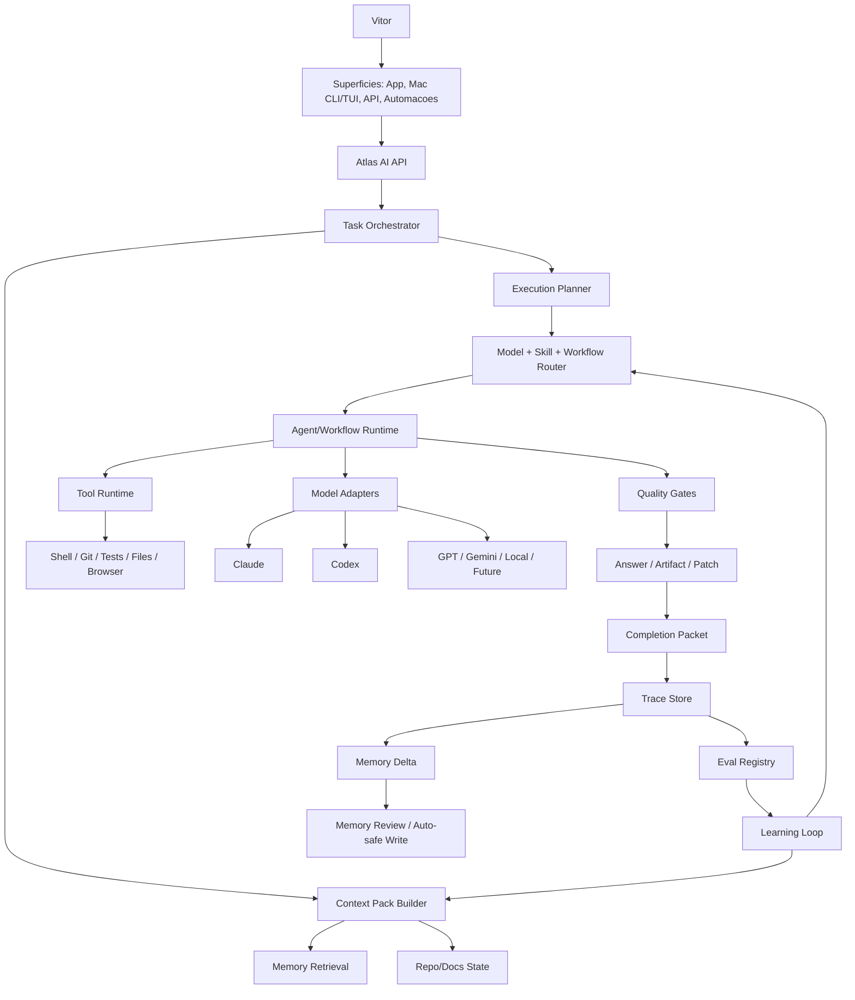

# ATLAS AI - PLANO DE IMPLEMENTACAO PROFISSIONAL

**Plano para transformar Atlas AI + Atlas AI Harness em substituto real de Claude/GPT apps, Claude Code e Codex CLI**

---

| | |
|---|---|
| **Operador** | Vitor Emanuel |
| **Sistema** | Atlas |
| **Documento** | Atlas AI - Plano de Implementacao Profissional |
| **Versao** | 1.0 |
| **Data** | 29 de abril de 2026 |
| **Status** | Plano executivo de implementacao |
| **Autoridade superior** | Atlas_AI_Documentacao_Final.md |
| **Documentos relacionados** | Atlas_AI_Harness_v1.md, Atlas_AI_Skill_System_v1.md, Master Prompt Atlas AI, Atlas Como Superficie Cognitiva Unica |

---

## 0. Decisao Executiva

O objetivo nao e criar "mais um chat com IA".

O objetivo e fazer o Atlas AI substituir, na pratica diaria, o uso direto de Claude, GPT, Claude Code, Codex CLI e Perplexity, porque o Atlas deve ser a superficie cognitiva persistente de Vitor.

Para isso, o Atlas AI precisa vencer em quatro frentes:

1. **Experiencia diaria melhor que Claude/GPT apps**: rapido, bonito, confiavel, com conversas, historico, modos, anexos, voz no futuro, respostas boas e retomada real de contexto.
2. **Memoria profunda superior**: nao historico bruto; memoria com origem, escopo, confianca, validade temporal e ativacao correta.
3. **Harness profissional**: Context Pack, roteamento de modelo, workflows, tools, quality gates, traces, completion packet e learning loop.
4. **Mac/CLI profissional**: substituir Claude Code/Codex CLI como interface principal para desenvolvimento pesado, usando esses motores por baixo quando forem melhores.

O Atlas AI so substitui Claude/GPT de verdade quando Vitor sentir que abrir Claude/GPT direto e pior porque perde memoria, contexto, continuidade, rastreabilidade e capacidade acumulada.

---

## 1. Estado Atual

O Atlas ja tem fundacao relevante:

- `atlas-server` com AI Gateway.
- Providers locais `claude_cli` e `codex_cli`.
- Fila `ai_jobs`.
- Traces `ai_traces`.
- Tentativas `ai_job_attempts`.
- Worker local.
- Health de providers.
- `AtlasAiSheet` no app.
- Roteamento basico por task/domain/provider.
- Semantic search no AtlasVault.
- Skills atuais: `orquestrador`, `vault-curador`, `blackink`, `financas`, `saude`.
- Documentacao constitucional do Atlas AI e Harness.

Mas o sistema ainda nao e um substituto profissional de Claude/GPT porque:

- nao ha conversa/thread real como unidade de produto;
- nao ha `ContextPack` tipado como artefato canonico;
- `AiPromptBuilder` ainda monta prompt direto de notas sem contrato forte;
- nao ha `ExecutionPlan` persistido;
- nao ha `CompletionPacket`;
- nao ha `MemoryDelta` pos-resposta;
- nao ha `Prompt/Skill Registry` versionado no banco;
- nao ha `EvalRegistry`;
- nao ha `PermissionEngine`;
- nao ha CLI `atlas`;
- nao ha tool runtime profissional para shell/Git/testes;
- nao ha UI de fontes/contexto/memoria usada;
- nao ha streaming/resposta incremental;
- nao ha ingestao estruturada de sessoes externas;
- falta a skill `aclarador` no Vault apesar de existir previsao no codigo;
- faltam skills profissionais do Harness: `dev-executor`, `code-reviewer`, `debugger`, `researcher`, `decision-advisor`, `memory-writer`, `evaluator`.

---

## 2. Produto-Alvo

### 2.1 Substituto Do Claude/GPT App

Atlas AI App deve cobrir:

- conversa rapida;
- pergunta simples;
- pesquisa;
- decisao;
- estudo;
- escrita;
- analise de notas;
- captura de pensamento;
- memoria;
- planejamento;
- trabalho;
- uso de modelos fortes por baixo;
- historico persistente;
- contexto do Atlas;
- explicacao de memoria usada;
- feedback e correcao;
- continuidade entre sessoes.

O app deve fazer o usuario pensar:

> "Nao faz sentido abrir Claude/GPT direto; no Atlas ele ja sabe meu contexto, minhas leis, meus projetos, minhas decisoes e ainda escolhe o melhor motor."

### 2.2 Substituto De Claude Code / Codex CLI

Atlas CLI/TUI deve cobrir:

- `atlas ask`;
- `atlas plan`;
- `atlas review`;
- `atlas dev`;
- `atlas threads`;
- `atlas state`;
- `atlas compact`;
- `atlas handoff`;
- `atlas checkpoint`;
- `atlas quality`;
- `atlas test`;
- `atlas runtime`;
- `atlas status`;
- `atlas bootstrap`;

O comando de alto nivel deve ser Atlas. Codex e Claude ficam como motores plugaveis.
Para configuracao, instalacao e validacao terminal, o unico comando recomendado e `atlas bootstrap`; diagnosticos internos de provider ficam encapsulados por ele.
Nomes como `atlas inspect`, `atlas remember`, `atlas ingest`, `atlas trace` e `atlas council` sao roadmap/legado ate constarem no Command Registry canonico de `Atlas_AI_CLI_Nomenclatura_Comandos_TUI_ADR.md`.

### 2.3 Core Profissional

Todo uso relevante deve passar por contratos:

```text
TaskRequest
-> ContextPack
-> ExecutionPlan
-> Provider/Agent/Workflow
-> Tool Events
-> QualityGateResult
-> CompletionPacket
-> MemoryDelta
-> Trace
```

---

## 3. Arquitetura-Alvo



---

## 4. Principios De Implementacao

1. **Atlas AI primeiro, provider depois.**  
   O usuario escolhe Atlas. Atlas escolhe Claude, Codex, GPT ou outro motor.

2. **Context Pack antes de prompt.**  
   Prompt deve ser renderizacao de um pacote de contexto tipado, nao texto montado de forma solta.

3. **Thread e unidade de experiencia; trace e unidade de auditoria.**  
   Conversas precisam ser boas para uso diario. Traces precisam ser bons para aprendizado.

4. **Workflow antes de agente livre.**  
   Dev, review, debug, research, decision e memory devem ter fluxos claros.

5. **Memoria precisa de ratificacao.**  
   Nem toda resposta vira memoria. Toda memoria relevante precisa de origem, confianca, escopo e validade.

6. **Mac/CLI local-first para dev.**  
   Desenvolvimento pesado precisa filesystem, Git, shell, testes, logs e permissao.

7. **Qualidade precisa ser visivel.**  
   O usuario deve ver modelo usado, contexto usado, gates executados, fontes e riscos quando isso importar.

8. **Substituicao por utilidade, nao por bloqueio.**  
   O Atlas deve ser melhor que Claude/GPT direto. Nao deve depender de proibir o uso externo.

---

## 5. Plano Faseado

## Fase 0 - Fundacao E Correcoes Imediatas

**Objetivo:** fechar lacunas basicas que impedem o Atlas AI de ser confiavel.

### Implementar

- Criar skill faltante `AtlasVault/_skills/aclarador/SKILL.md`.
- Criar skills iniciais:
  - `decision-advisor`;
  - `memory-writer`;
  - `evaluator`;
  - `researcher-quick`;
  - `code-reviewer`.
- Criar tabela ou JSON schema versionado para:
  - `TaskRequest`;
  - `ContextPack`;
  - `ExecutionPlan`;
  - `CompletionPacket`;
  - `MemoryDelta`.
- Adicionar snapshots desses contratos em `ai_traces.metadata` antes de criar tabelas dedicadas.
- Atualizar `AiPromptBuilder` para renderizar prompt a partir de `ContextPack`.
- Adicionar testes de unidade para roteamento e prompt/context pack.

### Criterio de sucesso

- Toda interacao nova gera `task_request`, `context_pack` e `execution_plan` no trace.
- Nenhuma resposta importante e gerada sem saber skill, modo, provider e contexto usado.
- `aclarador` deixa de ser uma skill prevista mas ausente.

### Nao fazer ainda

- Nao criar multi-agent complexo.
- Nao criar autoaprendizado automatico.
- Nao mexer em permissao destrutiva de shell.

---

## Fase 1 - Atlas AI App Como Chat Principal

**Objetivo:** tornar o app bom o bastante para perguntas diarias e substituir Claude/GPT app em uso simples e medio.

### Backend

- Criar conceito de `ai_threads`.
- Criar `ai_messages`.
- Associar `ai_traces` a threads.
- Permitir continuidade de conversa sem depender de historico bruto inteiro.
- Criar resumo incremental de thread.
- Adicionar `thread_context_pack`.
- Adicionar feedback por mensagem:
  - util;
  - errado;
  - contexto errado;
  - memoria errada;
  - salvar como memoria;
  - nao usar de novo.
- Criar endpoint de retry com outro provider.
- Criar endpoint de comparar providers para mesma pergunta.

### App

- Evoluir `AtlasAiSheet` para experiencia de conversa real.
- Criar tela dedicada `Atlas AI`.
- Suportar threads:
  - nova conversa;
  - continuar conversa;
  - buscar conversa;
  - fixar conversa;
  - arquivar conversa.
- Mostrar:
  - motor usado;
  - modo usado;
  - memorias usadas;
  - fontes/contexto relevante;
  - status de worker;
  - feedback rapido.
- Criar modos claros:
  - direto;
  - pesquisar;
  - decidir;
  - estudar;
  - escrever;
  - planejar;
  - revisar;
  - lembrar.

### UX minima para substituir Claude/GPT

- Abrir rapido.
- Responder sem friccao.
- Historico bom.
- Retomar contexto.
- Permitir pergunta boba sem ficar pesado.
- Permitir pergunta seria com estrutura.
- Permitir corrigir memoria.
- Permitir escolher motor quando Vitor quiser.

### Criterio de sucesso

- Vitor usa Atlas AI app por 7 dias para perguntas normais sem precisar abrir Claude/GPT app na maior parte das vezes.
- Pelo menos 30 interacoes reais com feedback.
- Menos de 10% de respostas com contexto errado.

---

## Fase 2 - Memoria Profunda E Context Pack Profissional

**Objetivo:** fazer o Atlas vencer Claude/GPT pela continuidade e memoria.

### Implementar

- `MemoryCandidate` gerado apos respostas relevantes.
- `MemoryDelta` com:
  - tipo;
  - texto;
  - evidencia;
  - origem;
  - escopo;
  - confianca;
  - validade temporal;
  - gatilhos de uso;
  - quando nao usar;
  - necessidade de ratificacao.
- Tela/fila de revisao de memorias candidatas.
- Classificacao de memoria:
  - episodica;
  - semantica;
  - procedural;
  - preferencial;
  - decisao;
  - fase/objetivo;
  - padrao;
  - eval case;
  - constitucional.
- `ContextPackBuilder` com ranking:
  1. objetivo atual;
  2. leis relevantes;
  3. thread summary;
  4. memoria forte;
  5. estado de projeto;
  6. evidencias/fontes;
  7. historico recente;
  8. lacunas.
- Mecanismo de "memoria usada nesta resposta".
- Feedback "essa memoria nao se aplica".

### Criterio de sucesso

- Atlas consegue explicar por que usou uma memoria.
- Vitor consegue corrigir memoria em 1 toque/comando.
- O sistema diferencia fase atual, fase encerrada e interesse latente.
- Retomada de contexto fica visivelmente superior a Claude/GPT direto.

---

## Fase 3 - Roteamento Profissional De Modelos

**Objetivo:** fazer o Atlas usar sempre o melhor motor para o objetivo.

### Implementar

- `ModelAdapter` formal.
- `ProviderCapabilityRegistry`:
  - conversa;
  - coding;
  - long context;
  - velocidade;
  - custo;
  - tool use;
  - privacidade;
  - confianca historica.
- `ModelRouter` heuristico:
  - pergunta simples -> rapido/barato;
  - decisao seria -> modelo forte + decision skill;
  - codigo -> Codex/Claude conforme historico;
  - review -> modelo diferente do executor;
  - pesquisa -> modelo com web/fonte quando disponivel;
  - memoria -> memory-writer/evaluator;
  - risco alto -> human gate.
- Fallback automatico:
  - provider offline;
  - timeout;
  - erro de auth;
  - resposta vazia;
  - gate falhou.
- Comparacao A/B manual:
  - "responder tambem com outro motor";
  - "comparar Claude vs Codex";
  - "usar conselho".

### Criterio de sucesso

- Vitor nao precisa pensar qual IA abrir para 80% das tarefas.
- Atlas escolhe ou sugere motor com justificativa curta.
- Provider falhando nao quebra a experiencia.

---

## Fase 4 - Mac CLI/TUI Para Desenvolvimento Pesado

**Objetivo:** substituir o uso direto de Claude Code/Codex CLI no Mac.

### CLI minima

```bash
atlas ask "..."
atlas plan "..."
atlas review --base main
atlas dev "..."
atlas test
atlas runtime workspace.profile
atlas status
atlas bootstrap
atlas threads
atlas handoff codex
```

### Componentes

- Binario/script `atlas`.
- Resolucao de workspace:
  - repo atual;
  - root;
  - branch;
  - dirty state;
  - arquivos alterados.
- `RepoContextBuilder`.
- `GitSafetyManager`.
- `CommandRunner` com trace:
  - comando;
  - cwd;
  - exit code;
  - stdout/stderr excerpt;
  - duracao;
  - motivo.
- Modo read-only:
  - `atlas plan`;
  - `atlas review`.
- Modo write:
  - `atlas dev`;
  - exige plano;
  - exige checkpoint/diff;
  - exige completion packet.
- Quality gates:
  - typecheck;
  - tests;
  - lint/build quando aplicavel;
  - diff review.

### Fluxo `atlas dev`

```text
intent
-> repo state
-> task request
-> context pack
-> plan
-> approval se necessario
-> provider executor
-> edits
-> tests
-> reviewer
-> completion packet
-> memory delta
-> trace
```

### Criterio de sucesso

- Vitor consegue trabalhar em `atlas-server` e `atlas-app` usando `atlas` como comando principal.
- Codex/Claude direto vira fallback, nao default.
- Toda sessao de dev gera trace, diff summary, testes e memoria candidata.

---

## Fase 5 - Research, Decision E Study Workflows

**Objetivo:** substituir Perplexity/Claude/GPT para pesquisa, decisao e estudo.

### `atlas research`

- pergunta;
- plano de busca;
- criterios de fonte;
- fontes primarias quando necessario;
- sintese;
- conflitos;
- lacunas;
- recomendacao;
- memoria candidata.

### `atlas decide`

- objetivo;
- opcoes;
- criterios;
- tradeoffs;
- reversibilidade;
- riscos;
- stakeholders;
- premortem;
- pergunta de autoria;
- decisao ratificada.

### `atlas study`

- objetivo de aprendizagem;
- mapa de conceito;
- recall ativo;
- lacunas;
- exercicios;
- revisao espaciada;
- conexoes com projetos.

### Criterio de sucesso

- Vitor usa Atlas para pesquisa e decisao sem precisar abrir Perplexity/Claude na maioria dos casos.
- Decisoes importantes geram decision records.
- Estudos geram revisao ativa, nao apenas resumo.

---

## Fase 6 - Avaliacao, Evals E Learning Loop

**Objetivo:** provar e melhorar qualidade de forma profissional.

### Implementar

- `EvalCase`:
  - input;
  - contexto esperado;
  - output esperado ou rubrica;
  - tipo;
  - dificuldade;
  - provider/modelo;
  - resultado.
- `EvalRun`.
- `PromptRegistry`.
- `SkillRegistry`.
- `RouterDecisionLog`.
- Dashboards:
  - taxa de sucesso;
  - latencia;
  - custo;
  - contexto errado;
  - memoria util;
  - provider escolhido;
  - retrabalho;
  - gate failures.
- Promocao de melhorias:
  - candidato;
  - teste offline;
  - holdout;
  - aprovacao;
  - rollback.

### Criterio de sucesso

- Melhorias de prompt/skill/router so entram se nao piorarem evals.
- Atlas sabe em quais tarefas Claude, Codex ou outro motor performa melhor.
- "5x" passa a ser medido por categoria.

---

## Fase 7 - Polimento Para Substituicao Total

**Objetivo:** Atlas AI virar default emocional e operacional de Vitor.

### Produto

- App rapido e confiavel.
- Busca de conversas.
- Voz/transcricao quando estiver maduro.
- Anexos/imagens/PDFs.
- Fonte/contexto visivel.
- Memoria corrigivel.
- Atalhos no Mac.
- Menu bar ou launcher.
- Deep links para traces, notas, projetos e arquivos.
- Export/ingest de conversas externas.

### Profissionalismo operacional

- Observabilidade.
- Backups.
- Retencao.
- Redaction de segredos.
- Provider health.
- Offline/degraded mode.
- Logs claros.
- Test suite.
- Documentacao interna.

### Criterio de sucesso

- Vitor abre Atlas primeiro por reflexo.
- Claude/GPT direto vira excecao.
- Atlas e melhor em continuidade, memoria, decisao, dev e trabalho real.

---

## 6. Backlog Tecnico Por Modulo

### Backend: Core Atlas AI

- `TaskRequestFactory`
- `ContextPackBuilder`
- `ExecutionPlanner`
- `ModelRouter`
- `SkillRouter` evoluido
- `WorkflowRegistry`
- `CompletionPacketBuilder`
- `MemoryDeltaBuilder`
- `QualityGateRunner`
- `ProviderCapabilityRegistry`
- `TraceEventLogger`

### Backend: Banco

- `ai_threads`
- `ai_messages`
- `ai_context_packs`
- `ai_execution_plans`
- `ai_completion_packets`
- `ai_memory_deltas`
- `ai_eval_cases`
- `ai_eval_runs`
- `ai_prompt_versions`
- `ai_skill_versions`
- `ai_router_decisions`
- `ai_tool_events`
- `ai_artifacts`

### App

- Tela dedicada Atlas AI.
- Thread list.
- Message composer robusto.
- Estado de streaming/polling.
- Feedback por mensagem.
- Painel de contexto/memoria.
- Modo provider override.
- Modo tarefa.
- Review de Memory Delta.
- Visualizacao de trace.

### CLI/TUI

- `atlas` launcher.
- Config local.
- Repo detection.
- API client local.
- Command runner.
- Git safety.
- Provider status.
- Trace viewer.
- Ingest external session.

### Skills

- `aclarador`
- `decision-advisor`
- `memory-writer`
- `evaluator`
- `researcher-quick`
- `researcher-deep`
- `dev-executor`
- `code-reviewer`
- `debugger`
- `architect`
- `harness-governance`

---

## 7. Ordem Recomendada De Execucao

### Sprint 1

1. Criar `aclarador` e skills base.
2. Criar `TaskRequest` e `ContextPack` em metadata.
3. Refatorar `AiPromptBuilder` para renderizar de `ContextPack`.
4. Adicionar testes de prompt/contexto/roteamento.
5. Melhorar `AtlasAiSheet` para mostrar memoria/contexto usado.

### Sprint 2

1. Criar `ai_threads` e `ai_messages`.
2. Transformar Atlas AI app em conversa real.
3. Criar feedback por mensagem.
4. Criar resumo incremental de thread.
5. Criar retry com outro provider.

### Sprint 3

1. Criar `MemoryDelta`.
2. Criar fila de revisao de memorias.
3. Criar memory feedback.
4. Criar explicacao de memoria usada.
5. Medir 30 interacoes reais.

### Sprint 4

1. Criar `ModelRouter`.
2. Criar provider capability registry.
3. Criar fallback de provider.
4. Criar comparacao manual de providers.
5. Registrar router decisions.

### Sprint 5

1. Criar CLI `atlas ask`, `atlas plan`, `atlas review`, `atlas status`, `atlas bootstrap`.
2. Criar `atlas review --base`.
3. Criar repo context builder.
4. Criar trace viewer.
5. Usar no `atlas-server` e `atlas-app`.

### Sprint 6

1. Criar `atlas dev`.
2. Criar `GitSafetyManager`.
3. Criar `CommandRunner`.
4. Criar completion packet automatico.
5. Criar code review gate.

---

## 8. Metricas De Substituicao

Atlas AI so pode ser considerado substituto real quando vencer nestas metricas:

| Dimensao | Meta |
|---|---|
| Uso diario | Vitor abre Atlas antes de Claude/GPT em >80% das interacoes. |
| Retomada de contexto | Tempo para retomar projeto cai pelo menos 3x. |
| Memoria util | >60% das memorias ativadas recebem feedback util/neutro, <10% erradas. |
| Resposta simples | Latencia aceitavel para uso cotidiano. |
| Decisao seria | Respostas trazem criterio, tradeoff e memoria relevante. |
| Dev local | `atlas review/inspect/dev` substitui Codex/Claude direto em tarefas reais. |
| Retrabalho | Menos ciclos de correcao vs uso direto. |
| Provider routing | Escolha de modelo raramente precisa ser corrigida manualmente. |
| Privacidade | Nenhum dado sensivel enviado sem classificacao/necessidade. |
| Aprendizado | Interacoes importantes geram MemoryDelta ou EvalCase quando aplicavel. |

---

## 9. Riscos E Controles

| Risco | Controle |
|---|---|
| Virar chat wrapper | Context Pack, traces, memory delta e workflows obrigatorios. |
| Virar dev tool apenas | Roadmap inclui app, memoria, pesquisa, decisao e estudo. |
| Memoria falsa | Ratificacao, validade temporal, feedback e origem. |
| UX lenta | Modo direto rapido, roteamento leve e fallback. |
| Multi-agent caro | Council so por regra clara. |
| Provider lock-in | ModelAdapter e ProviderCapabilityRegistry. |
| Prompt spaghetti | PromptRegistry e renderizacao por ContextPack. |
| Automacao perigosa | PermissionEngine, GitSafety e human gates. |
| Falta de confianca | Quality gates visiveis e completion packet. |
| Overengineering | Entregar primeiro threads + ContextPack + memoria + CLI minima. |

---

## 10. Definicao De Pronto

O Atlas AI estara pronto para substituir Claude/GPT apps quando:

1. Vitor conseguir fazer perguntas diarias no Atlas com menos friccao que em Claude/GPT.
2. O Atlas responder usando memoria e contexto melhores que qualquer provider isolado.
3. Conversas forem persistentes, buscaveis e reutilizaveis.
4. O sistema explicar memoria/contexto usados quando necessario.
5. Feedback corrigir comportamento futuro.
6. O Mac CLI permitir trabalhar em codigo sem abrir Codex/Claude direto como default.
7. Tarefas relevantes gerarem traces, completion packets e memory deltas.
8. O roteador escolher modelos com base em tarefa, risco, custo e resultado.
9. Privacidade e permissao forem parte da arquitetura.
10. Vitor sentir que abrir Claude/GPT direto cria perda de contexto.

---

## 11. Primeira Acao Recomendada

A primeira implementacao deve ser:

```text
TaskRequest + ContextPack + Thread real + MemoryDelta basico
```

Motivo: isso melhora imediatamente a experiencia do app e cria a base para todo o resto. Sem thread e context pack, o Atlas continua parecendo um gateway. Com thread, context pack e memory delta, ele comeca a virar core cognitivo.

Depois disso, construir a CLI.

O Mac/dev e crucial, mas o substituto de Claude/GPT comeca pelo app ser bom o bastante para uso diario. O substituto de Claude Code/Codex CLI vem logo depois com `atlas plan`, `atlas review` e `atlas dev`.
