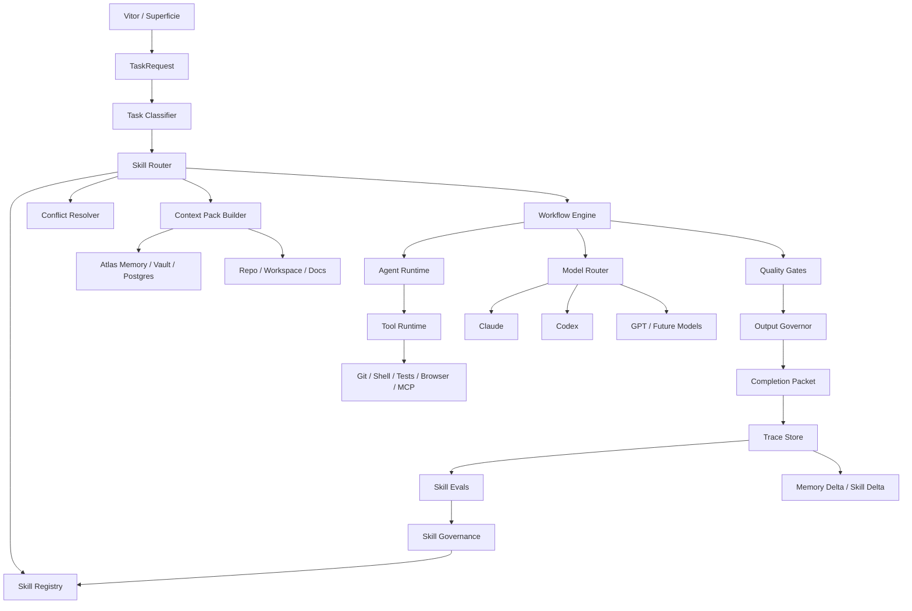

# ATLAS AI - SKILL SYSTEM V1

**Sistema profissional de skills do Atlas AI para transformar modelos intercambiaveis em capacidade operacional acumulativa**

---

| | |
|---|---|
| **Operador** | Vitor Emanuel |
| **Sistema** | Atlas |
| **Documento** | Atlas AI - Skill System v1 |
| **Versao** | 1.1 |
| **Data** | 29 de abril de 2026 |
| **Status** | Especificacao operacional final V1 com registry, aliases, skills e evals base definidos |
| **Autoridade superior** | Atlas_AI_Documentacao_Final.md |
| **Documentos relacionados** | Atlas_AI_Harness_v1.md, Atlas_AI_Sessoes_Compactacao_Continuidade.md, Atlas_AI_Plano_Implementacao_Profissional.md, Master Prompt Atlas AI |
| **Base de pesquisa** | Pesquisa rigorosa: skills para Claude Code e GPT/Codex que realmente valem a pena, Manus AI, 29 de abril de 2026 |

---

## 0. Decisao Executiva

O **Atlas AI Skill System** e a camada de capacidades especializadas do Atlas AI Harness.

Ele define como o Atlas cria, ativa, combina, avalia, promove, deprecia e melhora skills sem ficar preso a Claude, Codex, GPT ou qualquer outro provider.

Uma skill do Atlas nao e um prompt bonito, uma persona, uma colecao de dicas ou um "especialista" generico. Uma skill e um **contrato operacional versionado** que diz:

- quando deve ser usada;
- quando nao deve ser usada;
- qual entrada espera;
- qual saida deve produzir;
- quais permissoes pode usar;
- quais quality gates precisa passar;
- como sera avaliada contra baseline;
- como aprende sem degradar o sistema.

O objetivo do Skill System nao e aumentar a quantidade de prompts. O objetivo e transformar tarefas recorrentes em capacidades confiaveis, mensuraveis e reutilizaveis.

O Atlas deve ser a identidade persistente. Claude, Codex, GPT, Gemini, modelos locais e modelos futuros sao motores. Skills sao a forma como o Atlas veste esses motores com metodo, contexto, criterio, output e verificacao.

**Tese central:** o Atlas so deve adotar uma skill se ela melhorar qualidade, tempo, confiabilidade, custo, clareza ou continuidade contra uma baseline sem skill.

---

## 1. Definicao Curta

**Atlas AI Skill System** e o subsistema do Atlas AI Harness responsavel por transformar conhecimento operacional em modulos pequenos, versionados, ativados sob demanda, provider-neutral, avaliados por evidencia e conectados a contexto, memoria, agentes, ferramentas, quality gates e traces.

---

## 2. Fronteira Conceitual

| Conceito | Definicao | Regra |
|---|---|---|
| **Atlas AI** | Core cognitivo persistente do Atlas. | Identidade, memoria, leis, direcao e continuidade pertencem ao Atlas. |
| **Atlas AI Harness** | Infraestrutura operacional que usa modelos, agentes, ferramentas, contexto e gates. | O Harness executa e mede. |
| **Skill System** | Registro e runtime de capacidades especializadas. | Skill e contrato operacional, nao persona. |
| **Skill** | Lente, politica, procedimento e criterio de saida. | Skill vem antes de agente. |
| **Workflow** | Sequencia de passos para tarefa repetivel ou critica. | Workflow pode usar uma ou mais skills. |
| **Agente** | Papel operacional temporario. | Agente executa sob uma skill ou workflow. |
| **Provider/modelo** | Motor substituivel. | Provider nunca define identidade nem memoria. |
| **Hook/gate** | Verificacao ou bloqueio deterministico. | Hook defende; nao substitui julgamento. |
| **MCP/tool** | Ferramenta externa ou local. | Read-only por padrao; write exige escopo e permissao. |

---

## 2.1 Decisoes Finais Da V1

Esta versao resolve a ambiguidade entre tese, nomes conceituais e runtime real.

| Ponto | Decisao final |
|---|---|
| **Nomes canonicos** | Slugs ja existentes no Vault continuam canonicos. Nomes em ingles viram aliases oficiais quando necessario. |
| **Registry V1** | `AtlasVault/_skills/atlas-skills.manifest.json` e o registry humano/editavel. O backend registra hashes em traces. Tabela `ai_skill_versions` fica como espelho runtime futuro. |
| **Fonte de verdade** | V1 usa o Vault como fonte autoritativa de skills. Banco nao substitui o Vault. |
| **Output governor** | `comunicador-claro` e o slug canonico; `clear-output-governor` e alias. Deve ser aplicado por default na resposta final. |
| **Atlas core** | `atlas` e o slug canonico; `atlas-core` e alias. |
| **Dev executor** | `desenvolvedor` e o slug canonico; `dev-executor` e alias. |
| **Continuity workflows** | `session-compaction` e `provider-handoff` sao skills operacionais que governam services/workflows do Harness. |
| **Evals base** | Evals iniciais vivem em `AtlasVault/_skills/_evals/`. |
| **Permissoes** | Cada skill declara permissao de filesystem, shell, network e memory_write. |
| **Finalidade** | Skill sem eval nao vira default. Excecao V1: skills constitucionais entram default com eval base pendente de execucao real. |

Aliases oficiais:

| Alias conceitual | Slug canonico |
|---|---|
| `atlas-core` | `atlas` |
| `clear-output-governor` | `comunicador-claro` |
| `output-governor` | `comunicador-claro` |
| `clear-communicator` | `comunicador-claro` |
| `dev-executor` | `desenvolvedor` |
| `memory-curator` | `vault-curador` |

---

## 3. Principios Nao-Negociaveis

### P1. Skill antes de agente.

Antes de criar um agente, o Atlas deve definir a skill: missao, gatilhos, limites, entradas, saidas, permissoes e gates.

Agente sem skill vira personagem. Skill com runtime vira capacidade.

### P2. Provider-neutral por padrao.

Uma skill deve funcionar com Claude, Codex, GPT ou provider futuro sempre que possivel. O provider pode mudar a execucao, mas nao a regra da skill.

### P3. Poucas skills fortes vencem catalogo gigante.

O Atlas nao deve instalar ou criar centenas de skills. O nucleo precisa ser pequeno, auditavel, avaliavel e de alto impacto.

### P4. Descricao e parte do sistema.

A descricao da skill nao e texto decorativo. Ela e o gatilho de roteamento. Descricao ruim ativa skill errada, polui contexto e reduz performance.

### P5. Progressive disclosure.

O Atlas deve carregar primeiro metadados leves: nome, descricao, gatilhos, risco e saida. O corpo completo da skill so entra no contexto quando a tarefa justificar.

### P6. Contexto compilado, nao despejado.

Skills nao devem puxar todo o Vault, todo repo ou todo historico. Elas devem pedir Context Packs especificos, pequenos e autoritativos.

### P7. Clareza de saida e skill central, nao estetica opcional.

Para o Atlas, respostas claras, simples, sem codigo por padrao e com baixa carga cognitiva sao parte do produto. O estilo Caveman/Comunicador Claro nao e baixa prioridade; e o output governor base para uso diario.

### P8. Skill sem eval nao vira default.

Uma skill pode existir em draft, mas nao deve virar padrao sem casos de avaliacao, baseline e evidencia de ganho.

### P9. Autoaperfeicoamento exige prova.

O Atlas pode propor melhorias de skill, prompt, roteamento ou workflow. Promocao automatica so ocorre quando houver metrica, traces, rollback e risco baixo. Mudancas sensiveis exigem aprovacao humana.

### P10. Hooks sao defensivos.

Hooks devem bloquear risco, validar saida, registrar artefatos e exigir testes. Nao devem executar deploy, commit, delete ou acao irreversivel sem confirmacao humana.

### P11. Memoria nao e dump.

Skills de memoria devem promover apenas aprendizado qualificado, com origem, escopo, confianca, validade temporal e condicoes de uso/nao uso.

### P12. Multi-skill e multi-agent sao excecoes controladas.

Combinar muitas skills ou muitos agentes aumenta custo, latencia e contradicao. O default e uma skill principal, skills auxiliares de baixo conflito e um agente executor.

---

## 4. Objetivo Operacional

O Skill System deve permitir que o Atlas:

1. entenda a tarefa;
2. escolha a skill principal;
3. aplique skills auxiliares quando necessario;
4. compile contexto correto;
5. escolha provider/modelo adequado;
6. execute com workflow apropriado;
7. aplique quality gates;
8. entregue saida clara;
9. registre trace;
10. proponha memoria ou melhoria quando houver aprendizado reutilizavel.

Fluxo canonico:

```text
TaskRequest
-> Task Classification
-> Skill Routing
-> Context Pack
-> Provider/Agent/Workflow
-> Tool Runtime
-> Quality Gates
-> Output Governor
-> Completion Packet
-> Trace
-> Memory Delta / Skill Delta
```

---

## 5. Arquitetura Do Skill System



### Componentes

| Componente | Responsabilidade |
|---|---|
| **Skill Registry** | Fonte canonica de skills, versoes, status, descricoes, permissoes e evals. |
| **Skill Router** | Decide skill principal e auxiliares por tarefa, superficie, risco e contexto. |
| **Conflict Resolver** | Evita skills contraditorias, excesso de instrucoes e ativacao indevida. |
| **Context Pack Builder** | Monta contexto minimo suficiente para a skill ativa. |
| **Workflow Engine** | Executa sequencias controladas quando a tarefa exige processo. |
| **Agent Runtime** | Instancia papeis operacionais temporarios. |
| **Model Router** | Escolhe provider e modelo sem entregar identidade ao provider. |
| **Tool Runtime** | Usa shell, Git, testes, browser, Postgres, Vault e MCP com permissao. |
| **Quality Gates** | Verifica resposta, patch, fontes, testes, seguranca, memoria e clareza. |
| **Output Governor** | Aplica formato final: clareza, concisao, sem codigo por padrao. |
| **Trace Store** | Registra decisao de skill, contexto, provider, tools, custo, resultado e feedback. |
| **Skill Evals** | Mede skill contra baseline com casos realistas. |
| **Skill Governance** | Promove, rebaixa, deprecia e revisa skills com evidencia. |

---

## 6. Contrato De Skill V1

Toda skill do Atlas deve seguir um contrato minimo.

### 6.1 Metadados

```yaml
id: atlas-skill-comunicador-claro
slug: comunicador-claro
title: Comunicador Claro
status: draft|experimental|candidate|default|deprecated
version: 1
owner: atlas
domain: output
risk_level: low|medium|high
provider_neutral: true
surfaces:
  - app
  - mac_cli
  - api
activation:
  primary_triggers:
    - resposta simples
    - explicar sem codigo
    - resumo
  negative_triggers:
    - usuario pediu codigo completo
    - saida exige schema exato
permissions:
  filesystem: none|read|write_scoped
  shell: none|read_only|scoped
  network: none|read_only|scoped
  memory_write: none|proposal|auto_safe
quality_gates:
  - clarity_check
  - no_unrequested_code
evals:
  baseline: no_skill
  min_cases: 5
  promotion_metric: clarity_score
aliases:
  - clear-output-governor
```

### 6.2 Corpo

Toda skill deve conter:

1. **Missao**: uma frase clara.
2. **Quando usar**: gatilhos positivos concretos.
3. **Quando nao usar**: gatilhos negativos.
4. **Entrada esperada**: dados minimos para executar.
5. **Processo**: passos imperativos e curtos.
6. **Saida padrao**: formato verificavel.
7. **Quality gate**: como validar.
8. **Permissoes**: ferramentas e limites.
9. **Exemplos**: 1 ou 2 exemplos realistas.
10. **Evals**: casos que provam melhoria.
11. **Falhas conhecidas**: onde a skill costuma errar.
12. **Rollback/deprecacao**: quando remover ou substituir.

### 6.3 Regras De Escrita

- Usar linguagem operacional, nao motivacional.
- Evitar "boas praticas" sem dizer quais.
- Preferir passos verificaveis.
- Nao duplicar regra constitucional que ja mora no Master Prompt ou docs superiores.
- Nao criar skill para algo que cabe em uma instrucao simples.
- Nao acoplar a Claude ou Codex sem motivo tecnico.
- Separar procedimento de estilo.
- Manter curta; referencias longas devem ficar em arquivos auxiliares carregados sob demanda.

---

## 7. Taxonomia De Skills Do Atlas

| Tipo | Funcao | Exemplo |
|---|---|---|
| **Core Identity** | Preservar diferencas entre Atlas, Atlas AI, Harness, provider e memoria. | `atlas` / alias `atlas-core` |
| **Output Governor** | Controlar clareza, tamanho, codigo, tom e forma final. | `comunicador-claro` / alias `clear-output-governor` |
| **Context Skill** | Gerar Context Pack para tarefa, repo, memoria ou sessao. | `atlas-context-pack`, `repo-context-pack` |
| **Continuity Skill** | Manter sessoes longas, compactar, retomar e trocar provider. | `session-compaction`, `provider-handoff` |
| **Development Skill** | Programar, revisar, testar, debugar e validar. | `dev-quality-gate`, `test-repair-loop` |
| **Research Skill** | Pesquisar com fontes, lacunas, confianca e sintese. | `research-brief`, `source-grounding` |
| **Decision Skill** | Estruturar opcoes, tradeoffs, riscos e recomendacao. | `decision-advisor` |
| **Memory Skill** | Propor memoria qualificada e descartar ruido. | `memory-retrospective`, `memory-writer` |
| **Security Skill** | Revisar ameacas, secrets, permissoes, dependencias e abuso. | `security-review` |
| **Tool Builder Skill** | Criar wrappers CLI/MCP/API quando uso repetido justificar. | `mcp-or-cli-builder` |
| **Eval Skill** | Criar e rodar avaliacao A/B de skills, prompts e roteamento. | `skill-eval-creator` |
| **Incident Skill** | Transformar erro real em postmortem e melhoria. | `incident-postmortem` |

---

## 8. Kit Minimo Profissional V1

O nucleo inicial do Atlas deve ter poucas skills fortes. Elas devem cobrir continuidade, clareza, desenvolvimento, memoria, seguranca e melhoria.

### 8.1 Ring 0 - Skills Constitucionais

Estas skills protegem a identidade do Atlas e a experiencia diaria.

| Skill | Missao | Quando usar | Saida padrao | Gate |
|---|---|---|---|---|
| `atlas` | Preservar arquitetura e identidade do Atlas. | Perguntas sobre Atlas, AI Core, Harness, memoria, provider, agentes. | Resposta alinhada aos docs constitucionais. | Nao confundir provider com Atlas. |
| `comunicador-claro` | Reduzir ruido, custo e carga cognitiva. | Explicacao, status, plano, decisao, resposta sem codigo. | Texto curto, claro e acionavel. | Sem codigo nao solicitado. |
| `atlas-context-pack` | Montar contexto Atlas minimo e autoritativo. | Toda tarefa que depende de memoria, projeto, leis ou historico. | Context Pack com fontes, escopo e lacunas. | Contexto pequeno, relevante e datado. |
| `skill-eval-creator` | Criar evals para skills e mudancas de prompt/roteamento. | Toda nova skill, promocao ou autoaperfeicoamento. | Casos A/B, baseline e metricas. | Nao promover sem evidencia. |

### 8.2 Ring 1 - Continuidade E Memoria

Estas skills resolvem o problema central que Claude/GPT/Codex isolados nao resolvem: continuidade real.

| Skill | Missao | Quando usar | Saida padrao | Gate |
|---|---|---|---|---|
| `session-compaction` | Compactar sessoes longas sem perder estado. | Conversas por horas, implementacoes longas, risco de contexto degradar. | Session Brief + estado atual + decisoes + pendencias. | Novo provider entende a sessao sem historico bruto. |
| `provider-handoff` | Transferir trabalho entre Claude, Codex, GPT ou modelo futuro. | Troca de provider ou retomada em outra superficie. | Handoff Packet. | Preserva objetivo, estado, restricoes, arquivos e proximos passos. |
| `memory-retrospective` | Extrair aprendizado reutilizavel de sessoes e falhas. | Fechamento de tarefa, erro recorrente, decisao importante. | Memory Delta proposto. | Origem, confianca, validade e condicao de uso. |
| `memory-writer` | Escrever memoria qualificada quando permitido. | Apos aprovacao ou memoria auto-safe. | Nota/registro persistente com metadados. | Nao cristalizar fase encerrada como identidade atual. |

### 8.3 Ring 2 - Desenvolvimento Pesado No Mac

Estas skills tornam o Atlas competitivo com Claude Code e Codex CLI.

| Skill | Missao | Quando usar | Saida padrao | Gate |
|---|---|---|---|---|
| `repo-context-pack` | Entender repo, comandos, arquitetura e hotspots. | Antes de tarefa em codigo desconhecido ou ampla. | Repo Brief curto e versionavel. | Usa `rg`, Git, testes e arquivos reais. |
| `dev-quality-gate` | Validar diff antes de concluir. | Toda implementacao ou bugfix. | Gate report: diff, testes, lint/typecheck, riscos. | Tarefa nao fecha sem prova ou justificativa. |
| `test-repair-loop` | Criar/regredir teste e reparar falha. | Bugfix, regressao, comportamento verificavel. | Teste que falha/passa quando viavel. | Nao inventar sucesso; registrar comando e resultado. |
| `ui-verification` | Verificar frontend visual e funcionalmente. | Mudancas de app/web/UI. | Screenshot/checklist/resultado de navegacao. | Sem tela quebrada, texto sobreposto ou canvas branco. |
| `security-review` | Detectar risco tecnico e operacional. | Auth, dados sensiveis, tool runtime, MCP, rede, storage. | Findings com severidade e evidencia. | Bloqueia secrets, permissoes amplas e write perigoso. |

### 8.4 Ring 3 - Capacidades Opcionais De Alto Valor

Entram quando houver demanda real e eval.

| Skill | Missao | Condicao para virar default |
|---|---|---|
| `mcp-or-cli-builder` | Transformar APIs e rotinas repetidas em ferramentas estaveis. | Uso repetido, permissao clara, beneficio medido. |
| `incident-postmortem` | Converter falhas reais em aprendizado, teste e regra. | Operacao com logs/monitoramento em producao. |
| `deployment-gate` | Validar deploy, rollback e checklist de release. | Quando Atlas tiver fluxo de deploy frequente. |
| `source-grounded-research` | Pesquisar com fontes, lacunas e confianca. | Quando pesquisa factual for parte central do uso. |
| `decision-advisor` | Estruturar decisoes importantes. | Quando decisao tiver risco, custo ou irreversibilidade. |

---

## 9. Skills Existentes No Vault

O Atlas possui skills no Vault com metadados V1.1 padronizados: status, permissao, risco, superficies, ativacao, quality gates e eval base. A governanca runtime completa entra por traces, manifest e evolucao futura de dashboard.

| Skill atual | Papel provavel no sistema | Observacao |
|---|---|---|
| `atlas` | Core Identity | Slug canonico. `atlas-core` e alias oficial. |
| `comunicador-claro` | Output Governor | Corresponde ao principio Caveman: clareza, baixo output e sem codigo por padrao. |
| `aclarador` | Clarificacao e reducao de ambiguidade | Deve ser usado antes de plano quando tarefa estiver ambigua. |
| `orquestrador` | Roteamento inicial | Deve chamar Skill Router, nao decidir sozinho por feeling. |
| `desenvolvedor` | Dev execution | Deve ser decomposto em `repo-context-pack`, `dev-quality-gate` e `test-repair-loop` quando necessario. |
| `code-reviewer` | Review tecnico | Deve ser ligado a gates, diff e testes. |
| `decision-advisor` | Decisao | Deve preservar autoria humana. |
| `memory-writer` | Memoria | Deve seguir regra de promocao e validade temporal. |
| `evaluator` | Avaliacao | Deve virar base para quality gates e skill evals. |
| `researcher-quick` | Pesquisa rapida | Precisa de fonte, data e incerteza. |
| `vault-curador` | Curadoria do Vault | Deve evitar dump de memoria. |
| `blackink`, `financas`, `saude` | Dominio | Devem acionar contexto e riscos especificos do dominio. |

---

## 10. Algoritmo De Roteamento De Skills

O Skill Router deve seguir uma ordem previsivel.

### 10.1 Entradas

```json
{
  "surface": "app|mac_cli|api|automation|browser",
  "message": "texto do operador",
  "thread_id": "uuid",
  "session_id": "uuid",
  "domain": "atlas|dev|finance|health|blackink|general",
  "task_type": "chat|dev|review|debug|research|decision|memory|study",
  "risk_level": "low|medium|high",
  "provider_hint": "claude|codex|gpt|null",
  "mode_hint": "direct|plan|execute|review|council|null",
  "context_refs": [],
  "active_state": {}
}
```

### 10.2 Ordem De Decisao

1. **Resolver continuidade.**  
   Se a mensagem for curta ou referencial ("C", "ambos", "continua", "isso"), usar thread/session state antes de classificar como nova tarefa.

2. **Detectar se e nova sessao ou continuacao.**  
   Se houver objetivo ativo compativel, continuar. Se houver assunto novo, criar nova thread/sessao. Se ambiguidade for alta, perguntar ou oferecer interpretacao.

3. **Classificar tarefa.**  
   Determinar tipo, dominio, risco, superficie e necessidade de ferramenta.

4. **Aplicar hard constraints.**  
   Seguranca, permissao, leis do Atlas, memoria sensivel, write/deploy, dados pessoais.

5. **Selecionar skill principal.**  
   Uma skill dominante por default.

6. **Selecionar skills auxiliares.**  
   No maximo duas auxiliares, exceto workflow tecnico justificado.

7. **Resolver conflito.**  
   Se uma skill pede detalhe e outra pede concisao, a saida final obedece ao Output Governor, mas o processo interno pode ser detalhado.

8. **Compilar contexto.**  
   Buscar somente o necessario.

9. **Escolher provider/agente/workflow.**  
   Provider e motor; skill define comportamento.

10. **Executar e registrar trace.**

### 10.3 Pseudocodigo

```text
route_skill(request):
  state = load_thread_session_state(request)

  if is_referential_message(request.message):
    request = resolve_reference(request, state)

  task = classify_task(request, state)
  constraints = load_constraints(task, request.surface)

  if constraints.requires_clarification:
    return skill("aclarador")

  primary = select_primary_skill(task, constraints)
  auxiliaries = select_auxiliary_skills(task, primary, max=2)
  selected = resolve_conflicts(primary, auxiliaries, constraints)

  context_pack = build_context_pack(task, selected)
  workflow = select_workflow(task, selected, context_pack)
  provider = select_provider(task, workflow, constraints)

  return ExecutionPlan(selected, context_pack, workflow, provider)
```

---

## 11. Regras De Ativacao

### 11.1 Mensagens Curtas E Referenciais

O Atlas deve tratar respostas curtas como dependentes de contexto antes de responder que "nao ha referencia".

| Entrada | Interpretacao esperada |
|---|---|
| "C" | Resolver contra alternativas A/B/C visiveis no thread. |
| "ambos" | Resolver contra a pergunta imediatamente anterior. |
| "continua" | Continuar tarefa ativa. |
| "faz" | Executar plano aprovado se houver permissao. |
| "isso" | Confirmar ou expandir ultimo ponto. |
| "troca" | Trocar provider/modo se o UI oferecer essa acao. |

Se a referencia nao puder ser resolvida com confianca, o Atlas deve dizer exatamente qual ambiguidade existe e oferecer a interpretacao mais provavel.

### 11.2 App Vs Mac CLI

| Superficie | Default | Skills provaveis |
|---|---|---|
| **App** | Resposta clara, memoria, decisao, pesquisa, planejamento. | `comunicador-claro`, `atlas-context-pack`, `decision-advisor`, `memory-retrospective`. |
| **Mac CLI/TUI** | Desenvolvimento pesado, repo, execucao, testes, review. | `repo-context-pack`, `dev-quality-gate`, `test-repair-loop`, `provider-handoff`. |
| **API/Automation** | Tarefa tipada, baixa ambiguidade, logs. | Skill explicita ou workflow fixo. |
| **Browser** | Verificacao visual, pesquisa, produto. | `ui-verification`, `source-grounded-research`. |

### 11.3 Codigo Por Padrao

O Atlas nao deve mostrar codigo ao usuario por padrao quando a pergunta for sobre entendimento, status, decisao ou plano.

Para desenvolvimento, o Atlas pode editar arquivos, rodar testes e resumir o que fez em linguagem natural. Codigo aparece quando:

- Vitor pede codigo;
- o artefato final e codigo;
- um trecho pequeno e necessario para explicar risco;
- review exige linha especifica;
- output e patch/diff por definicao.

---

## 12. Output Governor

O `comunicador-claro` e a skill central de output governor do Atlas. `clear-output-governor` permanece como alias conceitual. Essa skill resolve um problema de uso real: respostas longas, codigo desnecessario, ruido e custo cognitivo.

### 12.1 Missao

Produzir respostas claras, simples, tecnicamente precisas, com baixo output e sem codigo por padrao.

### 12.2 Regras

- Responder primeiro a tese.
- Explicar apenas o que muda a decisao.
- Separar "o que importa" de detalhes.
- Nao colar codigo se Vitor nao pediu.
- Nao fingir certeza quando ha lacuna.
- Evitar floreio, desculpa, frase motivacional e meta-comentario.
- Em dev, preferir "arquivo X foi alterado para Y; teste Z passou".
- Quando houver risco, explicitar risco e proximo passo.

### 12.3 Exemplo De Saida

```text
Sim: para o Atlas, essa skill e central.

Ela controla a forma final da resposta: curta, clara e sem codigo por padrao.
Isso reduz custo, ruido e carga cognitiva, principalmente no app.

Proximo passo: formalizar essa skill como default em todas as superficies.
```

---

## 13. Provider Handoff

O `provider-handoff` e obrigatorio porque o Atlas nao pode perder continuidade ao trocar Claude por Codex, Codex por GPT ou qualquer combinacao futura.

### 13.1 Handoff Packet

```json
{
  "thread": {
    "title": "",
    "objective": "",
    "current_topic": ""
  },
  "session": {
    "type": "dev|research|decision|chat",
    "status": "active|paused|waiting_human",
    "active_goal": "",
    "next_step": ""
  },
  "decisions": [],
  "constraints": [],
  "files_touched": [],
  "commands_run": [],
  "tests_status": [],
  "open_questions": [],
  "risks": [],
  "memory_refs": [],
  "provider_notes": {
    "previous_provider": "",
    "reason_for_switch": "",
    "capabilities_needed": []
  }
}
```

### 13.2 Gate

O novo provider deve conseguir responder:

1. Qual e o objetivo?
2. O que ja foi decidido?
3. O que esta aberto?
4. Quais restricoes importam?
5. Qual e o proximo passo?
6. Que memoria/contexto foi usado?
7. O que nao deve ser refeito?

Se nao conseguir, o handoff falhou.

---

## 14. Session Compaction

O `session-compaction` nao e resumo generico. Ele e uma compressao operacional.

### 14.1 Quando Compactar

Compactar quando:

- conversa passa de janela segura de contexto;
- tarefa dura horas;
- houve muitas ferramentas/testes/diffs;
- provider vai trocar;
- app vai pausar/retomar;
- thread tem muitas decisoes importantes;
- resposta do modelo comeca a perder foco;
- custo/latencia cresce sem ganho.

### 14.2 Saida Canonica

```json
{
  "objective": "",
  "current_state": "",
  "decisions": [],
  "user_preferences_active": [],
  "user_preferences_inactive_or_historical": [],
  "files_or_artifacts": [],
  "commands_and_results": [],
  "known_errors": [],
  "resolved_errors": [],
  "open_tasks": [],
  "next_action": "",
  "memory_candidates": [],
  "do_not_repeat": []
}
```

### 14.3 Regra Sobre Fases Encerradas

Compactacao deve distinguir:

- fato historico;
- preferencia atual;
- fase encerrada;
- interesse latente;
- regra ativa.

Exemplo: "Vitor lutou jiu-jitsu no passado" nao deve ser usado como preferencia atual sem evidencia recente.

---

## 15. Desenvolvimento Pesado No Mac

Para substituir Claude Code e Codex CLI, o Skill System precisa operar como engenharia real, nao apenas chat.

### 15.1 Fluxo Dev Padrao

```text
User Intent
-> repo-context-pack
-> plan
-> scoped edit
-> test/typecheck/lint
-> dev-quality-gate
-> optional review provider
-> completion packet
-> memory-retrospective
```

### 15.2 Definition Of Done Para Dev

Uma tarefa de desenvolvimento so esta pronta quando:

- objetivo foi entendido;
- escopo foi limitado;
- arquivos alterados estao claros;
- comandos relevantes foram rodados;
- testes passaram ou falha foi explicada;
- diff foi revisado;
- riscos residuais foram citados;
- nada foi revertido indevidamente;
- proximo passo esta claro.

### 15.3 Quando Usar Council/Reviewer Separado

Usar reviewer separado quando:

- mexe em auth, dados, pagamentos, memoria ou tool runtime;
- muda contrato API;
- altera fluxo multi-provider;
- ha risco de regressao ampla;
- a tarefa ficou longa;
- o agente executor demonstrou incerteza.

Nao usar council quando:

- a mudanca e pequena e verificavel;
- teste/lint ja cobre;
- latencia extra nao compensa;
- a revisao seria so opiniao sem artefato.

---

## 16. Skill Evals

### 16.1 Regra De Promocao

Nenhuma skill vira default sem avaliacao minima.

| Status | Criterio |
|---|---|
| **Draft** | Ideia escrita, hipotese de valor, sem uso padrao. |
| **Experimental** | 3 a 5 casos reais, uso manual. |
| **Candidate** | 5 a 10 casos, baseline, traces e ganho observado. |
| **Default** | Score >= 80, risco controlado, docs curtas e rollback. |
| **Deprecated** | Pouco uso, conflito, risco, baixa qualidade ou substituicao melhor. |

### 16.2 Metricas

| Metrica | Pergunta |
|---|---|
| **Quality score** | A resposta/patch ficou melhor que baseline? |
| **Time to completion** | Reduziu tempo real? |
| **Token/output cost** | Reduziu contexto ou saida sem perder substancia? |
| **Failure rate** | Menos erro, retrabalho ou alucinacao? |
| **Verification rate** | Mais tarefas terminaram com prova? |
| **User correction rate** | Vitor precisou corrigir menos? |
| **Continuity score** | Manteve contexto entre sessoes/providers? |
| **Clarity score** | Ficou mais simples e acionavel? |
| **Risk score** | Aumentou ou reduziu risco operacional? |

### 16.3 Caso De Eval

```yaml
id: comunicador-claro-001
task: explicar mudanca tecnica sem mostrar codigo
baseline: resposta sem skill
skill: comunicador-claro
expected:
  - tese em ate 2 frases
  - sem codigo
  - menciona arquivos alterados se houver
  - proximo passo claro
fail_if:
  - cola bloco de codigo
  - responde com floreio
  - omite risco relevante
metrics:
  clarity: 0-5
  completeness: 0-5
  output_size: tokens
  user_followup_needed: yes|no
```

---

## 17. Governanca

### 17.1 Promocao Controlada

Mudancas de skill seguem este caminho:

```text
Idea
-> Draft Skill
-> Experimental Run
-> Eval Cases
-> Candidate
-> Review
-> Default
-> Monitoring
-> Deprecation or Improvement
```

### 17.2 Quem Pode Mudar O Que

| Mudanca | Pode ser automatica? | Exige aprovacao humana? |
|---|---|---|
| Corrigir typo em skill | Sim, se baixo risco. | Nao necessariamente. |
| Adicionar exemplo de uso | Sim, com trace. | Nao necessariamente. |
| Alterar gatilho de ativacao | Nao por default. | Sim se impactar roteamento. |
| Promover skill para default | Nao. | Sim. |
| Dar permissao write/shell/network | Nao. | Sim. |
| Depreciar skill conflituosa | Pode propor. | Sim. |
| Alterar lei do Atlas AI | Nao. | Sim, sempre. |

### 17.3 Regra De Erro Recorrente

Quando o Atlas cometer o mesmo erro duas vezes:

1. registrar trace;
2. produzir retrospectiva curta;
3. propor alteracao de skill, eval ou roteamento;
4. criar caso de eval;
5. pedir aprovacao se afetar default, permissao ou lei.

---

## 18. Observabilidade

Toda execucao relevante deve registrar:

```json
{
  "trace_id": "",
  "thread_id": "",
  "session_id": "",
  "surface": "app",
  "task_type": "decision",
  "primary_skill": "decision-advisor",
  "auxiliary_skills": ["comunicador-claro", "atlas-context-pack"],
  "skill_versions": {
    "decision-advisor": 1,
    "comunicador-claro": 1
  },
  "provider": "claude_cli",
  "model": "",
  "context_pack_id": "",
  "tools_used": [],
  "quality_gates": [],
  "cost": {
    "input_tokens": null,
    "output_tokens": null,
    "latency_ms": null
  },
  "outcome": "completed|failed|cancelled|needs_human",
  "user_feedback": null,
  "memory_delta_id": null,
  "skill_delta_id": null
}
```

### 18.1 Registry V1 E Tabelas Futuras

Na V1, o registry canonico e:

```text
AtlasVault/_skills/atlas-skills.manifest.json
```

O manifesto define:

- slugs canonicos;
- aliases oficiais;
- rings de prioridade;
- output governor default;
- regras globais;
- arquivos de eval obrigatorios.

O backend continua registrando `skill_versions` por hash nos traces. Isso ja permite auditoria de qual skill foi usada em cada resposta. O banco pode evoluir depois para espelhar o Vault e permitir dashboards/governanca sem transformar o banco na fonte editorial.

O backend pode evoluir para estes contratos:

| Tabela | Funcao |
|---|---|
| `ai_skill_versions` | Registro versionado de skills, status, descricao, permissoes e corpo. |
| `ai_skill_runs` | Execucoes por trace, provider, contexto e resultado. |
| `ai_skill_evaluations` | Casos A/B, scores, artefatos e decisao de promocao. |
| `ai_skill_feedback` | Feedback humano e correcao por skill. |
| `ai_skill_deltas` | Propostas de alteracao geradas pelo learning loop. |
| `ai_skill_conflicts` | Conflitos detectados entre skills e resolucao aplicada. |

---

## 19. Seguranca E Permissoes

### 19.1 Default Seguro

- Skills externas sao dependencias de software.
- Scripts precisam ser auditados antes de execucao.
- MCP deve ser read-only por padrao.
- Rede externa exige escopo.
- Credenciais nunca entram em prompt sem necessidade.
- Write/deploy/delete/commit exigem permissao explicita.
- Hooks bloqueiam risco; nao surpreendem o operador.

### 19.2 Checklist Para Skill Externa

| Verificacao | Bloqueia se |
|---|---|
| Origem | Repo sem confianca, sem manutencao ou sem licenca clara. |
| Escopo | Descricao vaga ou ampla demais. |
| Scripts | Baixa/executa codigo remoto ou acessa segredos sem necessidade. |
| Rede | Envia dados sensiveis a terceiros sem consentimento. |
| Permissao | Faz write/deploy/commit sem confirmacao. |
| Ativacao | Gatilho generico ativa em tarefas erradas. |
| Eval | Nao ha como medir melhoria. |
| Tamanho | Grande demais para revisar com seguranca. |

---

## 20. Anti-Padroes

| Anti-padrao | Por que falha | Substituto |
|---|---|---|
| 200 skills instaladas | Conflito, ruido, risco e ativacao errada. | Kit minimo com eval. |
| Personas genericas | Nao definem processo nem verificacao. | Skill com entrada, passos e saida. |
| "Senior architect" como skill | Vago e teatral. | `decision-advisor`, `repo-context-pack`, `dev-quality-gate`. |
| Memoria que salva tudo | Polui contexto e congela erro antigo. | Memory Delta com escopo, confianca e validade. |
| Hook que faz deploy | Acao irreversivel e surpresa operacional. | Deployment gate com aprovacao. |
| Subagents para tudo | Latencia, custo e divergencia. | Subagent so para side task clara. |
| Skill sem baseline | Nao ha prova de melhoria. | Eval A/B antes de default. |
| Output longo por padrao | Aumenta carga cognitiva e custo. | Output Governor. |
| Provider como identidade | Perde continuidade ao trocar modelo. | Atlas como identidade; provider como motor. |

---

## 21. Plano De Implementacao

### Fase 1 - Normalizacao Do Registro

1. Padronizar metadados de todas as skills atuais do Vault.
2. Definir status: draft, experimental, candidate, default, deprecated.
3. Adicionar campos de permissao, risco, superficies e gates.
4. Mapear aliases: `atlas-core` -> `atlas`, `clear-output-governor` -> `comunicador-claro`.
5. Criar manifest canonico de skills.

**Estado V1.1:** implementado no Vault e no backend via aliases.

### Fase 2 - Runtime De Roteamento

1. Evoluir Skill Router para usar thread/session state.
2. Resolver mensagens curtas como "C" e "ambos" contra contexto anterior.
3. Permitir uma skill principal e ate duas auxiliares.
4. Registrar skill usada em todo trace.
5. Exibir no app skill, provider, status e contexto quando relevante.

**Estado V1.1:** parcialmente implementado. O backend resolve aliases, registra skill hash e aplica output governor auxiliar. O app ja exibe skills por trace. O conflict resolver completo continua como evolucao de runtime.

### Fase 3 - Continuidade

1. Implementar `session-compaction` como skill operacional.
2. Implementar `provider-handoff` com Handoff Packet.
3. Inserir resumos compactados no Context Pack.
4. Testar troca Claude/Codex/GPT em uma mesma thread.
5. Criar eval de continuidade para mensagens referenciais.

**Estado V1.1:** compaction e handoff existem no backend e agora possuem skill, manifest e eval base. Falta bateria real de troca de provider por horas.

### Fase 4 - Dev Profissional

1. Formalizar `repo-context-pack`.
2. Formalizar `dev-quality-gate`.
3. Formalizar `test-repair-loop`.
4. Formalizar `ui-verification`.
5. Formalizar `security-review`.
6. Integrar com CLI/TUI do Atlas.

**Estado V1.1:** skills formalizadas. Integracao profunda com CLI/TUI continua no roadmap do Atlas CLI.

### Fase 5 - Evals E Learning Loop

1. Criar `skill-eval-creator`.
2. Criar schema de eval.
3. Rodar baseline vs skill em tarefas reais.
4. Promover apenas com evidencia.
5. Registrar Skill Delta em falhas recorrentes.

**Estado V1.1:** skill e evals base criados. Falta execucao historica com scores reais.

### Fase 6 - Governanca E UI

1. Tela de Skill Registry no app.
2. Tela de skill runs por thread/sessao.
3. Feedback por skill.
4. Promocao/deprecacao assistida.
5. Dashboard de custo, qualidade, falha e clareza.

---

## 22. Definition Of Done Do Skill System V1

O Skill System V1 esta pronto quando:

- skills atuais possuem metadados padronizados;
- toda resposta relevante registra skill principal no trace;
- mensagens referenciais usam continuidade antes de falhar;
- `comunicador-claro` e default para saida final;
- `atlas-context-pack` e usado em tarefas que dependem de memoria;
- `session-compaction` gera Session Brief estruturado;
- `provider-handoff` permite trocar provider sem perder estado;
- tarefas dev passam por quality gate;
- novas skills nao viram default sem eval;
- app mostra skill/provider/contexto de modo compreensivel;
- existe rollback/deprecacao para skill ruim;
- o sistema mede se a skill melhora ou piora o Atlas.

Status V1.1:

| Criterio | Estado |
|---|---|
| Metadados padronizados | Fechado para skills V1 no Vault. |
| Skill principal em trace | Fechado via `skill_versions`. |
| Continuidade antes de falhar | Fechado em prompt/context pack; evolucao futura no router com state-aware resolver. |
| Output governor default | Fechado no prompt builder, exceto saida JSON/schema. |
| Context pack | Fechado como contrato e skill; backend ja possui ContextPack. |
| Session compaction | Fechado como service + skill; precisa de eval real prolongado. |
| Provider handoff | Fechado como service + skill; precisa de eval real prolongado. |
| Dev quality gate | Skill criada; execucao profunda depende do Atlas CLI/TUI. |
| Evals | Arquivos base criados; scores reais ainda precisam ser coletados. |
| UI de skills | App ja exibe skill traces; dashboard de governanca e futuro. |

---

## 23. Decisoes V1

1. O Atlas nao adotara catalogo massivo de skills.
2. Skills do Atlas serao provider-neutral por default.
3. `comunicador-claro` e skill central do produto, nao detalhe estetico.
4. `provider-handoff` e `session-compaction` sao obrigatorias para substituir Claude/GPT/Codex direto.
5. Desenvolvimento no Mac exige skills verificaveis: repo context, quality gate, test repair, UI verification e security review.
6. Skill sem eval nao vira default.
7. Hooks serao defensivos.
8. MCP sera read-only por padrao.
9. Memoria sera promovida por Memory Delta, nao por historico bruto.
10. O Skill System sera medido por ganho real contra baseline.

---

## 24. Proximos Artefatos

Este documento deve gerar os seguintes artefatos:

1. `AtlasVault/_skills/atlas-skills.manifest.json`: criado.
2. Specs individuais de skills Ring 0, Ring 1 e Ring 2: criadas no Vault.
3. Evals iniciais para `comunicador-claro`, `session-compaction`, `provider-handoff` e `dev-quality-gate`: criados.
4. Contrato de `ContextPack`: existente no backend e documentado como skill.
5. Contrato de `HandoffPacket`: existente no backend e documentado como skill.
6. Contrato de `SkillRun`: representado hoje por trace + `skill_versions`; tabela dedicada e evolucao futura.
7. Tela de Skill Registry no Atlas App: futura.
8. Relatorio periodico de performance de skills: futuro apos coleta de scores reais.

---

## 24.1 Resolucao Dos 10 Pontos Da Revisao

| Ponto | Resolucao V1.1 |
|---|---|
| 1. Nomes canonicos | Resolvido com aliases oficiais. Slugs existentes continuam canonicos: `atlas`, `comunicador-claro`, `desenvolvedor`, `vault-curador`. |
| 2. Registro oficial | Resolvido com `AtlasVault/_skills/atlas-skills.manifest.json`; DB fica como espelho runtime futuro. |
| 3. Normalizar skills atuais | Resolvido com frontmatter padronizado em todas as skills V1. |
| 4. Criar skills faltantes | Resolvido com 10 novas skills: context pack, eval creator, compaction, handoff, retrospective, repo context, dev gate, test loop, UI verification e security review. |
| 5. Separar skill/workflow/service | Resolvido: compaction e handoff sao skills operacionais que governam services/workflows ja existentes. |
| 6. Alinhar runtime real | Resolvido parcialmente no runtime: aliases, output governor auxiliar e bootstrap das novas skills. Conflict resolver completo fica como evolucao. |
| 7. Evals reais | Resolvido em nivel base com arquivos de eval. Scores reais dependem de execucao historica e traces futuros. |
| 8. Permission engine | Resolvido no contrato e frontmatter de cada skill. Engine de enforcement profundo fica para Atlas CLI/tool runtime. |
| 9. Output governor default | Resolvido no backend: `comunicador-claro` entra como skill auxiliar por default, exceto JSON/schema. |
| 10. Criterios de aceite | Resolvido com Definition of Done V1.1 e matriz de estado. |

---

## 25. Referencias

- Claude Code Skills: `https://code.claude.com/docs/en/skills`
- Anthropic Agent Skills overview: `https://platform.claude.com/docs/en/agents-and-tools/agent-skills/overview`
- Claude Code subagents: `https://code.claude.com/docs/en/sub-agents`
- Claude Code hooks: `https://code.claude.com/docs/en/hooks`
- OpenAI Codex Skills: `https://developers.openai.com/codex/skills`
- OpenAI Codex AGENTS.md: `https://developers.openai.com/codex/guides/agents-md`
- OpenAI Codex subagents: `https://developers.openai.com/codex/subagents`
- OpenAI Codex hooks: `https://developers.openai.com/codex/hooks`
- Agent Skills evaluation: `https://agentskills.io/skill-creation/evaluating-skills`
- Manus AI: `Pesquisa rigorosa_ skills para Claude Code e GPT_Codex que realmente valem a pena.md`

---

## 26. Frase Canonica

O Atlas AI Skill System existe para transformar modelos intercambiaveis em capacidades Atlas: pequenas, versionadas, verificaveis, provider-neutral, ativadas sob demanda, medidas contra baseline e melhoradas apenas com evidencia.
