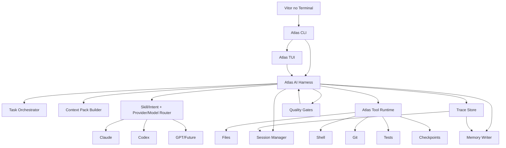

# ATLAS CLI/TUI - PLANO DE IMPLEMENTACAO ESTADO DA ARTE

**Produto principal do Atlas no Mac para substituir Claude Code, Codex CLI e o uso direto de providers no trabalho pesado**

---

| | |
|---|---|
| **Operador** | Vitor Emanuel |
| **Sistema** | Atlas |
| **Documento** | Atlas CLI/TUI - Plano de Implementacao Estado da Arte |
| **Versao** | 1.0 |
| **Data** | 30 de abril de 2026 |
| **Status** | Plano executivo e mapa de implementacao |
| **Autoridade superior** | Atlas_AI_Documentacao_Final.md, Atlas_AI_Harness_v1.md |
| **Roadmap especifico** | Atlas_CLI_Produto_Final_Roadmap_7_Pontos.md |
| **ADR de saneamento** | Atlas_AI_CLI_Nomenclatura_Comandos_TUI_ADR.md |
| **Decisao central** | Foco total no Atlas CLI/TUI; Mac App visual nao e prioridade |

---

## 0. Decisao Executiva

O Atlas no Mac deve ser, primeiro, um **CLI/TUI profissional**, nao um app visual separado.

O objetivo e substituir o uso direto de:

- Claude Code;
- Codex CLI;
- Claude app para tarefas de desenvolvimento;
- ChatGPT app para tarefas operacionais de codigo;
- qualquer provider futuro usado diretamente no terminal.

O operador deve abrir o terminal e usar **Atlas** como superficie principal:

```bash
atlas
atlas dev
atlas review
atlas test
atlas fix
atlas debug
atlas plan
atlas research
atlas runtime
```

Claude, Codex, GPT e modelos futuros serao motores internos. O Atlas permanece como identidade, memoria, contexto, permissao, runtime e processo.

---

## 1. Definicoes Simples

### 1.1 Atlas CLI

Interface por comandos no terminal.

Exemplos:

```bash
atlas ask "resume esse arquivo"
atlas dev "implemente a feature X"
atlas review
atlas runtime package.detect
```

### 1.2 Atlas TUI

Interface visual dentro do terminal. Nao e app Mac.

Deve mostrar paineis como:

- conversa;
- plano atual;
- arquivos alterados;
- diff;
- testes;
- permissoes;
- provider atual;
- sessao;
- checkpoints;
- health;
- proximas acoes.

### 1.3 Atlas AI Harness

Camada que controla modelos, ferramentas, contexto, permissoes, quality gates, memoria e traces.

### 1.4 Provider

Motor substituivel: Claude, Codex, GPT, Gemini, local ou futuro.

Regra: **provider nao manda no Atlas; provider executa dentro do Atlas**.

---

## 2. Tese Do Produto

O Atlas CLI/TUI so sera superior a Claude Code ou Codex CLI se vencer em continuidade, controle, verificacao e memoria.

Uso direto de provider tem quatro problemas:

1. contexto precisa ser reexplicado;
2. memoria nao evolui como modelo profundo de Vitor;
3. cada provider cria uma sessao isolada;
4. ferramentas e permissoes ficam presas ao produto do provider.

O Atlas resolve isso ao colocar uma camada propria acima de todos:

```text
Vitor no terminal
  -> Atlas CLI/TUI
  -> Atlas AI Harness
  -> Atlas Runtime
  -> Claude/Codex/GPT/outro motor
  -> arquivos, shell, testes, git, memoria, traces
```

---

## 3. Principios Nao-Negociaveis

1. **Atlas e a superficie. Provider e motor.**
   O operador nao deve precisar abrir Claude Code ou Codex CLI diretamente.

2. **CLI/TUI e produto principal no Mac.**
   App Mac visual fica fora do caminho critico por enquanto.

3. **Runtime proprio antes de autonomia.**
   Ler arquivo, editar, aplicar patch, rodar teste, rodar shell e fazer rollback devem pertencer ao Atlas.

4. **Permissao explicita para risco real.**
   Leitura e inspecao podem fluir. Escrita, shell mutavel e danger exigem gates.

5. **Sessao longa preserva raciocinio.**
   Atlas precisa trabalhar por horas sem perder objetivo, arquivos, decisoes, testes, erros e proximos passos.

6. **Compaction e handoff sao parte do produto.**
   Trocar Claude por Codex nao pode significar perder continuidade.

7. **Qualidade e verificavel.**
   Trabalho de codigo deve terminar com diff, testes, checks e riscos conhecidos.

8. **Resposta clara por default.**
   O operador nao quer ler codigo sem necessidade. O Atlas deve resumir o que importa e esconder detalhe bruto quando nao for util.

9. **Skills sao capacidade, nao decoracao.**
   Cada skill precisa ter missao, gatilho, entrada, saida, permissao e quality gate.

10. **Tudo importante deixa rastro.**
    Trace, provider, ferramenta, permissao, diff, teste, compaction e memoria devem ser auditaveis.

---

## 4. Produto-Alvo

### 4.1 Comandos Principais

| Comando | Objetivo |
|---|---|
| `atlas` | abrir loop interativo do Atlas CLI |
| `atlas bootstrap` | configurar, instalar e validar o Atlas CLI; unico fluxo recomendado de setup |
| `atlas tui` | abrir painel operacional no terminal |
| `atlas status` | mostrar estado do workspace, sessao, providers e runtime |
| `atlas ask` | pergunta rapida com memoria e contexto |
| `atlas dev` | executar trabalho pesado de implementacao |
| `atlas plan` | planejar sem editar |
| `atlas review` | revisar codigo, arquitetura e riscos |
| `atlas debug` | investigar erro e propor correcao |
| `atlas test` | rodar testes relevantes com interpretacao |
| `atlas fix` | corrigir falha concreta com loop de validacao |
| `atlas runtime` | usar ferramentas nativas do Atlas |
| `atlas threads` | listar/retomar sessoes |
| `atlas checkpoint` | listar/restaurar checkpoints |

### 4.2 Experiencia Esperada

Para programacao:

```bash
atlas dev "implemente o fluxo X"
```

O Atlas deve:

1. entender o objetivo;
2. montar contexto do repo;
3. selecionar modelo/skill;
4. propor ou seguir plano;
5. editar via runtime proprio;
6. mostrar diff;
7. rodar testes;
8. revisar o proprio resultado;
9. corrigir erros;
10. entregar resumo claro e riscos.

Para retomada:

```bash
atlas
/status
/threads
/thread <id>
continua exatamente de onde parou
```

Para provider handoff:

```bash
/provider codex
```

Atlas deve criar brief de continuidade antes de trocar motor.

---

## 5. Arquitetura-Alvo



---

## 6. Estado Atual Ja Implementado

### 6.1 Pronto

- Threads e sessoes do Atlas AI.
- Auto-compaction basica.
- Provider handoff.
- Streaming real de provider quando disponivel.
- Quality evaluator e quality actions iniciais.
- Runtime nativo:
  - `workspace.profile`;
  - `package.detect`;
  - `file.read`;
  - `file.write`;
  - `file.patch`;
  - `search.rg`;
  - `shell.run`;
  - `git.status`;
  - `git.diff`;
  - `git.apply_patch`;
  - `test.run`;
  - `checkpoint.restore`.
- Permission engine de runtime:
  - `read`;
  - `write`;
  - `danger`;
  - aprovacao humana;
  - bloqueio de danger por configuracao;
  - validacao de paths;
  - classificacao de comandos shell.
- Checkpoint, diff e rollback.
- Workspace profiling.
- `bin/atlas` com comandos principais.

### 6.2 Ainda Nao Final

- TUI visual real dentro do terminal.
- Dashboard operacional forte.
- Loop dev autonomo usando runtime proprio do Atlas em vez de depender so do provider.
- Registro rico de tool events no fluxo CLI.
- Listagem e gestao de checkpoints.
- Test runner inteligente por arquivo/stack.
- Provider router baseado em desempenho historico.
- Skill router mais formal para CLI.
- Memory delta pos-trabalho.
- Modo "nao mostre codigo se nao for necessario" aplicado consistentemente.

---

## 7. Ordem De Implementacao

## Fase 1 - Fundacao Do Produto CLI/TUI

**Objetivo:** fazer o terminal mostrar o estado real do Atlas e virar cockpit operacional.

Implementar:

1. `atlas status` e `atlas tui` com dashboard terminal.
2. Painel de workspace:
   - repo;
   - branch;
   - head;
   - stack;
   - package manager;
   - dirty files;
   - testes detectados.
3. Painel de Atlas AI:
   - thread ativa;
   - session ativa;
   - ultimo trace;
   - jobs pendentes;
   - quality actions abertas.
4. Painel de providers:
   - Claude/Codex status;
   - ultima latencia;
   - pain score.
5. Painel de runtime:
   - permissao default;
   - roots permitidos;
   - danger ligado/desligado;
   - comandos recomendados.

Pronto quando:

- `atlas status` responder rapido;
- `atlas tui --json` for parseavel;
- o operador souber o estado do projeto sem abrir outras ferramentas.

## Fase 2 - Sessao Longa Profissional

**Objetivo:** garantir horas de trabalho sem perda de continuidade.

Implementar:

1. estado de sessao CLI com:
   - objetivo;
   - fase atual;
   - arquivos tocados;
   - decisoes;
   - testes;
   - erros;
   - proximos passos.
2. comandos:
   - `/state`;
   - `/objective`;
   - `/phase`;
   - `/notes`;
   - `/compact`;
   - `/handoff`.
3. compaction por limiar:
   - mensagens;
   - tempo;
   - troca de provider;
   - alto volume de output.
4. resumo estruturado para retomada.

Pronto quando:

- trocar provider nao perder contexto;
- retomar thread antiga produzir resposta contextual;
- Atlas souber explicar "onde estamos".

## Fase 3 - Dev Workflow Nativo

**Objetivo:** transformar `atlas dev` em fluxo operacional proprio, nao apenas chat com provider.

Implementar:

1. planner de tarefa dev;
2. execucao por etapas;
3. tool calls pelo Atlas Runtime;
4. diff incremental;
5. checkpoint antes de escrita;
6. teste relevante;
7. auto-review;
8. resumo final Caveman/clear por default.

Pronto quando:

- Atlas editar, testar, corrigir e resumir dentro do proprio runtime;
- provider nao precisar controlar diretamente ferramentas perigosas;
- cada execucao terminar com verificacao ou motivo claro para nao verificar.

## Fase 4 - TUI Interativa Real

Decisao de stack conforme `Atlas_AI_CLI_Nomenclatura_Comandos_TUI_ADR.md`: V1/V1.5 seguem em PHP/Laravel Console para dashboard e comandos; V2+ usa Go + Bubble Tea para a TUI interativa real.

**Objetivo:** transformar o terminal em interface visual de trabalho.

Implementar paineis:

1. conversa;
2. plano;
3. arquivos/diff;
4. comandos/testes;
5. permissoes;
6. providers;
7. memoria/contexto;
8. checkpoints.

Atalhos desejados:

- `p`: plano;
- `d`: diff;
- `t`: testes;
- `r`: review;
- `a`: aprovar;
- `x`: negar;
- `c`: compactar;
- `m`: trocar modelo;
- `q`: sair.

Pronto quando:

- for possivel trabalhar no terminal sem perder visibilidade;
- aprovar e revisar diff for mais claro que no CLI puro.

## Fase 5 - Permission Engine Avancada

**Objetivo:** permissao por acao, risco e contexto.

Implementar:

1. politicas por ferramenta;
2. politicas por workspace;
3. allowlist/denylist de comandos;
4. aprovacao persistente por sessao;
5. dry-run obrigatorio para edicoes grandes;
6. limite de arquivos afetados;
7. bloqueio de segredos;
8. explainability de permissao.

Pronto quando:

- Atlas for seguro para rodar em repos reais;
- o operador entender o que esta aprovando;
- danger for excecao rara.

## Fase 6 - Quality Loop Estado Da Arte

**Objetivo:** Atlas nao termina sem verificar qualidade.

Implementar:

1. preflight;
2. diff review;
3. testes relevantes;
4. lint/format;
5. static checks;
6. regression scan;
7. remediation loop;
8. completion packet.

Pronto quando:

- falhas comuns forem corrigidas automaticamente;
- final answer sempre tiver verificacao, riscos e arquivos relevantes.

## Fase 7 - Model Router E Provider Strategy

**Objetivo:** usar Claude/Codex/GPT como motores intercambiaveis com estrategia.

Implementar:

1. tabela de desempenho por provider;
2. roteamento por tarefa;
3. fallback automatico;
4. dual-review para tarefas criticas;
5. handoff com brief estruturado;
6. custo/latencia/qualidade como sinais.

Pronto quando:

- Atlas escolher modelo melhor que escolha manual padrao;
- provider ruim naquele momento for evitado.

## Fase 8 - Memoria E Aprendizado Pos-Trabalho

**Objetivo:** cada sessao importante melhora o Atlas.

Implementar:

1. MemoryDelta pos-sessao;
2. proposta de memoria;
3. ratificacao humana;
4. aprendizagem de preferencias;
5. aprendizagem de arquitetura;
6. aprendizagem de erros recorrentes;
7. atualizacao de skill quando houver evidencia.

Pronto quando:

- Atlas lembrar decisoes reais;
- nao repetir erros ja corrigidos;
- usar historico para trabalhar melhor no proximo dia.

---

## 8. Contratos Tecnicos

### 8.1 CLI Session Packet

```json
{
  "workspace": "/path",
  "thread_id": "uuid",
  "session_id": "uuid",
  "mode": "dev",
  "provider": "codex_cli",
  "permission": "write",
  "objective": "implementar X",
  "phase": "testing",
  "files_touched": [],
  "commands_run": [],
  "tests_run": [],
  "decisions": [],
  "open_loops": [],
  "next_steps": []
}
```

### 8.2 Runtime Tool Event

```json
{
  "tool": "file.write",
  "risk": "medium",
  "permission": "write",
  "approved": true,
  "changed_files": [],
  "checkpoint": "/path",
  "diff_hash": "sha256",
  "duration_ms": 120
}
```

### 8.3 Completion Packet

```json
{
  "status": "completed",
  "summary": "O que foi feito",
  "files_changed": [],
  "tests": [],
  "quality_gates": [],
  "risks": [],
  "rollback": [],
  "memory_delta": []
}
```

---

## 9. Regras De UX Terminal

1. Resposta final deve ser curta e operacional.
2. Codigo bruto so aparece quando o operador pedir ou quando for necessario revisar.
3. Diff aparece como artefato, nao como explicacao principal.
4. Falha deve vir com causa e proximo passo.
5. Permissao deve explicar risco em uma frase.
6. Dashboard deve ser escaneavel em menos de 10 segundos.
7. Estado atual deve estar sempre disponivel.
8. Comando recomendado deve ser claro.

---

## 10. Primeiro Bloco De Implementacao A Partir Deste Documento

Implementado em 30 de abril de 2026:

1. Documento oficial do Atlas CLI/TUI.
2. `AtlasCliDashboardService`.
3. `atlas:cli:dashboard`.
4. Alias `atlas status` e `atlas tui`.
5. JSON output para automacao.
6. Testes unitarios do dashboard.
7. Smoke tests reais:
   - `./bin/atlas status`;
   - `./bin/atlas status --json`;
   - `./bin/atlas tui`.
8. `AtlasCliSessionService`.
9. `atlas:cli:state`.
10. Slash commands de sessao longa no `atlas` interativo:
    - `/state`;
    - `/objective`;
    - `/phase`;
    - `/topic`;
    - `/note`;
    - `/next`;
    - `/compact`;
    - `/handoff`.
11. `AtlasCliCheckpointService`.
12. `atlas checkpoint list/show/restore`.
13. `AtlasCliQualityService`.
14. `atlas quality`, `atlas finish`, `atlas test`.
15. Quality gate automatico para `atlas dev`.
16. `AtlasCliProviderStrategyService`.
17. `atlas bootstrap` como fluxo unico recomendado de configuracao/instalacao/validacao.
18. `atlas tui --watch=N`.

Depois disso:

1. dev workflow nativo mais profundo;
2. TUI interativa com atalhos reais;
3. permission policies avancadas por sessao;
4. memory delta pos-trabalho;
5. provider router integrado ao envio automatico, nao apenas recomendado.

---

## 11. Criterio De Estado Da Arte

Atlas CLI/TUI so pode ser chamado de estado da arte quando:

- substitui Claude Code/Codex CLI no uso diario;
- preserva continuidade entre providers;
- trabalha por horas com compaction boa;
- executa via runtime proprio;
- controla permissoes melhor que provider direto;
- mostra diff/checkpoints/testes com clareza;
- faz auto-review e auto-test;
- responde de forma clara sem despejar codigo inutil;
- aprende com sessoes importantes;
- permite trocar motor sem trocar identidade.
