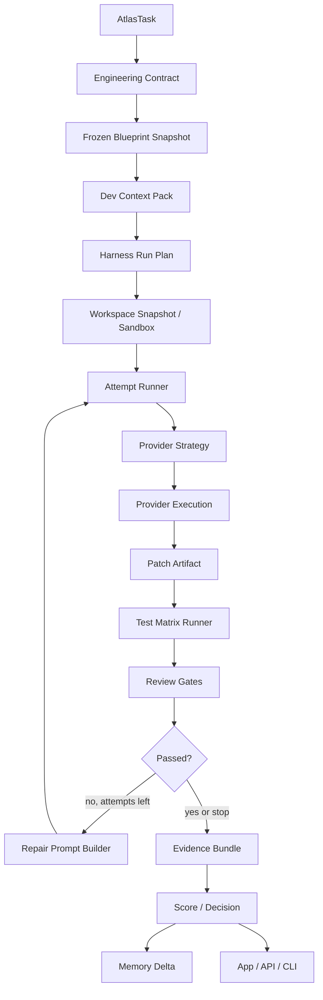

# Atlas Engineering Harness Runner - Plano Profissional

| | |
|---|---|
| Sistema | Atlas |
| Documento | Plano de implementacao do Atlas Engineering Harness Runner |
| Data | 1 de maio de 2026 |
| Status | Em implementacao - Runner MVP, Atlas-Bench, corpus manager, corpus curado, trends, quality metrics, release gates, alertas, outcome loop, calibracao de rollout, Docker hardening, matriz visual/E2E, visual smoke, baseline visual pixel-level, screenshot driver Atlas-managed, bootstrap Playwright Atlas-managed, trace Playwright por rota, governanca de baseline, quality/security scan auditavel, detalhe auditavel de runs, diff viewer, artifact viewer, politica de autonomia, versionamento historico de controles, replay controlado por run/attempt, comparacao de attempts, override de modelo end-to-end, politica automatica de modelo, changed-files scope policy, calibracao historica de harnessability, acoes auditaveis de operador, Engineering Knowledge Base e Code Intelligence Index validados |
| Relacionado | `Atlas_AI_Harness_v1.md`, `Atlas_AI_Harness_Super_Tool_Runtime_Core.md`, `Atlas_Engineering_Blueprint_7_Itens_Plano_Implementacao.md`, `Atlas_AI_Memory_Context_Core_Open_Brain.md`, Martin Fowler/Thoughtworks: Harness engineering for coding agent users |
| Decisao central | Evoluir o Atlas de control-plane de engenharia para execution harness completo |

---

## Status De Implementacao

### Implementado em 1 de maio de 2026

- Migration `2026_05_01_150000_create_atlas_engineering_runner_tables`.
- Migration `2026_05_01_151000_create_atlas_engineering_review_findings_table`.
- Migration `2026_05_01_152000_create_atlas_engineering_benchmark_tables`.
- Migration `2026_05_01_153000_add_trend_columns_to_atlas_engineering_benchmark_runs`.
- Migration `2026_05_01_154000_add_quality_metrics_to_atlas_engineering_benchmark_runs`.
- Migration `2026_05_01_155000_add_release_gates_to_atlas_engineering_benchmark_runs`.
- Migration `2026_05_01_156000_add_corpus_columns_to_atlas_engineering_benchmark_cases`.
- Migration `2026_05_01_157000_add_rollout_outcome_to_atlas_engineering_benchmark_runs`.
- Migration `2026_05_02_007000_version_atlas_engineering_controls`.
- Migration `2026_05_02_007100_backfill_atlas_engineering_control_revisions`.
- Migration `2026_05_02_007200_create_atlas_engineering_harnessability_calibrations_table`.
- Migration `2026_05_02_007300_create_atlas_engineering_run_operator_actions_table`.
- Migration `2026_05_02_009000_create_atlas_engineering_knowledge_items_table`.
- Migration `2026_05_02_010000_create_atlas_engineering_code_intelligence_tables`.
- Models:
  - `AtlasEngineeringRun`;
  - `AtlasEngineeringRunAttempt`;
  - `AtlasEngineeringRunOperatorAction`;
  - `AtlasEngineeringPatchArtifact`;
  - `AtlasEngineeringControl`;
  - `AtlasEngineeringControlRevision`;
  - `AtlasEngineeringControlResult`;
  - `AtlasEngineeringHarnessabilityCalibration`;
  - `AtlasEngineeringTestCase`;
  - `AtlasEngineeringTestRun`;
  - `AtlasEngineeringContextPack`;
  - `AtlasEngineeringReviewFinding`;
  - `AtlasEngineeringBenchmarkSuite`;
  - `AtlasEngineeringBenchmarkCase`;
  - `AtlasEngineeringBenchmarkRun`;
  - `AtlasEngineeringBenchmarkResult`;
  - `AtlasEngineeringKnowledgeItem`;
  - `AtlasEngineeringCodeModule`;
  - `AtlasEngineeringCodeSymbol`;
  - `AtlasEngineeringDocLink`.
- Relacoes novas em `AtlasTask` para runs, test cases, review findings, benchmark cases e benchmark results.
- Services:
  - `EngineeringHarnessRunnerService`;
  - `EngineeringControlRegistryService`;
  - `EngineeringContextPackService`;
  - `EngineeringPatchArtifactService`;
  - `EngineeringTestMatrixService`;
  - `EngineeringRunScoringService`;
  - `EngineeringHarnessabilityService`;
  - `EngineeringReviewFindingService`;
  - `EngineeringRunOperatorActionService`;
  - `EngineeringWorkspaceService`;
  - `EngineeringProviderRuntimeService`;
  - `EngineeringModelPolicyService`;
  - `EngineeringQualityScanService`;
  - `EngineeringBenchmarkService`;
  - `EngineeringKnowledgeBaseService`;
  - `EngineeringCodeIntelligenceService`.
- CLI `php artisan atlas:engineering:run`, incluindo `--sandbox=worktree` e `--keep-workspace`.
- CLI `php artisan atlas:engineering:run`, `atlas:engineering:replay` e `atlas:engineering:benchmark` aceitam `--model-policy=fixed|auto|balanced|best-quality|fastest|cheapest` para selecao automatica auditavel de modelo.
- CLI `php artisan atlas:engineering:benchmark` para executar suites/cases contra o Runner e persistir resultados objetivos.
- CLI `php artisan atlas:engineering:benchmark:seed` para criar a suite padrao e promover runs reais do Harness para cases reutilizaveis.
- CLI `php artisan atlas:engineering:benchmark:calibrate` para transformar outcomes reais em politica calibrada de rollout, saude do corpus e candidatos a quarentena.
- CLI `php artisan atlas:engineering:replay` e launcher `atlas engineering replay <run-id> --attempt=<n|id>` para reexecutar runs ou attempts especificos em modo replay auditavel.
- CLI `php artisan atlas:engineering:harnessability:calibrate` e launcher `atlas engineering harnessability calibrate --limit=300` para calibrar thresholds de autonomia a partir de runs historicos, controles, testes, findings e outcomes.
- CLI `php artisan atlas:engineering:knowledge` e launcher `atlas engineering knowledge status|sync|list|show|context` sincronizam docs canonicos de engenharia para Postgres e expõem refs para manutencao/context pack.
- CLI `php artisan atlas:engineering:knowledge` e launcher `atlas engineering knowledge index-code|code-status|modules|symbols|show-module` indexam e inspecionam modulos reais, simbolos, rotas, comandos, migrations, testes e links docs->codigo.
- CLI `php artisan atlas:engineering:quality-scan` e launcher `atlas engineering quality-scan --profile=auto|fast|standard|release|deep --changed-only` rodam scan auditavel de qualidade/seguranca com ferramentas gratuitas locais ou project-local, artifacts por ferramenta, findings normalizados, recomendacoes de instalacao gratuita, redaction e postura `paid_tool_required=false`.
- CLI `php artisan atlas:engineering:api-contract` e launcher `atlas engineering api-contract --spec=docs/openapi.yaml --strict` rodam detector/validador OpenAPI local, com diff contra rotas Laravel, findings por endpoint, artifacts redigidos e evidencia `atlas_api_contract`.
- API `POST /engineering/api-contract` expõe o mesmo fluxo para app/automacoes protegidas por token.
- CLI `php artisan atlas:engineering:security-scan` e launcher `atlas engineering security-scan --profile=release` rodam somente Gitleaks/Semgrep/OSV-Scanner/Trivy/Grype pelo mesmo runtime filtrado.
- CLI `php artisan atlas:engineering:sbom` e launcher `atlas engineering sbom --profile=release` rodam somente Syft, persistindo metricas e resumo de SBOM no Evidence Store.
- API `POST /engineering/security-scan` e `POST /engineering/sbom` expõem os mesmos fluxos filtrados para app/automacoes protegidas por token.
- Super Tool Runtime Core Fase 0 implementado como fundacao transversal abaixo do Harness: registry persistente `atlas_tool_definitions`, policy engine, executor seguro, normalizador, evidence store `atlas_tool_runs/artifacts/findings`, query service com filtros por workspace/tool/status/surface/contexto e export auditavel por run id (`atlas.tool_evidence.v1`), gate service para avaliar evidencias normalizadas como `passed|warning|blocked`, release gate Security/SBOM em `atlas tools release-gate` e `GET /tools/release-gate`, matriz operacional T0-T3/autoridade em `atlas tools authority` e `GET /tools/authority`, CLI `atlas tools doctor|list|authority|status|run|evidence|evidence-show|evidence-export|gate|release-gate|approve|revoke|waive-finding|revoke-finding-waiver|policies`, API `/tools/*`, aprovacoes auditaveis por workspace/global com TTL/rede/revogacao, waivers auditaveis de findings com motivo/operador/origem/TTL/historico e efeito correto nos gates, Quality Scan registrando evidencias genericas sem substituir o fluxo existente, Quality Scan acionando OSV-Scanner em `standard/release/deep` quando ha lockfile/manifesto e Trivy/Syft/Grype em `release/deep`, comandos e endpoints dedicados `api-contract`/`security-scan`/`sbom` filtrando o mesmo pipeline de evidencias, Quality Scan gerenciado vinculado ao `engineering_run` e promovido ao controle `atlas_tool_runtime_gate`, Visual Smoke gerenciado vinculado ao `engineering_run` e promovido ao controle `atlas_tool_runtime_visual_gate`, Code Intelligence index/audit aceitando contexto explicito de runtime, e sensores internos `atlas_visual_smoke`/`atlas_code_intelligence`/`atlas_api_contract` registrados e emitindo evidencias normalizadas.
- Roadmap canônico de Programming Power Tools documentado em `docs/engineering-knowledge-base/super-tool-runtime-core.md`: Serena/LSP/MCP, Tree-sitter graph, ast-grep, CodeQL, Rector, PHP Mess Detector, PHPCPD, Composer Require Checker/Unused, Knip, ts-prune, Checkov, Terrascan, kube-linter, kube-score, Dockle, ScanCode/ORT/licensee, Schemathesis/Pact/Prism/WireMock/Bruno, Infection/Stryker/property testing, axe/Pa11y/Lighthouse/bundle analysis, Deptrac/dependency-cruiser/Madge, Aider/Continue/OpenHands. Todas entram como tools opcionais governadas por registry/policy/evidence/gates, sem dependencia paga obrigatoria.
- O roadmap agora define tambem uma politica de produto final para nao virar "buffet de ferramentas": tiers de execucao `T0 interactive`, `T1 local fast`, `T2 PR/review` e `T3 nightly/release`; matriz de autoridade anti-duplicacao por categoria; e contrato de agentes externos onde o Atlas indexa, governa, valida, persiste evidencias e decide gates, enquanto Aider/Continue/OpenHands/Serena apenas fornecem capacidade dentro de sandbox/worktree.
- Implementacao dessa politica em base operacional: registry persistente agora tem campos `execution_tier`, `expected_cost`, `default_trigger`, `authority_role` e `authority_group`; CLI/API de tools aceitam `max_execution_tier`; policy engine registra e respeita budget T0-T3; `atlas tools authority`/`GET /tools/authority` publicam resumo por tier, grupos de autoridade, primarias/complementares/fallbacks/executores e recomendacoes; o painel Engineering mostra essa matriz no card Super Tool Runtime; e o catalogo inicial foi expandido com as Programming Power Tools como opcionais detectaveis, sem dependencia paga obrigatoria.
- Matriz anti-duplicacao tambem iniciou no gate: `AtlasToolFindingCorrelationService` correlaciona findings bloqueantes entre ferramentas sobrepostas por `authority_group`, localizacao/titulo ou fingerprint, e o gate conta somente o achado autoritativo enquanto preserva todas as evidencias originais para auditoria.
- Executor generico fortalecido: `atlas tools run` aceita `--tool-env=KEY=VALUE` e `--output-limit`, a API aceita `env`/`output_limit`, chaves sensiveis sao rejeitadas antes da execucao e o Evidence Store registra `env_keys`, limite e flags de truncamento de stdout/stderr.
- Policy Engine generico agora decide tambem por `sandbox_mode`, `privacy_level`, `task_type` e `requires_provider_safe`, bloqueando escrita no workspace sem `worktree`/`docker` ou approval e impedindo outputs nao seguros para provider quando o consumidor exige esse contrato.
- Approval policy tambem ganhou guardrails persistentes: aprovacoes workspace/global podem carregar `max_execution_tier`, `sandbox_mode`, `privacy_level`, `task_type` e `requires_provider_safe`, e runs posteriores herdam esses limites quando nao recebem override explicito.
- App/client alinhado ao contrato novo: `runAtlasTool(tool, input)` permite executar tools pelo mesmo schema da API e o card Super Tool Runtime mostra tier/sandbox/privacy/task/provider-safe nas evidencias.
- Client do app agora tambem opera approval policies com guardrails por `listAtlasToolPolicies`, `approveAtlasTool` e `revokeAtlasToolApproval`.
- Discovery operacional atualizado: `atlas help` e completion incluem `tools authority`, `--tool-env`, `--output-limit`, `--max-execution-tier`, `--sandbox-mode`, `--privacy-level`, `--task-type` e `--requires-provider-safe`.
- CLI/API aceitam `--sandbox=docker`, `--docker-service`, `--docker-image`, `--docker-workdir`, `--docker-cache`, `--docker-network`, `--docker-healthcheck-service` e `--docker-artifact-path` para preparar Docker Harness por run/benchmark.
- CLI/API aceitam `visual_e2e=auto|off|required` para detectar scripts Playwright/Cypress/E2E e usar evidencia automatizada quando a task exige QA visual.
- CLI/API aceitam `harness_policy=auto|off|strict`; a politica usa `harnessability_score` para ajustar sandbox, permissao, numero de attempts e auto-test antes de executar provider.
- CLI `php artisan atlas:engineering:visual-smoke` e launcher `atlas engineering visual-smoke` sobem um servidor local do repo, validam rotas localhost, salvam DOM/headers/manifesto, mantem baseline observacional e tiram screenshot + trace Playwright por rota via `--screenshot-driver=auto|workspace|atlas|off`.
- Screenshot driver Atlas-managed: o visual smoke tenta Playwright do workspace primeiro e, se configurado, usa runtime do Atlas por `ATLAS_ENGINEERING_VISUAL_PLAYWRIGHT_NODE_MODULES`/`atlas.engineering.visual_e2e.playwright_node_modules`, registrando `screenshot_driver` no manifest sem exigir Playwright instalado no repo alvo.
- CLI `php artisan atlas:engineering:visual-driver` e launcher `atlas engineering visual-driver status|doctor|install` auditam e instalam o runtime Playwright gratuito/local do Atlas em `storage/app/engineering-playwright`, incluindo pacote npm, Chromium, status JSON, hashes de paths e env recomendado quando usar runtime customizado.
- CLI `php artisan atlas:engineering:visual-smoke` aceita `--screenshot-baseline=auto|off|observe|strict`; em modo strict compara screenshots pixel a pixel contra a baseline, grava `changed_pixels`, `diff_ratio` e PNG de diff, e falha o gate quando ha mudanca visual nao promovida.
- CLI `php artisan atlas:engineering:visual-baseline` e launcher `atlas engineering visual-baseline` listam/promovem baselines DOM e screenshot com dry-run padrao, `--apply` explicito, copia da imagem baseline e historico auditavel por workspace.
- CLI `php artisan atlas:engineering:docker-cleanup` e launcher `atlas benchmark cleanup` auditam por dry-run e apagam com `--apply` caches Docker e artifacts antigos do Harness.
- CLI/API aceitam `provider_runtime=host|docker|auto`, `provider_docker_compose_file`, `provider_docker_service`, `provider_docker_app_dir` e `provider_docker_workspace_dir` para isolar a execucao do `atlas:cli:dev` em runtime Docker do proprio Atlas.
- API:
  - `POST /tasks/{task}/engineering/runs`;
  - `GET /tasks/{task}/engineering/runs`;
  - `GET /engineering/runs/{run}`;
  - `POST /engineering/runs/{run}/replay`;
  - `POST /engineering/runs/{run}/attempts/{attempt}/replay`;
  - `POST /engineering/runs/{run}/cancel`;
  - `POST /engineering/runs/{run}/operator-action`;
  - `GET /engineering/runs/{run}/patch-artifacts/{patch}/diff`;
  - `GET /engineering/runs/{run}/test-runs/{testRun}/artifacts`;
  - `GET /engineering/runs/{run}/test-runs/{testRun}/artifacts/content`;
  - `GET /engineering/runs/{run}/review-findings`;
  - `POST /engineering/runs/{run}/review-findings`;
  - `PATCH /engineering/review-findings/{finding}`;
  - `GET /engineering/controls`;
  - `GET /engineering/harnessability`;
  - `GET /engineering/harnessability/calibration`;
  - `POST /engineering/harnessability/calibrate`;
  - `GET /engineering/knowledge`;
  - `GET /engineering/knowledge/context`;
  - `POST /engineering/knowledge/sync`;
  - `POST /engineering/knowledge/code/index`;
  - `GET /engineering/knowledge/code/modules`;
  - `GET /engineering/knowledge/code/modules/{module}`;
  - `GET /engineering/knowledge/code/symbols`;
  - `GET /engineering/knowledge/items/{item}`;
  - `GET /engineering/benchmarks/suites`;
  - `POST /engineering/benchmarks/suites`;
  - `POST /engineering/benchmarks/suites/default`;
  - `GET /engineering/benchmarks/suites/{suite}`;
  - `GET /engineering/benchmarks/suites/{suite}/trends`;
  - `POST /engineering/benchmarks/suites/{suite}/corpus/refresh`;
  - `POST /engineering/benchmarks/suites/{suite}/calibrate`;
  - `POST /engineering/benchmarks/suites/{suite}/cases`;
  - `POST /engineering/benchmarks/suites/{suite}/cases/from-run`;
  - `POST /engineering/benchmarks/suites/{suite}/run`;
  - `GET /engineering/benchmarks/runs/{benchmarkRun}`;
  - `PATCH /engineering/benchmarks/runs/{benchmarkRun}/outcome`.
- `GET /tasks/{task}/engineering` agora inclui `latest_harness_run`, `harness_runs`, `benchmark_cases` e `benchmark_results`.
- App em `atlas-app/app/projects.tsx` mostra score do harness, attempts, isolamento, bloqueios, timeline recente e atalho para Benchmarks.
- App em `atlas-app/app/engineering.tsx` mostra suites do Atlas-Bench, pass rate, score medio, ultimo run, resultados por case e permite executar uma suite em modo seguro `no_provider` + `auto_test`, com seletores para provider runtime e sandbox quando o operador quiser sair do modo sensores.
- App em `atlas-app/app/engineering.tsx` tambem abre o run real associado ao case selecionado, exibindo patch excerpt, diff completo sob demanda, integridade do hash, arquivos alterados, controles com versao, testes, findings, attempts e timeline para auditoria operacional; a partir do detalhe, o operador pode disparar replay de sensores em worktree para o run inteiro ou para uma tentativa especifica.
- App em `atlas-app/app/engineering.tsx` mostra a calibracao atual de harnessability, amostra, confianca, thresholds efetivos e botao para recalibrar a policy do Runner.
- App em `atlas-app/app/engineering.tsx` mostra status da Engineering Knowledge Base, docs ativos, categorias, ultimo index e botao de sincronizacao.
- App em `atlas-app/app/engineering.tsx` mostra tambem o Code Intelligence Index, modulos, simbolos, rotas, doc links e botao para reindexar codigo.
- App em `atlas-app/app/engineering.tsx` mostra o Super Tool Runtime, registry, gate e evidencias recentes, e agora permite rodar `API Contract` para o workspace informado, persistindo evidencia `atlas_api_contract` e recarregando o painel.
- App em `atlas-app/app/engineering.tsx` permite registrar acoes auditaveis no run selecionado: aceitar, marcar como humano, rejeitar e cancelar.
- App em `atlas-app/app/engineering.tsx` mostra comparacao objetiva de attempts, melhor tentativa, score, ranking e recomendacao de base para reparo/replay.
- App em `atlas-app/app/engineering.tsx` aceita override de modelo e politica de modelo no benchmark/replay, enviando ambos para a API do Harness e mostrando a selecao aplicada no detalhe do run.
- Endpoint de diff completo valida que o artifact pertence ao run, limita o payload por `max_bytes`, retorna metadados de truncamento/hash e bloqueia path traversal ou leitura fora de `storage/app/engineering-runs/{run}`.
- Artifact viewer lista arquivos capturados por test run, expõe tipo/tamanho/hash e abre conteúdo inline para texto, JSON, XML, HTML e imagens, sempre limitado ao artifact path do run.
- Politica de autonomia `harnessability_autonomy_policy` registra `requested_*` e `effective_*`, forca worktree quando o workspace tem harnessability baixa, reduz `danger` para `write`, limita repair loop arriscado e liga `auto_test` quando ha testes detectados.
- Control registry versionado: cada controle persistido recebe uma definicao deterministica, `definition_hash`, `version`, revisao historica em `atlas_engineering_control_revisions` e cada `control_result` aponta para a versao usada no run; migration de backfill carimba controles/resultados existentes com a melhor versao conhecida.
- Replay controlado: `EngineeringHarnessRunnerService::replay` reconstroi a estrategia de um run fonte, exige workspace explicito na API, roda por padrao em `worktree`, nao reexecuta provider sem `--provider-replay`, nao aplica patch isolado sem permissao explicita e grava controle `harness_replay_contract` com `source_run_id`, escopo `run|attempt`, score/decision originais e hash da estrategia fonte; `replayAttempt` preserva attempt id/numero/status/fase/provider/modelo/patch hash para auditoria granular.
- Comparacao de attempts: `runSummary` calcula ranking derivado de status, patches, arquivos alterados, testes, controles, findings bloqueantes e risk flags, expondo `attempt_comparison.best_attempt_id`, score e recomendacao (`best_repair_base`, `review_before_replay`, `avoid_replay_base`) para orientar replay e reparo; quando nao ha override manual, o replay herda provider/modelo do attempt especifico ou do melhor attempt ranqueado.
- Override de modelo end-to-end: `AtlasCliModelCatalogService` normaliza aliases/model ids, infere provider quando possivel, bloqueia conflito provider/modelo, `atlas:cli:dev --model` encaminha o modelo para `atlas:ai:chat`, o Runner persiste `provider_strategy_json.model`, os attempts recebem `model`, replay herda modelo da origem/melhor attempt sem override e CLI/API/App podem sobrescrever de forma auditavel.
- Politica automatica de modelo: `EngineeringModelPolicyService` ranqueia modelos elegiveis do catalogo por politica (`balanced`, `best-quality`, `fastest`, `cheapest`), risco da task e historico real do Atlas-Bench (`pass_rate`, `average_score`, duracao, custo, divida de qualidade e outcomes ruins), grava `provider_strategy_json.model_policy`, expõe `run.model_selection`, registra controle `model_selection_policy` e permite benchmarkar a propria politica via `model=policy:<policy>`.
- Changed-files scope policy: o contrato preserva `allowed_files`, `allowed_paths`, `strict_file_scope`, `file_scope` e `scope_policy`; o Runner registra `changed_files_scope_policy` depois do patch, compara `changed_files` contra o escopo declarado e bloqueia `resolved` quando um allowlist estrito e violado. Quando existe apenas `likely_files`, o controle vira alerta/advisory para evitar falso bloqueio em arquivos de suporte legitimamente descobertos.
- Calibracao historica de harnessability: `EngineeringHarnessabilityService::calibrate` agrupa runs por bucket `low|medium|high`, mede taxa de resolved, divida de qualidade, outcomes ruins, persiste snapshots em `atlas_engineering_harnessability_calibrations` e alimenta a policy de autonomia do Runner com `policy_source=historical_calibration` quando ha amostra minima.
- Acoes auditaveis de operador: `EngineeringRunOperatorActionService` registra `cancel`, `accept`, `needs_human` e `reject` em tabela propria, preserva status/decision antes e depois, atualiza metadata do run, cancela attempts em execucao quando aplicavel e inclui eventos na timeline.
- Runner MVP registra:
  - blueprint snapshot;
  - context pack hash;
  - harnessability score;
  - control registry/results;
  - attempt;
  - patch artifact;
  - diff completo em `storage/app/engineering-runs/{run}/attempt-{n}.patch`;
  - test cases/runs;
  - score e decision;
  - evidencia `atlas:engineering:runner` na task.
- Repair loop do `atlas:cli:dev --complete` agora e absorvido como attempts persistidos quando o provider retorna multiplas iteracoes.
- Review findings P0/P1 bloqueiam decision `resolved`; P2 aberto degrada para `partial`.
- Riscos e testes falhos retornados pelo provider/quality gate viram review findings automaticos do run.
- Attempt final com status `failed`, `timed_out` ou `cancelled` bloqueia `resolved`, mesmo se algum sensor local estiver verde.
- Sandbox `worktree` cria execucao isolada em `storage/app/engineering-worktrees`, captura o patch e limpa o workspace isolado ao final por padrao.
- Patch gerado em `worktree` e aplicado automaticamente no workspace original apenas quando a decisao preliminar e `resolved`, o diff passa em `git apply --check` e nao ha conflito com dirty state local.
- CLI permite impedir essa aplicacao com `--no-apply-isolated-patch`; API aceita `apply_isolated_patch=false`.
- Docker Harness inicial:
  - `EngineeringWorkspaceService` detecta `compose.yaml`, `compose.yml`, `docker-compose.yaml`, `docker-compose.yml`, `Dockerfile` e `.devcontainer/devcontainer.json`;
  - `--sandbox=docker` cria worktree isolada antes de qualquer execucao e anexa perfil Docker ao workspace plan;
  - quando Docker/Compose/service estao disponiveis, testes do Runner sao executados via comando containerizado contra a worktree;
  - `EngineeringDockerHarnessService` adiciona cache controlado de dependencias por workspace, healthchecks de services Compose e export de artifacts de teste;
  - caches detectados automaticamente: npm, pnpm, yarn, Composer e pip, com mounts dedicados em `/cache/*`;
  - artifacts configurados sao copiados de volta para `storage/app/engineering-runs/{run}/test-artifacts/{testRun}` com limite de arquivos e bytes;
  - healthchecks de services dependentes geram controle `docker_service_healthchecks` e bloqueiam `resolved` quando falham;
  - politica de rede Docker aceita `profile`, `none` e `bridge`; Dockerfile aplica `--network`, Compose exige politica no profile do repo e gera controle bloqueante quando o operador pede um modo nao aplicavel por CLI;
  - cleanup de cache/artifacts tem retencao configuravel por `ATLAS_ENGINEERING_DOCKER_CACHE_RETENTION_DAYS`, `ATLAS_ENGINEERING_DOCKER_ARTIFACT_RETENTION_DAYS`, dry-run padrao e apply explicito;
  - matriz visual/E2E detecta scripts `e2e`, `test:e2e`, `playwright`, `cypress`, `visual` e similares, copia reports/screenshots/traces para `storage/app/engineering-runs/{run}/visual-artifacts/{testRun}` e satisfaz `manual_behaviour_evidence` quando o blueprint pede QA visual e o E2E passa;
  - quando o repo nao tem Playwright/Cypress configurado, a matriz pode gerar um test case `atlas:engineering:visual-smoke` gerenciado pelo Atlas, com artifact `atlas-visual-report`, snapshots de rota, baseline DOM observacional e screenshot por rota usando Playwright do workspace ou runtime configurado pelo Atlas;
  - baseline visual pixel-level: quando o screenshot driver esta disponivel, o smoke compara screenshot atual contra baseline PNG por rota, calcula diferenca de pixels, grava diff artifact e permite `--screenshot-baseline=strict` bloquear regressao visual;
  - governanca de baseline visual com `atlas engineering visual-baseline list|promote|history`, permitindo revisar o manifest/artifacts antes de atualizar hashes aceitos, destravar `--baseline=strict`/`--screenshot-baseline=strict` e auditar promocoes por rota;
  - quando Docker foi pedido mas o perfil nao existe ou o runtime esta indisponivel, o run cai para worktree e grava controle requerido `docker_harness_profile` como falha, impedindo `resolved`;
  - `runSummary` mostra `containerized_execution`, `isolation_type` e motivo de fallback.
- Provider runtime inicial:
  - Runner nao chama mais `atlas:cli:dev` por `Artisan::call`; agora monta um comando auditavel e executa por `Process`;
  - runtime padrao segue `host` para nao quebrar o fluxo atual;
  - `provider_runtime=docker` usa o Docker Compose do Atlas, por padrao `docker-compose.yml` + service `backend`, monta a worktree em `/workspace` e roda `php artisan atlas:cli:dev --workspace=/workspace`;
  - `provider_runtime=auto` tenta Docker quando o runtime do Atlas esta pronto e cai para host com controle `provider_runtime_isolation` em warning quando indisponivel;
  - `provider_runtime=docker` e requerido: se Compose/Docker/service nao estiver pronto, o attempt falha antes de chamar provider e a decisao nao pode virar `resolved`;
  - `runSummary` mostra `provider_runtime`, status, service, workspace interno e hash do Compose.
- Behaviour harness inicial: tasks com gate visual/manual exigem `manual_behaviour_evidence`; sem essa evidencia, o run fica `partial`, mesmo com testes verdes.
- Database review gate inicial: tasks com gate de banco recebem `database_review_evidence` como controle requerido de revisao.
- `GET /tasks/{task}/engineering` agora usa o mesmo resumo completo do Runner, incluindo timeline, review summary, benchmark cases e benchmark results.
- Benchmark interno executavel:
  - suites versionaveis por slug;
  - cases com task existente ou contrato sintetico;
  - expectativas por `expected_decision` e `min_score`;
  - results por case com decision, score, pass/fail, failure summary e link para o `AtlasEngineeringRun` real;
  - filtro por case/tag/limit;
  - workspace path tratado por hash por padrao, com persistencia explicita quando necessario.
- API `GET /engineering/benchmarks/suites` agora inclui `latest_run` por suite para dashboards sem N+1 no app.
- Atlas-Bench corpus manager inicial:
  - `ensureDefaultSuite` cria/atualiza a suite `atlas-core-smoke`;
  - `promoteRunToCase` transforma um `AtlasEngineeringRun` real em benchmark case idempotente;
  - `promoteRecentRuns` cura automaticamente runs recentes por `decision`, score minimo, workspace e tags;
  - metadata do case preserva run origem, score, decision, attempts, harnessability, workspace hash e flags de risco;
  - comando `atlas benchmark seed --from-recent-runs=<n>` disponivel no launcher e no `/help`;
  - tela `engineering.tsx` consegue criar a suite padrao quando ainda nao existe suite ativa.
- Atlas-Bench trends/baseline:
  - cada benchmark run grava `provider`, `model`, `mode`, `case_set_hash` e `benchmark_key`;
  - cada run compara contra o run anterior equivalente e persiste `baseline_run_id`, `pass_rate_delta`, `average_score_delta`, `duration_ms` e `trend_status`;
  - `trend_status` diferencia `first_baseline`, `stable`, `improved`, `regressed` e `empty`;
  - CLI aceita `--model=<label>` para separar baseline por modelo e `--model-policy=<policy>` para medir politicas automaticas como uma identidade comparavel;
  - API `GET /engineering/benchmarks/suites/{suite}/trends` retorna series por chave comparavel;
  - app mostra historico recente da suite, provider/modelo/modo, deltas e status de tendencia.
- Atlas-Bench quality metrics:
  - benchmark run persiste `harness_version`, `total_attempts`, failed/blocked/skipped controls, failed tests, review findings, changed files, risk flags, tokens, custo e cobertura de telemetria;
  - `quality_metrics_json` preserva detalhe de failed controls, failed tests, blocking findings, risk flags, artifact exports e trace ids cobertos por telemetria;
  - trend considera regressao de qualidade quando surgem controles/testes/findings bloqueantes mesmo que score/pass rate ainda parecam bons;
  - CLI renderiza controles falhos, testes falhos, findings bloqueantes, attempts, tokens e custo;
  - app mostra divida de qualidade por run e resumo de controles/testes/findings/attempts no card do ultimo benchmark.
- Atlas-Bench release gates:
  - benchmark run persiste `release_gate_status`, `release_gate_profile`, policy aplicada, falhas e avisos;
  - perfis oficiais `release`, `smoke`, `strict`, `advisory` e `off` regulam pass rate, score medio, cases falhos, divida de qualidade, trend regredida, attempts, tokens e custo;
  - gate `release` bloqueia o run quando cases passam mas existe divida de qualidade, como controles obrigatorios pulados, testes falhos ou findings P0/P1;
  - CLI aceita `--gate-profile=<profile>` e renderiza falhas do gate;
  - API aceita `release_gate_profile` e `release_gate_policy` para overrides controlados;
  - app mostra status do gate, perfil, falhas e avisos no card do ultimo benchmark e no historico.
- Alertas operacionais de release gate:
  - novo emissor `EngineeringReleaseGateAlertService` cria item idempotente no `ai_inbox_items` quando o gate fica `failed` ou `warning`;
  - alerta usa categoria `engineering_release_gate`, source `atlas_engineering_benchmark_run`, dedupe por run e payload com suite, status, perfil, trend, score, pass rate, divida de qualidade, falhas e avisos;
  - falha critica recebe severidade `critical`, push policy `immediate` e acoes para abrir Engineering, discutir com Atlas ou descartar.
- Corpus curado e outcome loop:
  - benchmark cases agora persistem `corpus_tier`, `domain_slug`, `risk_profile`, `curation_status`, `curation_score`, `corpus_fingerprint` e `curated_at`;
  - suite persiste `corpus_manifest` com distribuicao por tier, dominio, risco, status de curadoria e subsets oficiais `smoke`, `release` e `full_regression`;
  - CLI seed aceita `--tier`, `--domain`, `--risk`, `--curation-status` e `--refresh-manifest`;
  - benchmark run agora persiste `rollout_status`, `rollout_policy_json`, `outcome_status`, `outcome_score`, `outcome_json`, `outcome_recorded_at` e `outcome_recorded_by`;
  - endpoint de outcome fecha o ciclo pos-release, marcando runs como `healthy`, `accepted`, `degraded`, `incident` ou `rolled_back`;
  - app mostra tier/risco dos cases, rollout, outcome e score de outcome no card do ultimo run.
- Calibracao de rollout e saude do corpus:
  - `EngineeringBenchmarkService::calibrateSuite` analisa runs com outcome registrado, calcula taxa de degradacao, distribuicao por tier/dominio/risco/curadoria e janela da amostra;
  - suite persiste `rollout_calibration`, `rollout_policy` calibrada e `corpus_health` dentro de `metadata`, sem criar tabela prematura;
  - politica recomendada ajusta status depois de gate `passed`/`warning`, SLA de outcome, score minimo saudavel e modo conservador quando ha incidentes, rollbacks ou taxa ruim;
  - overrides por risco/dominio sao aplicados automaticamente em novos rollouts quando os cases do run batem com dimensoes historicamente problematicas;
  - candidatos a quarentena sao derivados de cases expostos a outcomes `degraded`, `incident` ou `rolled_back`;
  - API e app mostram a calibracao operacional, e o launcher suporta `atlas benchmark calibrate`.

### Fase 11 - Code Intelligence Index

Objetivo: fazer a IA entender o codigo real do Atlas, nao apenas docs e memoria
de conversa.

Implementado:

- scan deterministico de `app`, `routes`, `database/migrations`, `tests`,
  `docs/engineering-knowledge-base`, `config`, `lib`, `components` e `scripts`;
- agrupamento por modulos operacionais como Harness services, API, CLI, schema,
  tests, docs, Atlas AI, memoria, mobile gateway e demais camadas;
- extracao de classes, interfaces, traits, enums, metodos, comandos CLI,
  rotas Laravel, `apiResource`, migrations, exports TS/JS e headings Markdown;
- persistencia em Postgres com hash de fonte, status, timestamps, doc coverage e
  arquivamento por `--prune`;
- links docs->codigo via `atlas_engineering_doc_links`, usando paths canonicos
  da Knowledge Base e verificacao de existencia/hash do alvo;
- `EngineeringContextPackService` agora inclui `code_refs` junto de
  `knowledge_refs`, e adiciona arquivos/testes relevantes em `selected_files`;
- CLI/API/App expõem status, indexacao, catalogo de modulos e simbolos.

Comandos operacionais:

```bash
atlas engineering knowledge sync --prune
atlas engineering knowledge index-code --prune
atlas engineering knowledge code-status
atlas engineering knowledge modules --docs-status=undocumented
atlas engineering knowledge symbols --symbol-type=cli_command
```

### Validado

- Migrations do Runner aplicadas no Postgres local: `150000`, `151000`, `152000`, `153000`, `154000`, `155000`, `156000`, `157000`, `2026_05_02_007000_version_atlas_engineering_controls`, `2026_05_02_007100_backfill_atlas_engineering_control_revisions`, `2026_05_02_007200_create_atlas_engineering_harnessability_calibrations_table` e `2026_05_02_007300_create_atlas_engineering_run_operator_actions_table` status `Ran`.
- Rotas de benchmark registradas: 12 rotas em `engineering/benchmarks`.
- Comandos `atlas:engineering:run`, `atlas:engineering:replay`, `atlas:engineering:harnessability:calibrate`, `atlas:engineering:quality-scan`, `atlas:engineering:benchmark`, `atlas:engineering:benchmark:seed`, `atlas:engineering:benchmark:calibrate`, `atlas:engineering:docker-cleanup`, `atlas:engineering:visual-smoke`, `atlas:engineering:visual-driver` e `atlas:engineering:visual-baseline` registrados.
- Testes focados backend passaram: `35 passed / 207 assertions`.
- Testes focados do bloco anterior passaram: `16 passed / 122 assertions`.
- Testes focados do bloco de trends passaram: `16 passed / 130 assertions`.
- Testes focados do bloco de quality metrics passaram: `16 passed / 137 assertions`.
- Testes focados do bloco de corpus/outcome passaram: `17 passed / 164 assertions`.
- Testes focados do bloco de calibracao de rollout passaram: `17 passed / 177 assertions`.
- Testes focados do bloco Docker Harness inicial passaram: `18 passed / 189 assertions`.
- Testes focados do bloco provider runtime passaram: `21 passed / 209 assertions`.
- Testes focados do bloco Docker ops passaram: `24 passed / 223 assertions`.
- Testes focados do bloco Docker hardening, matriz visual/E2E, visual smoke gerenciado, baseline visual pixel-level, screenshot driver Atlas-managed, quality/security scan auditavel, detalhe auditavel de runs, diff viewer, artifact viewer, politica de autonomia, versionamento de controles, replay controlado por run/attempt, comparacao de attempts, override de modelo end-to-end, politica automatica de modelo, changed-files scope policy, calibracao historica de harnessability, acoes auditaveis de operador, artifacts de quality scan no viewer e defaults de quality scan em release gate passaram: `90 passed / 771 assertions`.
- `bash -n bin/atlas` e `bash -n bin/atlas-completion.bash` passaram.
- `npm run typecheck` em `atlas-app` esta bloqueado por erros preexistentes em `components/sheets/SettingsSheet.tsx` (`activeAiThreads`, `AtlasAiThread`, `listAiThreads`, `updateAiThread` ausentes), nao pelo bloco Engineering.
- `npm run test:front` passou em `atlas-app`.
- `git diff --check` passou em `atlas-server` e `atlas-app`.
- Smoke real `atlas:engineering:quality-scan --profile=fast --changed-only` no `atlas-server` executou 11 ferramentas planejadas, passou `composer_validate`, pulou ferramentas gratuitas ausentes, gerou recomendacoes de setup e falhou corretamente em `laravel_pint`, registrando artifact em `storage/app/engineering-quality-scans/...`; isto confirma o gate e expõe divida de formatacao existente no workspace.

Observacao operacional: ainda ha migrations pendentes de outros blocos fora do Harness Runner (`2026_05_01_140000_add_payload_snapshots_to_ai_performance_report_runs`, `2026_05_01_160000_allow_snoozed_recommendation_state`, `2026_05_01_161000_harden_body_composition_metrics` e `2026_05_01_170000_create_ai_attachment_index_entries_table`). Elas nao fazem parte desta entrega.

---

## 0. Decisao Executiva

O Atlas ja tem a base certa para engenharia profissional:

- AI Harness com task routing, skills, traces, providers, tool runtime e quality service.
- Atlas CLI com `atlas:cli:dev`, provider strategy, permissao, streaming, complete mode e quality gate.
- Engineering Blueprint com contrato tecnico, blueprint deterministico, gates, evidencias e snapshots congelados.
- App com painel de engenharia por task.
- Tabelas de telemetry, traces, tool events, evidence e blueprints.

O proximo salto e construir o:

**Atlas Engineering Harness Runner**

Ele deve ser a vertical de desenvolvimento de software dentro do Atlas AI Harness. Seu papel e transformar uma task tecnica em uma execucao auditavel:

```text
Task Contract
-> Frozen Blueprint
-> Workspace Snapshot
-> Context Pack
-> Execution Plan
-> Isolated Runner
-> Patch Attempt
-> Test Matrix
-> Repair Loop
-> Review Gate
-> Evidence Bundle
-> Score / Decision
-> Memory Delta
```

O objetivo nao e copiar SWE-bench, Auggie, Codex ou Claude Code. O objetivo e absorver os principios que tornam um harness profissional:

1. ambiente controlado;
2. patch isolado;
3. testes reprodutiveis;
4. loop de reparo;
5. avaliacao objetiva;
6. evidencia persistida;
7. comparabilidade entre runs, modelos e estrategias.

Adendo de 1 de maio de 2026:

O artigo "Harness engineering for coding agent users", publicado por Birgitta Bockeler no site de Martin Fowler/Thoughtworks em 2 de abril de 2026, adiciona uma linguagem precisa para este plano. O Runner deve ser entendido como um sistema de **guides + sensors + steering loop**:

```text
Guides = controles que orientam antes do agente agir
Sensors = controles que observam depois do agente agir
Steering loop = quando um erro se repete, o Harness melhora seus controles
```

Essa taxonomia deve ser incorporada ao Atlas porque evita tratar "harness" como uma lista solta de comandos. O Runner precisa ter controles catalogados, versionados, executados no momento certo e avaliados por evidencia.

---

## 1. Onde Estamos Hoje

### 1.1 Forte

| Area | Estado atual |
|---|---|
| Contrato por task | Implementado via `EngineeringTaskContractService` |
| Blueprint | Implementado via `EngineeringBlueprintService` |
| Freeze/versionamento | Implementado via `EngineeringBlueprintSnapshotService` |
| Evidencia | Implementada em `atlas_engineering_evidence` |
| Status snapshot | Implementado em `EngineeringRunArtifactService` |
| CLI dev | Integrado com `--task-id`, contrato e blueprint |
| Quality gate | Existe via `AtlasCliQualityService` |
| Tool runtime | Existe via `AiToolRuntime` e `ai_tool_events` |
| Traces | Existem em `ai_traces` |
| App | Exibe engenharia por task e registra evidencia |

### 1.2 Lacunas Para Nivel De Mercado

| Lacuna | Impacto |
|---|---|
| Runner isolado por tentativa | Implementado via `--sandbox=worktree`, Docker Harness de testes, provider runtime Docker, cache, artifact export, healthchecks, politica de rede, cleanup retentivo e matriz visual/E2E automatica |
| Patch artifact canonico | Implementado como artifact por run/attempt com hash, arquivos alterados, risk flags e diff completo em storage |
| Test matrix formal | Implementado para comandos detectados/operador/controles, quality/security scan auditavel, scripts visual/E2E existentes, visual smoke gerenciado pelo Atlas e comparison visual pixel-level via Playwright do workspace ou runtime Atlas-managed; runtime Atlas-managed tem bootstrap/status/doctor/install proprio e sem driver registra skip auditavel |
| Control registry | Implementado com guides/sensors, definicao deterministica, hash, versao historica e resultado apontando para a versao usada no run |
| Taxonomia de controles | Implementada em `direction`, `execution_type`, `regulation_category`, `timing` e `failure_policy` |
| Harnessability score | Implementado para workspace e aplicado na politica `harness_policy=auto|strict`, ajustando sandbox, permissao, attempts e auto-test; calibracao historica implementada via runs/control results/testes/findings/outcomes; falta acumular volume real para confianca alta |
| Behaviour harness | Implementado primeiro gate manual/visual, visual smoke gerenciado, screenshot por rota, trace Playwright por rota, baseline pixel-level e bootstrap/status/doctor/install do Playwright Atlas-managed |
| Quality/security scan | Implementado com perfis `auto`, `fast`, `standard`, `release` e `deep`, deteccao de Composer/Pint/PHPStan/Psalm/TypeScript/Biome/ESLint/Gitleaks/Semgrep/ShellCheck/Hadolint, skip auditavel para ferramentas ausentes, redaction e artifacts locais |
| Engineering Knowledge Base | Implementado com docs canonicos versionados em `atlas-server/docs/engineering-knowledge-base`, tabela `atlas_engineering_knowledge_items`, CLI/API de sync/catalogo, painel no app Engineering e `knowledge_refs` no context pack |
| Repair loop estruturado | Implementado em base profissional: iteracoes do `atlas:cli:dev --complete` viram attempts persistidos, runs/attempts especificos podem ser reexecutados por replay controlado em worktree, `attempt_comparison` ranqueia a melhor base de reparo, replay sem override herda provider/modelo da origem ou melhor attempt, `atlas:cli:dev --model` permite override explicito e `--model-policy` escolhe modelo por qualidade/latencia/custo/outcome; falta calibrar pesos com maior volume real |
| Scoring objetivo | Implementado com decision `resolved`, `partial`, `unresolved`, `blocked`, `unsafe` e calibracao por outcome; falta aumentar volume historico para confianca alta |
| Context pack canonico de dev | Implementado com hash e secoes autoritativas; falta retrieval semantico/Open Brain |
| Review findings dedicados | Implementado: tabela, API, resumo e bloqueio de score por P0/P1 |
| Benchmark interno | Infra executavel implementada com suites/cases/runs/results, corpus manager, corpus curado, trends por provider/modelo, quality metrics, release gates, alertas, rollout, outcome e politica calibrada; falta popular corpus real amplo |
| UI de runs | App mostra resumo, timeline recente, detalhe auditavel por run, patch excerpt, diff completo sob demanda, artifacts de teste/visual, controles, testes, findings, attempts, replay de sensores por run/attempt e acoes auditaveis de operador; falta viewer especializado para traces Playwright quando necessario |

---

## 2. Definicao Do Runner

**Atlas Engineering Harness Runner** e o executor profissional de tarefas de software do Atlas.

Ele recebe uma `AtlasTask` com contrato e blueprint, prepara ambiente, executa provider/agente, coleta patch, roda validacoes, tenta reparar falhas dentro de limites, registra tudo e retorna uma decisao auditavel.

### 2.1 O Que Ele Nao E

| Nao e | Motivo |
|---|---|
| Apenas `atlas dev` renomeado | `atlas dev` e interface; Runner e runtime persistido e auditavel |
| Apenas chamar Codex/Claude | Provider e motor; Runner e avaliador, orquestrador e registrador |
| CI generico | CI valida branch; Runner valida intencao, contrato, patch, evidencia e score |
| Agente autonomo solto | Runner opera com escopo, limites, permissao, rollback e evidencia |
| Benchmark externo puro | SWE-bench inspira, mas Atlas precisa rodar em repos reais do operador |

---

## 3. Modelo Profissional De Referencia

Um harness de elite para software engineering precisa cobrir:

| Capacidade | Padrao de mercado | Versao Atlas desejada |
|---|---|---|
| Ambiente | Docker/checkout limpo/sandbox | Workspace snapshot + opcional worktree/container |
| Entrada | Issue/task normalizada | `AtlasTask` + contract + blueprint snapshot |
| Contexto | Retrieval + repo map + arquivos relevantes | Atlas Context Pack de dev |
| Execucao | Modelo/agente aplica patch | Provider strategy + `atlas:ai:chat` + tool runtime |
| Validacao | Testes oficiais e hidden tests quando houver | Test matrix declarada + comandos detectados + gates |
| Reparo | Iteracoes limitadas | Attempts persistidos com failure summary |
| Decisao | resolved/unresolved | decision score com evidencia e riscos |
| Auditoria | logs, patch, exit code, timing | traces + tool events + evidence bundle |
| Comparacao | leaderboard/evals | Atlas-bench interno por repo/task |

---

## 4. Harness Engineering Controls

O Runner deve regular a qualidade da mudanca com dois eixos:

1. Direcao: `feedforward` ou `feedback`.
2. Execucao: `computational` ou `inferential`.

### 4.1 Guides E Sensors

| Tipo | Quando atua | Papel no Atlas |
|---|---|---|
| Guide / feedforward | Antes do agente agir | aumenta a chance do primeiro patch vir correto |
| Sensor / feedback | Depois do agente agir | detecta problema e alimenta reparo ou revisao |

Exemplos no Atlas:

| Controle | Direcao | Execucao | Exemplo |
|---|---|---|---|
| Task Contract | feedforward | inferential/structured | escopo, objetivo, fora de escopo |
| Blueprint Snapshot | feedforward | structured | fases, gates, cenarios, criterios |
| Context Pack | feedforward | mixed | memoria, decisoes, arquivos, comandos |
| Architecture Rules | feedforward | mixed | boundaries, padroes, constraints |
| Test Matrix | feedback | computational | phpunit, typecheck, lint, e2e |
| Migration Pretend | feedback | computational | validar SQL gerado antes de aplicar |
| Static Analysis | feedback | computational | lint, typecheck, semgrep, dep scan |
| Browser/Runtime Logs | feedback | computational | console, network, crash, SLO |
| Code Review Agent | feedback | inferential | bug, overengineering, test gap |
| Architecture Review | feedback | inferential | fit arquitetural e tradeoffs |
| Human Review | feedback | human | decisao final quando julgamento humano e necessario |

Regra:

> Controles computacionais baratos devem rodar cedo e frequentemente. Controles inferenciais devem rodar quando risco, ambiguidade ou impacto justificarem custo e nao-determinismo.

### 4.2 Categorias De Regulacao

O Runner deve classificar cada controle por categoria de qualidade regulada.

| Categoria | O que regula | Exemplos |
|---|---|---|
| Maintainability | qualidade interna do codigo | complexidade, duplicacao, lint, coverage, dead code |
| Architecture fitness | aderencia arquitetural | boundaries, dependencias, observabilidade, performance |
| Behaviour | comportamento funcional | fixtures aprovadas, E2E, QA manual, screenshots, API contracts |
| Security/privacy | risco operacional | secrets, permissoes, dados sensiveis, auth |
| Delivery safety | seguranca de entrega | migrations, rollback, dirty state, CI readiness |

Behaviour harness e a parte mais dificil. O Atlas nao deve confiar apenas em testes gerados pela propria IA. Quando a task altera comportamento visivel ou regra de negocio, o Runner deve exigir pelo menos um destes sinais:

- fixture aprovada;
- teste existente alterado com justificativa;
- E2E/smoke test;
- evidencia manual estruturada;
- screenshot ou log runtime quando UI estiver envolvida;
- aceite humano quando a validacao objetiva ainda nao existir.

### 4.3 Control Registry

O Runner deve ter um registro de controles. Um controle e qualquer guia ou sensor que regula a execucao.

Contrato recomendado:

```json
{
  "name": "npm_run_typecheck",
  "direction": "feedback",
  "execution_type": "computational",
  "regulation_category": "maintainability",
  "timing": "pre_commit",
  "required": true,
  "risk_level": "medium",
  "command": "npm run typecheck",
  "applies_when": {
    "workspace_kind": "expo_app",
    "changed_files": ["*.ts", "*.tsx"]
  },
  "failure_policy": "blocks_resolved"
}
```

Campos obrigatorios:

- `name`;
- `direction`;
- `execution_type`;
- `regulation_category`;
- `timing`;
- `required`;
- `applies_when`;
- `failure_policy`.

### 4.4 Harnessability Score

Nem todo repo e igualmente facil de controlar por agente. O Runner deve medir a "harnessability" do workspace antes de aumentar autonomia.

Sinais positivos:

- scripts claros de teste/lint/typecheck;
- linguagem fortemente tipada ou typecheck confiavel;
- boundaries arquiteturais detectaveis;
- suite rapida de smoke tests;
- fixtures ou contratos aprovados;
- docs de arquitetura;
- padroes de logging/observabilidade;
- baixo dirty state;
- estrutura de projeto previsivel.

Score recomendado:

| Item | Peso |
|---|---:|
| Testes rapidos confiaveis | 20 |
| Typecheck/lint | 15 |
| Arquitetura documentada | 15 |
| Boundaries verificaveis | 15 |
| Fixtures/e2e/behaviour checks | 15 |
| Scripts padronizados | 10 |
| Baixo ruido/dirty state | 10 |

Uso:

- score alto permite mais autonomia e repair loop maior;
- score medio exige mais review;
- score baixo exige plano incremental para melhorar o repo antes de confiar no agente.

### 4.5 Harness Templates

O Atlas deve criar templates de harness por topologia:

| Template | Guides | Sensors |
|---|---|---|
| Laravel API Harness | arquitetura API, migrations, policies, tests | phpunit, pint, migration pretend, route list |
| Expo App Harness | UI patterns, navigation, state, push/web caveats | typecheck, test front, screenshot, console logs |
| Atlas Fullstack Feature Harness | contract, blueprint, backend/app split | backend tests, app tests, API smoke, QA evidence |
| CLI Command Harness | command contract, output schema, safety | artisan test, command json, tool events |
| Database Migration Harness | schema intent, rollback, data safety | migrate pretend, model tests, query review |

Templates reduzem variedade. Quanto menos livre for a topologia, mais completo pode ser o harness.

---

## 5. Arquitetura-Alvo



### 5.1 Camadas

| Camada | Responsabilidade | Reusar |
|---|---|---|
| Contract Layer | Escopo e criterios da task | `EngineeringTaskContractService` |
| Blueprint Layer | Plano, gates e cenarios | `EngineeringBlueprintService` |
| Snapshot Layer | Congelar conteudo avaliado | `EngineeringBlueprintSnapshotService` |
| Context Layer | Montar contexto autoritativo | novo `EngineeringContextPackService` |
| Control Layer | Registrar guides/sensors e decidir quando aplicar | novo `EngineeringControlRegistryService` |
| Workspace Layer | Preparar sandbox/worktree | novo `EngineeringWorkspaceService` |
| Runner Layer | Executar attempts | novo `EngineeringHarnessRunnerService` |
| Patch Layer | Capturar diff/arquivos/hash | novo `EngineeringPatchArtifactService` |
| Test Layer | Rodar matriz de validacao | novo `EngineeringTestMatrixService` |
| Review Layer | Achados e gates | expandir `EngineeringRunArtifactService` |
| Score Layer | Decisao objetiva | novo `EngineeringRunScoringService` |
| UI/API Layer | Timeline e controle | expandir `AtlasTaskController` e app |

---

## 6. Entidades E Tabelas Necessarias

### 6.1 `atlas_engineering_runs`

Unidade principal de execucao.

Campos:

- `id` uuid primary
- `task_id`
- `project_id`
- `blueprint_id`
- `blueprint_version`
- `trace_id` nullable
- `workspace_path_hash`
- `workspace_label`
- `provider_strategy_json`
- `context_pack_hash`
- `status`: `queued | preparing | running | testing | repairing | reviewing | passed | failed | blocked | cancelled`
- `decision`: `resolved | partial | unresolved | blocked | unsafe | needs_human`
- `score` decimal nullable
- `max_attempts`
- `attempt_count`
- `started_at`
- `finished_at`
- `metadata`
- timestamps

### 6.2 `atlas_engineering_run_attempts`

Uma tentativa de resolver a task.

Campos:

- `id`
- `engineering_run_id`
- `attempt_number`
- `trace_id`
- `provider`
- `model`
- `phase`: `edit | repair | review`
- `prompt_hash`
- `input_summary_json`
- `patch_hash`
- `diff_stat_json`
- `changed_files_json`
- `status`: `completed | failed | timed_out | cancelled`
- `failure_summary`
- `started_at`
- `finished_at`
- `metadata`

### 6.3 `atlas_engineering_patch_artifacts`

Artefato canonico do diff.

Campos:

- `id`
- `engineering_run_id`
- `attempt_id`
- `base_ref`
- `head_ref`
- `diff_hash`
- `diff_excerpt`
- `diff_path` nullable
- `changed_files_json`
- `created_files_json`
- `deleted_files_json`
- `risk_flags_json`
- `metadata`

Regra: o diff completo pode ir para storage quando grande; banco guarda hash, resumo e caminho.

### 6.4 `atlas_engineering_controls`

Registro de guides e sensors.

Campos:

- `id`
- `slug`
- `name`
- `direction`: `feedforward | feedback`
- `execution_type`: `computational | inferential | human | mixed`
- `regulation_category`: `maintainability | architecture_fitness | behaviour | security_privacy | delivery_safety`
- `timing`: `prepare | pre_attempt | post_attempt | pre_commit | post_integration | continuous`
- `required`
- `risk_level`: `low | medium | high | critical`
- `applies_when_json`
- `failure_policy`: `advisory | blocks_resolved | blocks_run | requires_human`
- `command`
- `skill_slug`
- `metadata`

### 6.5 `atlas_engineering_control_results`

Resultado de cada controle aplicado.

Campos:

- `id`
- `engineering_run_id`
- `attempt_id`
- `control_id`
- `status`: `passed | failed | blocked | skipped | warning`
- `signal_summary`
- `output_excerpt`
- `duration_ms`
- `artifact_path`
- `metadata`

### 6.6 `atlas_engineering_test_cases`

Matriz declarada de teste.

Campos:

- `id`
- `task_id`
- `blueprint_id`
- `case_code`
- `source`: `blueprint | detected | operator | regression | ci`
- `type`: `unit | feature | integration | e2e | lint | typecheck | migration | manual`
- `priority`: `p0 | p1 | p2 | p3`
- `command`
- `expected_signal`
- `timeout_seconds`
- `required`
- `metadata`

### 6.7 `atlas_engineering_test_runs`

Execucao de cada caso.

Campos:

- `id`
- `engineering_run_id`
- `attempt_id`
- `test_case_id`
- `command`
- `exit_code`
- `status`: `passed | failed | blocked | skipped | timed_out`
- `duration_ms`
- `stdout_excerpt`
- `stderr_excerpt`
- `artifact_path`
- `metadata`

### 6.8 `atlas_engineering_review_findings`

Achados estruturados.

Campos:

- `id`
- `engineering_run_id`
- `attempt_id`
- `task_id`
- `file_path`
- `line_start`
- `line_end`
- `severity`: `p0 | p1 | p2 | p3`
- `confidence`
- `category`: `bug | security | regression | test_gap | design | maintainability | product_gap`
- `finding`
- `evidence`
- `recommendation`
- `status`: `open | fixed | accepted | false_positive | deferred`

### 6.9 `atlas_engineering_context_packs`

Contexto usado no run.

Campos:

- `id`
- `engineering_run_id`
- `task_id`
- `hash`
- `contract_json`
- `blueprint_json`
- `repo_profile_json`
- `selected_files_json`
- `prior_runs_json`
- `memory_refs_json`
- `prompt_sections_json`
- `token_budget_json`
- `metadata`

---

## 7. Contratos JSON

### 7.1 Harness Run Plan

```json
{
  "schema_version": 1,
  "run_id": "uuid",
  "task_id": "uuid",
  "workspace": "/repo",
  "mode": "single_shot|complete|review_only|benchmark",
  "max_attempts": 3,
  "provider_strategy": {
    "primary": "codex_cli",
    "fallback": ["claude_cli"],
    "critical": false
  },
  "sandbox": {
    "type": "workspace|git_worktree|docker",
    "base_ref": "HEAD",
    "write_policy": "scoped|operator|danger"
  },
  "test_matrix": [],
  "control_registry": [],
  "required_gates": [
    "contract_acceptance",
    "patch_artifact",
    "tests",
    "review",
    "evidence"
  ],
  "stop_conditions": {
    "max_attempts": 3,
    "max_duration_seconds": 3600,
    "unsafe_diff": true
  }
}
```

### 7.2 Control Result

```json
{
  "schema_version": 1,
  "control": "phpunit_backend",
  "direction": "feedback",
  "execution_type": "computational",
  "regulation_category": "maintainability",
  "status": "passed",
  "blocks_resolved": true,
  "signal_summary": "Feature test suite passed.",
  "artifact_path": null
}
```

### 7.3 Evidence Bundle

```json
{
  "schema_version": 1,
  "run_id": "uuid",
  "decision": "resolved|partial|unresolved|blocked|unsafe|needs_human",
  "score": 0.87,
  "summary": "",
  "contract_coverage": [],
  "patch": {
    "diff_hash": "",
    "changed_files": []
  },
  "controls": [],
  "tests": [],
  "review_findings": [],
  "residual_risks": [],
  "operator_next_actions": []
}
```

---

## 8. Workflow Do Runner

### 8.1 Fase 1 - Prepare

Entrada:

- `task_id`
- `workspace`
- `mode`
- provider opcional
- permissao

Passos:

1. carregar `AtlasTask`;
2. gerar/validar `EngineeringTaskContract`;
3. gerar/validar `EngineeringBlueprint`;
4. congelar snapshot se ainda nao congelado;
5. montar `ContextPack`;
6. criar `atlas_engineering_runs`;
7. resolver provider strategy;
8. calcular harnessability score;
9. resolver control registry aplicavel;
10. gerar test matrix inicial.

Criterio de pronto:

- run criado;
- blueprint congelado;
- context pack com hash;
- controles aplicaveis selecionados;
- test matrix com pelo menos um gate aplicavel.

### 8.2 Fase 2 - Sandbox

Modos:

1. `workspace`: usa workspace atual, mais simples.
2. `git_worktree`: cria worktree temporaria por run.
3. `docker`: cria worktree isolada, detecta perfil Docker e containeriza testes quando runtime esta disponivel.

V1 recomendada:

- comecar com `workspace`;
- usar `git_worktree` como modo profissional padrao;
- usar Docker quando o repo tem Compose/Dockerfile/devcontainer e o objetivo exige reprodutibilidade forte.

Criterio de pronto:

- base ref capturado;
- estado inicial registrado;
- dirty state detectado antes de escrever;
- runner nao mistura diff anterior com diff do attempt.

### 8.3 Fase 3 - Attempt

Passos:

1. renderizar prompt com contrato, blueprint e contexto;
2. aplicar guides pre-attempt;
3. executar provider;
4. capturar trace;
5. capturar diff;
6. criar patch artifact;
7. registrar attempt.

Criterio de pronto:

- attempt tem trace;
- diff hash existe quando ha mudanca;
- changed files registrados;
- erro ou timeout vira status estruturado.

### 8.4 Fase 4 - Test Matrix E Sensors

Fontes de testes:

- `contract.test_coverage`;
- comandos detectados pelo `WorkspaceProfiler`;
- package scripts;
- artisan/phpunit/pint para Laravel;
- npm typecheck/test/lint para app;
- migrations pretend quando tocar banco;
- Playwright/manual QA quando tocar UI.

Regra:

- teste requerido falhando impede `resolved`;
- teste nao executado em area tocada gera `partial` ou `needs_human`;
- sem teste aplicavel exige evidencia manual ou review de maior confianca.
- sensor computacional requerido falhando bloqueia `resolved`;
- sensor inferencial com P0/P1 aberto bloqueia `resolved`;
- sensor que nunca dispara deve ser revisado no steering loop.

### 8.5 Fase 5 - Repair Loop

Quando reparar:

- teste requerido falha;
- gate de contrato falha;
- controle requerido falha;
- review encontra P0/P1;
- diff foge do escopo;
- app/build quebra.

Limites:

- max attempts padrao: 3;
- max attempts hard: 10;
- max duration por run;
- parar imediatamente em unsafe diff.

Prompt de reparo deve conter:

- objetivo original;
- diff atual;
- falha exata;
- testes que falharam;
- gates pendentes;
- instrucao para menor patch corretivo.

### 8.6 Fase 6 - Review

Gates minimos:

- contrato atendido;
- tests/lint/typecheck adequados;
- diff dentro do escopo;
- migrations seguras se houver DB;
- sem segredo/credencial no diff;
- sem arquivos gigantes ou gerados sem justificativa;
- app UI sem overlap quando UI for tocada;
- residual risks declarados.
- resultado dos controls coerente com a decision.

Review pode ser:

- deterministic review local;
- provider reviewer;
- dual-provider critical review;
- operator review.

### 8.7 Fase 7 - Score

Score recomendado:

| Componente | Peso |
|---|---:|
| Criterios de aceite atendidos | 30 |
| Test matrix requerida passou | 30 |
| Review sem P0/P1 aberto | 20 |
| Controles obrigatorios passaram | 10 |
| Escopo/diff controlado | 5 |
| Evidencia suficiente | 5 |

Decisao:

- `resolved`: score >= 85, nenhum gate requerido falhando.
- `partial`: score 60-84 ou evidencia incompleta.
- `unresolved`: score < 60 ou teste requerido falhando.
- `blocked`: dependencia externa ou falta de permissao.
- `unsafe`: risco de segredo, destructive diff ou escopo perigoso.
- `needs_human`: ambiguidade decisoria relevante.

---

## 9. Steering Loop

O Runner deve melhorar o Harness quando encontrar padroes repetidos de erro.

Exemplos:

| Erro recorrente | Mudanca correta no Harness |
|---|---|
| Agente esquece typecheck | tornar typecheck sensor requerido para TS/TSX |
| Agente quebra rota Laravel | adicionar route smoke ou feature test |
| Agente cria UI com overlap | adicionar screenshot/visual QA para mudancas em tela |
| Agente muda arquivo fora do escopo | `changed_files_scope_policy` com allowlist estrito bloqueante e `likely_files` advisory |
| Agente repete arquitetura ruim | criar architecture guide + architecture fitness sensor |
| Tests verdes mas comportamento errado | criar behaviour fixture aprovada |

Regra:

> Quando o mesmo tipo de erro aparecer duas vezes, abrir proposta de melhoria do Harness em vez de apenas corrigir o codigo.

O steering loop deve gerar:

- proposta de novo controle;
- alteracao de controle existente;
- novo template de harness;
- melhoria de skill;
- novo teste/fixture;
- memory delta com decisao ou padrao.

---

## 10. APIs Necessarias

### 10.1 Backend

Adicionar em `routes/api.php`:

```text
POST /tasks/{task}/engineering/runs
GET  /tasks/{task}/engineering/runs
GET  /engineering/runs/{run}
POST /engineering/runs/{run}/replay
POST /engineering/runs/{run}/attempts/{attempt}/replay
POST /engineering/runs/{run}/cancel
POST /engineering/runs/{run}/operator-action
POST /engineering/runs/{run}/evidence
POST /engineering/runs/{run}/review-findings
GET  /engineering/controls
POST /engineering/controls
GET  /engineering/harnessability?workspace=...
GET  /engineering/harnessability/calibration
POST /engineering/harnessability/calibrate
```

### 10.2 Payload Para Criar Run

```json
{
  "workspace": "/Users/vitorepf/Develop/atlas",
  "mode": "complete",
  "provider": "codex_cli",
  "permission": "write",
  "max_attempts": 3,
  "auto_test": true,
  "sandbox_type": "git_worktree",
  "control_profile": "atlas_fullstack_feature"
}
```

### 10.3 Resposta De Run

Deve retornar:

- run summary;
- current status;
- attempts;
- patch artifacts;
- tests;
- controls;
- harnessability_score;
- review findings;
- evidence bundle;
- score;
- next recommended action.

---

## 11. CLI Necessario

### 11.1 Comando Novo

```bash
php artisan atlas:engineering:run --task-id=UUID --workspace=/path --complete --auto-test
```

Opcoes:

```text
--provider=
--permission=auto|read|write|danger
--sandbox=workspace|worktree|docker
--docker-service=
--docker-image=
--docker-workdir=/workspace
--docker-cache=auto|off
--docker-healthcheck-service=
--docker-healthcheck-timeout=45
--docker-artifact-path=
--docker-artifact-max-files=100
--docker-artifact-max-bytes=10485760
--provider-runtime=host|docker|auto
--provider-docker-compose-file=
--provider-docker-service=
--provider-docker-app-dir=/app
--provider-docker-workspace-dir=/workspace
--max-attempts=3
--test-command=
--review
--critical
--json
--dry-run
--resume=RUN_ID
--control-profile=
--harnessability
```

Comandos auxiliares:

```bash
php artisan atlas:engineering:controls --workspace=/path
php artisan atlas:engineering:harnessability --workspace=/path
php artisan atlas:engineering:harnessability:calibrate --limit=300
php artisan atlas:engineering:quality-scan --workspace=/path --profile=standard --changed-only
```

### 11.2 Relacao Com `atlas:cli:dev`

V1:

- `atlas:engineering:run` pode usar `AtlasCliDevWorkflowService` por baixo.
- `atlas:cli:dev --task-id` continua existindo como comando rapido.

V2:

- `atlas:cli:dev --task-id --complete` deve delegar para o Runner quando `engineering_runner.enabled=true`.

---

## 12. App Necessario

Na tela de task/projeto, adicionar:

1. botao `Rodar Harness`;
2. timeline de runs;
3. lista de attempts;
4. diff summary;
5. controles aplicados;
6. test matrix;
7. harnessability score;
8. review findings;
9. score/decision;
10. evidencias anexadas;
11. acao `Marcar como pronto` somente quando gates permitirem;
12. acao `Registrar decisao humana` quando `needs_human`.

Regra de produto:

- o app deve mostrar estado real, nao texto motivacional;
- cada gate deve explicar por que passou/falhou;
- a tela deve permitir auditar uma task antiga em menos de 30 segundos.

---

## 13. Provider Strategy

### 13.1 Modos

| Modo | Uso |
|---|---|
| `fast_patch` | mudanca pequena, baixo risco |
| `deep_engineering` | feature/refactor com multiplos arquivos |
| `critical_review` | seguranca, banco, billing, auth, dados |
| `repair_only` | corrigir falha especifica |
| `benchmark` | comparar modelos/estrategias |

### 13.2 Politica

- provider primario escolhido por saude, custo, tipo de task e historico;
- fallback se provider falhar;
- critical mode pode exigir review por outro provider;
- resultado alimenta metricas por provider/modelo.

---

## 14. Context Pack De Dev

O Runner precisa de contexto compacto, nao dump do repo.

Conteudo minimo:

- task contract;
- frozen blueprint;
- acceptance criteria;
- likely files;
- repo profile;
- commands detectados;
- arquivos modificados atuais;
- decisoes anteriores do projeto;
- evidencias anteriores;
- failures de attempt anterior;
- restricoes de permissao;
- token budget.
- guides aplicaveis.
- sensors requeridos.

Implementar:

```text
EngineeringContextPackService
EngineeringContextPackRenderer
EngineeringContextPackStore
```

Regra:

- todo prompt de attempt deve ter `context_pack_hash`;
- mudancas no contexto precisam ser rastreaveis;
- context pack deve ser exibivel no app em resumo.

---

## 15. Sandbox E Reprodutibilidade

### 15.1 V1 - Workspace Guarded

- roda no workspace atual;
- captura estado inicial;
- recusa declarar `resolved` se havia dirty state nao relacionado;
- separa changed files iniciais de changed files do attempt.

### 15.2 V2 - Git Worktree

- cria worktree temporaria por run;
- aplica patch no final ou gera patch para revisao;
- reduz risco de misturar alteracoes.

### 15.3 V3 - Docker

- define imagem/servicos por repo;
- roda migrations/testes em ambiente limpo;
- aproxima o Atlas de harnesses benchmark-style.

---

## 16. Atlas-Bench Interno

O Atlas-Bench interno e a camada que impede o Runner de evoluir "no feeling". Cada mudanca no harness deve poder ser medida contra uma suite de tasks reais ou sinteticas, com expectativa objetiva e link para o `AtlasEngineeringRun` produzido.

Schema implementado:

- `atlas_engineering_benchmark_suites`: agrupa cases por slug, nome, status e opcoes default de runner;
- `atlas_engineering_benchmark_cases`: define task existente ou contrato sintetico, expectativa, score minimo, tags, tier de corpus, dominio, risco, status de curadoria, fingerprint e hash do workspace;
- `atlas_engineering_benchmark_runs`: execucao de uma suite, com total, passed, failed, pass rate, average score, trend, quality metrics, release gate, rollout e outcome;
- `atlas_engineering_benchmark_results`: resultado por case, com decision, score, pass/fail, failure summary e `engineering_run_id`.

Interface operacional:

- `php artisan atlas:engineering:benchmark --suite=<slug> --workspace=<path> --tier=release --sandbox=docker --docker-service=app --auto-test --test-command='<cmd>' --gate-profile=release`;
- `php artisan atlas:engineering:benchmark:calibrate --suite=<slug> --limit=200`;
- `GET /engineering/benchmarks/suites`;
- `POST /engineering/benchmarks/suites/default`;
- `POST /engineering/benchmarks/suites`;
- `GET /engineering/benchmarks/suites/{suite}/trends`;
- `POST /engineering/benchmarks/suites/{suite}/corpus/refresh`;
- `POST /engineering/benchmarks/suites/{suite}/calibrate`;
- `POST /engineering/benchmarks/suites/{suite}/cases`;
- `POST /engineering/benchmarks/suites/{suite}/cases/from-run`;
- `POST /engineering/benchmarks/suites/{suite}/run`;
- `GET /engineering/benchmarks/runs/{benchmarkRun}`;
- `PATCH /engineering/benchmarks/runs/{benchmarkRun}/outcome`.

Tipos de task:

- bug pequeno;
- feature app;
- migration/backend;
- refactor com teste;
- UI fix;
- failing test repair;
- docs-only;
- multi-file feature.

Metricas:

- resolved rate;
- attempts por sucesso;
- tempo ate primeiro patch;
- tempo ate passed;
- custo estimado;
- tokens;
- regressao;
- review findings por run;
- taxa de rollback humano.
- harnessability score antes/depois.
- controles que mais falharam.
- controles que nunca disparam.
- release gate status/falhas/avisos.
- corpus tier/domain/risk/curation.
- rollout status e outcome pos-release.
- rollout calibration, bad outcome rate, risk overrides e candidatos a quarentena.

O que ainda falta para virar benchmark de nivel mercado:

- popular a suite `atlas-core-smoke` com volume maior de tasks reais do Atlas, cobrindo backend, app, migrations, UI, docs e refactors;
- calibrar tags automaticas de risco/dominio com historico real e revisar os subsets oficiais de smoke, release e full regression;
- popular baselines reais por Codex, Claude, GPT e futuros motores usando a mesma suite e o mesmo `case_set_hash`;
- alimentar outcomes reais por semanas para aumentar a confianca estatistica da politica calibrada.

Primeiro dashboard implementado no app:

- lista suites ativas;
- mostra status agregado de pass rate e score medio a partir do ultimo run de cada suite;
- abre detalhe da suite selecionada;
- mostra ultimo benchmark run e results por case;
- executa suite selecionada usando workspace/test command informados pelo operador;
- cria a suite padrao `atlas-core-smoke` quando nao ha suite ativa;
- mostra historico recente com provider/modelo/modo, deltas de pass rate/score e tendencia contra baseline.
- mostra divida de qualidade por run com controles/testes/findings/attempts.
- mostra release gate, perfil, falhas e avisos por run.
- mostra tier/risco dos cases, rollout status, outcome e score de outcome por run.
- calibra a politica da suite e mostra status, confianca, taxa ruim, overrides e candidatos a quarentena.
- abre o run real de cada resultado do benchmark com patch excerpt, diff completo sob demanda, artifacts de teste/visual, controles, testes, findings, attempts e timeline.

---

## 17. Plano Faseado

## Fase 1 - Runner MVP Profissional

Objetivo: persistir runs/attempts/patch/test matrix e produzir score.

Implementar:

- migrations/modelos:
  - `atlas_engineering_runs`;
  - `atlas_engineering_run_attempts`;
  - `atlas_engineering_patch_artifacts`;
  - `atlas_engineering_controls`;
  - `atlas_engineering_control_results`;
  - `atlas_engineering_test_cases`;
  - `atlas_engineering_test_runs`;
- services:
  - `EngineeringHarnessRunnerService`;
  - `EngineeringContextPackService`;
  - `EngineeringControlRegistryService`;
  - `EngineeringPatchArtifactService`;
  - `EngineeringTestMatrixService`;
  - `EngineeringRunScoringService`;
- comando:
  - `atlas:engineering:run`;
- APIs de listagem/detalhe;
- testes unit/feature.

Criterio de pronto:

- uma task roda em modo `workspace`;
- cria run e attempt;
- captura patch;
- resolve controles aplicaveis;
- roda pelo menos um teste/gate;
- registra resultados de controles;
- gera score e decision;
- registra evidencia final.

## Fase 2 - Repair Loop Real

Objetivo: transformar `--complete` em loop persistido.

Implementar:

- repair prompt estruturado;
- attempts encadeados;
- test failures resumidos;
- stop conditions;
- cancel/accept/needs-human/reject auditaveis;
- resume via replay controlado;
- app mostra attempts.
- repair prompt usa control results como entrada.

Criterio de pronto:

- teste falhando gera attempt de reparo;
- max attempts respeitado;
- cada attempt tem patch/test/status;
- decision final explica por que parou.

## Fase 3 - Worktree Sandbox

Objetivo: isolar execucao do workspace ativo.

Implementar:

- `EngineeringWorkspaceService`;
- modo `--sandbox=worktree`;
- base ref/head ref;
- apply/export patch;
- limpeza segura de worktree temporaria;
- bloqueio quando repo esta sujo sem consentimento.

Criterio de pronto:

- run nao altera workspace principal por padrao quando em worktree;
- patch pode ser aplicado ou revisado;
- dirty state inicial nao contamina score.

## Fase 4 - Review Findings E Critical Mode

Objetivo: revisar com padrao profissional.

Implementar:

- tabela `atlas_engineering_review_findings`;
- deterministic review rules;
- provider reviewer opcional;
- critical mode com reviewer separado;
- app exibe findings.

Criterio de pronto:

- P0/P1 aberto impede `resolved`;
- falso positivo pode ser marcado com justificativa;
- findings entram no evidence bundle.

## Fase 5 - Harnessability E Templates

Objetivo: tornar repos mais controlaveis por agentes.

Implementar:

- `EngineeringHarnessabilityService`;
- score por workspace;
- perfis/templates:
  - `laravel_api`;
  - `expo_app`;
  - `atlas_fullstack_feature`;
  - `cli_command`;
  - `database_migration`;
- recomendacoes de melhoria do harness.

Criterio de pronto:

- Runner adapta autonomia ao score do repo;
- app/CLI mostram lacunas e calibracao de harnessability;
- controles sao selecionados por template.

## Fase 6 - UI Completa No App

Objetivo: operador audita e controla engenharia pelo app.

Implementar:

- timeline de runs;
- detalhe de attempt;
- test matrix;
- control results;
- harnessability;
- patch summary;
- score;
- findings;
- evidencia;
- botoes: run, replay, cancel, accept, needs-human e reject.

Criterio de pronto:

- uma task mostra historia completa;
- operador entende rapidamente se pode confiar no resultado.

## Fase 7 - Atlas-Bench

Objetivo: medir o Atlas contra ele mesmo e contra providers.

Implementar:

- suite interna de tasks; parcialmente implementado via `atlas-core-smoke` + seed por runs reais;
- replay controlado; implementado por `atlas engineering replay <run-id> --attempt=<n|id>`, `POST /engineering/runs/{run}/replay` e `POST /engineering/runs/{run}/attempts/{attempt}/replay`, com modo sensor-only seguro por padrao, provider replay explicito e metadados auditaveis de tentativa fonte;
- comparacao por provider/mode; implementado parcialmente com `provider`, `model`, `mode`, `benchmark_key`, `baseline_run_id` e deltas por run;
- relatorio de performance; parcialmente implementado com pass rate, score, deltas, attempts, controles/testes/findings, tokens e custo por run;
- release gate automatizado; implementado com perfis `release`, `smoke`, `strict`, `advisory` e `off`;
- alerta operacional; implementado via `EngineeringReleaseGateAlertService` para gates `failed`/`warning`;
- corpus curado; implementado com tier, dominio, risco, curation status, fingerprint e manifesto por suite;
- outcome loop; implementado com rollout status e registro pos-release por run;
- calibracao de rollout; implementado com politica recomendada, corpus health, overrides por risco/dominio e candidatos a quarentena;
- Docker Harness operacional; implementado com perfil Docker, worktree isolada, testes containerizados, provider runtime Docker, cache controlado, healthchecks, artifact export e fallback auditavel;
- regressao de prompts/skills.
- regressao de controles/harness templates; parcialmente implementada via failed controls agregados no benchmark run e historico de definicoes versionadas.

Criterio de pronto:

- cada mudanca no Runner pode ser medida;
- melhorias sao baseadas em evidencia, nao impressao.

## Fase 8 - Docker Harness

Objetivo: aproximar de harnesses benchmark-style.

Implementado inicialmente:

- repo config para containers;
- perfil Docker por run com Compose/Dockerfile/devcontainer;
- worktree isolada antes de executar provider/testes;
- comandos de teste containerizados por `docker compose run` ou `docker build` + `docker run`;
- controle requerido `docker_harness_profile` quando `--sandbox=docker` e pedido;
- fallback explicito para worktree com motivo auditavel quando Docker nao esta pronto;
- provider runtime separado do Docker do repo alvo: `provider_runtime=docker` usa o Compose do Atlas para rodar `atlas:cli:dev` dentro do service backend;
- montagem controlada da worktree em `/workspace`, com rewrite do argumento `--workspace` para o path interno do container;
- controle `provider_runtime_isolation` diferencia `passed`, `warning` e `failed` conforme `host`, `auto` ou `docker` requerido;
- cache controlado por workspace para npm, pnpm, yarn, Composer e pip com mounts dedicados e env vars apropriadas;
- healthchecks opcionais de services Compose antes dos testes, com controle `docker_service_healthchecks`;
- export de artifacts gerados pelos testes containerizados para `storage/app/engineering-runs`, com limites de quantidade e tamanho;
- politica de rede por run/benchmark com `--docker-network=profile|none|bridge`; Dockerfile aplica `docker run --network`, Compose usa `profile` como fonte de verdade e bloqueia quando o operador pede uma politica que nao pode ser garantida por CLI;
- cleanup/retencao de caches e artifacts com comando `atlas benchmark cleanup`, dry-run padrao, `--apply` explicito e flags `--cache-retention-days`/`--artifact-retention-days`;
- matriz visual/E2E automatica com `--visual-e2e=auto|off|required`, deteccao de scripts Playwright/Cypress/E2E, export de reports/screenshots/traces e promocao de E2E verde para evidencia do gate visual;
- visual smoke gerenciado pelo Atlas com `atlas engineering visual-smoke`, start command autodetectado para Laravel/PHP public dir/Vite/web/start scripts, rotas localhost, manifesto, DOM snapshots, baseline `off|observe|strict`, `--screenshot-driver=auto|workspace|atlas|off`, screenshot por rota, trace Playwright por rota e comparison pixel-level com Playwright do workspace ou runtime Atlas-managed;
- bootstrap/status/doctor/install do runtime Playwright Atlas-managed com `atlas engineering visual-driver status|doctor|install`, pacote gratuito/local, Chromium instalado em path gerenciado, verificacao de Node/npm/npx e status JSON auditavel;
- governanca de baseline DOM/screenshot com `atlas engineering visual-baseline list|promote|history`, dry-run padrao, `--apply` explicito, filtro por rota, historico JSONL auditavel, copia de baseline PNG e promocao a partir do `atlas-visual-report/manifest.json`;
- teardown seguro reaproveitando `git worktree remove --force`.

Criterio de pronto:

- tarefas rodam em ambiente reprodutivel;
- resultado independe do estado local do Mac quando configurado.

---

## Fase 9 - Quality/Security Scan Local

Objetivo: transformar qualidade e seguranca basica em sensor auditavel do Harness sem depender de SaaS pago.

Implementado inicialmente:

- comando `atlas engineering quality-scan` e Artisan `atlas:engineering:quality-scan`;
- perfis `auto`, `fast`, `standard`, `release` e `deep`;
- `--changed-only` para limitar ferramentas que aceitam lista explicita de arquivos;
- deteccao de ferramentas project-local: Composer, Laravel Pint, PHPStan, Psalm, TypeScript, Biome e ESLint;
- deteccao de ferramentas globais gratuitas quando instaladas: Gitleaks, Semgrep, ShellCheck e Hadolint;
- ferramentas ausentes geram `skipped`, nao falha falsa;
- secrets e saidas de processo passam por redaction antes de virar artifact;
- cada ferramenta grava `stdout.txt`, `stderr.txt` e `result.json`;
- `scan.json` consolida status, resumo, tools, findings, artifacts, hashes de path e postura de custo;
- findings normalizados para Gitleaks, Semgrep, ESLint, PHPStan e ShellCheck;
- falhas de ferramenta, timeouts e findings bloqueantes impedem status `passed`;
- postura declarada `free_local_or_project_local` e `paid_tool_required=false`.
- integracao como sensor Atlas-managed da `EngineeringTestMatrixService` por `--quality-scan=auto|required`;
- artifacts do quality scan sao copiados para `storage/app/engineering-runs/{run}/quality-artifacts/{testRun}` quando o scan roda dentro do Runner, permitindo abrir `scan.json`, `stdout.txt`, `stderr.txt` e `result.json` pelo artifact viewer existente com path-safety;
- recomendacoes normalizadas para ferramentas gratuitas ausentes (`composer require`, `npm install --save-dev`, `brew install`) preservam `paid_tool_required=false` e nao bloqueiam o scan;
- API de runs/replay/benchmark aceita `quality_scan`, `quality_profile` e `quality_changed_only`;
- app Engineering permite ligar quality scan nos benchmarks/replays, mostra resumo/recomendacoes no test run e abre artifacts pelo mesmo viewer de testes/visual.
- Atlas-Bench com release gate `release` ou `strict` promove `quality_scan=auto` quando o operador/suite/case nao definiu politica propria; `release` usa perfil `standard`, `strict` usa perfil `release`, sempre com `quality_changed_only=true` por padrao.

Criterio de pronto:

- o operador consegue rodar um scan profissional no repo atual sem instalar servico pago;
- o Harness consegue promover esse scan para sensor automatico em runs de maior risco;
- o resultado e reprodutivel o suficiente para benchmark, replay e release gate.

Proximo passo desta fase:

- calibrar dinamicamente perfis de quality scan por historico de outcome quando houver volume suficiente;
- criar uma aba/filtro dedicado para artifacts de quality scan quando o volume de runs justificar separar de artifacts visuais/testes.

---

## Fase 10 - Engineering Knowledge Base

Objetivo: garantir que decisoes, playbooks e capacidades do Harness nao dependam de memoria de conversa ou de notas soltas.

Implementado:

- docs canonicos versionados em `atlas-server/docs/engineering-knowledge-base`;
- ADR inicial definindo docs no repo como fonte de verdade e Postgres como registry operacional;
- migration `2026_05_02_009000_create_atlas_engineering_knowledge_items_table`;
- model `AtlasEngineeringKnowledgeItem`;
- service `EngineeringKnowledgeBaseService` com parse de frontmatter, hash de conteudo, sync, catalogo, busca e refs para contexto;
- comando `atlas engineering knowledge status|sync|list|show|context`;
- endpoints `GET /engineering/knowledge`, `POST /engineering/knowledge/sync` e `GET /engineering/knowledge/items/{item}`;
- app Engineering mostra status da knowledge base e permite sincronizar;
- `EngineeringContextPackService` inclui `knowledge_refs` compactos e adiciona paths canonicos em `selected_files`;
- sync real executado: 6 docs canonicos ativos no Postgres.

Criterio de pronto:

- o Atlas consegue recuperar o conhecimento de manutencao do Harness sem depender desta conversa;
- docs e registry ficam rastreaveis por path, hash, categoria e prioridade;
- mudancas futuras em arquitetura/manutencao entram por docs versionados e sync auditavel.

Proximo passo desta fase:

- quando o Open Brain estiver completo, conectar `atlas_engineering_knowledge_items` ao recall semantico global;
- criar espelho opcional para Obsidian apenas como leitura humana.

---

## 18. Ordem Recomendada De Implementacao

1. Criar migrations/modelos de run, attempt, patch e test run.
2. Criar migrations/modelos de controls e control results.
3. Criar `EngineeringControlRegistryService`.
4. Criar `EngineeringPatchArtifactService`.
5. Criar `EngineeringTestMatrixService`.
6. Criar `EngineeringRunScoringService`.
7. Criar `EngineeringContextPackService`.
8. Criar `EngineeringHarnessRunnerService` usando os services existentes.
9. Criar comando `atlas:engineering:run`.
10. Criar endpoints de run.
11. Expandir app com timeline simples.
12. Adicionar repair loop persistido.
13. Adicionar harnessability score e templates.
14. Adicionar worktree sandbox.
15. Adicionar review findings.
16. Criar Atlas-Bench.

---

## 19. Riscos E Decisoes

| Risco | Mitigacao |
|---|---|
| Misturar alteracoes antigas com run novo | snapshot inicial + worktree sandbox |
| Agente declarar sucesso sem teste | score impede `resolved` sem gate requerido |
| Custo alto com repair loop | max attempts, provider strategy e stop conditions |
| UI virar painel complexo demais | mostrar summary primeiro, detalhes sob demanda |
| Provider mexer fora do escopo | contract gate + `changed_files_scope_policy` com allowlist estrito bloqueante |
| Resultado nao reprodutivel | context hash, patch hash, test runs, base ref |
| Benchmark virar teatro | usar tasks reais historicas e metricas objetivas |
| Sensores demais deixam o Runner lento | classificar por custo, risco e timing |
| Sensores nunca disparam e dao falsa seguranca | medir cobertura/efetividade dos controles |
| Guides e sensors entram em conflito | Control Registry com prioridade e rationale |
| Behaviour harness fraco | fixtures aprovadas, E2E e evidencia manual estruturada |

---

## 20. Definicao De Pronto Do Runner V1

O V1 esta pronto quando:

- `php artisan atlas:engineering:run --task-id=... --workspace=... --complete --auto-test` funciona;
- run aparece no banco com status, decision e score;
- cada attempt tem trace, patch hash e changed files;
- controles aplicaveis foram resolvidos pelo Control Registry;
- control results foram registrados;
- test matrix registra comandos e resultados;
- evidence bundle e salvo na task;
- app mostra ultimo run e historico basico;
- testes backend cobrem sucesso, falha, blocked e partial;
- nenhum run pode virar `resolved` com teste requerido falhando;
- blueprint snapshot usado no run fica rastreavel.
- score final considera controles obrigatorios.

---

## 21. Conclusao

O Atlas ja passou da fase de "IA que ajuda a codar" para uma base de engenharia com contrato, plano, evidencia e gates.

O Engineering Harness Runner e o passo que falta para chegar perto de um harness profissional de mercado: nao apenas orientar o agente, mas controlar a execucao, medir resultado, reparar falhas, comparar estrategias e auditar cada decisao.

Com a incorporacao da taxonomia de harness engineering, o Runner passa a ser definido como um sistema de controles:

```text
Guides antes da acao
Sensors depois da acao
Steering loop quando erros se repetem
Control Registry para manter coerencia
Harnessability Score para medir autonomia segura
```

A melhor versao do Atlas nao deve depender de um provider especifico. O Runner deve permitir que Codex, Claude, GPT, modelos locais ou futuros motores sejam substituiveis, enquanto a qualidade operacional continua sendo do Atlas.
