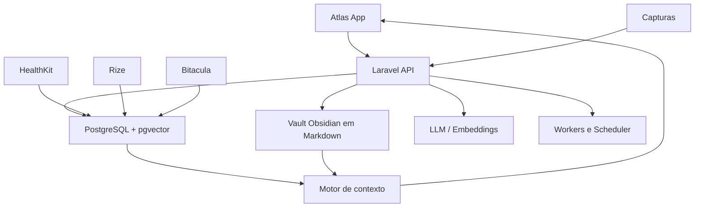
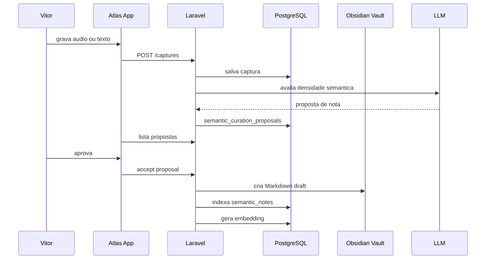
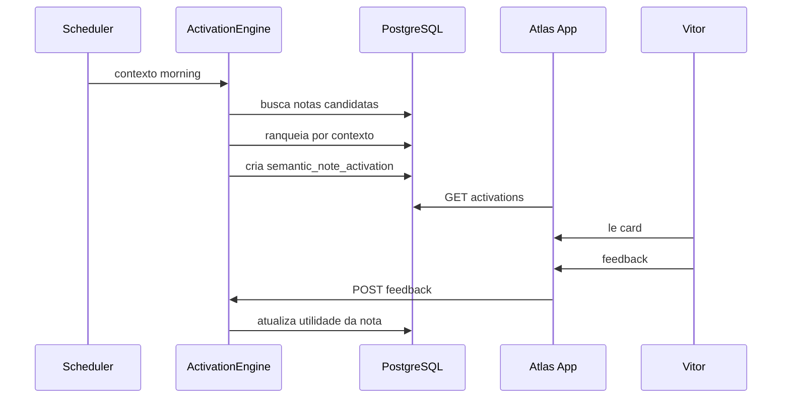
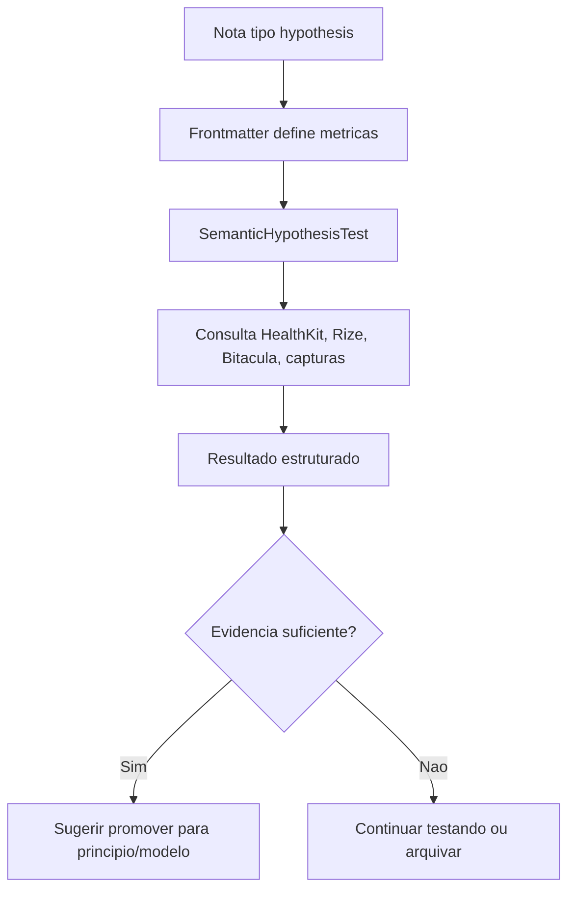

# ATLAS

**Memoria Semantica Ativa Compartilhada**

*Projeto funcional completo para implementacao operacional*

---

| | |
|---|---|
| **Operador** | Vitor Emanuel |
| **Sistema** | Atlas |
| **Documento-base** | Atlas_Memoria_Semantica_Ativa_Compartilhada.md |
| **Tipo** | Projeto funcional e tecnico |
| **Stack alvo** | Laravel + PostgreSQL + pgvector + Obsidian Markdown + Expo app |
| **Data** | 28 de abril de 2026 |
| **Status** | Especificacao pronta para implementacao incremental |

---

## 0. Decisao Executiva

A primeira versao completa e funcional da Memoria Semantica Ativa Compartilhada nao deve tentar construir o estado final inteiro de uma vez. Ela deve entregar um ciclo completo, pequeno, real e confiavel:

> **Capturar conhecimento importante, promover para nota semantica, indexar, buscar, relembrar no contexto certo, registrar se foi util e manter o vault saudavel.**

Se esse ciclo funcionar, o Atlas passa a ter memoria semantica ativa. Se ele nao funcionar, qualquer multi-agente, jogo cognitivo ou correlacao sofisticada vira arquitetura decorativa.

A V1 funcional precisa ter:

1. Vault Obsidian inicializado com estrutura correta.
2. Notas Markdown com frontmatter padronizado.
3. Indexacao do vault no PostgreSQL.
4. Busca semantica e busca por metadados.
5. Propostas de curadoria a partir de capturas importantes.
6. Criacao assistida de drafts de notas.
7. Motor simples de ativacao contextual.
8. Tela no app para memoria, curadoria e revisao.
9. Registro de ativacoes e feedback.
10. Governanca basica do vault.

Tudo acima precisa funcionar sem depender de disciplina manual pesada. Vitor aprova, corrige e decide. Atlas faz o trabalho operacional.

---

## 1. Norte Do Produto

### 1.1 Objetivo

Criar uma camada do Atlas que permita que conhecimento pessoal importante seja preservado, estruturado, reativado e aplicado no momento certo.

O sistema deve responder a quatro perguntas praticas:

1. **O que eu ja aprendi que e relevante agora?**
2. **Que conceito eu esqueci e deveria praticar hoje?**
3. **Que captura recente merece virar conhecimento duradouro?**
4. **Que hipotese ou principio meu ja tem evidencia suficiente para amadurecer?**

### 1.2 Usuario real

O usuario e Vitor, com TDAH, memoria fraca, hiperfoco, variacao de energia e tendencia a produzir muito em rajadas. O sistema nao pode depender de:

- lembrar de abrir o Obsidian;
- manter curadoria perfeita;
- revisar manualmente centenas de notas;
- criar links por disciplina abstrata;
- saber de cabeca qual nota se aplica a qual situacao.

O sistema deve compensar essas limitacoes de forma arquitetural.

### 1.3 Definicao de sucesso da V1 funcional

A V1 esta funcionando quando:

- Vitor captura uma ideia importante em audio ou texto;
- Atlas identifica que ela pode virar nota semantica;
- Vitor aprova a promocao;
- Atlas cria um draft Markdown no vault com frontmatter valido;
- o servidor indexa a nota no PostgreSQL;
- a nota aparece em busca e em contexto relevante;
- Atlas reativa a nota em algum momento util;
- Vitor registra se aquilo ajudou ou nao;
- a nota passa a acumular historico de uso.

Esse e o ciclo minimo de memoria ativa.

---

## 2. Arquitetura Geral

### 2.1 Componentes



### 2.2 Responsabilidade de cada parte

| Parte | Responsabilidade |
|---|---|
| **Atlas app** | Captura, curadoria leve, visualizacao, feedback e jogos simples. |
| **Laravel API** | Orquestracao, leitura/escrita do vault, indexacao, regras, jobs e endpoints. |
| **PostgreSQL** | Estado estruturado, indice semantico, historico de ativacoes, correlacoes e auditoria. |
| **Obsidian vault** | Corpo narrativo do conhecimento, editavel por humano e legivel por IA. |
| **LLM** | Sugerir notas, resumir, classificar, gerar links candidatos e prompts de pratica. |
| **Workers** | Indexar, reprocessar embeddings, avaliar contexto, governar saude do vault. |
| **Bitacula** | Contexto factual nao inferivel por sensores; alimenta revisoes, hipoteses e experimentos. |

### 2.3 Direcao de fluxo

Para evitar dois sources of truth quebrados, cada dado tem direcao clara:

| Dado | Fonte de verdade | Fluxo |
|---|---|---|
| Capturas brutas | PostgreSQL | App -> API -> PostgreSQL |
| Metricas HealthKit | PostgreSQL | App -> API -> PostgreSQL |
| Rize e atividade digital | PostgreSQL | API Rize -> PostgreSQL |
| Comportamentos Bitacula | PostgreSQL | App -> API -> PostgreSQL |
| Logs da Bitacula | PostgreSQL | Briefing/Captura/App -> API -> PostgreSQL |
| Conteudo narrativo de conhecimento | Markdown | Obsidian/vault -> index PostgreSQL |
| Metadados acionaveis da nota | Markdown frontmatter | Vault -> PostgreSQL |
| Embeddings | PostgreSQL | Markdown -> embedding -> PostgreSQL |
| Historico de ativacoes | PostgreSQL | Motor -> PostgreSQL |
| Feedback de utilidade | PostgreSQL | App -> API -> PostgreSQL |
| Hipoteses em teste | Markdown + PostgreSQL | Nota define; banco executa e registra |

Regra dura:

> **PostgreSQL indexa e opera o vault. Ele nao substitui o texto narrativo do vault.**

---

## 3. Escopo Da V1 Funcional

### 3.1 Inclui

1. Estrutura inicial do vault.
2. Templates Markdown.
3. Parser de frontmatter.
4. Indexacao de notas.
5. Embeddings das notas.
6. Busca semantica.
7. Busca filtrada por tipo, dominio, maturidade e status.
8. Propostas de curadoria a partir de capturas.
9. Draft assistido de nota.
10. Revisao humana antes de promover.
11. Ativacoes contextuais simples.
12. Feedback de ativacao.
13. Tela de Memoria no app.
14. Tela de Curadoria no app.
15. Tela de detalhe de nota.
16. Governanca basica.
17. Logs e auditoria.

### 3.2 Nao inclui na V1

- Multi-agente autonomo escrevendo no vault sem aprovacao.
- Edicao completa de Markdown dentro do app.
- Plugin Obsidian proprio.
- Sincronizacao cloud do vault.
- Jogos cognitivos complexos com avaliacao longa.
- Correlacoes estatisticas profundas.
- Promocao constitucional automatica.
- Sistema publico ou multi-tenant.

Esses itens podem vir depois. A V1 precisa provar que a memoria ativa funciona.

---

## 4. Estrutura Do Vault

### 4.1 Caminho recomendado

No servidor principal:

```text
/Users/vitorepf/Develop/atlas/AtlasVault
```

Ou, se o servidor definitivo for Linux:

```text
/var/atlas/vault
```

Variavel de ambiente:

```env
ATLAS_VAULT_PATH=/Users/vitorepf/Develop/atlas/AtlasVault
```

### 4.2 Pastas obrigatorias

```text
atlas-vault/
├── 00-constituicao/
├── 01-acervo/
│   ├── livros/
│   ├── filosofia/
│   ├── blackink/
│   ├── saude/
│   ├── comunicacao/
│   ├── investimento/
│   └── vida/
├── 02-modelos-mentais/
├── 03-principios/
├── 04-hipoteses/
├── 05-praticas/
├── 06-jogos-cognitivos/
├── 07-decisoes-e-identidade/
├── 08-sinteses/
├── _inbox/
├── _laboratorio/
├── _arquivo/
└── _templates/
```

### 4.3 Regras de pasta

| Pasta | Pode receber automaticamente? | Precisa de aprovacao? | Observacao |
|---|---:|---:|---|
| `_inbox/` | Sim | Nao | Entrada temporaria, baixa confianca. |
| `_laboratorio/` | Sim | Simples | Espaco de exploracao e rascunho. |
| `01-acervo/` | Sim | Sim | Conhecimento curado, ainda nao regra. |
| `02-modelos-mentais/` | Nao | Sim | Exige uso pretendido claro. |
| `03-principios/` | Nao | Sim forte | So entra com criterio de identidade. |
| `04-hipoteses/` | Sim | Sim | Precisa definir como testar. |
| `05-praticas/` | Sim | Sim | Precisa ter procedimento executavel. |
| `06-jogos-cognitivos/` | Nao | Sim | Deve ter regra, entrada e criterio. |
| `07-decisoes-e-identidade/` | Nao | Sim forte | Conteudo sensivel. |
| `08-sinteses/` | Sim | Sim | Resultado de cruzamento de notas. |
| `_arquivo/` | Sim | Simples | Arquivamento sem culpa. |

---

## 5. Tipos De Nota Da V1

A V1 deve suportar poucos tipos, mas bem feitos.

### 5.1 `source_note`

Anotacao curada de livro, paper, video, conversa ou aula.

Uso:

- preservar conhecimento externo;
- registrar o que foi aprendido;
- permitir recuperacao futura.

### 5.2 `mental_model`

Modelo mental aplicavel a decisao, comunicacao, estrategia ou operacao.

Uso:

- lembrar quando aplicar;
- treinar aplicacao;
- conectar a situacoes reais.

### 5.3 `principle`

Regra de identidade ou criterio decisorio.

Uso:

- proteger comportamento;
- confrontar incoerencia;
- guiar decisao.

### 5.4 `hypothesis`

Hipotese pessoal a testar com dados do Atlas.

Uso:

- transformar intuicao em experimento;
- cruzar com HealthKit, Rize, Bitacula, capturas e check-ins.

### 5.5 `practice`

Pratica executavel de baixo custo.

Uso:

- treinar oratoria;
- treinar decisao;
- treinar foco;
- transformar conhecimento em habilidade.

### 5.6 `synthesis`

Conexao entre varias notas.

Uso:

- unir livros, experiencias e dados;
- criar tese nova;
- alimentar modelos e principios.

---

## 6. Frontmatter Funcional

### 6.1 Campos obrigatorios

Toda nota indexavel precisa ter:

```yaml
---
id: note_20260428_000001
type: mental_model
title: "Pausa antes da tese"
status: active
confidence: medium
maturity: draft
domains:
  - comunicacao
  - blackink
summary: "Antes de explicar algo importante, fazer uma pausa curta para reduzir velocidade e aumentar clareza."
when_to_use:
  - "antes de explicar preco"
  - "antes de responder cliente em call"
  - "quando perceber fala acelerada"
trigger_signals:
  - call_com_cliente
  - estado_disperso
  - captura_sobre_venda
do_not_use_when:
  - "em conversa leve sem decisao"
practice_prompt: "Respire, conte 2 segundos e diga a tese em uma frase antes de justificar."
created_at: "2026-04-28T00:00:00-03:00"
updated_at: "2026-04-28T00:00:00-03:00"
---
```

### 6.2 Campos recomendados

```yaml
source_type: book
source_refs:
  - "Livro X, capitulo 3"
related_notes:
  - note_20260428_000002
postgres_refs:
  captures:
    - "uuid-da-captura"
  behaviors:
    - "uuid-do-comportamento"
review_after: "2026-05-28"
archive_after:
last_activated_at:
last_practiced_at:
activation_count: 0
usefulness_avg:
```

### 6.3 Validacao minima

A indexacao deve recusar como `invalid` notas sem:

- `id`;
- `type`;
- `title`;
- `status`;
- `summary`;
- pelo menos um `when_to_use` ou `trigger_signals`.

Notas invalidas nao quebram o sistema. Elas entram em `semantic_notes.status = invalid` com erro legivel.

---

## 7. Modelo De Dados No PostgreSQL

### 7.1 `semantic_notes`

Tabela principal de indice do vault.

```sql
CREATE TABLE semantic_notes (
  id UUID PRIMARY KEY DEFAULT gen_random_uuid(),
  note_key TEXT NOT NULL UNIQUE,
  path TEXT NOT NULL UNIQUE,
  title TEXT NOT NULL,
  type TEXT NOT NULL CHECK (type IN (
    'source_note',
    'mental_model',
    'principle',
    'hypothesis',
    'practice',
    'synthesis',
    'decision_identity',
    'cognitive_game'
  )),
  status TEXT NOT NULL DEFAULT 'draft' CHECK (status IN (
    'inbox',
    'draft',
    'active',
    'testing',
    'validated',
    'archived',
    'invalid'
  )),
  confidence TEXT NOT NULL DEFAULT 'low' CHECK (confidence IN (
    'low',
    'medium',
    'high',
    'validated'
  )),
  maturity TEXT NOT NULL DEFAULT 'draft' CHECK (maturity IN (
    'seed',
    'draft',
    'useful',
    'tested',
    'principle',
    'archived'
  )),
  domains JSONB NOT NULL DEFAULT '[]'::jsonb,
  summary TEXT,
  body_excerpt TEXT,
  frontmatter JSONB NOT NULL DEFAULT '{}'::jsonb,
  when_to_use JSONB NOT NULL DEFAULT '[]'::jsonb,
  trigger_signals JSONB NOT NULL DEFAULT '[]'::jsonb,
  do_not_use_when JSONB NOT NULL DEFAULT '[]'::jsonb,
  postgres_refs JSONB NOT NULL DEFAULT '{}'::jsonb,
  content_hash TEXT NOT NULL,
  embedding VECTOR(1536),
  indexed_at TIMESTAMPTZ,
  last_seen_at TIMESTAMPTZ,
  last_activated_at TIMESTAMPTZ,
  last_practiced_at TIMESTAMPTZ,
  activation_count INTEGER NOT NULL DEFAULT 0,
  usefulness_avg NUMERIC(4, 3),
  validation_errors JSONB NOT NULL DEFAULT '[]'::jsonb,
  metadata JSONB NOT NULL DEFAULT '{}'::jsonb,
  created_at TIMESTAMPTZ NOT NULL DEFAULT NOW(),
  updated_at TIMESTAMPTZ NOT NULL DEFAULT NOW(),
  deleted_at TIMESTAMPTZ
);
```

Indices:

```sql
CREATE INDEX idx_semantic_notes_type_status ON semantic_notes(type, status);
CREATE INDEX idx_semantic_notes_updated_at ON semantic_notes(updated_at DESC);
CREATE INDEX idx_semantic_notes_last_activated ON semantic_notes(last_activated_at DESC NULLS LAST);
CREATE INDEX idx_semantic_notes_frontmatter_gin ON semantic_notes USING GIN(frontmatter);
CREATE INDEX idx_semantic_notes_domains_gin ON semantic_notes USING GIN(domains);
CREATE INDEX idx_semantic_notes_embedding ON semantic_notes USING ivfflat (embedding vector_cosine_ops);
```

### 7.2 `semantic_note_links`

Links explicados entre notas.

```sql
CREATE TABLE semantic_note_links (
  id UUID PRIMARY KEY DEFAULT gen_random_uuid(),
  source_note_id UUID NOT NULL REFERENCES semantic_notes(id) ON DELETE CASCADE,
  target_note_id UUID NOT NULL REFERENCES semantic_notes(id) ON DELETE CASCADE,
  link_type TEXT NOT NULL CHECK (link_type IN (
    'supports',
    'contradicts',
    'extends',
    'example_of',
    'applies_to',
    'derived_from',
    'similar_to',
    'tension'
  )),
  explanation TEXT NOT NULL,
  created_by TEXT NOT NULL DEFAULT 'operator' CHECK (created_by IN (
    'operator',
    'atlas_suggestion',
    'import'
  )),
  confidence NUMERIC(4,3) CHECK (confidence IS NULL OR confidence BETWEEN 0 AND 1),
  confirmed_by_operator BOOLEAN NOT NULL DEFAULT FALSE,
  created_at TIMESTAMPTZ NOT NULL DEFAULT NOW(),
  updated_at TIMESTAMPTZ NOT NULL DEFAULT NOW()
);
```

### 7.3 `semantic_curation_proposals`

Fila de sugestoes para transformar captura em nota.

```sql
CREATE TABLE semantic_curation_proposals (
  id UUID PRIMARY KEY DEFAULT gen_random_uuid(),
  source_type TEXT NOT NULL CHECK (source_type IN (
    'capture',
    'transcription',
    'behavior_pattern',
    'health_pattern',
    'rize_pattern',
    'manual'
  )),
  source_refs JSONB NOT NULL DEFAULT '{}'::jsonb,
  proposed_note_type TEXT NOT NULL,
  proposed_title TEXT NOT NULL,
  proposed_summary TEXT NOT NULL,
  proposed_path TEXT,
  proposed_frontmatter JSONB NOT NULL DEFAULT '{}'::jsonb,
  proposed_body TEXT,
  score NUMERIC(4,3) CHECK (score IS NULL OR score BETWEEN 0 AND 1),
  reason TEXT NOT NULL,
  status TEXT NOT NULL DEFAULT 'pending' CHECK (status IN (
    'pending',
    'accepted',
    'edited',
    'dismissed',
    'postponed'
  )),
  shown_at TIMESTAMPTZ,
  resolved_at TIMESTAMPTZ,
  created_at TIMESTAMPTZ NOT NULL DEFAULT NOW(),
  updated_at TIMESTAMPTZ NOT NULL DEFAULT NOW()
);
```

### 7.4 `semantic_note_activations`

Historico de quando Atlas trouxe uma nota para Vitor.

```sql
CREATE TABLE semantic_note_activations (
  id UUID PRIMARY KEY DEFAULT gen_random_uuid(),
  note_id UUID NOT NULL REFERENCES semantic_notes(id) ON DELETE CASCADE,
  activation_type TEXT NOT NULL CHECK (activation_type IN (
    'remember',
    'practice',
    'connect',
    'confront',
    'test',
    'promote',
    'archive_review'
  )),
  context_type TEXT NOT NULL CHECK (context_type IN (
    'morning_briefing',
    'capture_created',
    'health_state',
    'rize_context',
    'weekly_review',
    'manual_search',
    'cognitive_game',
    'notification_candidate'
  )),
  context_payload JSONB NOT NULL DEFAULT '{}'::jsonb,
  prompt TEXT NOT NULL,
  shown_at TIMESTAMPTZ,
  acted_at TIMESTAMPTZ,
  dismissed_at TIMESTAMPTZ,
  usefulness_score SMALLINT CHECK (usefulness_score IS NULL OR usefulness_score BETWEEN 1 AND 5),
  operator_feedback TEXT,
  created_at TIMESTAMPTZ NOT NULL DEFAULT NOW(),
  updated_at TIMESTAMPTZ NOT NULL DEFAULT NOW()
);
```

### 7.5 `semantic_hypothesis_tests`

Hipoteses vindas do vault que viram teste estruturado.

```sql
CREATE TABLE semantic_hypothesis_tests (
  id UUID PRIMARY KEY DEFAULT gen_random_uuid(),
  note_id UUID NOT NULL REFERENCES semantic_notes(id) ON DELETE CASCADE,
  hypothesis TEXT NOT NULL,
  metric_targets JSONB NOT NULL DEFAULT '[]'::jsonb,
  required_sources JSONB NOT NULL DEFAULT '[]'::jsonb,
  started_at TIMESTAMPTZ,
  ended_at TIMESTAMPTZ,
  status TEXT NOT NULL DEFAULT 'draft' CHECK (status IN (
    'draft',
    'running',
    'completed',
    'inconclusive',
    'cancelled'
  )),
  result_summary TEXT,
  result_payload JSONB NOT NULL DEFAULT '{}'::jsonb,
  decision TEXT CHECK (decision IS NULL OR decision IN (
    'promote',
    'revise',
    'archive',
    'keep_testing'
  )),
  created_at TIMESTAMPTZ NOT NULL DEFAULT NOW(),
  updated_at TIMESTAMPTZ NOT NULL DEFAULT NOW()
);
```

### 7.6 `cognitive_game_runs`

Execucoes de jogos cognitivos.

```sql
CREATE TABLE cognitive_game_runs (
  id UUID PRIMARY KEY DEFAULT gen_random_uuid(),
  game_key TEXT NOT NULL,
  title TEXT NOT NULL,
  input_note_ids JSONB NOT NULL DEFAULT '[]'::jsonb,
  prompt TEXT NOT NULL,
  operator_answer TEXT,
  atlas_feedback TEXT,
  score NUMERIC(4,3) CHECK (score IS NULL OR score BETWEEN 0 AND 1),
  duration_seconds INTEGER CHECK (duration_seconds IS NULL OR duration_seconds >= 0),
  promoted_note_id UUID REFERENCES semantic_notes(id) ON DELETE SET NULL,
  created_at TIMESTAMPTZ NOT NULL DEFAULT NOW(),
  updated_at TIMESTAMPTZ NOT NULL DEFAULT NOW()
);
```

### 7.7 `vault_health_snapshots`

Saude do vault ao longo do tempo.

```sql
CREATE TABLE vault_health_snapshots (
  id UUID PRIMARY KEY DEFAULT gen_random_uuid(),
  snapshot_date DATE NOT NULL UNIQUE,
  total_notes INTEGER NOT NULL DEFAULT 0,
  active_notes INTEGER NOT NULL DEFAULT 0,
  inbox_notes INTEGER NOT NULL DEFAULT 0,
  invalid_notes INTEGER NOT NULL DEFAULT 0,
  stale_notes INTEGER NOT NULL DEFAULT 0,
  notes_without_triggers INTEGER NOT NULL DEFAULT 0,
  notes_without_links INTEGER NOT NULL DEFAULT 0,
  activations_7d INTEGER NOT NULL DEFAULT 0,
  useful_activations_7d INTEGER NOT NULL DEFAULT 0,
  health_state TEXT NOT NULL CHECK (health_state IN (
    'healthy',
    'inflated',
    'cold',
    'anxious',
    'mature',
    'needs_attention'
  )),
  recommendations JSONB NOT NULL DEFAULT '[]'::jsonb,
  created_at TIMESTAMPTZ NOT NULL DEFAULT NOW(),
  updated_at TIMESTAMPTZ NOT NULL DEFAULT NOW()
);
```

---

## 8. Servicos Laravel

### 8.1 `VaultFileStore`

Responsavel por ler e escrever arquivos Markdown.

Metodos:

- `ensureVaultStructure(): void`
- `listMarkdownFiles(): Collection`
- `read(string $path): VaultMarkdownFile`
- `writeDraft(string $path, string $content): VaultMarkdownFile`
- `move(string $from, string $to): void`
- `archive(string $path): void`
- `safePath(string $path): string`

Regras:

- nunca escrever fora de `ATLAS_VAULT_PATH`;
- path sempre normalizado;
- writes atomicos com arquivo temporario;
- preservar conteudo manual quando reindexar.

### 8.2 `FrontmatterParser`

Responsavel por separar YAML e corpo.

Metodos:

- `parse(string $markdown): ParsedMarkdown`
- `validate(array $frontmatter): ValidationResult`
- `build(array $frontmatter, string $body): string`

Falhas:

- YAML invalido nao derruba indexacao;
- nota vira `invalid`;
- erro fica em `semantic_notes.validation_errors`.

### 8.3 `SemanticNoteIndexer`

Responsavel por sincronizar vault -> PostgreSQL.

Metodos:

- `indexAll(): IndexStats`
- `indexFile(string $path): SemanticNote`
- `markMissingAsDeleted(): int`
- `needsEmbedding(SemanticNote $note): bool`

Regras:

- se `content_hash` nao mudou, nao recalcula embedding;
- se arquivo sumiu, soft delete;
- se frontmatter mudou, atualiza metadados;
- se corpo mudou, recalcula excerpt e embedding.

### 8.4 `EmbeddingService`

Responsavel por gerar vetor.

Metodos:

- `embedNote(ParsedMarkdown $note): array`
- `embedQuery(string $query): array`

Politica:

- texto de embedding = `title + summary + when_to_use + trigger_signals + body excerpt`;
- nao embedar arquivo inteiro se ficar grande demais;
- manter versao do modelo em metadata.

### 8.5 `SemanticSearchService`

Responsavel por busca.

Metodos:

- `semanticSearch(string $query, array $filters = []): Collection`
- `metadataSearch(array $filters): Collection`
- `hybridSearch(string $query, array $filters = []): Collection`

Filtros:

- type;
- status;
- domain;
- maturity;
- confidence;
- trigger_signal;
- last_activated range.

### 8.6 `CurationProposalService`

Responsavel por sugerir o que vira nota.

Fontes:

- capturas com alta densidade;
- transcricoes longas;
- capturas marcadas como importantes;
- repeticao de temas;
- divergencia entre comportamento e principio;
- padroes em Bitacula;
- hipoteses sugeridas por HealthKit/Rize.

Metodos:

- `scanRecentCaptures(): ProposalStats`
- `createFromCapture(Capture $capture): ?Proposal`
- `accept(Proposal $proposal, ?array $edits = null): SemanticNote`
- `dismiss(Proposal $proposal): void`
- `postpone(Proposal $proposal): void`

Regra:

> Atlas pode propor nota. Atlas nao deve promover nota para area nobre sem ratificacao.

### 8.7 `ActivationEngine`

Responsavel por decidir quando uma nota volta.

Inputs:

- estado atual;
- energia e mood;
- HealthKit;
- sono;
- Rize;
- calendario;
- captura recem-criada;
- hora do dia;
- misses de comportamento;
- weekly review.

Metodos:

- `candidatesForMorningBriefing(): Collection`
- `candidatesForCapture(Capture $capture): Collection`
- `candidatesForHealthState(HealthSnapshot $snapshot): Collection`
- `rank(array $context, Collection $notes): Collection`
- `recordActivation(SemanticNote $note, array $context): Activation`

Regra:

- maximo 1 ativacao semantica forte por briefing;
- maximo 2 lembretes ativos por dia na V1;
- se duas ativacoes seguidas forem ignoradas, reduzir prioridade da nota.

### 8.8 `VaultGovernanceService`

Responsavel por detectar apodrecimento.

Metodos:

- `createDailySnapshot(): VaultHealthSnapshot`
- `findInvalidNotes(): Collection`
- `findStaleHypotheses(): Collection`
- `findNotesWithoutTriggers(): Collection`
- `findColdUsefulNotes(): Collection`
- `recommendActions(): array`

Estados:

- `healthy`;
- `inflated`;
- `cold`;
- `anxious`;
- `mature`;
- `needs_attention`.

### 8.9 `CognitiveGameService`

Responsavel por jogos simples na V1.

Jogos V1:

- recall sem olhar;
- aplicacao antes da resposta;
- conexao forcada simples.

Metodos:

- `suggestGameForToday(): ?GamePrompt`
- `start(string $gameKey, array $input): CognitiveGameRun`
- `submitAnswer(CognitiveGameRun $run, string $answer): CognitiveGameRun`

---

## 9. Comandos Artisan

### 9.1 Inicializar vault

```bash
php artisan atlas:semantic:bootstrap-vault
```

Faz:

- cria pastas;
- cria templates;
- copia documento constitucional para `00-constituicao/`;
- valida permissao de leitura/escrita;
- cria `.atlas-vault.json`.

### 9.2 Indexar vault

```bash
php artisan atlas:semantic:index
php artisan atlas:semantic:index --changed
php artisan atlas:semantic:index --path=02-modelos-mentais/pausa-antes-da-tese.md
```

### 9.3 Gerar propostas

```bash
php artisan atlas:semantic:propose --since="24 hours ago"
```

### 9.4 Rodar ativacoes

```bash
php artisan atlas:semantic:activate --context=morning
php artisan atlas:semantic:activate --context=weekly-review
```

### 9.5 Governanca

```bash
php artisan atlas:semantic:govern
```

### 9.6 Jogo cognitivo

```bash
php artisan atlas:semantic:game --type=recall
```

---

## 10. Scheduler

No Laravel scheduler:

```php
$schedule->command('atlas:semantic:index --changed')->everyFiveMinutes();
$schedule->command('atlas:semantic:propose --since="24 hours ago"')->hourly();
$schedule->command('atlas:semantic:activate --context=morning')->dailyAt('06:00');
$schedule->command('atlas:semantic:govern')->dailyAt('03:20');
$schedule->command('atlas:semantic:game --type=recall')->weeklyOn(6, '10:00');
```

Na V1, ativacoes viram cards no app, nao notificacoes invasivas.

---

## 11. API Laravel

Todos os endpoints autenticados por `X-Atlas-Token`, exceto health.

### 11.1 Notas

```http
GET /api/semantic/notes
GET /api/semantic/notes/{id}
POST /api/semantic/notes/reindex
```

Filtros:

- `type`;
- `status`;
- `domain`;
- `query`;
- `limit`;
- `cursor`.

### 11.2 Busca

```http
POST /api/semantic/search
```

Request:

```json
{
  "query": "como explicar preco sem falar rapido",
  "filters": {
    "type": ["mental_model", "practice"],
    "domains": ["comunicacao", "blackink"]
  },
  "limit": 10
}
```

Response:

```json
{
  "results": [
    {
      "id": "uuid",
      "note_key": "note_20260428_000001",
      "title": "Pausa antes da tese",
      "type": "mental_model",
      "summary": "Antes de explicar algo importante...",
      "score": 0.83,
      "path": "02-modelos-mentais/pausa-antes-da-tese.md"
    }
  ]
}
```

### 11.3 Curadoria

```http
GET /api/semantic/curation-proposals
POST /api/semantic/curation-proposals/{id}/accept
POST /api/semantic/curation-proposals/{id}/dismiss
POST /api/semantic/curation-proposals/{id}/postpone
```

Accept request:

```json
{
  "title": "Pausa antes da tese",
  "path": "02-modelos-mentais/pausa-antes-da-tese.md",
  "frontmatter_edits": {
    "domains": ["comunicacao", "blackink"],
    "trigger_signals": ["call_com_cliente"]
  },
  "body_edits": null
}
```

### 11.4 Ativacoes

```http
GET /api/semantic/activations
POST /api/semantic/activations/{id}/shown
POST /api/semantic/activations/{id}/feedback
POST /api/semantic/activations/{id}/dismiss
```

Feedback:

```json
{
  "usefulness_score": 4,
  "operator_feedback": "Ajudou antes da call."
}
```

### 11.5 Jogos

```http
GET /api/semantic/games/today
POST /api/semantic/games
POST /api/semantic/games/{id}/answer
```

### 11.6 Saude do vault

```http
GET /api/semantic/vault-health
POST /api/semantic/vault-health/recompute
```

---

## 12. App Expo

### 12.1 Nova area: Memoria

A V1 deve adicionar uma tela `app/memory.tsx` ou uma secao acessivel a partir de Review/Ritual, sem competir com captura.

Objetivo da tela:

- mostrar o que Atlas quer reativar hoje;
- mostrar propostas de curadoria;
- permitir busca no segundo cerebro;
- dar acesso a jogos cognitivos simples;
- mostrar saude do vault.

### 12.2 Tela principal

Secoes:

1. **Hoje**
   - 1 card de relembrar/treinar/conectar.
   - Botao: "Usei", "Nao agora", "Nao foi util".

2. **Curadoria**
   - propostas pendentes.
   - aceitar, editar minimo, dispensar.

3. **Buscar**
   - input simples.
   - resultados por titulo, resumo, tipo.

4. **Praticar**
   - jogo cognitivo sugerido.

5. **Saude do vault**
   - estado: Saudavel / Frio / Inflado / Precisa atencao.

### 12.3 Card de ativacao

Exemplo:

```text
MEMORIA
Pausa antes da tese

Voce tem uma call de cliente hoje e ontem capturou preocupacao com preco.

Pratica:
Respire, conte 2 segundos e diga a tese em uma frase antes de justificar.

[Usei] [Nao agora] [Nao foi util]
```

### 12.4 Card de curadoria

```text
CURADORIA
Essa captura parece um modelo mental

"Quando eu explico preco rapido, eu pareco inseguro..."

Sugestao:
Pausa antes da tese

[Criar nota] [Editar] [Ignorar]
```

### 12.5 Busca

Busca deve ser util em 2 segundos:

- campo de texto;
- resultado com titulo, tipo, resumo e dominios;
- abrir detalhe read-only;
- botao "abrir no Obsidian" pode vir depois.

### 12.6 Detalhe de nota

V1 pode ser read-only:

- titulo;
- tipo;
- resumo;
- quando usar;
- prompt de pratica;
- links relacionados;
- historico de ativacoes;
- botao "Foi util agora".

Nao precisa editar Markdown no app na V1.

---

## 13. Fluxos Funcionais

### 13.1 Captura vira nota



### 13.2 Nota volta no contexto certo



### 13.3 Hipotese vira teste



---

## 14. Motor De Ativacao V1

### 14.1 Contextos suportados

Na V1, usar apenas contextos confiaveis:

1. **Morning briefing.**
2. **Captura recem-criada.**
3. **Weekly review.**
4. **Busca manual.**
5. **Estado fisico ruim ou baixo readiness.**

Nao usar notificacoes push na V1.

### 14.2 Sinais de contexto

| Sinal | Fonte | Exemplo |
|---|---|---|
| Energia baixa | Check-in | energia 1-2 |
| Mood baixo | Check-in | mood 1-2 |
| Sono ruim | Health snapshot | duracao baixa, debito alto |
| HRV abaixo do baseline | Health snapshot | recuperacao baixa |
| Captura sobre venda | Captures + LLM | transcricao menciona cliente/preco |
| Muito input algoritmico | Rize | YouTube/social acima do normal |
| Dia de review | app | weekly review |

### 14.3 Ranking inicial

Score de ativacao:

```text
score =
  trigger_match * 0.35
  + semantic_similarity * 0.25
  + recency_need * 0.15
  + usefulness_history * 0.15
  + maturity_weight * 0.10
  - fatigue_penalty
```

Onde:

- `trigger_match`: match entre trigger_signals e contexto.
- `semantic_similarity`: embedding da situacao atual vs nota.
- `recency_need`: nota util mas pouco ativada recentemente.
- `usefulness_history`: feedback anterior.
- `maturity_weight`: principios e praticas validadas sobem.
- `fatigue_penalty`: reduz se Vitor ignorou recentemente.

### 14.4 Limites

- No maximo 1 card semantico no briefing.
- No maximo 3 candidatos no app.
- Sem push notification na V1.
- Sem confronto forte em dia de baixa energia, salvo violacao grave.

---

## 15. Curadoria Assistida

### 15.1 Quando propor nota

Propor nota quando uma captura tiver:

- tese clara;
- principio de identidade;
- tecnica aplicavel;
- aprendizado de livro;
- hipotese testavel;
- decisao recorrente;
- padrao emocional/cognitivo repetido;
- frase que Vitor provavelmente esqueceria mas deveria recuperar.

### 15.2 Quando nao propor

Nao propor quando:

- captura e operacional e descartavel;
- conteudo e apenas lembrete simples;
- texto e muito emocional sem tese clara;
- tema ja existe e deve virar append/link, nao nova nota;
- score de confianca baixo.

### 15.3 Estados da proposta

```text
pending -> accepted -> note_created
pending -> edited -> note_created
pending -> dismissed
pending -> postponed
```

### 15.4 Regra de friccao

Aceitar uma proposta deve levar menos de 20 segundos.

Se exigir mais, a proposta deve ir para `_inbox/` como draft, nao bloquear o fluxo.

---

## 16. Governanca Do Vault

### 16.1 Problemas que o sistema deve detectar

1. Muitas notas na inbox.
2. Notas sem `when_to_use`.
3. Notas sem `trigger_signals`.
4. Hipoteses paradas ha mais de 90 dias.
5. Praticas nunca praticadas.
6. Principios nunca ativados.
7. Links sugeridos nao confirmados.
8. Notas com baixa utilidade repetida.
9. Crescimento rapido demais do vault.

### 16.2 Acoes permitidas

Atlas pode:

- sugerir arquivamento;
- sugerir completar frontmatter;
- sugerir fundir notas;
- sugerir revisar hipotese;
- reduzir prioridade de ativacao;
- marcar nota como fria.

Atlas nao pode:

- apagar nota definitivamente;
- promover principio sem ratificacao;
- alterar tese central de uma nota sem aprovacao;
- esconder conteudo de Vitor;
- criar ansiedade por backlog.

### 16.3 Saude do vault no app

Mostrar simples:

```text
Vault saudavel
42 notas ativas
3 na inbox
2 precisam de gatilho
1 hipotese parada
```

Sem grafo ornamental na V1.

---

## 17. Integracao Com Os Sensores Do Atlas

### 17.1 Capturas

Capturas geram propostas de nota e contexto de ativacao.

Exemplo:

- captura: "eu fico inseguro falando preco";
- proposta: modelo mental "Pausa antes da tese";
- ativacao futura: antes de call, lembrar pratica.

### 17.2 HealthKit

HealthKit informa estado fisiologico para escolher o tipo de intervencao.

Exemplo:

- readiness baixo;
- Atlas evita confronto forte;
- sugere pratica curta ou principio de descanso.

### 17.3 Rize

Rize informa contexto digital.

Exemplo:

- muito YouTube autoplay pela manha;
- nota relevante: "Input algoritmico antes do trabalho";
- Atlas conecta com foco baixo e sugere experimento.

### 17.4 Bitacula

Bitacula e a camada factual de contexto humano do Atlas.

Ela registra fatores que aconteceram na vida real e que sensores passivos nao inferem com seguranca. Nao e diario livre, nao e lista generica de habitos e nao e laboratorio inteiro. Ela coleta observacoes pequenas; algumas observacoes viram hipoteses; algumas hipoteses viram experimentos.

Definicao operacional:

> **Bitacula registra fatores factuais, pequenos e rastreaveis que podem explicar variacao em sono, HRV, energia, humor, foco, decisoes e performance.**

Regra epistemica:

> **Correlacao da Bitacula nunca vira conclusao causal. Ela vira pergunta, hipotese ou experimento.**

#### 17.4.1 Fronteira com outros modulos

| Modulo | Pergunta que responde | Exemplo |
|---|---|---|
| Check-in | Como estou agora? | energia 2, disperso, estresse alto |
| Captura | O que pensei, vivi ou decidi? | "fiquei inseguro falando preco" |
| Bitacula | O que aconteceu que pode explicar meu estado? | cafe apos 14h, alcool, conflito |
| Experimento | O que vou testar deliberadamente? | 14 dias sem cafe apos 14h |
| Review | O que aprendi e que decisao muda? | cafe tarde parece piorar sono; testar mais uma semana |

Bitacula coleta sinais. Review transforma sinais em aprendizado. Experimento testa causalidade com mais rigor.

#### 17.4.2 O que entra

Entra se cumprir os tres criterios:

1. **Factual:** aconteceu ou nao aconteceu; teve intensidade ou quantidade observavel.
2. **Nao inferivel:** sensor, calendario ou Rize nao capturam com significado suficiente.
3. **Acionavel:** pode orientar revisao, decisao, hipotese ou experimento.

Exemplos bons:

- cafe apos 14h;
- alcool ontem;
- jantar pesado;
- tela na cama;
- treino intenso a noite;
- conflito ou conversa dificil;
- viagem ou deslocamento incomum;
- socializacao relevante;
- medicacao ou suplemento;
- doenca, dor ou sintoma.

Exemplos ruins:

- produtividade;
- ansiedade;
- dormi mal;
- fui bem;
- disciplina;
- motivacao.

Esses exemplos ruins sao estados, resultados ou interpretacoes. Devem ir para check-in, captura ou review.

#### 17.4.3 Campos V1

| Campo | Regra |
|---|---|
| `name` | Fator curto e factual. Ex: `cafe apos 14h`. |
| `question_text` | Deve ser gerado automaticamente. Ex: `Ontem teve cafe depois das 14h?`. |
| `category` | Serve para analise e agrupamento; nao deve virar carga cognitiva. |
| `input_type` | V1 usa `yes_no` por padrao. Escala/contagem apenas quando necessario. |
| `default_value` | `no`, para reduzir friccao no briefing. |
| `show_in_morning_briefing` | Ativo aparece no briefing de ontem. |
| `relational_privacy` | Usar quando envolve outra pessoa. Impede perfilamento de terceiros. |
| `source_capture_ids` | Capturas que originaram ou justificam o fator. |
| `activation_rules` | Regras futuras de quando perguntar ou esconder. |

Campos como `expected_lag`, `expected_direction`, `sensitivity_level`, `confidence` e `consent_scope` devem entrar em V1.5+ para separar observacao, hipotese e privacidade.

Campos conceituais recomendados para V1.5+:

| Campo | Regra |
|---|---|
| `parent_factor` | Entidade ampla. Ex: `cafeina`. |
| `factor_condition` | Condicao rastreavel. Ex: `apos_14h`. |
| `target_outcomes` | Desfechos esperados. Ex: `sleep`, `hrv`, `anxiety`. |
| `expected_lag` | Janela esperada. Ex: `same_night`, `next_morning`. |
| `granularity_level` | `binary`, `intensity`, `protocol`. |
| `derived_from` | Campo/evento de origem quando fator for derivado automaticamente. |
| `operator_confirmed` | Se IA inferiu, operador precisa confirmar antes de virar dado forte. |

#### 17.4.4 Granularidade dos fatores

A unidade da Bitacula nao e "habito" generico. E fator rastreavel:

```text
fator = objeto + condicao relevante + desfecho-alvo
```

Exemplo cafe:

- objeto: cafeina;
- condicao: depois das 14h;
- desfecho-alvo: sono/HRV da noite seguinte.

Por isso, `cafe` e amplo demais quando a pergunta e sono. `cafe apos 14h` e um fator melhor. `cafe de manha` so deve virar fator se houver hipotese especifica sobre ansiedade, foco, apetite, refluxo ou outro desfecho. Se cafe de manha e quase diario, ele e baseline, nao pergunta cotidiana.

Atlas deve normalizar por familia causal, nao por palavra literal. `cafe`, `terere`, `chimarrao`, `mate`, `cha preto`, `energetico`, `guarana` e `pre-treino` podem pertencer a familia `cafeina`. A condicao define o fator final: `terere depois das 16h` vira `cafeina apos 14h`; `cafe ao acordar` vira `cafeina pela manha` apenas se houver hipotese util. O texto original fica preservado em `derived_from.matched_text`, mas a analise usa o fator canonico.

Estado de implementacao:

- fonte canonica no servidor: `canonical_catalog_v2`;
- fallback local no app para uso offline;
- endpoint `POST /bitacula/normalize` para texto livre -> candidatos confirmaveis;
- endpoint `GET /bitacula/factors` para expor/catalogar os fatores;
- endpoint `GET /bitacula/briefing` para selecao adaptativa do briefing;
- endpoint `GET /bitacula/analysis` para contraste exploratorio com/sem fator;
- todo fator normalizado deve salvar `derived_from.normalizer`, `derived_from.canonical_factor`, `derived_from.matched_text`, `derived_from.match_reason` e `derived_from.confidence`.

Regras:

| Situacao | Decisao |
|---|---|
| Acontece quase todo dia e do mesmo jeito | Nao perguntar; tratar como baseline. |
| Varia bastante e pode afetar desfecho | Criar fator ativo. |
| Timing muda o mecanismo | Separar por horario. Ex: cafe manha vs cafe apos 14h. |
| Dose muda o mecanismo | Adicionar intensidade/quantidade apenas se necessario. |
| Contexto muda o significado | Separar se a acao tiver efeito diferente. Ex: socializacao leve vs conflito. |
| Sensor mede bem | Nao perguntar; derivar automaticamente. |

Fatores bons sao limiares, nao categorias amplas:

- `cafe apos 14h`, nao `cafe`;
- `jantar pesado apos 21h`, nao `alimentacao`;
- `tela na cama`, nao `celular`;
- `treino intenso a noite`, nao `treino`;
- `conversa dificil`, nao `social`.

#### 17.4.5 Quantidade e intensidade

Quantidade nao deve ser campo obrigatorio por padrao. Ela so entra se aumentar qualidade da decisao.

Niveis:

| Nivel | Forma | Uso |
|---|---|---|
| 0 - Binario | sim/nao | Padrao da Bitacula. Melhor aderencia. |
| 1 - Intensidade simples | leve/moderado/alto ou contagem curta | Quando dose provavelmente importa. |
| 2 - Protocolo experimental | dose, horario, duracao, aderencia | Apenas em experimento ativo ou investigacao importante. |

Exemplo cafeina:

| Nivel | Registro |
|---|---|
| Binario | `Teve cafeina apos 14h?` |
| Intensidade | `ultima cafeina: manha / 14-17h / apos 17h` ou `1 / 2 / 3+ doses` |
| Experimento | horario, dose estimada, fonte, periodo de teste e metrica de sono |

Regra de produto:

> Comecar no menor nivel suficiente. Subir granularidade temporariamente quando houver sinal, hipotese ou experimento. Voltar para baixa friccao depois.

#### 17.4.6 Texto livre nao e dado correlacional forte

Captura em texto ou voz ajuda a encontrar fatores, mas nao deve ser tratada como medicao estatistica confiavel sem estrutura.

Fluxo:

```text
texto/voz/captura
  -> IA extrai fator candidato
  -> operador confirma, corrige ou ignora
  -> fator vira behavior_log estruturado
  -> log entra em analise temporal
```

Exemplo:

> "Tomei cafe no meio da tarde e fiquei acelerado."

Atlas pode sugerir:

- fator: `cafeina apos 14h`;
- categoria: `Substancias`;
- desfechos provaveis: sono, HRV, ansiedade, foco;
- confianca: media;
- acao: confirmar como log retroativo.

Sem confirmacao, o dado pode entrar como evidencia fraca, mas nao como base para conclusao.

#### 17.4.7 Como a correlacao deve acontecer

Correlacao da Bitacula e exploratoria. Ela compara dias com e sem fator, respeitando janela temporal, baseline e confundidores.

Pipeline:

1. Definir desfecho-alvo: sono, HRV, energia, foco, humor, application_ratio etc.
2. Definir lag esperado: mesma noite, manha seguinte, mesmo dia, 2-3 dias.
3. Exigir variacao: se algo acontece todo dia, nao ha contraste.
4. Separar dias com e sem fator.
5. Controlar confundidores obvios: alcool, doenca, viagem, treino intenso, conflito, carga de trabalho, sono anterior, dia da semana.
6. Calcular sinal exploratorio: direcao, diferenca media, consistencia e tamanho da amostra.
7. Classificar como hipotese, nao verdade.
8. Sugerir experimento se for relevante, acionavel e barato de testar.

Saida permitida:

```text
Cafeina apos 14h apareceu associada a sono mais curto em 7 de 10 ocorrencias.
Amostra pequena. Confundidores: treino intenso em 3 dias e jantar tarde em 2.
Vale testar 10-14 dias sem cafeina apos 14h?
```

Saida proibida:

```text
Cafe depois das 14h causa seu sono ruim.
```

#### 17.4.8 Dias ruins e excesso de fatores

Quando o dia foi ruim, Atlas nao deve listar tudo que aconteceu. Deve priorizar candidatos.

Processo:

1. Detectar desfecho ruim: sono, HRV, energia, humor, foco, aplicacao, decisoes.
2. Buscar fatores recentes com lag plausivel.
3. Separar fatores confirmados, inferidos e desconhecidos.
4. Mostrar no maximo 3 candidatos principais.
5. Fazer a menor pergunta que falta.

Exemplo:

```text
Sono e HRV cairam.
Possiveis fatores: cafeina apos 14h, jantar tarde, conversa dificil.
Confundidores: treino intenso e sono anterior curto.
Pergunta util: ontem teve algo incomum alem desses?
```

Ranking de prioridade:

- plausibilidade fisiologica/cognitiva;
- proximidade temporal;
- variacao recente;
- recorrencia;
- tamanho do sinal exploratorio;
- acionabilidade;
- baixo custo de mudanca;
- risco de falso positivo.

#### 17.4.9 Categorias recomendadas

| Categoria | Uso |
|---|---|
| Substancias | cafeina, alcool, nicotina, remedio, suplemento, pre-treino |
| Alimentacao | refeicao tardia, acucar, jejum, jantar pesado |
| Sono/Ritmo | dormir tarde, cochilo, luz solar, jet lag, horario irregular |
| Treino/Movimento | treino intenso, cardio, forca, caminhada, mobilidade |
| Recuperacao | sauna, banho frio, respiracao, NSDR, massagem, alongamento |
| Digital | YouTube, rede social, doomscroll, input algoritmico, tela na cama |
| Trabalho/Cognicao | deep work, reuniao pesada, troca de contexto, tarefa critica |
| Relacional | conflito, conversa dificil, evento social, sexo, familia |
| Saude/Sintoma | dor, doenca, enxaqueca, indisposicao |
| Ambiente/Rotina | viagem, clima, rotina fora do normal, mudanca de local |
| Outro | excecoes temporarias que ainda nao merecem categoria propria |

Observacao: `conflito` nao deve ser categoria principal isolada. E subtipo relacional. Isso reduz ambiguidade e evita medicalizar relacoes.

Observacao de implementacao: a UI e o backend usam as categorias canonicas. Aliases legados continuam aceitos por compatibilidade: `bebida` e `suplemento` viram `substancias`; `social` e `conflito` viram `relacional`; `sono`, `treino`, `trabalho` e `saude` viram as categorias especificas novas. A analise deve sempre gravar e ler a categoria canonica.

#### 17.4.10 Fluxo de uso

```text
Captura/check-in/sensor sugere contexto
  -> Atlas sugere fator de Bitacula
  -> operador aceita, edita ou ignora
  -> briefing pergunta sobre ontem
  -> logs acumulam sinais
  -> weekly review mostra padroes e incerteza
  -> operador arquiva, continua observando ou promove para experimento
```

Estados:

| Estado | Significado |
|---|---|
| active | Fator ativo no briefing. |
| experiment | Fator ativo no briefing com hipotese/teste. |
| baseline | Acontece quase sempre; nao ha contraste diario suficiente. |
| dormant | Ficou muito tempo sem acontecer; nao deve ser perguntado. |
| paused | Pausado manualmente. |
| manual_only | Pode ser registrado manualmente, mas fica fora do briefing. |
| archived | Encerrado por `archived_at`. |

Ocorrencias podem gravar horario, quantidade, unidade, intensidade, contexto e texto original. Esses campos sao opcionais e so devem aparecer quando aumentam poder explicativo sem virar formulario pesado.

#### 17.4.11 Friccao e limites

- Uso diario padrao: menos de 30 segundos dentro do briefing.
- Recomendado: 3 a 5 fatores ativos por semana.
- Limite tecnico: 12 ativos no briefing.
- IA deve sugerir e reduzir perguntas, nao criar formulario maior.
- O operador nunca deve preencher o que HealthKit, Rize, calendario ou sensores ja sabem.
- Campos extras aparecem apenas quando ha hipotese ativa, anomalia, review ou privacidade sensivel.

#### 17.4.12 Privacidade relacional

Quando envolve outra pessoa, Bitacula so pode usar o dado para entender impacto no operador.

Permitido:

- correlacionar com fisiologia do operador;
- mostrar em review privado;
- usar descricao redigida e sem nome proprio.

Proibido:

- inferir intencao de terceiro;
- criar perfil psicologico de outra pessoa;
- exportar conteudo identificavel;
- enviar para IA sem redacao quando houver dado sensivel.

#### 17.4.13 Linguagem permitida

Atlas pode dizer:

- "aparece associado";
- "ha indicio fraco/moderado";
- "amostra insuficiente";
- "vale testar";
- "experimento sugere".

Atlas nao pode dizer sem experimento robusto:

- "X causa Y";
- "comprovado";
- "sempre";
- "seu corpo funciona assim";
- "voce deve".

Exemplo:

- nota hipotese: "cafe tarde prejudica sono";
- behavior: "cafe apos 14h";
- resultado: cruzar behavior_logs com sono/HRV.

Conclusao de produto:

> **Bitacula e observacao estruturada. Experimento e promocao. Journal e a camada maior. Review e onde nasce o valor.**

### 17.5 Check-ins

Estado, energia e mood modulam ativacao.

Exemplo:

- estado disperso + energia 2;
- Atlas nao manda leitura longa;
- Atlas sugere pratica de 30 segundos.

---

## 18. Agentes De IA Da V1

Na V1, "agente" significa servico especializado com prompt e permissao limitada. Nao e multi-agente autonomo ainda.

### 18.1 Curador

Entrada:

- captura;
- transcricao;
- contexto recente.

Saida:

- proposta de nota;
- tipo;
- titulo;
- resumo;
- frontmatter inicial;
- motivo.

Nao pode:

- criar nota ativa sem aprovacao.

### 18.2 Indexador

Entrada:

- arquivo Markdown.

Saida:

- metadados parseados;
- embedding;
- erros de validacao.

Nao precisa LLM, exceto para resumo automatico quando ausente.

### 18.3 Ativador

Entrada:

- contexto atual;
- notas indexadas.

Saida:

- ate 3 candidatos;
- prompt de uso;
- justificativa curta.

Nao pode:

- mandar notificacao invasiva;
- insistir apos rejeicao.

### 18.4 Governanca

Entrada:

- estado do vault;
- historico de ativacoes;
- propostas pendentes.

Saida:

- snapshot de saude;
- recomendacoes.

Nao pode:

- apagar;
- envergonhar;
- transformar backlog em cobranca.

---

## 19. Design De Produto

### 19.1 Personalidade da experiencia

A Memoria nao deve parecer app de notas. Deve parecer painel silencioso de recuperacao cognitiva.

Tom:

- calmo;
- direto;
- sem gamificacao;
- sem culpa;
- sem excesso de texto;
- sem "voce precisa";
- sempre "pode ser util agora".

### 19.2 Hierarquia

Ordem de importancia:

1. Reativacao util de hoje.
2. Curadoria pendente.
3. Busca.
4. Pratica.
5. Saude do vault.

### 19.3 Estados vazios

Estado inicial:

```text
Memoria vazia
Comece promovendo uma captura importante ou criando uma nota no Obsidian.
```

Nao usar mock.

### 19.4 Sem dados falsos

Se nao ha notas, mostrar vazio real.

Se nao ha ativacoes, mostrar "Nada para reativar agora".

Se busca nao retornou, mostrar "Nenhuma nota encontrada".

---

## 20. Implementacao Incremental

### Fase 1 - Base do vault

Entregaveis:

- env `ATLAS_VAULT_PATH`;
- comando bootstrap;
- estrutura de pastas;
- templates;
- parser de frontmatter;
- migracoes `semantic_notes`;
- indexacao sem embedding.

Pronto quando:

- criar vault;
- colocar 3 notas manuais;
- rodar index;
- ver notas no banco.

### Fase 2 - Busca e app read-only

Entregaveis:

- embedding;
- busca semantica;
- endpoints `/semantic/notes` e `/semantic/search`;
- tela Memoria;
- detalhe de nota.

Pronto quando:

- buscar "preco cliente" retorna nota de comunicacao;
- abrir detalhe no app;
- sem dados mockados.

### Fase 3 - Curadoria assistida

Entregaveis:

- tabela `semantic_curation_proposals`;
- scanner de capturas;
- accept/dismiss/postpone;
- criacao de draft Markdown;
- tela de curadoria.

Pronto quando:

- uma captura real gera proposta;
- Vitor aceita;
- arquivo Markdown nasce no vault;
- nota e indexada.

### Fase 4 - Ativacao contextual

Entregaveis:

- tabela `semantic_note_activations`;
- ActivationEngine;
- card de ativacao no app;
- feedback de utilidade.

Pronto quando:

- morning briefing ou tela Memoria mostra 1 nota relevante;
- feedback atualiza historico.

### Fase 5 - Governanca e jogos simples

Entregaveis:

- `vault_health_snapshots`;
- governanca diaria;
- jogo de recall;
- jogo de conexao forcada simples.

Pronto quando:

- app mostra saude real do vault;
- rodar um jogo cognitivo com nota real;
- resultado fica salvo.

---

## 21. Definition Of Done Da V1 Funcional

A V1 funcional so esta pronta se todos estes pontos forem verdade:

1. O vault inicializa com um comando.
2. O servidor le e valida Markdown real.
3. Notas invalidas nao quebram indexacao.
4. O banco tem indice de notas.
5. Busca retorna notas reais.
6. Capturas reais podem gerar propostas.
7. Vitor pode aceitar ou rejeitar proposta.
8. Nota aceita vira arquivo Markdown.
9. Arquivo novo e indexado automaticamente.
10. App mostra memoria sem mock.
11. App mostra curadoria sem mock.
12. App registra feedback de ativacao.
13. Governanca detecta pelo menos notas invalidas e inbox acumulada.
14. Tudo funciona local-first onde fizer sentido.
15. Nenhuma automacao escreve em area nobre sem aprovacao.

---

## 22. Testes Necessarios

### 22.1 Backend

Testes automatizados:

- parser aceita frontmatter valido;
- parser marca YAML invalido;
- indexador cria `semantic_notes`;
- indexador atualiza nota quando hash muda;
- indexador soft delete quando arquivo some;
- busca por metadados funciona;
- busca semantica retorna ordenado;
- aceitar proposta cria arquivo;
- aceitar proposta indexa nota;
- feedback atualiza ativacao;
- governanca cria snapshot.

### 22.2 App

Testes manuais obrigatorios:

- tela Memoria vazia;
- tela Memoria com notas;
- busca sem resultado;
- busca com resultado;
- proposta pendente;
- aceitar proposta;
- rejeitar proposta;
- feedback em ativacao;
- offline sem quebrar.

### 22.3 E2E local

Fluxo completo:

1. Criar captura de texto.
2. Rodar proposta.
3. Aceitar no app.
4. Ver arquivo no vault.
5. Rodar index.
6. Buscar no app.
7. Gerar ativacao.
8. Dar feedback.

---

## 23. Riscos E Mitigacoes

### 23.1 Vault virar colecao

Mitigacao:

- exigir `when_to_use`;
- governanca detecta nota fria;
- curadoria semanal pequena.

### 23.2 Atlas interferir demais

Mitigacao:

- limites diarios;
- feedback negativo reduz prioridade;
- sem push na V1.

### 23.3 Curadoria virar trabalho

Mitigacao:

- aceitar proposta em menos de 20 segundos;
- drafts podem ir para `_inbox`;
- governanca sem culpa.

### 23.4 Obsidian virar source of truth errado

Mitigacao:

- so conhecimento narrativo mora no vault;
- metricas continuam no PostgreSQL;
- direcao de fluxo por tipo de dado.

### 23.5 IA inventar pensamento

Mitigacao:

- toda proposta mostra fonte;
- operador ratifica;
- nota criada por IA fica com metadata `created_by: atlas_suggestion`;
- conteudo importante exige revisao.

### 23.6 TDAH matar manutencao

Mitigacao:

- Atlas propõe, Vitor decide;
- revisoes curtas;
- nenhum fluxo depende de lembrar voluntariamente.

---

## 24. O Que Implementar Primeiro

Ordem correta:

1. **Backend: vault bootstrap + parser + semantic_notes.**
2. **Backend: indexador + comando artisan.**
3. **Backend: busca simples por metadados.**
4. **App: tela Memoria read-only.**
5. **Backend: embeddings + busca semantica.**
6. **Backend: propostas de curadoria.**
7. **App: tela Curadoria.**
8. **Backend: aceitar proposta cria Markdown.**
9. **Backend: ActivationEngine basico.**
10. **App: card de ativacao + feedback.**
11. **Backend: governanca.**
12. **App: saude do vault.**

Nao inverter. Se comecar por IA sofisticada antes de parser/indexador, o projeto fica fragil.

---

## 25. Primeira Semana De Implementacao

### Dia 1

- criar migracao `semantic_notes`;
- criar config `semantic.php`;
- criar `VaultFileStore`;
- criar comando bootstrap.

### Dia 2

- criar parser frontmatter;
- criar templates;
- criar indexador sem embedding;
- criar testes.

### Dia 3

- criar endpoints list/detail;
- criar tela Memoria vazia/read-only;
- conectar app ao backend.

### Dia 4

- embeddings;
- busca semantica;
- endpoint search;
- UI de busca.

### Dia 5

- scanner simples de capturas;
- tabela de propostas;
- tela de curadoria;
- aceitar proposta criando Markdown.

Ao fim da primeira semana, ja deve existir um ciclo real: captura -> proposta -> nota -> index -> busca.

---

## 26. Regra Final

A Memoria Semantica Ativa Compartilhada nao sera julgada pela quantidade de notas, nem pela beleza do grafo, nem pela complexidade da IA.

Ela sera julgada por uma coisa:

> **O Atlas conseguiu trazer de volta um conhecimento que Vitor teria esquecido, no momento em que isso mudou uma acao real?**

Se sim, o sistema esta vivo.

Se nao, e apenas armazenamento.
